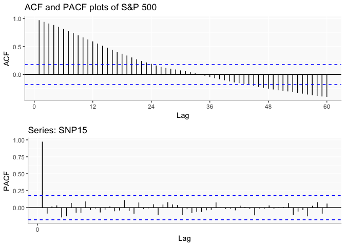
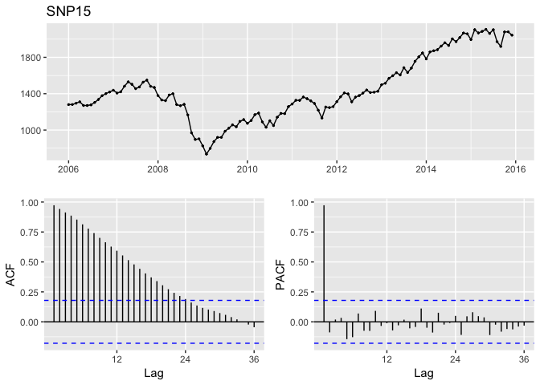
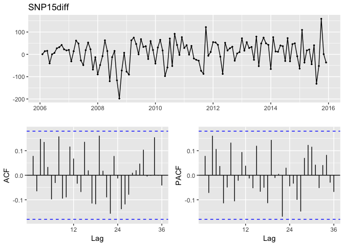
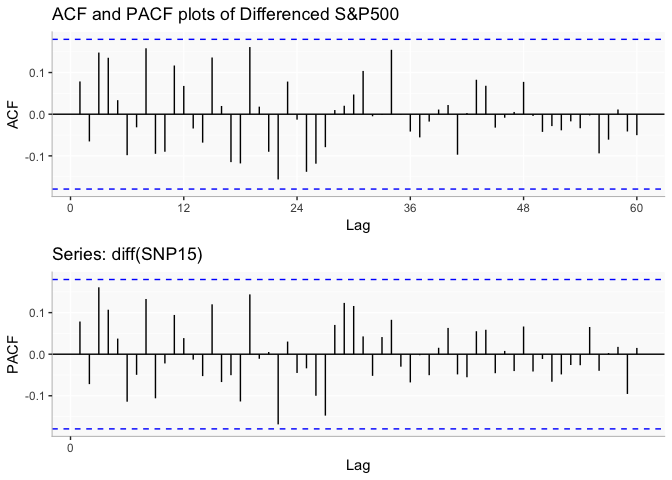

Standard & Poor's 500 INDEX Forecasting (GSPC)
================

Abstract
--------

Post the financial debacle in 2008-09, the necessity for forecasting the stock market has become of paramount importance. With advent of tools for forecasting and the ease of availability of data, there is no restriction on the different forecasting techniques. In this paper we are attempting to find the optimal statistical technique to forecast the stock market based on the S&P 500 index. Our choice of S&P 500 Index in the presence of other indices such as Dow Jones Industrial Average and Nasdaq Composite Index, is mainly as S&P 500 provides a broader representation of the overall US stock market.

Introduction
============

Brief Note on S&P 500 Index The Standard & Poor's 500, often abbreviated as the S&P 500, or just "the S&P", is an American stock market index based on the market capitalizations of 500 large companies having common stock listed on the NYSE or NASDAQ. The S&P 500 index components and their weightings are determined by S&P Dow Jones Indices. Forecasting of the stock market can be carried out vide two approaches: - ● Fundamental Approach – forecasting is done based on the economy, the financial statement of the company and the company’s future prospects ● Technical Analysis – forecasting based on time series analysis of available historical data of the stock market.

In this project, we have attempted only the second approach i.e “Technical Analysis”. The data for our project is obtained from “Yahoo Finance” and the forecasting techniques are implemented in R.

Data Collection
===============

We have imported the data from Yahoo finance. We have extracted the daily adjusted closing price value of S&P 500 from 1st January 2006 to 31st December 2016. . The ticker symbol for S&P 500 is “GSPC”.

``` r
startDate = as.Date("2006-01-01") 

endDate = as.Date("2016-12-31")

#getting data from yahoo finance using start and end date
getSymbols("^GSPC", from = startDate, to = endDate,src="yahoo")
```

    ## [1] "GSPC"

The extracted data contains seven columns - first acting as an index, the next four columns is generally referred to as OHLC i.e Open, High, Low and Close prices of the index. The sixth column comprises the volume of trade and the seventh column i.e “Adjusted Price” is of utmost importance to our paper. In our time series forecasting techniques, we will mainly be using the “Adjusted Price” column, the reason for this can be summed up as “stock split” which is explained further with an example below.

In’R’,we use the ‘quantmod’ library to extract data of any stock. The `getSymbols()` function takes 4 parameters – the ticker, the start date ,the end date and the source.

`Why we are using the adjusted closing price?` The closing price provides us the value at which the stock closes at the end of the day. Now due to some management reason, the company decides to split the stock thereby decreasing the value of the stock price. Say if one stock of company is priced for at $100, the company splits one stock into two, thereby now the price of each stock is further split and is $50. So the opening price of the stock and the closing of the stock varies the following day. Hence for our paper we have only considered the adjusted value of the index, which takes into account the “stock split “factor.

Since we are doing monthly forecasting, our extracted data is converted into monthly format.

    ##          Jan     Feb     Mar     Apr     May     Jun     Jul     Aug
    ## 2006 1280.08 1280.66 1294.87 1310.61 1270.09 1270.20 1276.66 1303.82
    ## 2007 1438.24 1406.82 1420.86 1482.37 1530.62 1503.35 1455.27 1473.99
    ## 2008 1378.55 1330.63 1322.70 1385.59 1400.38 1280.00 1267.38 1282.83
    ## 2009  825.88  735.09  797.87  872.81  919.14  919.32  987.48 1020.62
    ## 2010 1073.87 1104.49 1169.43 1186.69 1089.41 1030.71 1101.60 1049.33
    ## 2011 1286.12 1327.22 1325.83 1363.61 1345.20 1320.64 1292.28 1218.89
    ## 2012 1312.41 1365.68 1408.47 1397.91 1310.33 1362.16 1379.32 1406.58
    ## 2013 1498.11 1514.68 1569.19 1597.57 1630.74 1606.28 1685.73 1632.97
    ## 2014 1782.59 1859.45 1872.34 1883.95 1923.57 1960.23 1930.67 2003.37
    ## 2015 1994.99 2104.50 2067.89 2085.51 2107.39 2063.11 2103.84 1972.18
    ## 2016 1940.24 1932.23 2059.74 2065.30 2096.95 2098.86 2173.60 2170.95
    ##          Sep     Oct     Nov     Dec
    ## 2006 1335.85 1377.94 1400.63 1418.30
    ## 2007 1526.75 1549.38 1481.14 1468.36
    ## 2008 1166.36  968.75  896.24  903.25
    ## 2009 1057.08 1036.19 1095.63 1115.10
    ## 2010 1141.20 1183.26 1180.55 1257.64
    ## 2011 1131.42 1253.30 1246.96 1257.60
    ## 2012 1440.67 1412.16 1416.18 1426.19
    ## 2013 1681.55 1756.54 1805.81 1848.36
    ## 2014 1972.29 2018.05 2067.56 2058.90
    ## 2015 1920.03 2079.36 2080.41 2043.94
    ## 2016 2168.27 2126.15 2198.81 2238.83

Exploratory Analysis
====================

Our S&P 500 Stock Index data is in the form of time-series; this means that our data exists over a continuous time interval with equal spacing between every two consecutive measurements. Once we have our time series data object ready, we plot the object to do a good exploratory analysis on it. This enables us to make inferences about important components of the time-series data, such as trend, seasonality, heteroskedasticity, and stationary. A brief on each inference: ● Trend: a dataset has a trend when it has either a long-term increasing or decreasing graph. ● Seasonality:a dataset has seasonality when it has patterns that repeat over known, fixed periods of time (e.g. monthly, quarterly, yearly). ● Heteroskedasticity:a data is heteroskedastic when its variability is not constant (i.e. its variance increases or decreases as a function of the explanatory variable). ● Stationary:a stochastic process is called stationary if the mean and variance are constant (i.e. their joint distribution does not change over time). We start our analysis by plotting our time series to give us a basis about how to start our modeling. <!--html_preserve-->

<script type="application/json" data-for="htmlwidget-ecc8d58b2dd6fa16f13d">{"x":{"data":[{"x":[2006,2006.08333333333,2006.16666666667,2006.25,2006.33333333333,2006.41666666667,2006.5,2006.58333333333,2006.66666666667,2006.75,2006.83333333333,2006.91666666667,2007,2007.08333333333,2007.16666666667,2007.25,2007.33333333333,2007.41666666667,2007.5,2007.58333333333,2007.66666666667,2007.75,2007.83333333333,2007.91666666667,2008,2008.08333333333,2008.16666666667,2008.25,2008.33333333333,2008.41666666667,2008.5,2008.58333333333,2008.66666666667,2008.75,2008.83333333333,2008.91666666667,2009,2009.08333333333,2009.16666666667,2009.25,2009.33333333333,2009.41666666667,2009.5,2009.58333333333,2009.66666666667,2009.75,2009.83333333333,2009.91666666667,2010,2010.08333333333,2010.16666666667,2010.25,2010.33333333333,2010.41666666667,2010.5,2010.58333333333,2010.66666666667,2010.75,2010.83333333333,2010.91666666667,2011,2011.08333333333,2011.16666666667,2011.25,2011.33333333333,2011.41666666667,2011.5,2011.58333333333,2011.66666666667,2011.75,2011.83333333333,2011.91666666667,2012,2012.08333333333,2012.16666666667,2012.25,2012.33333333333,2012.41666666667,2012.5,2012.58333333333,2012.66666666667,2012.75,2012.83333333333,2012.91666666667,2013,2013.08333333333,2013.16666666667,2013.25,2013.33333333333,2013.41666666667,2013.5,2013.58333333333,2013.66666666667,2013.75,2013.83333333333,2013.91666666667,2014,2014.08333333333,2014.16666666667,2014.25,2014.33333333333,2014.41666666667,2014.5,2014.58333333333,2014.66666666667,2014.75,2014.83333333333,2014.91666666667,2015,2015.08333333333,2015.16666666667,2015.25,2015.33333333333,2015.41666666667,2015.5,2015.58333333333,2015.66666666667,2015.75,2015.83333333333,2015.91666666667,2016,2016.08333333333,2016.16666666667,2016.25,2016.33333333333,2016.41666666667,2016.5,2016.58333333333,2016.66666666667,2016.75,2016.83333333333,2016.91666666667],"y":[1280.079956,1280.660034,1294.869995,1310.609985,1270.089966,1270.199951,1276.660034,1303.819946,1335.849976,1377.939941,1400.630005,1418.300049,1438.23999,1406.819946,1420.859985,1482.369995,1530.619995,1503.349976,1455.27002,1473.98999,1526.75,1549.380005,1481.140015,1468.359985,1378.550049,1330.630005,1322.699951,1385.589966,1400.380005,1280,1267.380005,1282.829956,1166.359985,968.75,896.23999,903.25,825.880005,735.090027,797.869995,872.809998,919.140015,919.320007,987.47998,1020.619995,1057.079956,1036.189941,1095.630005,1115.099976,1073.869995,1104.48999,1169.430054,1186.689941,1089.410034,1030.709961,1101.599976,1049.329956,1141.199951,1183.26001,1180.550049,1257.640015,1286.119995,1327.219971,1325.829956,1363.609985,1345.199951,1320.640015,1292.280029,1218.890015,1131.420044,1253.300049,1246.959961,1257.599976,1312.410034,1365.680054,1408.469971,1397.910034,1310.329956,1362.160034,1379.319946,1406.579956,1440.670044,1412.160034,1416.180054,1426.189941,1498.109985,1514.680054,1569.189941,1597.569946,1630.73999,1606.280029,1685.72998,1632.969971,1681.550049,1756.540039,1805.810059,1848.359985,1782.589966,1859.449951,1872.339966,1883.949951,1923.569946,1960.22998,1930.670044,2003.369995,1972.290039,2018.050049,2067.560059,2058.899902,1994.98999,2104.5,2067.889893,2085.51001,2107.389893,2063.110107,2103.840088,1972.180054,1920.030029,2079.360107,2080.409912,2043.939941,1940.23999,1932.22998,2059.73999,2065.300049,2096.949951,2098.860107,2173.600098,2170.949951,2168.27002,2126.149902,2198.810059,2238.830078],"text":["x: 2006<br>y: 1280.08","x: 2006.08<br>y: 1280.66","x: 2006.17<br>y: 1294.87","x: 2006.25<br>y: 1310.61","x: 2006.33<br>y: 1270.09","x: 2006.42<br>y: 1270.2","x: 2006.5<br>y: 1276.66","x: 2006.58<br>y: 1303.82","x: 2006.67<br>y: 1335.85","x: 2006.75<br>y: 1377.94","x: 2006.83<br>y: 1400.63","x: 2006.92<br>y: 1418.3","x: 2007<br>y: 1438.24","x: 2007.08<br>y: 1406.82","x: 2007.17<br>y: 1420.86","x: 2007.25<br>y: 1482.37","x: 2007.33<br>y: 1530.62","x: 2007.42<br>y: 1503.35","x: 2007.5<br>y: 1455.27","x: 2007.58<br>y: 1473.99","x: 2007.67<br>y: 1526.75","x: 2007.75<br>y: 1549.38","x: 2007.83<br>y: 1481.14","x: 2007.92<br>y: 1468.36","x: 2008<br>y: 1378.55","x: 2008.08<br>y: 1330.63","x: 2008.17<br>y: 1322.7","x: 2008.25<br>y: 1385.59","x: 2008.33<br>y: 1400.38","x: 2008.42<br>y: 1280","x: 2008.5<br>y: 1267.38","x: 2008.58<br>y: 1282.83","x: 2008.67<br>y: 1166.36","x: 2008.75<br>y: 968.75","x: 2008.83<br>y: 896.24","x: 2008.92<br>y: 903.25","x: 2009<br>y: 825.88","x: 2009.08<br>y: 735.09","x: 2009.17<br>y: 797.87","x: 2009.25<br>y: 872.81","x: 2009.33<br>y: 919.14","x: 2009.42<br>y: 919.32","x: 2009.5<br>y: 987.48","x: 2009.58<br>y: 1020.62","x: 2009.67<br>y: 1057.08","x: 2009.75<br>y: 1036.19","x: 2009.83<br>y: 1095.63","x: 2009.92<br>y: 1115.1","x: 2010<br>y: 1073.87","x: 2010.08<br>y: 1104.49","x: 2010.17<br>y: 1169.43","x: 2010.25<br>y: 1186.69","x: 2010.33<br>y: 1089.41","x: 2010.42<br>y: 1030.71","x: 2010.5<br>y: 1101.6","x: 2010.58<br>y: 1049.33","x: 2010.67<br>y: 1141.2","x: 2010.75<br>y: 1183.26","x: 2010.83<br>y: 1180.55","x: 2010.92<br>y: 1257.64","x: 2011<br>y: 1286.12","x: 2011.08<br>y: 1327.22","x: 2011.17<br>y: 1325.83","x: 2011.25<br>y: 1363.61","x: 2011.33<br>y: 1345.2","x: 2011.42<br>y: 1320.64","x: 2011.5<br>y: 1292.28","x: 2011.58<br>y: 1218.89","x: 2011.67<br>y: 1131.42","x: 2011.75<br>y: 1253.3","x: 2011.83<br>y: 1246.96","x: 2011.92<br>y: 1257.6","x: 2012<br>y: 1312.41","x: 2012.08<br>y: 1365.68","x: 2012.17<br>y: 1408.47","x: 2012.25<br>y: 1397.91","x: 2012.33<br>y: 1310.33","x: 2012.42<br>y: 1362.16","x: 2012.5<br>y: 1379.32","x: 2012.58<br>y: 1406.58","x: 2012.67<br>y: 1440.67","x: 2012.75<br>y: 1412.16","x: 2012.83<br>y: 1416.18","x: 2012.92<br>y: 1426.19","x: 2013<br>y: 1498.11","x: 2013.08<br>y: 1514.68","x: 2013.17<br>y: 1569.19","x: 2013.25<br>y: 1597.57","x: 2013.33<br>y: 1630.74","x: 2013.42<br>y: 1606.28","x: 2013.5<br>y: 1685.73","x: 2013.58<br>y: 1632.97","x: 2013.67<br>y: 1681.55","x: 2013.75<br>y: 1756.54","x: 2013.83<br>y: 1805.81","x: 2013.92<br>y: 1848.36","x: 2014<br>y: 1782.59","x: 2014.08<br>y: 1859.45","x: 2014.17<br>y: 1872.34","x: 2014.25<br>y: 1883.95","x: 2014.33<br>y: 1923.57","x: 2014.42<br>y: 1960.23","x: 2014.5<br>y: 1930.67","x: 2014.58<br>y: 2003.37","x: 2014.67<br>y: 1972.29","x: 2014.75<br>y: 2018.05","x: 2014.83<br>y: 2067.56","x: 2014.92<br>y: 2058.9","x: 2015<br>y: 1994.99","x: 2015.08<br>y: 2104.5","x: 2015.17<br>y: 2067.89","x: 2015.25<br>y: 2085.51","x: 2015.33<br>y: 2107.39","x: 2015.42<br>y: 2063.11","x: 2015.5<br>y: 2103.84","x: 2015.58<br>y: 1972.18","x: 2015.67<br>y: 1920.03","x: 2015.75<br>y: 2079.36","x: 2015.83<br>y: 2080.41","x: 2015.92<br>y: 2043.94","x: 2016<br>y: 1940.24","x: 2016.08<br>y: 1932.23","x: 2016.17<br>y: 2059.74","x: 2016.25<br>y: 2065.3","x: 2016.33<br>y: 2096.95","x: 2016.42<br>y: 2098.86","x: 2016.5<br>y: 2173.6","x: 2016.58<br>y: 2170.95","x: 2016.67<br>y: 2168.27","x: 2016.75<br>y: 2126.15","x: 2016.83<br>y: 2198.81","x: 2016.92<br>y: 2238.83"],"key":null,"type":"scatter","mode":"lines","name":"","line":{"width":1.88976377952756,"color":"rgba(0,0,0,1)","dash":"solid"},"hoveron":"points","showlegend":false,"xaxis":"x","yaxis":"y","hoverinfo":"text"}],"layout":{"margin":{"t":43.7625570776256,"r":7.30593607305936,"b":40.1826484018265,"l":48.9497716894977},"plot_bgcolor":"rgba(250,250,250,1)","paper_bgcolor":"rgba(255,255,255,1)","font":{"color":"rgba(0,0,0,1)","family":"","size":14.6118721461187},"title":"Plot of S&P 500 Time Series(2006-2016)","titlefont":{"color":"rgba(0,0,0,1)","family":"","size":17.5342465753425},"xaxis":{"domain":[0,1],"type":"linear","autorange":false,"tickmode":"array","range":[2005.45416666667,2017.4625],"ticktext":["2006","2008","2010","2012","2014","2016"],"tickvals":[2006,2008,2010,2012,2014,2016],"ticks":"outside","tickcolor":"rgba(51,51,51,1)","ticklen":3.65296803652968,"tickwidth":0.66417600664176,"showticklabels":true,"tickfont":{"color":"rgba(77,77,77,1)","family":"","size":11.689497716895},"tickangle":-0,"showline":true,"linecolor":"rgba(190,190,190,1)","linewidth":0.66417600664176,"showgrid":true,"gridcolor":"rgba(255,255,255,1)","gridwidth":0.66417600664176,"zeroline":false,"anchor":"y","title":"Year","titlefont":{"color":"rgba(0,0,0,1)","family":"","size":14.6118721461187},"hoverformat":".2f"},"yaxis":{"domain":[0,1],"type":"linear","autorange":false,"tickmode":"array","range":[659.90302445,2314.01708055],"ticktext":["1000","1500","2000"],"tickvals":[1000,1500,2000],"ticks":"outside","tickcolor":"rgba(51,51,51,1)","ticklen":3.65296803652968,"tickwidth":0.66417600664176,"showticklabels":true,"tickfont":{"color":"rgba(77,77,77,1)","family":"","size":11.689497716895},"tickangle":-0,"showline":true,"linecolor":"rgba(190,190,190,1)","linewidth":0.66417600664176,"showgrid":true,"gridcolor":"rgba(255,255,255,1)","gridwidth":0.66417600664176,"zeroline":false,"anchor":"x","title":"Adjusted Price","titlefont":{"color":"rgba(0,0,0,1)","family":"","size":14.6118721461187},"hoverformat":".2f"},"shapes":[{"type":"rect","fillcolor":null,"line":{"color":null,"width":0,"linetype":[]},"yref":"paper","xref":"paper","x0":0,"x1":1,"y0":0,"y1":1}],"showlegend":false,"legend":{"bgcolor":"rgba(255,255,255,1)","bordercolor":"transparent","borderwidth":1.88976377952756,"font":{"color":"rgba(0,0,0,1)","family":"","size":11.689497716895}},"hovermode":"closest"},"source":"A","config":{"modeBarButtonsToAdd":[{"name":"Collaborate","icon":{"width":1000,"ascent":500,"descent":-50,"path":"M487 375c7-10 9-23 5-36l-79-259c-3-12-11-23-22-31-11-8-22-12-35-12l-263 0c-15 0-29 5-43 15-13 10-23 23-28 37-5 13-5 25-1 37 0 0 0 3 1 7 1 5 1 8 1 11 0 2 0 4-1 6 0 3-1 5-1 6 1 2 2 4 3 6 1 2 2 4 4 6 2 3 4 5 5 7 5 7 9 16 13 26 4 10 7 19 9 26 0 2 0 5 0 9-1 4-1 6 0 8 0 2 2 5 4 8 3 3 5 5 5 7 4 6 8 15 12 26 4 11 7 19 7 26 1 1 0 4 0 9-1 4-1 7 0 8 1 2 3 5 6 8 4 4 6 6 6 7 4 5 8 13 13 24 4 11 7 20 7 28 1 1 0 4 0 7-1 3-1 6-1 7 0 2 1 4 3 6 1 1 3 4 5 6 2 3 3 5 5 6 1 2 3 5 4 9 2 3 3 7 5 10 1 3 2 6 4 10 2 4 4 7 6 9 2 3 4 5 7 7 3 2 7 3 11 3 3 0 8 0 13-1l0-1c7 2 12 2 14 2l218 0c14 0 25-5 32-16 8-10 10-23 6-37l-79-259c-7-22-13-37-20-43-7-7-19-10-37-10l-248 0c-5 0-9-2-11-5-2-3-2-7 0-12 4-13 18-20 41-20l264 0c5 0 10 2 16 5 5 3 8 6 10 11l85 282c2 5 2 10 2 17 7-3 13-7 17-13z m-304 0c-1-3-1-5 0-7 1-1 3-2 6-2l174 0c2 0 4 1 7 2 2 2 4 4 5 7l6 18c0 3 0 5-1 7-1 1-3 2-6 2l-173 0c-3 0-5-1-8-2-2-2-4-4-4-7z m-24-73c-1-3-1-5 0-7 2-2 3-2 6-2l174 0c2 0 5 0 7 2 3 2 4 4 5 7l6 18c1 2 0 5-1 6-1 2-3 3-5 3l-174 0c-3 0-5-1-7-3-3-1-4-4-5-6z"},"click":"function(gd) { \n        // is this being viewed in RStudio?\n        if (location.search == '?viewer_pane=1') {\n          alert('To learn about plotly for collaboration, visit:\\n https://cpsievert.github.io/plotly_book/plot-ly-for-collaboration.html');\n        } else {\n          window.open('https://cpsievert.github.io/plotly_book/plot-ly-for-collaboration.html', '_blank');\n        }\n      }"}],"modeBarButtonsToRemove":["sendDataToCloud"]},"base_url":"https://plot.ly"},"evals":["config.modeBarButtonsToAdd.0.click"],"jsHooks":[]}</script>
<!--/html_preserve-->
Later we remove the year 2016 in order to compare our forecasted values with the real values. <!--html_preserve-->

<script type="application/json" data-for="htmlwidget-2714e1a8c2c8c9b4689d">{"x":{"data":[{"x":[2006,2006.08333333333,2006.16666666667,2006.25,2006.33333333333,2006.41666666667,2006.5,2006.58333333333,2006.66666666667,2006.75,2006.83333333333,2006.91666666667,2007,2007.08333333333,2007.16666666667,2007.25,2007.33333333333,2007.41666666667,2007.5,2007.58333333333,2007.66666666667,2007.75,2007.83333333333,2007.91666666667,2008,2008.08333333333,2008.16666666667,2008.25,2008.33333333333,2008.41666666667,2008.5,2008.58333333333,2008.66666666667,2008.75,2008.83333333333,2008.91666666667,2009,2009.08333333333,2009.16666666667,2009.25,2009.33333333333,2009.41666666667,2009.5,2009.58333333333,2009.66666666667,2009.75,2009.83333333333,2009.91666666667,2010,2010.08333333333,2010.16666666667,2010.25,2010.33333333333,2010.41666666667,2010.5,2010.58333333333,2010.66666666667,2010.75,2010.83333333333,2010.91666666667,2011,2011.08333333333,2011.16666666667,2011.25,2011.33333333333,2011.41666666667,2011.5,2011.58333333333,2011.66666666667,2011.75,2011.83333333333,2011.91666666667,2012,2012.08333333333,2012.16666666667,2012.25,2012.33333333333,2012.41666666667,2012.5,2012.58333333333,2012.66666666667,2012.75,2012.83333333333,2012.91666666667,2013,2013.08333333333,2013.16666666667,2013.25,2013.33333333333,2013.41666666667,2013.5,2013.58333333333,2013.66666666667,2013.75,2013.83333333333,2013.91666666667,2014,2014.08333333333,2014.16666666667,2014.25,2014.33333333333,2014.41666666667,2014.5,2014.58333333333,2014.66666666667,2014.75,2014.83333333333,2014.91666666667,2015,2015.08333333333,2015.16666666667,2015.25,2015.33333333333,2015.41666666667,2015.5,2015.58333333333,2015.66666666667,2015.75,2015.83333333333,2015.91666666667],"y":[1280.079956,1280.660034,1294.869995,1310.609985,1270.089966,1270.199951,1276.660034,1303.819946,1335.849976,1377.939941,1400.630005,1418.300049,1438.23999,1406.819946,1420.859985,1482.369995,1530.619995,1503.349976,1455.27002,1473.98999,1526.75,1549.380005,1481.140015,1468.359985,1378.550049,1330.630005,1322.699951,1385.589966,1400.380005,1280,1267.380005,1282.829956,1166.359985,968.75,896.23999,903.25,825.880005,735.090027,797.869995,872.809998,919.140015,919.320007,987.47998,1020.619995,1057.079956,1036.189941,1095.630005,1115.099976,1073.869995,1104.48999,1169.430054,1186.689941,1089.410034,1030.709961,1101.599976,1049.329956,1141.199951,1183.26001,1180.550049,1257.640015,1286.119995,1327.219971,1325.829956,1363.609985,1345.199951,1320.640015,1292.280029,1218.890015,1131.420044,1253.300049,1246.959961,1257.599976,1312.410034,1365.680054,1408.469971,1397.910034,1310.329956,1362.160034,1379.319946,1406.579956,1440.670044,1412.160034,1416.180054,1426.189941,1498.109985,1514.680054,1569.189941,1597.569946,1630.73999,1606.280029,1685.72998,1632.969971,1681.550049,1756.540039,1805.810059,1848.359985,1782.589966,1859.449951,1872.339966,1883.949951,1923.569946,1960.22998,1930.670044,2003.369995,1972.290039,2018.050049,2067.560059,2058.899902,1994.98999,2104.5,2067.889893,2085.51001,2107.389893,2063.110107,2103.840088,1972.180054,1920.030029,2079.360107,2080.409912,2043.939941],"text":["x: 2006<br>y: 1280.08","x: 2006.08<br>y: 1280.66","x: 2006.17<br>y: 1294.87","x: 2006.25<br>y: 1310.61","x: 2006.33<br>y: 1270.09","x: 2006.42<br>y: 1270.2","x: 2006.5<br>y: 1276.66","x: 2006.58<br>y: 1303.82","x: 2006.67<br>y: 1335.85","x: 2006.75<br>y: 1377.94","x: 2006.83<br>y: 1400.63","x: 2006.92<br>y: 1418.3","x: 2007<br>y: 1438.24","x: 2007.08<br>y: 1406.82","x: 2007.17<br>y: 1420.86","x: 2007.25<br>y: 1482.37","x: 2007.33<br>y: 1530.62","x: 2007.42<br>y: 1503.35","x: 2007.5<br>y: 1455.27","x: 2007.58<br>y: 1473.99","x: 2007.67<br>y: 1526.75","x: 2007.75<br>y: 1549.38","x: 2007.83<br>y: 1481.14","x: 2007.92<br>y: 1468.36","x: 2008<br>y: 1378.55","x: 2008.08<br>y: 1330.63","x: 2008.17<br>y: 1322.7","x: 2008.25<br>y: 1385.59","x: 2008.33<br>y: 1400.38","x: 2008.42<br>y: 1280","x: 2008.5<br>y: 1267.38","x: 2008.58<br>y: 1282.83","x: 2008.67<br>y: 1166.36","x: 2008.75<br>y: 968.75","x: 2008.83<br>y: 896.24","x: 2008.92<br>y: 903.25","x: 2009<br>y: 825.88","x: 2009.08<br>y: 735.09","x: 2009.17<br>y: 797.87","x: 2009.25<br>y: 872.81","x: 2009.33<br>y: 919.14","x: 2009.42<br>y: 919.32","x: 2009.5<br>y: 987.48","x: 2009.58<br>y: 1020.62","x: 2009.67<br>y: 1057.08","x: 2009.75<br>y: 1036.19","x: 2009.83<br>y: 1095.63","x: 2009.92<br>y: 1115.1","x: 2010<br>y: 1073.87","x: 2010.08<br>y: 1104.49","x: 2010.17<br>y: 1169.43","x: 2010.25<br>y: 1186.69","x: 2010.33<br>y: 1089.41","x: 2010.42<br>y: 1030.71","x: 2010.5<br>y: 1101.6","x: 2010.58<br>y: 1049.33","x: 2010.67<br>y: 1141.2","x: 2010.75<br>y: 1183.26","x: 2010.83<br>y: 1180.55","x: 2010.92<br>y: 1257.64","x: 2011<br>y: 1286.12","x: 2011.08<br>y: 1327.22","x: 2011.17<br>y: 1325.83","x: 2011.25<br>y: 1363.61","x: 2011.33<br>y: 1345.2","x: 2011.42<br>y: 1320.64","x: 2011.5<br>y: 1292.28","x: 2011.58<br>y: 1218.89","x: 2011.67<br>y: 1131.42","x: 2011.75<br>y: 1253.3","x: 2011.83<br>y: 1246.96","x: 2011.92<br>y: 1257.6","x: 2012<br>y: 1312.41","x: 2012.08<br>y: 1365.68","x: 2012.17<br>y: 1408.47","x: 2012.25<br>y: 1397.91","x: 2012.33<br>y: 1310.33","x: 2012.42<br>y: 1362.16","x: 2012.5<br>y: 1379.32","x: 2012.58<br>y: 1406.58","x: 2012.67<br>y: 1440.67","x: 2012.75<br>y: 1412.16","x: 2012.83<br>y: 1416.18","x: 2012.92<br>y: 1426.19","x: 2013<br>y: 1498.11","x: 2013.08<br>y: 1514.68","x: 2013.17<br>y: 1569.19","x: 2013.25<br>y: 1597.57","x: 2013.33<br>y: 1630.74","x: 2013.42<br>y: 1606.28","x: 2013.5<br>y: 1685.73","x: 2013.58<br>y: 1632.97","x: 2013.67<br>y: 1681.55","x: 2013.75<br>y: 1756.54","x: 2013.83<br>y: 1805.81","x: 2013.92<br>y: 1848.36","x: 2014<br>y: 1782.59","x: 2014.08<br>y: 1859.45","x: 2014.17<br>y: 1872.34","x: 2014.25<br>y: 1883.95","x: 2014.33<br>y: 1923.57","x: 2014.42<br>y: 1960.23","x: 2014.5<br>y: 1930.67","x: 2014.58<br>y: 2003.37","x: 2014.67<br>y: 1972.29","x: 2014.75<br>y: 2018.05","x: 2014.83<br>y: 2067.56","x: 2014.92<br>y: 2058.9","x: 2015<br>y: 1994.99","x: 2015.08<br>y: 2104.5","x: 2015.17<br>y: 2067.89","x: 2015.25<br>y: 2085.51","x: 2015.33<br>y: 2107.39","x: 2015.42<br>y: 2063.11","x: 2015.5<br>y: 2103.84","x: 2015.58<br>y: 1972.18","x: 2015.67<br>y: 1920.03","x: 2015.75<br>y: 2079.36","x: 2015.83<br>y: 2080.41","x: 2015.92<br>y: 2043.94"],"key":null,"type":"scatter","mode":"lines","name":"","line":{"width":1.88976377952756,"color":"rgba(0,0,0,1)","dash":"solid"},"hoveron":"points","showlegend":false,"xaxis":"x","yaxis":"y","hoverinfo":"text"}],"layout":{"margin":{"t":43.7625570776256,"r":7.30593607305936,"b":40.1826484018265,"l":48.9497716894977},"plot_bgcolor":"rgba(250,250,250,1)","paper_bgcolor":"rgba(255,255,255,1)","font":{"color":"rgba(0,0,0,1)","family":"","size":14.6118721461187},"title":"Plot of S & P 500 Time Series(2006-2015)","titlefont":{"color":"rgba(0,0,0,1)","family":"","size":17.5342465753425},"xaxis":{"domain":[0,1],"type":"linear","autorange":false,"tickmode":"array","range":[2005.50416666667,2016.4125],"ticktext":["2006","2008","2010","2012","2014","2016"],"tickvals":[2006,2008,2010,2012,2014,2016],"ticks":"","tickcolor":null,"ticklen":3.65296803652968,"tickwidth":0,"showticklabels":true,"tickfont":{"color":"rgba(77,77,77,1)","family":"","size":11.689497716895},"tickangle":-0,"showline":true,"linecolor":"rgba(190,190,190,1)","linewidth":0.66417600664176,"showgrid":true,"gridcolor":"rgba(255,255,255,1)","gridwidth":0.66417600664176,"zeroline":false,"anchor":"y","title":"Year","titlefont":{"color":"rgba(0,0,0,1)","family":"","size":14.6118721461187},"hoverformat":".2f"},"yaxis":{"domain":[0,1],"type":"linear","autorange":false,"tickmode":"array","range":[666.4750337,2176.0048863],"ticktext":["1000","1400","1800"],"tickvals":[1000,1400,1800],"ticks":"","tickcolor":null,"ticklen":3.65296803652968,"tickwidth":0,"showticklabels":true,"tickfont":{"color":"rgba(77,77,77,1)","family":"","size":11.689497716895},"tickangle":-0,"showline":true,"linecolor":"rgba(190,190,190,1)","linewidth":0.66417600664176,"showgrid":true,"gridcolor":"rgba(255,255,255,1)","gridwidth":0.66417600664176,"zeroline":false,"anchor":"x","title":"Adjusted Price","titlefont":{"color":"rgba(0,0,0,1)","family":"","size":14.6118721461187},"hoverformat":".2f"},"shapes":[{"type":"rect","fillcolor":null,"line":{"color":null,"width":0,"linetype":[]},"yref":"paper","xref":"paper","x0":0,"x1":1,"y0":0,"y1":1}],"showlegend":false,"legend":{"bgcolor":"rgba(255,255,255,1)","bordercolor":"transparent","borderwidth":1.88976377952756,"font":{"color":"rgba(0,0,0,1)","family":"","size":11.689497716895}},"hovermode":"closest"},"source":"A","config":{"modeBarButtonsToAdd":[{"name":"Collaborate","icon":{"width":1000,"ascent":500,"descent":-50,"path":"M487 375c7-10 9-23 5-36l-79-259c-3-12-11-23-22-31-11-8-22-12-35-12l-263 0c-15 0-29 5-43 15-13 10-23 23-28 37-5 13-5 25-1 37 0 0 0 3 1 7 1 5 1 8 1 11 0 2 0 4-1 6 0 3-1 5-1 6 1 2 2 4 3 6 1 2 2 4 4 6 2 3 4 5 5 7 5 7 9 16 13 26 4 10 7 19 9 26 0 2 0 5 0 9-1 4-1 6 0 8 0 2 2 5 4 8 3 3 5 5 5 7 4 6 8 15 12 26 4 11 7 19 7 26 1 1 0 4 0 9-1 4-1 7 0 8 1 2 3 5 6 8 4 4 6 6 6 7 4 5 8 13 13 24 4 11 7 20 7 28 1 1 0 4 0 7-1 3-1 6-1 7 0 2 1 4 3 6 1 1 3 4 5 6 2 3 3 5 5 6 1 2 3 5 4 9 2 3 3 7 5 10 1 3 2 6 4 10 2 4 4 7 6 9 2 3 4 5 7 7 3 2 7 3 11 3 3 0 8 0 13-1l0-1c7 2 12 2 14 2l218 0c14 0 25-5 32-16 8-10 10-23 6-37l-79-259c-7-22-13-37-20-43-7-7-19-10-37-10l-248 0c-5 0-9-2-11-5-2-3-2-7 0-12 4-13 18-20 41-20l264 0c5 0 10 2 16 5 5 3 8 6 10 11l85 282c2 5 2 10 2 17 7-3 13-7 17-13z m-304 0c-1-3-1-5 0-7 1-1 3-2 6-2l174 0c2 0 4 1 7 2 2 2 4 4 5 7l6 18c0 3 0 5-1 7-1 1-3 2-6 2l-173 0c-3 0-5-1-8-2-2-2-4-4-4-7z m-24-73c-1-3-1-5 0-7 2-2 3-2 6-2l174 0c2 0 5 0 7 2 3 2 4 4 5 7l6 18c1 2 0 5-1 6-1 2-3 3-5 3l-174 0c-3 0-5-1-7-3-3-1-4-4-5-6z"},"click":"function(gd) { \n        // is this being viewed in RStudio?\n        if (location.search == '?viewer_pane=1') {\n          alert('To learn about plotly for collaboration, visit:\\n https://cpsievert.github.io/plotly_book/plot-ly-for-collaboration.html');\n        } else {\n          window.open('https://cpsievert.github.io/plotly_book/plot-ly-for-collaboration.html', '_blank');\n        }\n      }"}],"modeBarButtonsToRemove":["sendDataToCloud"]},"base_url":"https://plot.ly"},"evals":["config.modeBarButtonsToAdd.0.click"],"jsHooks":[]}</script>
<!--/html_preserve-->
From the plot we can see that there was certain dip in the stock prices between 2008 -2010.This is time when U.S market crashed.

When we plot, we observe a trend in our time-series, we further analyze our data by decomposing. We break-down our time-series into its seasonal component, trend, and residuals/white noise using the `stl() function`. \#Decomposition of the SNP15 data

    ##  Call:
    ##  stl(x = SNP15, s.window = "periodic")
    ## 
    ## Components
    ##             seasonal     trend    remainder
    ## Jan 2006 -19.2896838 1253.2217   46.1479660
    ## Feb 2006 -11.0192345 1264.5913   27.0879780
    ## Mar 2006   3.4362237 1275.9609   15.4728640
    ## Apr 2006  29.1211893 1288.0753   -6.5864965
    ## May 2006  19.1141106 1300.1897  -49.2138217
    ## Jun 2006  -7.0989053 1312.5335  -35.2346570
    ## Jul 2006   4.1980684 1324.8773  -52.4153838
    ## Aug 2006 -12.4019361 1337.1343  -20.9123974
    ## Sep 2006 -16.5748844 1349.3912    3.0336506
    ## Oct 2006   3.3119550 1365.0117    9.6163041
    ## Nov 2006   0.6438138 1380.6322   19.3540371
    ## Dec 2006   6.5592740 1398.0087   13.7320926
    ## Jan 2007 -19.2896838 1415.3852   42.1444632
    ## Feb 2007 -11.0192345 1430.5300  -12.6908584
    ## Mar 2007   3.4362237 1445.6749  -28.2511057
    ## Apr 2007  29.1211893 1456.8385   -3.5896849
    ## May 2007  19.1141106 1468.0021   43.5037703
    ## Jun 2007  -7.0989053 1472.4793   37.9696136
    ## Jul 2007   4.1980684 1476.9564  -25.8844697
    ## Aug 2007 -12.4019361 1472.6204   13.7714906
    ## Sep 2007 -16.5748844 1468.2844   75.0404345
    ## Oct 2007   3.3119550 1457.4256   88.6424208
    ## Nov 2007   0.6438138 1446.5668   33.9293926
    ## Dec 2007   6.5592740 1430.0180   31.7827359
    ## Jan 2008 -19.2896838 1413.4691  -15.6294087
    ## Feb 2008 -11.0192345 1389.6126  -47.9633176
    ## Mar 2008   3.4362237 1365.7560  -46.4922452
    ## Apr 2008  29.1211893 1329.0760   27.3928127
    ## May 2008  19.1141106 1292.3960   88.8699390
    ## Jun 2008  -7.0989053 1246.9125   40.1864457
    ## Jul 2008   4.1980684 1201.4290   61.7529728
    ## Aug 2008 -12.4019361 1151.8661  143.3657750
    ## Sep 2008 -16.5748844 1102.3033   80.6315989
    ## Oct 2008   3.3119550 1055.4011  -89.9630510
    ## Nov 2008   0.6438138 1008.4989 -112.9027454
    ## Dec 2008   6.5592740  973.2151  -76.5243769
    ## Jan 2009 -19.2896838  937.9313  -92.7615952
    ## Feb 2009 -11.0192345  922.6954 -176.5861856
    ## Mar 2009   3.4362237  907.4596 -113.0258387
    ## Apr 2009  29.1211893  913.9842  -70.2953531
    ## May 2009  19.1141106  920.5087  -20.4828091
    ## Jun 2009  -7.0989053  942.1333  -15.7143836
    ## Jul 2009   4.1980684  963.7579   19.5240333
    ## Aug 2009 -12.4019361  990.8816   42.1402847
    ## Sep 2009 -16.5748844 1018.0054   55.6494258
    ## Oct 2009   3.3119550 1040.6946   -7.8166212
    ## Nov 2009   0.6438138 1063.3838   31.6023913
    ## Dec 2009   6.5592740 1075.6805   32.8601848
    ## Jan 2010 -19.2896838 1087.9772    5.1824443
    ## Feb 2010 -11.0192345 1094.0701   21.4391350
    ## Mar 2010   3.4362237 1100.1629   65.8308859
    ## Apr 2010  29.1211893 1106.7536   50.8151724
    ## May 2010  19.1141106 1113.3442  -43.0482906
    ## Jun 2010  -7.0989053 1124.1650  -86.3561173
    ## Jul 2010   4.1980684 1134.9858  -37.5838456
    ## Aug 2010 -12.4019361 1151.0247  -89.2927779
    ## Sep 2010 -16.5748844 1167.0636   -9.2887516
    ## Oct 2010   3.3119550 1187.5649   -7.6168588
    ## Nov 2010   0.6438138 1208.0662  -28.1600054
    ## Dec 2010   6.5592740 1229.1652   21.9155581
    ## Jan 2011 -19.2896838 1250.2641   55.1455537
    ## Feb 2011 -11.0192345 1262.9729   75.2663286
    ## Mar 2011   3.4362237 1275.6816   46.7121038
    ## Apr 2011  29.1211893 1278.9534   55.5353550
    ## May 2011  19.1141106 1282.2253   43.8605875
    ## Jun 2011  -7.0989053 1281.4346   46.3043050
    ## Jul 2011   4.1980684 1280.6440    7.4379831
    ## Aug 2011 -12.4019361 1281.4239  -50.1319090
    ## Sep 2011 -16.5748844 1282.2037 -134.2088145
    ## Oct 2011   3.3119550 1285.7290  -35.7408772
    ## Nov 2011   0.6438138 1289.2542  -42.9380524
    ## Dec 2011   6.5592740 1297.1559  -46.1152110
    ## Jan 2012 -19.2896838 1305.0576   26.6420916
    ## Feb 2012 -11.0192345 1319.6313   57.0680217
    ## Mar 2012   3.4362237 1334.2049   70.8288401
    ## Apr 2012  29.1211893 1350.1716   18.6172575
    ## May 2012  19.1141106 1366.1383  -74.9224216
    ## Jun 2012  -7.0989053 1379.2804  -10.0214962
    ## Jul 2012   4.1980684 1392.4226  -17.3007264
    ## Aug 2012 -12.4019361 1406.3471   12.6348011
    ## Sep 2012 -16.5748844 1420.2716   36.9733502
    ## Oct 2012   3.3119550 1438.8326  -29.9845558
    ## Nov 2012   0.6438138 1457.3937  -41.8574513
    ## Dec 2012   6.5592740 1479.5080  -59.8773818
    ## Jan 2013 -19.2896838 1501.6224   15.7772628
    ## Feb 2013 -11.0192345 1524.9497    0.7495632
    ## Mar 2013   3.4362237 1548.2770   17.4766728
    ## Apr 2013  29.1211893 1575.3907   -6.9419249
    ## May 2013  19.1141106 1602.5043    9.1215608
    ## Jun 2013  -7.0989053 1631.8358  -18.4568435
    ## Jul 2013   4.1980684 1661.1672   20.3646747
    ## Aug 2013 -12.4019361 1688.8424  -43.4705319
    ## Sep 2013 -16.5748844 1716.5176  -18.3927078
    ## Oct 2013   3.3119550 1742.6141   10.6140102
    ## Nov 2013   0.6438138 1768.7105   36.4557388
    ## Dec 2013   6.5592740 1794.3820   47.4187435
    ## Jan 2014 -19.2896838 1820.0534  -18.1737787
    ## Feb 2014 -11.0192345 1844.7128   25.7564164
    ## Mar 2014   3.4362237 1869.3721   -0.4683673
    ## Apr 2014  29.1211893 1891.7829  -36.9541306
    ## May 2014  19.1141106 1914.1937   -9.7378396
    ## Jun 2014  -7.0989053 1934.2212   33.1077202
    ## Jul 2014   4.1980684 1954.2487  -27.7766794
    ## Aug 2014 -12.4019361 1973.0382   42.7336825
    ## Sep 2014 -16.5748844 1991.8278   -2.9629190
    ## Oct 2014   3.3119550 2007.7293    7.0088274
    ## Nov 2014   0.6438138 2023.6307   43.2855543
    ## Dec 2014   6.5592740 2034.7289   17.6116942
    ## Jan 2015 -19.2896838 2045.8272  -31.5475027
    ## Feb 2015 -11.0192345 2049.7104   65.8088010
    ## Mar 2015   3.4362237 2053.5937   10.8599789
    ## Apr 2015  29.1211893 2052.0437    4.3450806
    ## May 2015  19.1141106 2050.4938   37.7819926
    ## Jun 2015  -7.0989053 2049.5625   20.6464706
    ## Jul 2015   4.1980684 2048.6313   51.0107261
    ## Aug 2015 -12.4019361 2047.1012  -62.5192553
    ## Sep 2015 -16.5748844 2045.5712 -108.9662839
    ## Oct 2015   3.3119550 2043.4141   32.6340951
    ## Nov 2015   0.6438138 2041.2569   38.5091818
    ## Dec 2015   6.5592740 2038.9291   -1.5484004

<!--html_preserve-->

<script type="application/json" data-for="htmlwidget-e320efa77d1f62135cd4">{"x":{"data":[{"x":[2006,2006.08333333333,2006.16666666667,2006.25,2006.33333333333,2006.41666666667,2006.5,2006.58333333333,2006.66666666667,2006.75,2006.83333333333,2006.91666666667,2007,2007.08333333333,2007.16666666667,2007.25,2007.33333333333,2007.41666666667,2007.5,2007.58333333333,2007.66666666667,2007.75,2007.83333333333,2007.91666666667,2008,2008.08333333333,2008.16666666667,2008.25,2008.33333333333,2008.41666666667,2008.5,2008.58333333333,2008.66666666667,2008.75,2008.83333333333,2008.91666666667,2009,2009.08333333333,2009.16666666667,2009.25,2009.33333333333,2009.41666666667,2009.5,2009.58333333333,2009.66666666667,2009.75,2009.83333333333,2009.91666666667,2010,2010.08333333333,2010.16666666667,2010.25,2010.33333333333,2010.41666666667,2010.5,2010.58333333333,2010.66666666667,2010.75,2010.83333333333,2010.91666666667,2011,2011.08333333333,2011.16666666667,2011.25,2011.33333333333,2011.41666666667,2011.5,2011.58333333333,2011.66666666667,2011.75,2011.83333333333,2011.91666666667,2012,2012.08333333333,2012.16666666667,2012.25,2012.33333333333,2012.41666666667,2012.5,2012.58333333333,2012.66666666667,2012.75,2012.83333333333,2012.91666666667,2013,2013.08333333333,2013.16666666667,2013.25,2013.33333333333,2013.41666666667,2013.5,2013.58333333333,2013.66666666667,2013.75,2013.83333333333,2013.91666666667,2014,2014.08333333333,2014.16666666667,2014.25,2014.33333333333,2014.41666666667,2014.5,2014.58333333333,2014.66666666667,2014.75,2014.83333333333,2014.91666666667,2015,2015.08333333333,2015.16666666667,2015.25,2015.33333333333,2015.41666666667,2015.5,2015.58333333333,2015.66666666667,2015.75,2015.83333333333,2015.91666666667],"y":[1280.079956,1280.660034,1294.869995,1310.609985,1270.089966,1270.199951,1276.660034,1303.819946,1335.849976,1377.939941,1400.630005,1418.300049,1438.23999,1406.819946,1420.859985,1482.369995,1530.619995,1503.349976,1455.27002,1473.98999,1526.75,1549.380005,1481.140015,1468.359985,1378.550049,1330.630005,1322.699951,1385.589966,1400.380005,1280,1267.380005,1282.829956,1166.359985,968.75,896.23999,903.25,825.880005,735.090027,797.869995,872.809998,919.140015,919.320007,987.47998,1020.619995,1057.079956,1036.189941,1095.630005,1115.099976,1073.869995,1104.48999,1169.430054,1186.689941,1089.410034,1030.709961,1101.599976,1049.329956,1141.199951,1183.26001,1180.550049,1257.640015,1286.119995,1327.219971,1325.829956,1363.609985,1345.199951,1320.640015,1292.280029,1218.890015,1131.420044,1253.300049,1246.959961,1257.599976,1312.410034,1365.680054,1408.469971,1397.910034,1310.329956,1362.160034,1379.319946,1406.579956,1440.670044,1412.160034,1416.180054,1426.189941,1498.109985,1514.680054,1569.189941,1597.569946,1630.73999,1606.280029,1685.72998,1632.969971,1681.550049,1756.540039,1805.810059,1848.359985,1782.589966,1859.449951,1872.339966,1883.949951,1923.569946,1960.22998,1930.670044,2003.369995,1972.290039,2018.050049,2067.560059,2058.899902,1994.98999,2104.5,2067.889893,2085.51001,2107.389893,2063.110107,2103.840088,1972.180054,1920.030029,2079.360107,2080.409912,2043.939941],"text":["datetime: 2006<br>y: 1280.08<br>datetime: 2006<br>y: 1280.08","datetime: 2006.08<br>y: 1280.66<br>datetime: 2006.08<br>y: 1280.66","datetime: 2006.17<br>y: 1294.87<br>datetime: 2006.17<br>y: 1294.87","datetime: 2006.25<br>y: 1310.61<br>datetime: 2006.25<br>y: 1310.61","datetime: 2006.33<br>y: 1270.09<br>datetime: 2006.33<br>y: 1270.09","datetime: 2006.42<br>y: 1270.2<br>datetime: 2006.42<br>y: 1270.2","datetime: 2006.5<br>y: 1276.66<br>datetime: 2006.5<br>y: 1276.66","datetime: 2006.58<br>y: 1303.82<br>datetime: 2006.58<br>y: 1303.82","datetime: 2006.67<br>y: 1335.85<br>datetime: 2006.67<br>y: 1335.85","datetime: 2006.75<br>y: 1377.94<br>datetime: 2006.75<br>y: 1377.94","datetime: 2006.83<br>y: 1400.63<br>datetime: 2006.83<br>y: 1400.63","datetime: 2006.92<br>y: 1418.3<br>datetime: 2006.92<br>y: 1418.3","datetime: 2007<br>y: 1438.24<br>datetime: 2007<br>y: 1438.24","datetime: 2007.08<br>y: 1406.82<br>datetime: 2007.08<br>y: 1406.82","datetime: 2007.17<br>y: 1420.86<br>datetime: 2007.17<br>y: 1420.86","datetime: 2007.25<br>y: 1482.37<br>datetime: 2007.25<br>y: 1482.37","datetime: 2007.33<br>y: 1530.62<br>datetime: 2007.33<br>y: 1530.62","datetime: 2007.42<br>y: 1503.35<br>datetime: 2007.42<br>y: 1503.35","datetime: 2007.5<br>y: 1455.27<br>datetime: 2007.5<br>y: 1455.27","datetime: 2007.58<br>y: 1473.99<br>datetime: 2007.58<br>y: 1473.99","datetime: 2007.67<br>y: 1526.75<br>datetime: 2007.67<br>y: 1526.75","datetime: 2007.75<br>y: 1549.38<br>datetime: 2007.75<br>y: 1549.38","datetime: 2007.83<br>y: 1481.14<br>datetime: 2007.83<br>y: 1481.14","datetime: 2007.92<br>y: 1468.36<br>datetime: 2007.92<br>y: 1468.36","datetime: 2008<br>y: 1378.55<br>datetime: 2008<br>y: 1378.55","datetime: 2008.08<br>y: 1330.63<br>datetime: 2008.08<br>y: 1330.63","datetime: 2008.17<br>y: 1322.7<br>datetime: 2008.17<br>y: 1322.7","datetime: 2008.25<br>y: 1385.59<br>datetime: 2008.25<br>y: 1385.59","datetime: 2008.33<br>y: 1400.38<br>datetime: 2008.33<br>y: 1400.38","datetime: 2008.42<br>y: 1280<br>datetime: 2008.42<br>y: 1280","datetime: 2008.5<br>y: 1267.38<br>datetime: 2008.5<br>y: 1267.38","datetime: 2008.58<br>y: 1282.83<br>datetime: 2008.58<br>y: 1282.83","datetime: 2008.67<br>y: 1166.36<br>datetime: 2008.67<br>y: 1166.36","datetime: 2008.75<br>y: 968.75<br>datetime: 2008.75<br>y: 968.75","datetime: 2008.83<br>y: 896.24<br>datetime: 2008.83<br>y: 896.24","datetime: 2008.92<br>y: 903.25<br>datetime: 2008.92<br>y: 903.25","datetime: 2009<br>y: 825.88<br>datetime: 2009<br>y: 825.88","datetime: 2009.08<br>y: 735.09<br>datetime: 2009.08<br>y: 735.09","datetime: 2009.17<br>y: 797.87<br>datetime: 2009.17<br>y: 797.87","datetime: 2009.25<br>y: 872.81<br>datetime: 2009.25<br>y: 872.81","datetime: 2009.33<br>y: 919.14<br>datetime: 2009.33<br>y: 919.14","datetime: 2009.42<br>y: 919.32<br>datetime: 2009.42<br>y: 919.32","datetime: 2009.5<br>y: 987.48<br>datetime: 2009.5<br>y: 987.48","datetime: 2009.58<br>y: 1020.62<br>datetime: 2009.58<br>y: 1020.62","datetime: 2009.67<br>y: 1057.08<br>datetime: 2009.67<br>y: 1057.08","datetime: 2009.75<br>y: 1036.19<br>datetime: 2009.75<br>y: 1036.19","datetime: 2009.83<br>y: 1095.63<br>datetime: 2009.83<br>y: 1095.63","datetime: 2009.92<br>y: 1115.1<br>datetime: 2009.92<br>y: 1115.1","datetime: 2010<br>y: 1073.87<br>datetime: 2010<br>y: 1073.87","datetime: 2010.08<br>y: 1104.49<br>datetime: 2010.08<br>y: 1104.49","datetime: 2010.17<br>y: 1169.43<br>datetime: 2010.17<br>y: 1169.43","datetime: 2010.25<br>y: 1186.69<br>datetime: 2010.25<br>y: 1186.69","datetime: 2010.33<br>y: 1089.41<br>datetime: 2010.33<br>y: 1089.41","datetime: 2010.42<br>y: 1030.71<br>datetime: 2010.42<br>y: 1030.71","datetime: 2010.5<br>y: 1101.6<br>datetime: 2010.5<br>y: 1101.6","datetime: 2010.58<br>y: 1049.33<br>datetime: 2010.58<br>y: 1049.33","datetime: 2010.67<br>y: 1141.2<br>datetime: 2010.67<br>y: 1141.2","datetime: 2010.75<br>y: 1183.26<br>datetime: 2010.75<br>y: 1183.26","datetime: 2010.83<br>y: 1180.55<br>datetime: 2010.83<br>y: 1180.55","datetime: 2010.92<br>y: 1257.64<br>datetime: 2010.92<br>y: 1257.64","datetime: 2011<br>y: 1286.12<br>datetime: 2011<br>y: 1286.12","datetime: 2011.08<br>y: 1327.22<br>datetime: 2011.08<br>y: 1327.22","datetime: 2011.17<br>y: 1325.83<br>datetime: 2011.17<br>y: 1325.83","datetime: 2011.25<br>y: 1363.61<br>datetime: 2011.25<br>y: 1363.61","datetime: 2011.33<br>y: 1345.2<br>datetime: 2011.33<br>y: 1345.2","datetime: 2011.42<br>y: 1320.64<br>datetime: 2011.42<br>y: 1320.64","datetime: 2011.5<br>y: 1292.28<br>datetime: 2011.5<br>y: 1292.28","datetime: 2011.58<br>y: 1218.89<br>datetime: 2011.58<br>y: 1218.89","datetime: 2011.67<br>y: 1131.42<br>datetime: 2011.67<br>y: 1131.42","datetime: 2011.75<br>y: 1253.3<br>datetime: 2011.75<br>y: 1253.3","datetime: 2011.83<br>y: 1246.96<br>datetime: 2011.83<br>y: 1246.96","datetime: 2011.92<br>y: 1257.6<br>datetime: 2011.92<br>y: 1257.6","datetime: 2012<br>y: 1312.41<br>datetime: 2012<br>y: 1312.41","datetime: 2012.08<br>y: 1365.68<br>datetime: 2012.08<br>y: 1365.68","datetime: 2012.17<br>y: 1408.47<br>datetime: 2012.17<br>y: 1408.47","datetime: 2012.25<br>y: 1397.91<br>datetime: 2012.25<br>y: 1397.91","datetime: 2012.33<br>y: 1310.33<br>datetime: 2012.33<br>y: 1310.33","datetime: 2012.42<br>y: 1362.16<br>datetime: 2012.42<br>y: 1362.16","datetime: 2012.5<br>y: 1379.32<br>datetime: 2012.5<br>y: 1379.32","datetime: 2012.58<br>y: 1406.58<br>datetime: 2012.58<br>y: 1406.58","datetime: 2012.67<br>y: 1440.67<br>datetime: 2012.67<br>y: 1440.67","datetime: 2012.75<br>y: 1412.16<br>datetime: 2012.75<br>y: 1412.16","datetime: 2012.83<br>y: 1416.18<br>datetime: 2012.83<br>y: 1416.18","datetime: 2012.92<br>y: 1426.19<br>datetime: 2012.92<br>y: 1426.19","datetime: 2013<br>y: 1498.11<br>datetime: 2013<br>y: 1498.11","datetime: 2013.08<br>y: 1514.68<br>datetime: 2013.08<br>y: 1514.68","datetime: 2013.17<br>y: 1569.19<br>datetime: 2013.17<br>y: 1569.19","datetime: 2013.25<br>y: 1597.57<br>datetime: 2013.25<br>y: 1597.57","datetime: 2013.33<br>y: 1630.74<br>datetime: 2013.33<br>y: 1630.74","datetime: 2013.42<br>y: 1606.28<br>datetime: 2013.42<br>y: 1606.28","datetime: 2013.5<br>y: 1685.73<br>datetime: 2013.5<br>y: 1685.73","datetime: 2013.58<br>y: 1632.97<br>datetime: 2013.58<br>y: 1632.97","datetime: 2013.67<br>y: 1681.55<br>datetime: 2013.67<br>y: 1681.55","datetime: 2013.75<br>y: 1756.54<br>datetime: 2013.75<br>y: 1756.54","datetime: 2013.83<br>y: 1805.81<br>datetime: 2013.83<br>y: 1805.81","datetime: 2013.92<br>y: 1848.36<br>datetime: 2013.92<br>y: 1848.36","datetime: 2014<br>y: 1782.59<br>datetime: 2014<br>y: 1782.59","datetime: 2014.08<br>y: 1859.45<br>datetime: 2014.08<br>y: 1859.45","datetime: 2014.17<br>y: 1872.34<br>datetime: 2014.17<br>y: 1872.34","datetime: 2014.25<br>y: 1883.95<br>datetime: 2014.25<br>y: 1883.95","datetime: 2014.33<br>y: 1923.57<br>datetime: 2014.33<br>y: 1923.57","datetime: 2014.42<br>y: 1960.23<br>datetime: 2014.42<br>y: 1960.23","datetime: 2014.5<br>y: 1930.67<br>datetime: 2014.5<br>y: 1930.67","datetime: 2014.58<br>y: 2003.37<br>datetime: 2014.58<br>y: 2003.37","datetime: 2014.67<br>y: 1972.29<br>datetime: 2014.67<br>y: 1972.29","datetime: 2014.75<br>y: 2018.05<br>datetime: 2014.75<br>y: 2018.05","datetime: 2014.83<br>y: 2067.56<br>datetime: 2014.83<br>y: 2067.56","datetime: 2014.92<br>y: 2058.9<br>datetime: 2014.92<br>y: 2058.9","datetime: 2015<br>y: 1994.99<br>datetime: 2015<br>y: 1994.99","datetime: 2015.08<br>y: 2104.5<br>datetime: 2015.08<br>y: 2104.5","datetime: 2015.17<br>y: 2067.89<br>datetime: 2015.17<br>y: 2067.89","datetime: 2015.25<br>y: 2085.51<br>datetime: 2015.25<br>y: 2085.51","datetime: 2015.33<br>y: 2107.39<br>datetime: 2015.33<br>y: 2107.39","datetime: 2015.42<br>y: 2063.11<br>datetime: 2015.42<br>y: 2063.11","datetime: 2015.5<br>y: 2103.84<br>datetime: 2015.5<br>y: 2103.84","datetime: 2015.58<br>y: 1972.18<br>datetime: 2015.58<br>y: 1972.18","datetime: 2015.67<br>y: 1920.03<br>datetime: 2015.67<br>y: 1920.03","datetime: 2015.75<br>y: 2079.36<br>datetime: 2015.75<br>y: 2079.36","datetime: 2015.83<br>y: 2080.41<br>datetime: 2015.83<br>y: 2080.41","datetime: 2015.92<br>y: 2043.94<br>datetime: 2015.92<br>y: 2043.94"],"key":null,"type":"scatter","mode":"lines","name":"","line":{"width":1.88976377952756,"color":"rgba(0,0,0,1)","dash":"solid"},"hoveron":"points","showlegend":false,"xaxis":"x","yaxis":"y","hoverinfo":"text"},{"x":[2006,2006.08333333333,2006.16666666667,2006.25,2006.33333333333,2006.41666666667,2006.5,2006.58333333333,2006.66666666667,2006.75,2006.83333333333,2006.91666666667,2007,2007.08333333333,2007.16666666667,2007.25,2007.33333333333,2007.41666666667,2007.5,2007.58333333333,2007.66666666667,2007.75,2007.83333333333,2007.91666666667,2008,2008.08333333333,2008.16666666667,2008.25,2008.33333333333,2008.41666666667,2008.5,2008.58333333333,2008.66666666667,2008.75,2008.83333333333,2008.91666666667,2009,2009.08333333333,2009.16666666667,2009.25,2009.33333333333,2009.41666666667,2009.5,2009.58333333333,2009.66666666667,2009.75,2009.83333333333,2009.91666666667,2010,2010.08333333333,2010.16666666667,2010.25,2010.33333333333,2010.41666666667,2010.5,2010.58333333333,2010.66666666667,2010.75,2010.83333333333,2010.91666666667,2011,2011.08333333333,2011.16666666667,2011.25,2011.33333333333,2011.41666666667,2011.5,2011.58333333333,2011.66666666667,2011.75,2011.83333333333,2011.91666666667,2012,2012.08333333333,2012.16666666667,2012.25,2012.33333333333,2012.41666666667,2012.5,2012.58333333333,2012.66666666667,2012.75,2012.83333333333,2012.91666666667,2013,2013.08333333333,2013.16666666667,2013.25,2013.33333333333,2013.41666666667,2013.5,2013.58333333333,2013.66666666667,2013.75,2013.83333333333,2013.91666666667,2014,2014.08333333333,2014.16666666667,2014.25,2014.33333333333,2014.41666666667,2014.5,2014.58333333333,2014.66666666667,2014.75,2014.83333333333,2014.91666666667,2015,2015.08333333333,2015.16666666667,2015.25,2015.33333333333,2015.41666666667,2015.5,2015.58333333333,2015.66666666667,2015.75,2015.83333333333,2015.91666666667],"y":[1253.22167379534,1264.59129050413,1275.96090721291,1288.07529216572,1300.18967711854,1312.53351324623,1324.87734937393,1337.13427955161,1349.39120972928,1365.01168193272,1380.63215413616,1398.00868240198,1415.3852106678,1430.53003881323,1445.67486695866,1456.83849056501,1468.00211417135,1472.47926769712,1476.95642122289,1472.62043555514,1468.28444988739,1457.42562925671,1446.56680862604,1430.0179751034,1413.46914158076,1389.61255701165,1365.75597244253,1329.07596394012,1292.39595543771,1246.9124595802,1201.42896372269,1151.86611709385,1102.30327046501,1055.40109602557,1008.49892158613,973.215102837129,937.931284088131,922.695447025447,907.459609962763,913.984161738644,920.508713514525,942.133295874908,963.757878235291,990.881646416392,1018.00541459749,1040.69460723804,1063.38379987859,1075.68051719505,1087.97723451151,1094.07008945606,1100.16294440061,1106.75357923228,1113.34421406396,1124.1649836039,1134.98575314385,1151.02467004064,1167.06358693743,1187.56491377268,1208.06624060794,1229.16518289365,1250.26412517935,1262.9728768122,1275.68162844505,1278.95344069169,1282.22525293832,1281.43461521123,1280.64397748414,1281.42386016448,1282.20374284481,1285.72897122559,1289.25419960637,1297.15591293934,1305.05762627231,1319.63126672526,1334.20490717821,1350.17158712274,1366.13826706726,1379.2804354934,1392.42260391954,1406.34709103936,1420.27157815917,1438.83263482367,1457.39369148817,1479.50804877074,1501.62240605331,1524.94972523135,1548.27704440939,1575.3906815326,1602.50431865582,1631.83577777127,1661.16723688673,1688.84243902275,1716.51764115877,1742.61407377313,1768.71050638748,1794.38196747397,1820.05342856046,1844.71276907118,1869.3721095819,1891.78289229732,1914.19367501275,1934.22116500973,1954.24865500672,1973.0382486716,1991.82784233649,2007.72926663435,2023.63069093221,2034.72893375343,2045.82717657465,2049.7104334454,2053.59369031616,2052.04374006552,2050.49378981488,2049.56254163588,2048.63129345689,2047.10124538259,2045.5711973083,2043.41405686853,2041.25691642876,2038.92906737921],"text":["datetime: 2006<br>y: 1253.22<br>datetime: 2006<br>y: 1253.22","datetime: 2006.08<br>y: 1264.59<br>datetime: 2006.08<br>y: 1264.59","datetime: 2006.17<br>y: 1275.96<br>datetime: 2006.17<br>y: 1275.96","datetime: 2006.25<br>y: 1288.08<br>datetime: 2006.25<br>y: 1288.08","datetime: 2006.33<br>y: 1300.19<br>datetime: 2006.33<br>y: 1300.19","datetime: 2006.42<br>y: 1312.53<br>datetime: 2006.42<br>y: 1312.53","datetime: 2006.5<br>y: 1324.88<br>datetime: 2006.5<br>y: 1324.88","datetime: 2006.58<br>y: 1337.13<br>datetime: 2006.58<br>y: 1337.13","datetime: 2006.67<br>y: 1349.39<br>datetime: 2006.67<br>y: 1349.39","datetime: 2006.75<br>y: 1365.01<br>datetime: 2006.75<br>y: 1365.01","datetime: 2006.83<br>y: 1380.63<br>datetime: 2006.83<br>y: 1380.63","datetime: 2006.92<br>y: 1398.01<br>datetime: 2006.92<br>y: 1398.01","datetime: 2007<br>y: 1415.39<br>datetime: 2007<br>y: 1415.39","datetime: 2007.08<br>y: 1430.53<br>datetime: 2007.08<br>y: 1430.53","datetime: 2007.17<br>y: 1445.67<br>datetime: 2007.17<br>y: 1445.67","datetime: 2007.25<br>y: 1456.84<br>datetime: 2007.25<br>y: 1456.84","datetime: 2007.33<br>y: 1468<br>datetime: 2007.33<br>y: 1468","datetime: 2007.42<br>y: 1472.48<br>datetime: 2007.42<br>y: 1472.48","datetime: 2007.5<br>y: 1476.96<br>datetime: 2007.5<br>y: 1476.96","datetime: 2007.58<br>y: 1472.62<br>datetime: 2007.58<br>y: 1472.62","datetime: 2007.67<br>y: 1468.28<br>datetime: 2007.67<br>y: 1468.28","datetime: 2007.75<br>y: 1457.43<br>datetime: 2007.75<br>y: 1457.43","datetime: 2007.83<br>y: 1446.57<br>datetime: 2007.83<br>y: 1446.57","datetime: 2007.92<br>y: 1430.02<br>datetime: 2007.92<br>y: 1430.02","datetime: 2008<br>y: 1413.47<br>datetime: 2008<br>y: 1413.47","datetime: 2008.08<br>y: 1389.61<br>datetime: 2008.08<br>y: 1389.61","datetime: 2008.17<br>y: 1365.76<br>datetime: 2008.17<br>y: 1365.76","datetime: 2008.25<br>y: 1329.08<br>datetime: 2008.25<br>y: 1329.08","datetime: 2008.33<br>y: 1292.4<br>datetime: 2008.33<br>y: 1292.4","datetime: 2008.42<br>y: 1246.91<br>datetime: 2008.42<br>y: 1246.91","datetime: 2008.5<br>y: 1201.43<br>datetime: 2008.5<br>y: 1201.43","datetime: 2008.58<br>y: 1151.87<br>datetime: 2008.58<br>y: 1151.87","datetime: 2008.67<br>y: 1102.3<br>datetime: 2008.67<br>y: 1102.3","datetime: 2008.75<br>y: 1055.4<br>datetime: 2008.75<br>y: 1055.4","datetime: 2008.83<br>y: 1008.5<br>datetime: 2008.83<br>y: 1008.5","datetime: 2008.92<br>y: 973.22<br>datetime: 2008.92<br>y: 973.22","datetime: 2009<br>y: 937.93<br>datetime: 2009<br>y: 937.93","datetime: 2009.08<br>y: 922.7<br>datetime: 2009.08<br>y: 922.7","datetime: 2009.17<br>y: 907.46<br>datetime: 2009.17<br>y: 907.46","datetime: 2009.25<br>y: 913.98<br>datetime: 2009.25<br>y: 913.98","datetime: 2009.33<br>y: 920.51<br>datetime: 2009.33<br>y: 920.51","datetime: 2009.42<br>y: 942.13<br>datetime: 2009.42<br>y: 942.13","datetime: 2009.5<br>y: 963.76<br>datetime: 2009.5<br>y: 963.76","datetime: 2009.58<br>y: 990.88<br>datetime: 2009.58<br>y: 990.88","datetime: 2009.67<br>y: 1018.01<br>datetime: 2009.67<br>y: 1018.01","datetime: 2009.75<br>y: 1040.69<br>datetime: 2009.75<br>y: 1040.69","datetime: 2009.83<br>y: 1063.38<br>datetime: 2009.83<br>y: 1063.38","datetime: 2009.92<br>y: 1075.68<br>datetime: 2009.92<br>y: 1075.68","datetime: 2010<br>y: 1087.98<br>datetime: 2010<br>y: 1087.98","datetime: 2010.08<br>y: 1094.07<br>datetime: 2010.08<br>y: 1094.07","datetime: 2010.17<br>y: 1100.16<br>datetime: 2010.17<br>y: 1100.16","datetime: 2010.25<br>y: 1106.75<br>datetime: 2010.25<br>y: 1106.75","datetime: 2010.33<br>y: 1113.34<br>datetime: 2010.33<br>y: 1113.34","datetime: 2010.42<br>y: 1124.16<br>datetime: 2010.42<br>y: 1124.16","datetime: 2010.5<br>y: 1134.99<br>datetime: 2010.5<br>y: 1134.99","datetime: 2010.58<br>y: 1151.02<br>datetime: 2010.58<br>y: 1151.02","datetime: 2010.67<br>y: 1167.06<br>datetime: 2010.67<br>y: 1167.06","datetime: 2010.75<br>y: 1187.56<br>datetime: 2010.75<br>y: 1187.56","datetime: 2010.83<br>y: 1208.07<br>datetime: 2010.83<br>y: 1208.07","datetime: 2010.92<br>y: 1229.17<br>datetime: 2010.92<br>y: 1229.17","datetime: 2011<br>y: 1250.26<br>datetime: 2011<br>y: 1250.26","datetime: 2011.08<br>y: 1262.97<br>datetime: 2011.08<br>y: 1262.97","datetime: 2011.17<br>y: 1275.68<br>datetime: 2011.17<br>y: 1275.68","datetime: 2011.25<br>y: 1278.95<br>datetime: 2011.25<br>y: 1278.95","datetime: 2011.33<br>y: 1282.23<br>datetime: 2011.33<br>y: 1282.23","datetime: 2011.42<br>y: 1281.43<br>datetime: 2011.42<br>y: 1281.43","datetime: 2011.5<br>y: 1280.64<br>datetime: 2011.5<br>y: 1280.64","datetime: 2011.58<br>y: 1281.42<br>datetime: 2011.58<br>y: 1281.42","datetime: 2011.67<br>y: 1282.2<br>datetime: 2011.67<br>y: 1282.2","datetime: 2011.75<br>y: 1285.73<br>datetime: 2011.75<br>y: 1285.73","datetime: 2011.83<br>y: 1289.25<br>datetime: 2011.83<br>y: 1289.25","datetime: 2011.92<br>y: 1297.16<br>datetime: 2011.92<br>y: 1297.16","datetime: 2012<br>y: 1305.06<br>datetime: 2012<br>y: 1305.06","datetime: 2012.08<br>y: 1319.63<br>datetime: 2012.08<br>y: 1319.63","datetime: 2012.17<br>y: 1334.2<br>datetime: 2012.17<br>y: 1334.2","datetime: 2012.25<br>y: 1350.17<br>datetime: 2012.25<br>y: 1350.17","datetime: 2012.33<br>y: 1366.14<br>datetime: 2012.33<br>y: 1366.14","datetime: 2012.42<br>y: 1379.28<br>datetime: 2012.42<br>y: 1379.28","datetime: 2012.5<br>y: 1392.42<br>datetime: 2012.5<br>y: 1392.42","datetime: 2012.58<br>y: 1406.35<br>datetime: 2012.58<br>y: 1406.35","datetime: 2012.67<br>y: 1420.27<br>datetime: 2012.67<br>y: 1420.27","datetime: 2012.75<br>y: 1438.83<br>datetime: 2012.75<br>y: 1438.83","datetime: 2012.83<br>y: 1457.39<br>datetime: 2012.83<br>y: 1457.39","datetime: 2012.92<br>y: 1479.51<br>datetime: 2012.92<br>y: 1479.51","datetime: 2013<br>y: 1501.62<br>datetime: 2013<br>y: 1501.62","datetime: 2013.08<br>y: 1524.95<br>datetime: 2013.08<br>y: 1524.95","datetime: 2013.17<br>y: 1548.28<br>datetime: 2013.17<br>y: 1548.28","datetime: 2013.25<br>y: 1575.39<br>datetime: 2013.25<br>y: 1575.39","datetime: 2013.33<br>y: 1602.5<br>datetime: 2013.33<br>y: 1602.5","datetime: 2013.42<br>y: 1631.84<br>datetime: 2013.42<br>y: 1631.84","datetime: 2013.5<br>y: 1661.17<br>datetime: 2013.5<br>y: 1661.17","datetime: 2013.58<br>y: 1688.84<br>datetime: 2013.58<br>y: 1688.84","datetime: 2013.67<br>y: 1716.52<br>datetime: 2013.67<br>y: 1716.52","datetime: 2013.75<br>y: 1742.61<br>datetime: 2013.75<br>y: 1742.61","datetime: 2013.83<br>y: 1768.71<br>datetime: 2013.83<br>y: 1768.71","datetime: 2013.92<br>y: 1794.38<br>datetime: 2013.92<br>y: 1794.38","datetime: 2014<br>y: 1820.05<br>datetime: 2014<br>y: 1820.05","datetime: 2014.08<br>y: 1844.71<br>datetime: 2014.08<br>y: 1844.71","datetime: 2014.17<br>y: 1869.37<br>datetime: 2014.17<br>y: 1869.37","datetime: 2014.25<br>y: 1891.78<br>datetime: 2014.25<br>y: 1891.78","datetime: 2014.33<br>y: 1914.19<br>datetime: 2014.33<br>y: 1914.19","datetime: 2014.42<br>y: 1934.22<br>datetime: 2014.42<br>y: 1934.22","datetime: 2014.5<br>y: 1954.25<br>datetime: 2014.5<br>y: 1954.25","datetime: 2014.58<br>y: 1973.04<br>datetime: 2014.58<br>y: 1973.04","datetime: 2014.67<br>y: 1991.83<br>datetime: 2014.67<br>y: 1991.83","datetime: 2014.75<br>y: 2007.73<br>datetime: 2014.75<br>y: 2007.73","datetime: 2014.83<br>y: 2023.63<br>datetime: 2014.83<br>y: 2023.63","datetime: 2014.92<br>y: 2034.73<br>datetime: 2014.92<br>y: 2034.73","datetime: 2015<br>y: 2045.83<br>datetime: 2015<br>y: 2045.83","datetime: 2015.08<br>y: 2049.71<br>datetime: 2015.08<br>y: 2049.71","datetime: 2015.17<br>y: 2053.59<br>datetime: 2015.17<br>y: 2053.59","datetime: 2015.25<br>y: 2052.04<br>datetime: 2015.25<br>y: 2052.04","datetime: 2015.33<br>y: 2050.49<br>datetime: 2015.33<br>y: 2050.49","datetime: 2015.42<br>y: 2049.56<br>datetime: 2015.42<br>y: 2049.56","datetime: 2015.5<br>y: 2048.63<br>datetime: 2015.5<br>y: 2048.63","datetime: 2015.58<br>y: 2047.1<br>datetime: 2015.58<br>y: 2047.1","datetime: 2015.67<br>y: 2045.57<br>datetime: 2015.67<br>y: 2045.57","datetime: 2015.75<br>y: 2043.41<br>datetime: 2015.75<br>y: 2043.41","datetime: 2015.83<br>y: 2041.26<br>datetime: 2015.83<br>y: 2041.26","datetime: 2015.92<br>y: 2038.93<br>datetime: 2015.92<br>y: 2038.93"],"key":null,"type":"scatter","mode":"lines","name":"","line":{"width":1.88976377952756,"color":"rgba(0,0,0,1)","dash":"solid"},"hoveron":"points","showlegend":false,"xaxis":"x","yaxis":"y2","hoverinfo":"text"},{"x":[2006,2006.08333333333,2006.16666666667,2006.25,2006.33333333333,2006.41666666667,2006.5,2006.58333333333,2006.66666666667,2006.75,2006.83333333333,2006.91666666667,2007,2007.08333333333,2007.16666666667,2007.25,2007.33333333333,2007.41666666667,2007.5,2007.58333333333,2007.66666666667,2007.75,2007.83333333333,2007.91666666667,2008,2008.08333333333,2008.16666666667,2008.25,2008.33333333333,2008.41666666667,2008.5,2008.58333333333,2008.66666666667,2008.75,2008.83333333333,2008.91666666667,2009,2009.08333333333,2009.16666666667,2009.25,2009.33333333333,2009.41666666667,2009.5,2009.58333333333,2009.66666666667,2009.75,2009.83333333333,2009.91666666667,2010,2010.08333333333,2010.16666666667,2010.25,2010.33333333333,2010.41666666667,2010.5,2010.58333333333,2010.66666666667,2010.75,2010.83333333333,2010.91666666667,2011,2011.08333333333,2011.16666666667,2011.25,2011.33333333333,2011.41666666667,2011.5,2011.58333333333,2011.66666666667,2011.75,2011.83333333333,2011.91666666667,2012,2012.08333333333,2012.16666666667,2012.25,2012.33333333333,2012.41666666667,2012.5,2012.58333333333,2012.66666666667,2012.75,2012.83333333333,2012.91666666667,2013,2013.08333333333,2013.16666666667,2013.25,2013.33333333333,2013.41666666667,2013.5,2013.58333333333,2013.66666666667,2013.75,2013.83333333333,2013.91666666667,2014,2014.08333333333,2014.16666666667,2014.25,2014.33333333333,2014.41666666667,2014.5,2014.58333333333,2014.66666666667,2014.75,2014.83333333333,2014.91666666667,2015,2015.08333333333,2015.16666666667,2015.25,2015.33333333333,2015.41666666667,2015.5,2015.58333333333,2015.66666666667,2015.75,2015.83333333333,2015.91666666667],"y":[-19.2896838384169,-11.0192344610657,3.43622374228827,29.1211893293484,19.1141105561877,-7.09890525395054,4.19806843451659,-12.4019361315017,-16.5748843618612,3.31195499305024,0.643813804926063,6.55927403421574,-19.2896838384169,-11.0192344610657,3.43622374228827,29.1211893293484,19.1141105561877,-7.09890525395054,4.19806843451659,-12.4019361315017,-16.5748843618612,3.31195499305024,0.643813804926063,6.55927403421574,-19.2896838384169,-11.0192344610657,3.43622374228827,29.1211893293484,19.1141105561877,-7.09890525395054,4.19806843451659,-12.4019361315017,-16.5748843618612,3.31195499305024,0.643813804926063,6.55927403421574,-19.2896838384169,-11.0192344610657,3.43622374228827,29.1211893293484,19.1141105561877,-7.09890525395054,4.19806843451659,-12.4019361315017,-16.5748843618612,3.31195499305024,0.643813804926063,6.55927403421574,-19.2896838384169,-11.0192344610657,3.43622374228827,29.1211893293484,19.1141105561877,-7.09890525395054,4.19806843451659,-12.4019361315017,-16.5748843618612,3.31195499305024,0.643813804926063,6.55927403421574,-19.2896838384169,-11.0192344610657,3.43622374228827,29.1211893293484,19.1141105561877,-7.09890525395054,4.19806843451659,-12.4019361315017,-16.5748843618612,3.31195499305024,0.643813804926063,6.55927403421574,-19.2896838384169,-11.0192344610657,3.43622374228827,29.1211893293484,19.1141105561877,-7.09890525395054,4.19806843451659,-12.4019361315017,-16.5748843618612,3.31195499305024,0.643813804926063,6.55927403421574,-19.2896838384169,-11.0192344610657,3.43622374228827,29.1211893293484,19.1141105561877,-7.09890525395054,4.19806843451659,-12.4019361315017,-16.5748843618612,3.31195499305024,0.643813804926063,6.55927403421574,-19.2896838384169,-11.0192344610657,3.43622374228827,29.1211893293484,19.1141105561877,-7.09890525395054,4.19806843451659,-12.4019361315017,-16.5748843618612,3.31195499305024,0.643813804926063,6.55927403421574,-19.2896838384169,-11.0192344610657,3.43622374228827,29.1211893293484,19.1141105561877,-7.09890525395054,4.19806843451659,-12.4019361315017,-16.5748843618612,3.31195499305024,0.643813804926063,6.55927403421574],"text":["datetime: 2006<br>y: -19.29<br>datetime: 2006<br>y: -19.29","datetime: 2006.08<br>y: -11.02<br>datetime: 2006.08<br>y: -11.02","datetime: 2006.17<br>y: 3.44<br>datetime: 2006.17<br>y: 3.44","datetime: 2006.25<br>y: 29.12<br>datetime: 2006.25<br>y: 29.12","datetime: 2006.33<br>y: 19.11<br>datetime: 2006.33<br>y: 19.11","datetime: 2006.42<br>y: -7.1<br>datetime: 2006.42<br>y: -7.1","datetime: 2006.5<br>y: 4.2<br>datetime: 2006.5<br>y: 4.2","datetime: 2006.58<br>y: -12.4<br>datetime: 2006.58<br>y: -12.4","datetime: 2006.67<br>y: -16.57<br>datetime: 2006.67<br>y: -16.57","datetime: 2006.75<br>y: 3.31<br>datetime: 2006.75<br>y: 3.31","datetime: 2006.83<br>y: 0.64<br>datetime: 2006.83<br>y: 0.64","datetime: 2006.92<br>y: 6.56<br>datetime: 2006.92<br>y: 6.56","datetime: 2007<br>y: -19.29<br>datetime: 2007<br>y: -19.29","datetime: 2007.08<br>y: -11.02<br>datetime: 2007.08<br>y: -11.02","datetime: 2007.17<br>y: 3.44<br>datetime: 2007.17<br>y: 3.44","datetime: 2007.25<br>y: 29.12<br>datetime: 2007.25<br>y: 29.12","datetime: 2007.33<br>y: 19.11<br>datetime: 2007.33<br>y: 19.11","datetime: 2007.42<br>y: -7.1<br>datetime: 2007.42<br>y: -7.1","datetime: 2007.5<br>y: 4.2<br>datetime: 2007.5<br>y: 4.2","datetime: 2007.58<br>y: -12.4<br>datetime: 2007.58<br>y: -12.4","datetime: 2007.67<br>y: -16.57<br>datetime: 2007.67<br>y: -16.57","datetime: 2007.75<br>y: 3.31<br>datetime: 2007.75<br>y: 3.31","datetime: 2007.83<br>y: 0.64<br>datetime: 2007.83<br>y: 0.64","datetime: 2007.92<br>y: 6.56<br>datetime: 2007.92<br>y: 6.56","datetime: 2008<br>y: -19.29<br>datetime: 2008<br>y: -19.29","datetime: 2008.08<br>y: -11.02<br>datetime: 2008.08<br>y: -11.02","datetime: 2008.17<br>y: 3.44<br>datetime: 2008.17<br>y: 3.44","datetime: 2008.25<br>y: 29.12<br>datetime: 2008.25<br>y: 29.12","datetime: 2008.33<br>y: 19.11<br>datetime: 2008.33<br>y: 19.11","datetime: 2008.42<br>y: -7.1<br>datetime: 2008.42<br>y: -7.1","datetime: 2008.5<br>y: 4.2<br>datetime: 2008.5<br>y: 4.2","datetime: 2008.58<br>y: -12.4<br>datetime: 2008.58<br>y: -12.4","datetime: 2008.67<br>y: -16.57<br>datetime: 2008.67<br>y: -16.57","datetime: 2008.75<br>y: 3.31<br>datetime: 2008.75<br>y: 3.31","datetime: 2008.83<br>y: 0.64<br>datetime: 2008.83<br>y: 0.64","datetime: 2008.92<br>y: 6.56<br>datetime: 2008.92<br>y: 6.56","datetime: 2009<br>y: -19.29<br>datetime: 2009<br>y: -19.29","datetime: 2009.08<br>y: -11.02<br>datetime: 2009.08<br>y: -11.02","datetime: 2009.17<br>y: 3.44<br>datetime: 2009.17<br>y: 3.44","datetime: 2009.25<br>y: 29.12<br>datetime: 2009.25<br>y: 29.12","datetime: 2009.33<br>y: 19.11<br>datetime: 2009.33<br>y: 19.11","datetime: 2009.42<br>y: -7.1<br>datetime: 2009.42<br>y: -7.1","datetime: 2009.5<br>y: 4.2<br>datetime: 2009.5<br>y: 4.2","datetime: 2009.58<br>y: -12.4<br>datetime: 2009.58<br>y: -12.4","datetime: 2009.67<br>y: -16.57<br>datetime: 2009.67<br>y: -16.57","datetime: 2009.75<br>y: 3.31<br>datetime: 2009.75<br>y: 3.31","datetime: 2009.83<br>y: 0.64<br>datetime: 2009.83<br>y: 0.64","datetime: 2009.92<br>y: 6.56<br>datetime: 2009.92<br>y: 6.56","datetime: 2010<br>y: -19.29<br>datetime: 2010<br>y: -19.29","datetime: 2010.08<br>y: -11.02<br>datetime: 2010.08<br>y: -11.02","datetime: 2010.17<br>y: 3.44<br>datetime: 2010.17<br>y: 3.44","datetime: 2010.25<br>y: 29.12<br>datetime: 2010.25<br>y: 29.12","datetime: 2010.33<br>y: 19.11<br>datetime: 2010.33<br>y: 19.11","datetime: 2010.42<br>y: -7.1<br>datetime: 2010.42<br>y: -7.1","datetime: 2010.5<br>y: 4.2<br>datetime: 2010.5<br>y: 4.2","datetime: 2010.58<br>y: -12.4<br>datetime: 2010.58<br>y: -12.4","datetime: 2010.67<br>y: -16.57<br>datetime: 2010.67<br>y: -16.57","datetime: 2010.75<br>y: 3.31<br>datetime: 2010.75<br>y: 3.31","datetime: 2010.83<br>y: 0.64<br>datetime: 2010.83<br>y: 0.64","datetime: 2010.92<br>y: 6.56<br>datetime: 2010.92<br>y: 6.56","datetime: 2011<br>y: -19.29<br>datetime: 2011<br>y: -19.29","datetime: 2011.08<br>y: -11.02<br>datetime: 2011.08<br>y: -11.02","datetime: 2011.17<br>y: 3.44<br>datetime: 2011.17<br>y: 3.44","datetime: 2011.25<br>y: 29.12<br>datetime: 2011.25<br>y: 29.12","datetime: 2011.33<br>y: 19.11<br>datetime: 2011.33<br>y: 19.11","datetime: 2011.42<br>y: -7.1<br>datetime: 2011.42<br>y: -7.1","datetime: 2011.5<br>y: 4.2<br>datetime: 2011.5<br>y: 4.2","datetime: 2011.58<br>y: -12.4<br>datetime: 2011.58<br>y: -12.4","datetime: 2011.67<br>y: -16.57<br>datetime: 2011.67<br>y: -16.57","datetime: 2011.75<br>y: 3.31<br>datetime: 2011.75<br>y: 3.31","datetime: 2011.83<br>y: 0.64<br>datetime: 2011.83<br>y: 0.64","datetime: 2011.92<br>y: 6.56<br>datetime: 2011.92<br>y: 6.56","datetime: 2012<br>y: -19.29<br>datetime: 2012<br>y: -19.29","datetime: 2012.08<br>y: -11.02<br>datetime: 2012.08<br>y: -11.02","datetime: 2012.17<br>y: 3.44<br>datetime: 2012.17<br>y: 3.44","datetime: 2012.25<br>y: 29.12<br>datetime: 2012.25<br>y: 29.12","datetime: 2012.33<br>y: 19.11<br>datetime: 2012.33<br>y: 19.11","datetime: 2012.42<br>y: -7.1<br>datetime: 2012.42<br>y: -7.1","datetime: 2012.5<br>y: 4.2<br>datetime: 2012.5<br>y: 4.2","datetime: 2012.58<br>y: -12.4<br>datetime: 2012.58<br>y: -12.4","datetime: 2012.67<br>y: -16.57<br>datetime: 2012.67<br>y: -16.57","datetime: 2012.75<br>y: 3.31<br>datetime: 2012.75<br>y: 3.31","datetime: 2012.83<br>y: 0.64<br>datetime: 2012.83<br>y: 0.64","datetime: 2012.92<br>y: 6.56<br>datetime: 2012.92<br>y: 6.56","datetime: 2013<br>y: -19.29<br>datetime: 2013<br>y: -19.29","datetime: 2013.08<br>y: -11.02<br>datetime: 2013.08<br>y: -11.02","datetime: 2013.17<br>y: 3.44<br>datetime: 2013.17<br>y: 3.44","datetime: 2013.25<br>y: 29.12<br>datetime: 2013.25<br>y: 29.12","datetime: 2013.33<br>y: 19.11<br>datetime: 2013.33<br>y: 19.11","datetime: 2013.42<br>y: -7.1<br>datetime: 2013.42<br>y: -7.1","datetime: 2013.5<br>y: 4.2<br>datetime: 2013.5<br>y: 4.2","datetime: 2013.58<br>y: -12.4<br>datetime: 2013.58<br>y: -12.4","datetime: 2013.67<br>y: -16.57<br>datetime: 2013.67<br>y: -16.57","datetime: 2013.75<br>y: 3.31<br>datetime: 2013.75<br>y: 3.31","datetime: 2013.83<br>y: 0.64<br>datetime: 2013.83<br>y: 0.64","datetime: 2013.92<br>y: 6.56<br>datetime: 2013.92<br>y: 6.56","datetime: 2014<br>y: -19.29<br>datetime: 2014<br>y: -19.29","datetime: 2014.08<br>y: -11.02<br>datetime: 2014.08<br>y: -11.02","datetime: 2014.17<br>y: 3.44<br>datetime: 2014.17<br>y: 3.44","datetime: 2014.25<br>y: 29.12<br>datetime: 2014.25<br>y: 29.12","datetime: 2014.33<br>y: 19.11<br>datetime: 2014.33<br>y: 19.11","datetime: 2014.42<br>y: -7.1<br>datetime: 2014.42<br>y: -7.1","datetime: 2014.5<br>y: 4.2<br>datetime: 2014.5<br>y: 4.2","datetime: 2014.58<br>y: -12.4<br>datetime: 2014.58<br>y: -12.4","datetime: 2014.67<br>y: -16.57<br>datetime: 2014.67<br>y: -16.57","datetime: 2014.75<br>y: 3.31<br>datetime: 2014.75<br>y: 3.31","datetime: 2014.83<br>y: 0.64<br>datetime: 2014.83<br>y: 0.64","datetime: 2014.92<br>y: 6.56<br>datetime: 2014.92<br>y: 6.56","datetime: 2015<br>y: -19.29<br>datetime: 2015<br>y: -19.29","datetime: 2015.08<br>y: -11.02<br>datetime: 2015.08<br>y: -11.02","datetime: 2015.17<br>y: 3.44<br>datetime: 2015.17<br>y: 3.44","datetime: 2015.25<br>y: 29.12<br>datetime: 2015.25<br>y: 29.12","datetime: 2015.33<br>y: 19.11<br>datetime: 2015.33<br>y: 19.11","datetime: 2015.42<br>y: -7.1<br>datetime: 2015.42<br>y: -7.1","datetime: 2015.5<br>y: 4.2<br>datetime: 2015.5<br>y: 4.2","datetime: 2015.58<br>y: -12.4<br>datetime: 2015.58<br>y: -12.4","datetime: 2015.67<br>y: -16.57<br>datetime: 2015.67<br>y: -16.57","datetime: 2015.75<br>y: 3.31<br>datetime: 2015.75<br>y: 3.31","datetime: 2015.83<br>y: 0.64<br>datetime: 2015.83<br>y: 0.64","datetime: 2015.92<br>y: 6.56<br>datetime: 2015.92<br>y: 6.56"],"key":null,"type":"scatter","mode":"lines","name":"","line":{"width":1.88976377952756,"color":"rgba(0,0,0,1)","dash":"solid"},"hoveron":"points","showlegend":false,"xaxis":"x","yaxis":"y3","hoverinfo":"text"},{"x":[2006,2006,null,2006.08333333333,2006.08333333333,null,2006.16666666667,2006.16666666667,null,2006.25,2006.25,null,2006.33333333333,2006.33333333333,null,2006.41666666667,2006.41666666667,null,2006.5,2006.5,null,2006.58333333333,2006.58333333333,null,2006.66666666667,2006.66666666667,null,2006.75,2006.75,null,2006.83333333333,2006.83333333333,null,2006.91666666667,2006.91666666667,null,2007,2007,null,2007.08333333333,2007.08333333333,null,2007.16666666667,2007.16666666667,null,2007.25,2007.25,null,2007.33333333333,2007.33333333333,null,2007.41666666667,2007.41666666667,null,2007.5,2007.5,null,2007.58333333333,2007.58333333333,null,2007.66666666667,2007.66666666667,null,2007.75,2007.75,null,2007.83333333333,2007.83333333333,null,2007.91666666667,2007.91666666667,null,2008,2008,null,2008.08333333333,2008.08333333333,null,2008.16666666667,2008.16666666667,null,2008.25,2008.25,null,2008.33333333333,2008.33333333333,null,2008.41666666667,2008.41666666667,null,2008.5,2008.5,null,2008.58333333333,2008.58333333333,null,2008.66666666667,2008.66666666667,null,2008.75,2008.75,null,2008.83333333333,2008.83333333333,null,2008.91666666667,2008.91666666667,null,2009,2009,null,2009.08333333333,2009.08333333333,null,2009.16666666667,2009.16666666667,null,2009.25,2009.25,null,2009.33333333333,2009.33333333333,null,2009.41666666667,2009.41666666667,null,2009.5,2009.5,null,2009.58333333333,2009.58333333333,null,2009.66666666667,2009.66666666667,null,2009.75,2009.75,null,2009.83333333333,2009.83333333333,null,2009.91666666667,2009.91666666667,null,2010,2010,null,2010.08333333333,2010.08333333333,null,2010.16666666667,2010.16666666667,null,2010.25,2010.25,null,2010.33333333333,2010.33333333333,null,2010.41666666667,2010.41666666667,null,2010.5,2010.5,null,2010.58333333333,2010.58333333333,null,2010.66666666667,2010.66666666667,null,2010.75,2010.75,null,2010.83333333333,2010.83333333333,null,2010.91666666667,2010.91666666667,null,2011,2011,null,2011.08333333333,2011.08333333333,null,2011.16666666667,2011.16666666667,null,2011.25,2011.25,null,2011.33333333333,2011.33333333333,null,2011.41666666667,2011.41666666667,null,2011.5,2011.5,null,2011.58333333333,2011.58333333333,null,2011.66666666667,2011.66666666667,null,2011.75,2011.75,null,2011.83333333333,2011.83333333333,null,2011.91666666667,2011.91666666667,null,2012,2012,null,2012.08333333333,2012.08333333333,null,2012.16666666667,2012.16666666667,null,2012.25,2012.25,null,2012.33333333333,2012.33333333333,null,2012.41666666667,2012.41666666667,null,2012.5,2012.5,null,2012.58333333333,2012.58333333333,null,2012.66666666667,2012.66666666667,null,2012.75,2012.75,null,2012.83333333333,2012.83333333333,null,2012.91666666667,2012.91666666667,null,2013,2013,null,2013.08333333333,2013.08333333333,null,2013.16666666667,2013.16666666667,null,2013.25,2013.25,null,2013.33333333333,2013.33333333333,null,2013.41666666667,2013.41666666667,null,2013.5,2013.5,null,2013.58333333333,2013.58333333333,null,2013.66666666667,2013.66666666667,null,2013.75,2013.75,null,2013.83333333333,2013.83333333333,null,2013.91666666667,2013.91666666667,null,2014,2014,null,2014.08333333333,2014.08333333333,null,2014.16666666667,2014.16666666667,null,2014.25,2014.25,null,2014.33333333333,2014.33333333333,null,2014.41666666667,2014.41666666667,null,2014.5,2014.5,null,2014.58333333333,2014.58333333333,null,2014.66666666667,2014.66666666667,null,2014.75,2014.75,null,2014.83333333333,2014.83333333333,null,2014.91666666667,2014.91666666667,null,2015,2015,null,2015.08333333333,2015.08333333333,null,2015.16666666667,2015.16666666667,null,2015.25,2015.25,null,2015.33333333333,2015.33333333333,null,2015.41666666667,2015.41666666667,null,2015.5,2015.5,null,2015.58333333333,2015.58333333333,null,2015.66666666667,2015.66666666667,null,2015.75,2015.75,null,2015.83333333333,2015.83333333333,null,2015.91666666667,2015.91666666667],"y":[0,46.1479660430762,null,0,27.0879779569402,null,0,15.4728640448013,null,0,-6.58649649507242,null,0,-49.2138216747251,null,0,-35.234656992284,null,0,-52.4153838084485,null,0,-20.9123974201036,null,0,3.03365063258207,null,0,9.61630407423195,null,0,19.3540370589171,null,0,13.732092563806,null,0,42.1444631706174,null,0,-12.6908583521656,null,0,-28.2511057009517,null,0,-3.58968489435665,null,0,43.5037702724592,null,0,37.9696135568311,null,0,-25.8844696574024,null,0,13.771490576366,null,0,75.040434474475,null,0,88.642420750238,null,0,33.9293925690365,null,0,31.7827358623856,null,0,-15.629408742343,null,0,-47.9633175505808,null,0,-46.4922451848215,null,0,27.3928127305317,null,0,88.8699390061061,null,0,40.1864456737537,null,0,61.7529728427958,null,0,143.365775037655,null,0,80.6315988968558,null,0,-89.9630510186162,null,0,-112.902745391052,null,0,-76.5243768713445,null,0,-92.7615952497143,null,0,-176.586185564381,null,0,-113.025838705051,null,0,-70.2953530679927,null,0,-20.482809070713,null,0,-15.7143836209575,null,0,19.5240333301923,null,0,42.1402847151101,null,0,55.6494257643689,null,0,-7.81662123109118,null,0,31.6023913164843,null,0,32.8601847707337,null,0,5.18244432690562,null,0,21.4391350050068,null,0,65.8308858571052,null,0,50.8151724383688,null,0,-43.0482906201466,null,0,-86.3561173499518,null,0,-37.5838455783626,null,0,-89.2927779091349,null,0,-9.28875157556627,null,0,-7.61685876573256,null,0,-28.1600054128633,null,0,21.9155580721388,null,0,55.1455536590634,null,0,75.2663286488616,null,0,46.7121038126572,null,0,55.5353549789652,null,0,43.8605875054941,null,0,46.3043050427193,null,0,7.4379830813391,null,0,-50.1319090329735,null,0,-134.208814482945,null,0,-35.7408772186404,null,0,-42.9380524113001,null,0,-46.1152109735572,null,0,26.6420915661081,null,0,57.0680217358042,null,0,70.8288400794977,null,0,18.6172575479143,null,0,-74.9224216234481,null,0,-10.0214962394484,null,0,-17.3007263540539,null,0,12.6348010921456,null,0,36.9733502026863,null,0,-29.9845558167231,null,0,-41.8574512930968,null,0,-59.8773818049549,null,0,15.7772627851095,null,0,0.749563229715477,null,0,17.4766728483189,null,0,-6.94192486195243,null,0,9.12156078799694,null,0,-18.4568435173226,null,0,20.3646746787526,null,0,-43.4705318912502,null,0,-18.3927077969122,null,0,10.6140102338227,null,0,36.455738807593,null,0,47.4187434918135,null,0,-18.1737787220434,null,0,25.7564163898862,null,0,-0.468367324187057,null,0,-36.9541306266715,null,0,-9.73783956893521,null,0,33.1077202442186,null,0,-27.7766794412328,null,0,42.7336824598974,null,0,-2.96291897463152,null,0,7.00882737259781,null,0,43.2855542628627,null,0,17.6116942123538,null,0,-31.5475027362329,null,0,65.8088010156634,null,0,10.8599789415562,null,0,4.34508060513372,null,0,37.7819926289321,null,0,20.6464706180664,null,0,51.010726108595,null,0,-62.5192552510912,null,0,-108.966283946436,null,0,32.6340951384191,null,0,38.5091817663099,null,0,-1.54840041342732],"text":["datetime: 2006<br>y: 46.15<br>datetime: 2006<br>0: 0<br>datetime: 2006<br>y: 0","datetime: 2006<br>y: 46.15<br>datetime: 2006<br>0: 0<br>datetime: 2006<br>y: 0",null,"datetime: 2006.08<br>y: 27.09<br>datetime: 2006.08<br>0: 0<br>datetime: 2006.08<br>y: 0","datetime: 2006.08<br>y: 27.09<br>datetime: 2006.08<br>0: 0<br>datetime: 2006.08<br>y: 0",null,"datetime: 2006.17<br>y: 15.47<br>datetime: 2006.17<br>0: 0<br>datetime: 2006.17<br>y: 0","datetime: 2006.17<br>y: 15.47<br>datetime: 2006.17<br>0: 0<br>datetime: 2006.17<br>y: 0",null,"datetime: 2006.25<br>y: -6.59<br>datetime: 2006.25<br>0: 0<br>datetime: 2006.25<br>y: 0","datetime: 2006.25<br>y: -6.59<br>datetime: 2006.25<br>0: 0<br>datetime: 2006.25<br>y: 0",null,"datetime: 2006.33<br>y: -49.21<br>datetime: 2006.33<br>0: 0<br>datetime: 2006.33<br>y: 0","datetime: 2006.33<br>y: -49.21<br>datetime: 2006.33<br>0: 0<br>datetime: 2006.33<br>y: 0",null,"datetime: 2006.42<br>y: -35.23<br>datetime: 2006.42<br>0: 0<br>datetime: 2006.42<br>y: 0","datetime: 2006.42<br>y: -35.23<br>datetime: 2006.42<br>0: 0<br>datetime: 2006.42<br>y: 0",null,"datetime: 2006.5<br>y: -52.42<br>datetime: 2006.5<br>0: 0<br>datetime: 2006.5<br>y: 0","datetime: 2006.5<br>y: -52.42<br>datetime: 2006.5<br>0: 0<br>datetime: 2006.5<br>y: 0",null,"datetime: 2006.58<br>y: -20.91<br>datetime: 2006.58<br>0: 0<br>datetime: 2006.58<br>y: 0","datetime: 2006.58<br>y: -20.91<br>datetime: 2006.58<br>0: 0<br>datetime: 2006.58<br>y: 0",null,"datetime: 2006.67<br>y: 3.03<br>datetime: 2006.67<br>0: 0<br>datetime: 2006.67<br>y: 0","datetime: 2006.67<br>y: 3.03<br>datetime: 2006.67<br>0: 0<br>datetime: 2006.67<br>y: 0",null,"datetime: 2006.75<br>y: 9.62<br>datetime: 2006.75<br>0: 0<br>datetime: 2006.75<br>y: 0","datetime: 2006.75<br>y: 9.62<br>datetime: 2006.75<br>0: 0<br>datetime: 2006.75<br>y: 0",null,"datetime: 2006.83<br>y: 19.35<br>datetime: 2006.83<br>0: 0<br>datetime: 2006.83<br>y: 0","datetime: 2006.83<br>y: 19.35<br>datetime: 2006.83<br>0: 0<br>datetime: 2006.83<br>y: 0",null,"datetime: 2006.92<br>y: 13.73<br>datetime: 2006.92<br>0: 0<br>datetime: 2006.92<br>y: 0","datetime: 2006.92<br>y: 13.73<br>datetime: 2006.92<br>0: 0<br>datetime: 2006.92<br>y: 0",null,"datetime: 2007<br>y: 42.14<br>datetime: 2007<br>0: 0<br>datetime: 2007<br>y: 0","datetime: 2007<br>y: 42.14<br>datetime: 2007<br>0: 0<br>datetime: 2007<br>y: 0",null,"datetime: 2007.08<br>y: -12.69<br>datetime: 2007.08<br>0: 0<br>datetime: 2007.08<br>y: 0","datetime: 2007.08<br>y: -12.69<br>datetime: 2007.08<br>0: 0<br>datetime: 2007.08<br>y: 0",null,"datetime: 2007.17<br>y: -28.25<br>datetime: 2007.17<br>0: 0<br>datetime: 2007.17<br>y: 0","datetime: 2007.17<br>y: -28.25<br>datetime: 2007.17<br>0: 0<br>datetime: 2007.17<br>y: 0",null,"datetime: 2007.25<br>y: -3.59<br>datetime: 2007.25<br>0: 0<br>datetime: 2007.25<br>y: 0","datetime: 2007.25<br>y: -3.59<br>datetime: 2007.25<br>0: 0<br>datetime: 2007.25<br>y: 0",null,"datetime: 2007.33<br>y: 43.5<br>datetime: 2007.33<br>0: 0<br>datetime: 2007.33<br>y: 0","datetime: 2007.33<br>y: 43.5<br>datetime: 2007.33<br>0: 0<br>datetime: 2007.33<br>y: 0",null,"datetime: 2007.42<br>y: 37.97<br>datetime: 2007.42<br>0: 0<br>datetime: 2007.42<br>y: 0","datetime: 2007.42<br>y: 37.97<br>datetime: 2007.42<br>0: 0<br>datetime: 2007.42<br>y: 0",null,"datetime: 2007.5<br>y: -25.88<br>datetime: 2007.5<br>0: 0<br>datetime: 2007.5<br>y: 0","datetime: 2007.5<br>y: -25.88<br>datetime: 2007.5<br>0: 0<br>datetime: 2007.5<br>y: 0",null,"datetime: 2007.58<br>y: 13.77<br>datetime: 2007.58<br>0: 0<br>datetime: 2007.58<br>y: 0","datetime: 2007.58<br>y: 13.77<br>datetime: 2007.58<br>0: 0<br>datetime: 2007.58<br>y: 0",null,"datetime: 2007.67<br>y: 75.04<br>datetime: 2007.67<br>0: 0<br>datetime: 2007.67<br>y: 0","datetime: 2007.67<br>y: 75.04<br>datetime: 2007.67<br>0: 0<br>datetime: 2007.67<br>y: 0",null,"datetime: 2007.75<br>y: 88.64<br>datetime: 2007.75<br>0: 0<br>datetime: 2007.75<br>y: 0","datetime: 2007.75<br>y: 88.64<br>datetime: 2007.75<br>0: 0<br>datetime: 2007.75<br>y: 0",null,"datetime: 2007.83<br>y: 33.93<br>datetime: 2007.83<br>0: 0<br>datetime: 2007.83<br>y: 0","datetime: 2007.83<br>y: 33.93<br>datetime: 2007.83<br>0: 0<br>datetime: 2007.83<br>y: 0",null,"datetime: 2007.92<br>y: 31.78<br>datetime: 2007.92<br>0: 0<br>datetime: 2007.92<br>y: 0","datetime: 2007.92<br>y: 31.78<br>datetime: 2007.92<br>0: 0<br>datetime: 2007.92<br>y: 0",null,"datetime: 2008<br>y: -15.63<br>datetime: 2008<br>0: 0<br>datetime: 2008<br>y: 0","datetime: 2008<br>y: -15.63<br>datetime: 2008<br>0: 0<br>datetime: 2008<br>y: 0",null,"datetime: 2008.08<br>y: -47.96<br>datetime: 2008.08<br>0: 0<br>datetime: 2008.08<br>y: 0","datetime: 2008.08<br>y: -47.96<br>datetime: 2008.08<br>0: 0<br>datetime: 2008.08<br>y: 0",null,"datetime: 2008.17<br>y: -46.49<br>datetime: 2008.17<br>0: 0<br>datetime: 2008.17<br>y: 0","datetime: 2008.17<br>y: -46.49<br>datetime: 2008.17<br>0: 0<br>datetime: 2008.17<br>y: 0",null,"datetime: 2008.25<br>y: 27.39<br>datetime: 2008.25<br>0: 0<br>datetime: 2008.25<br>y: 0","datetime: 2008.25<br>y: 27.39<br>datetime: 2008.25<br>0: 0<br>datetime: 2008.25<br>y: 0",null,"datetime: 2008.33<br>y: 88.87<br>datetime: 2008.33<br>0: 0<br>datetime: 2008.33<br>y: 0","datetime: 2008.33<br>y: 88.87<br>datetime: 2008.33<br>0: 0<br>datetime: 2008.33<br>y: 0",null,"datetime: 2008.42<br>y: 40.19<br>datetime: 2008.42<br>0: 0<br>datetime: 2008.42<br>y: 0","datetime: 2008.42<br>y: 40.19<br>datetime: 2008.42<br>0: 0<br>datetime: 2008.42<br>y: 0",null,"datetime: 2008.5<br>y: 61.75<br>datetime: 2008.5<br>0: 0<br>datetime: 2008.5<br>y: 0","datetime: 2008.5<br>y: 61.75<br>datetime: 2008.5<br>0: 0<br>datetime: 2008.5<br>y: 0",null,"datetime: 2008.58<br>y: 143.37<br>datetime: 2008.58<br>0: 0<br>datetime: 2008.58<br>y: 0","datetime: 2008.58<br>y: 143.37<br>datetime: 2008.58<br>0: 0<br>datetime: 2008.58<br>y: 0",null,"datetime: 2008.67<br>y: 80.63<br>datetime: 2008.67<br>0: 0<br>datetime: 2008.67<br>y: 0","datetime: 2008.67<br>y: 80.63<br>datetime: 2008.67<br>0: 0<br>datetime: 2008.67<br>y: 0",null,"datetime: 2008.75<br>y: -89.96<br>datetime: 2008.75<br>0: 0<br>datetime: 2008.75<br>y: 0","datetime: 2008.75<br>y: -89.96<br>datetime: 2008.75<br>0: 0<br>datetime: 2008.75<br>y: 0",null,"datetime: 2008.83<br>y: -112.9<br>datetime: 2008.83<br>0: 0<br>datetime: 2008.83<br>y: 0","datetime: 2008.83<br>y: -112.9<br>datetime: 2008.83<br>0: 0<br>datetime: 2008.83<br>y: 0",null,"datetime: 2008.92<br>y: -76.52<br>datetime: 2008.92<br>0: 0<br>datetime: 2008.92<br>y: 0","datetime: 2008.92<br>y: -76.52<br>datetime: 2008.92<br>0: 0<br>datetime: 2008.92<br>y: 0",null,"datetime: 2009<br>y: -92.76<br>datetime: 2009<br>0: 0<br>datetime: 2009<br>y: 0","datetime: 2009<br>y: -92.76<br>datetime: 2009<br>0: 0<br>datetime: 2009<br>y: 0",null,"datetime: 2009.08<br>y: -176.59<br>datetime: 2009.08<br>0: 0<br>datetime: 2009.08<br>y: 0","datetime: 2009.08<br>y: -176.59<br>datetime: 2009.08<br>0: 0<br>datetime: 2009.08<br>y: 0",null,"datetime: 2009.17<br>y: -113.03<br>datetime: 2009.17<br>0: 0<br>datetime: 2009.17<br>y: 0","datetime: 2009.17<br>y: -113.03<br>datetime: 2009.17<br>0: 0<br>datetime: 2009.17<br>y: 0",null,"datetime: 2009.25<br>y: -70.3<br>datetime: 2009.25<br>0: 0<br>datetime: 2009.25<br>y: 0","datetime: 2009.25<br>y: -70.3<br>datetime: 2009.25<br>0: 0<br>datetime: 2009.25<br>y: 0",null,"datetime: 2009.33<br>y: -20.48<br>datetime: 2009.33<br>0: 0<br>datetime: 2009.33<br>y: 0","datetime: 2009.33<br>y: -20.48<br>datetime: 2009.33<br>0: 0<br>datetime: 2009.33<br>y: 0",null,"datetime: 2009.42<br>y: -15.71<br>datetime: 2009.42<br>0: 0<br>datetime: 2009.42<br>y: 0","datetime: 2009.42<br>y: -15.71<br>datetime: 2009.42<br>0: 0<br>datetime: 2009.42<br>y: 0",null,"datetime: 2009.5<br>y: 19.52<br>datetime: 2009.5<br>0: 0<br>datetime: 2009.5<br>y: 0","datetime: 2009.5<br>y: 19.52<br>datetime: 2009.5<br>0: 0<br>datetime: 2009.5<br>y: 0",null,"datetime: 2009.58<br>y: 42.14<br>datetime: 2009.58<br>0: 0<br>datetime: 2009.58<br>y: 0","datetime: 2009.58<br>y: 42.14<br>datetime: 2009.58<br>0: 0<br>datetime: 2009.58<br>y: 0",null,"datetime: 2009.67<br>y: 55.65<br>datetime: 2009.67<br>0: 0<br>datetime: 2009.67<br>y: 0","datetime: 2009.67<br>y: 55.65<br>datetime: 2009.67<br>0: 0<br>datetime: 2009.67<br>y: 0",null,"datetime: 2009.75<br>y: -7.82<br>datetime: 2009.75<br>0: 0<br>datetime: 2009.75<br>y: 0","datetime: 2009.75<br>y: -7.82<br>datetime: 2009.75<br>0: 0<br>datetime: 2009.75<br>y: 0",null,"datetime: 2009.83<br>y: 31.6<br>datetime: 2009.83<br>0: 0<br>datetime: 2009.83<br>y: 0","datetime: 2009.83<br>y: 31.6<br>datetime: 2009.83<br>0: 0<br>datetime: 2009.83<br>y: 0",null,"datetime: 2009.92<br>y: 32.86<br>datetime: 2009.92<br>0: 0<br>datetime: 2009.92<br>y: 0","datetime: 2009.92<br>y: 32.86<br>datetime: 2009.92<br>0: 0<br>datetime: 2009.92<br>y: 0",null,"datetime: 2010<br>y: 5.18<br>datetime: 2010<br>0: 0<br>datetime: 2010<br>y: 0","datetime: 2010<br>y: 5.18<br>datetime: 2010<br>0: 0<br>datetime: 2010<br>y: 0",null,"datetime: 2010.08<br>y: 21.44<br>datetime: 2010.08<br>0: 0<br>datetime: 2010.08<br>y: 0","datetime: 2010.08<br>y: 21.44<br>datetime: 2010.08<br>0: 0<br>datetime: 2010.08<br>y: 0",null,"datetime: 2010.17<br>y: 65.83<br>datetime: 2010.17<br>0: 0<br>datetime: 2010.17<br>y: 0","datetime: 2010.17<br>y: 65.83<br>datetime: 2010.17<br>0: 0<br>datetime: 2010.17<br>y: 0",null,"datetime: 2010.25<br>y: 50.82<br>datetime: 2010.25<br>0: 0<br>datetime: 2010.25<br>y: 0","datetime: 2010.25<br>y: 50.82<br>datetime: 2010.25<br>0: 0<br>datetime: 2010.25<br>y: 0",null,"datetime: 2010.33<br>y: -43.05<br>datetime: 2010.33<br>0: 0<br>datetime: 2010.33<br>y: 0","datetime: 2010.33<br>y: -43.05<br>datetime: 2010.33<br>0: 0<br>datetime: 2010.33<br>y: 0",null,"datetime: 2010.42<br>y: -86.36<br>datetime: 2010.42<br>0: 0<br>datetime: 2010.42<br>y: 0","datetime: 2010.42<br>y: -86.36<br>datetime: 2010.42<br>0: 0<br>datetime: 2010.42<br>y: 0",null,"datetime: 2010.5<br>y: -37.58<br>datetime: 2010.5<br>0: 0<br>datetime: 2010.5<br>y: 0","datetime: 2010.5<br>y: -37.58<br>datetime: 2010.5<br>0: 0<br>datetime: 2010.5<br>y: 0",null,"datetime: 2010.58<br>y: -89.29<br>datetime: 2010.58<br>0: 0<br>datetime: 2010.58<br>y: 0","datetime: 2010.58<br>y: -89.29<br>datetime: 2010.58<br>0: 0<br>datetime: 2010.58<br>y: 0",null,"datetime: 2010.67<br>y: -9.29<br>datetime: 2010.67<br>0: 0<br>datetime: 2010.67<br>y: 0","datetime: 2010.67<br>y: -9.29<br>datetime: 2010.67<br>0: 0<br>datetime: 2010.67<br>y: 0",null,"datetime: 2010.75<br>y: -7.62<br>datetime: 2010.75<br>0: 0<br>datetime: 2010.75<br>y: 0","datetime: 2010.75<br>y: -7.62<br>datetime: 2010.75<br>0: 0<br>datetime: 2010.75<br>y: 0",null,"datetime: 2010.83<br>y: -28.16<br>datetime: 2010.83<br>0: 0<br>datetime: 2010.83<br>y: 0","datetime: 2010.83<br>y: -28.16<br>datetime: 2010.83<br>0: 0<br>datetime: 2010.83<br>y: 0",null,"datetime: 2010.92<br>y: 21.92<br>datetime: 2010.92<br>0: 0<br>datetime: 2010.92<br>y: 0","datetime: 2010.92<br>y: 21.92<br>datetime: 2010.92<br>0: 0<br>datetime: 2010.92<br>y: 0",null,"datetime: 2011<br>y: 55.15<br>datetime: 2011<br>0: 0<br>datetime: 2011<br>y: 0","datetime: 2011<br>y: 55.15<br>datetime: 2011<br>0: 0<br>datetime: 2011<br>y: 0",null,"datetime: 2011.08<br>y: 75.27<br>datetime: 2011.08<br>0: 0<br>datetime: 2011.08<br>y: 0","datetime: 2011.08<br>y: 75.27<br>datetime: 2011.08<br>0: 0<br>datetime: 2011.08<br>y: 0",null,"datetime: 2011.17<br>y: 46.71<br>datetime: 2011.17<br>0: 0<br>datetime: 2011.17<br>y: 0","datetime: 2011.17<br>y: 46.71<br>datetime: 2011.17<br>0: 0<br>datetime: 2011.17<br>y: 0",null,"datetime: 2011.25<br>y: 55.54<br>datetime: 2011.25<br>0: 0<br>datetime: 2011.25<br>y: 0","datetime: 2011.25<br>y: 55.54<br>datetime: 2011.25<br>0: 0<br>datetime: 2011.25<br>y: 0",null,"datetime: 2011.33<br>y: 43.86<br>datetime: 2011.33<br>0: 0<br>datetime: 2011.33<br>y: 0","datetime: 2011.33<br>y: 43.86<br>datetime: 2011.33<br>0: 0<br>datetime: 2011.33<br>y: 0",null,"datetime: 2011.42<br>y: 46.3<br>datetime: 2011.42<br>0: 0<br>datetime: 2011.42<br>y: 0","datetime: 2011.42<br>y: 46.3<br>datetime: 2011.42<br>0: 0<br>datetime: 2011.42<br>y: 0",null,"datetime: 2011.5<br>y: 7.44<br>datetime: 2011.5<br>0: 0<br>datetime: 2011.5<br>y: 0","datetime: 2011.5<br>y: 7.44<br>datetime: 2011.5<br>0: 0<br>datetime: 2011.5<br>y: 0",null,"datetime: 2011.58<br>y: -50.13<br>datetime: 2011.58<br>0: 0<br>datetime: 2011.58<br>y: 0","datetime: 2011.58<br>y: -50.13<br>datetime: 2011.58<br>0: 0<br>datetime: 2011.58<br>y: 0",null,"datetime: 2011.67<br>y: -134.21<br>datetime: 2011.67<br>0: 0<br>datetime: 2011.67<br>y: 0","datetime: 2011.67<br>y: -134.21<br>datetime: 2011.67<br>0: 0<br>datetime: 2011.67<br>y: 0",null,"datetime: 2011.75<br>y: -35.74<br>datetime: 2011.75<br>0: 0<br>datetime: 2011.75<br>y: 0","datetime: 2011.75<br>y: -35.74<br>datetime: 2011.75<br>0: 0<br>datetime: 2011.75<br>y: 0",null,"datetime: 2011.83<br>y: -42.94<br>datetime: 2011.83<br>0: 0<br>datetime: 2011.83<br>y: 0","datetime: 2011.83<br>y: -42.94<br>datetime: 2011.83<br>0: 0<br>datetime: 2011.83<br>y: 0",null,"datetime: 2011.92<br>y: -46.12<br>datetime: 2011.92<br>0: 0<br>datetime: 2011.92<br>y: 0","datetime: 2011.92<br>y: -46.12<br>datetime: 2011.92<br>0: 0<br>datetime: 2011.92<br>y: 0",null,"datetime: 2012<br>y: 26.64<br>datetime: 2012<br>0: 0<br>datetime: 2012<br>y: 0","datetime: 2012<br>y: 26.64<br>datetime: 2012<br>0: 0<br>datetime: 2012<br>y: 0",null,"datetime: 2012.08<br>y: 57.07<br>datetime: 2012.08<br>0: 0<br>datetime: 2012.08<br>y: 0","datetime: 2012.08<br>y: 57.07<br>datetime: 2012.08<br>0: 0<br>datetime: 2012.08<br>y: 0",null,"datetime: 2012.17<br>y: 70.83<br>datetime: 2012.17<br>0: 0<br>datetime: 2012.17<br>y: 0","datetime: 2012.17<br>y: 70.83<br>datetime: 2012.17<br>0: 0<br>datetime: 2012.17<br>y: 0",null,"datetime: 2012.25<br>y: 18.62<br>datetime: 2012.25<br>0: 0<br>datetime: 2012.25<br>y: 0","datetime: 2012.25<br>y: 18.62<br>datetime: 2012.25<br>0: 0<br>datetime: 2012.25<br>y: 0",null,"datetime: 2012.33<br>y: -74.92<br>datetime: 2012.33<br>0: 0<br>datetime: 2012.33<br>y: 0","datetime: 2012.33<br>y: -74.92<br>datetime: 2012.33<br>0: 0<br>datetime: 2012.33<br>y: 0",null,"datetime: 2012.42<br>y: -10.02<br>datetime: 2012.42<br>0: 0<br>datetime: 2012.42<br>y: 0","datetime: 2012.42<br>y: -10.02<br>datetime: 2012.42<br>0: 0<br>datetime: 2012.42<br>y: 0",null,"datetime: 2012.5<br>y: -17.3<br>datetime: 2012.5<br>0: 0<br>datetime: 2012.5<br>y: 0","datetime: 2012.5<br>y: -17.3<br>datetime: 2012.5<br>0: 0<br>datetime: 2012.5<br>y: 0",null,"datetime: 2012.58<br>y: 12.63<br>datetime: 2012.58<br>0: 0<br>datetime: 2012.58<br>y: 0","datetime: 2012.58<br>y: 12.63<br>datetime: 2012.58<br>0: 0<br>datetime: 2012.58<br>y: 0",null,"datetime: 2012.67<br>y: 36.97<br>datetime: 2012.67<br>0: 0<br>datetime: 2012.67<br>y: 0","datetime: 2012.67<br>y: 36.97<br>datetime: 2012.67<br>0: 0<br>datetime: 2012.67<br>y: 0",null,"datetime: 2012.75<br>y: -29.98<br>datetime: 2012.75<br>0: 0<br>datetime: 2012.75<br>y: 0","datetime: 2012.75<br>y: -29.98<br>datetime: 2012.75<br>0: 0<br>datetime: 2012.75<br>y: 0",null,"datetime: 2012.83<br>y: -41.86<br>datetime: 2012.83<br>0: 0<br>datetime: 2012.83<br>y: 0","datetime: 2012.83<br>y: -41.86<br>datetime: 2012.83<br>0: 0<br>datetime: 2012.83<br>y: 0",null,"datetime: 2012.92<br>y: -59.88<br>datetime: 2012.92<br>0: 0<br>datetime: 2012.92<br>y: 0","datetime: 2012.92<br>y: -59.88<br>datetime: 2012.92<br>0: 0<br>datetime: 2012.92<br>y: 0",null,"datetime: 2013<br>y: 15.78<br>datetime: 2013<br>0: 0<br>datetime: 2013<br>y: 0","datetime: 2013<br>y: 15.78<br>datetime: 2013<br>0: 0<br>datetime: 2013<br>y: 0",null,"datetime: 2013.08<br>y: 0.75<br>datetime: 2013.08<br>0: 0<br>datetime: 2013.08<br>y: 0","datetime: 2013.08<br>y: 0.75<br>datetime: 2013.08<br>0: 0<br>datetime: 2013.08<br>y: 0",null,"datetime: 2013.17<br>y: 17.48<br>datetime: 2013.17<br>0: 0<br>datetime: 2013.17<br>y: 0","datetime: 2013.17<br>y: 17.48<br>datetime: 2013.17<br>0: 0<br>datetime: 2013.17<br>y: 0",null,"datetime: 2013.25<br>y: -6.94<br>datetime: 2013.25<br>0: 0<br>datetime: 2013.25<br>y: 0","datetime: 2013.25<br>y: -6.94<br>datetime: 2013.25<br>0: 0<br>datetime: 2013.25<br>y: 0",null,"datetime: 2013.33<br>y: 9.12<br>datetime: 2013.33<br>0: 0<br>datetime: 2013.33<br>y: 0","datetime: 2013.33<br>y: 9.12<br>datetime: 2013.33<br>0: 0<br>datetime: 2013.33<br>y: 0",null,"datetime: 2013.42<br>y: -18.46<br>datetime: 2013.42<br>0: 0<br>datetime: 2013.42<br>y: 0","datetime: 2013.42<br>y: -18.46<br>datetime: 2013.42<br>0: 0<br>datetime: 2013.42<br>y: 0",null,"datetime: 2013.5<br>y: 20.36<br>datetime: 2013.5<br>0: 0<br>datetime: 2013.5<br>y: 0","datetime: 2013.5<br>y: 20.36<br>datetime: 2013.5<br>0: 0<br>datetime: 2013.5<br>y: 0",null,"datetime: 2013.58<br>y: -43.47<br>datetime: 2013.58<br>0: 0<br>datetime: 2013.58<br>y: 0","datetime: 2013.58<br>y: -43.47<br>datetime: 2013.58<br>0: 0<br>datetime: 2013.58<br>y: 0",null,"datetime: 2013.67<br>y: -18.39<br>datetime: 2013.67<br>0: 0<br>datetime: 2013.67<br>y: 0","datetime: 2013.67<br>y: -18.39<br>datetime: 2013.67<br>0: 0<br>datetime: 2013.67<br>y: 0",null,"datetime: 2013.75<br>y: 10.61<br>datetime: 2013.75<br>0: 0<br>datetime: 2013.75<br>y: 0","datetime: 2013.75<br>y: 10.61<br>datetime: 2013.75<br>0: 0<br>datetime: 2013.75<br>y: 0",null,"datetime: 2013.83<br>y: 36.46<br>datetime: 2013.83<br>0: 0<br>datetime: 2013.83<br>y: 0","datetime: 2013.83<br>y: 36.46<br>datetime: 2013.83<br>0: 0<br>datetime: 2013.83<br>y: 0",null,"datetime: 2013.92<br>y: 47.42<br>datetime: 2013.92<br>0: 0<br>datetime: 2013.92<br>y: 0","datetime: 2013.92<br>y: 47.42<br>datetime: 2013.92<br>0: 0<br>datetime: 2013.92<br>y: 0",null,"datetime: 2014<br>y: -18.17<br>datetime: 2014<br>0: 0<br>datetime: 2014<br>y: 0","datetime: 2014<br>y: -18.17<br>datetime: 2014<br>0: 0<br>datetime: 2014<br>y: 0",null,"datetime: 2014.08<br>y: 25.76<br>datetime: 2014.08<br>0: 0<br>datetime: 2014.08<br>y: 0","datetime: 2014.08<br>y: 25.76<br>datetime: 2014.08<br>0: 0<br>datetime: 2014.08<br>y: 0",null,"datetime: 2014.17<br>y: -0.47<br>datetime: 2014.17<br>0: 0<br>datetime: 2014.17<br>y: 0","datetime: 2014.17<br>y: -0.47<br>datetime: 2014.17<br>0: 0<br>datetime: 2014.17<br>y: 0",null,"datetime: 2014.25<br>y: -36.95<br>datetime: 2014.25<br>0: 0<br>datetime: 2014.25<br>y: 0","datetime: 2014.25<br>y: -36.95<br>datetime: 2014.25<br>0: 0<br>datetime: 2014.25<br>y: 0",null,"datetime: 2014.33<br>y: -9.74<br>datetime: 2014.33<br>0: 0<br>datetime: 2014.33<br>y: 0","datetime: 2014.33<br>y: -9.74<br>datetime: 2014.33<br>0: 0<br>datetime: 2014.33<br>y: 0",null,"datetime: 2014.42<br>y: 33.11<br>datetime: 2014.42<br>0: 0<br>datetime: 2014.42<br>y: 0","datetime: 2014.42<br>y: 33.11<br>datetime: 2014.42<br>0: 0<br>datetime: 2014.42<br>y: 0",null,"datetime: 2014.5<br>y: -27.78<br>datetime: 2014.5<br>0: 0<br>datetime: 2014.5<br>y: 0","datetime: 2014.5<br>y: -27.78<br>datetime: 2014.5<br>0: 0<br>datetime: 2014.5<br>y: 0",null,"datetime: 2014.58<br>y: 42.73<br>datetime: 2014.58<br>0: 0<br>datetime: 2014.58<br>y: 0","datetime: 2014.58<br>y: 42.73<br>datetime: 2014.58<br>0: 0<br>datetime: 2014.58<br>y: 0",null,"datetime: 2014.67<br>y: -2.96<br>datetime: 2014.67<br>0: 0<br>datetime: 2014.67<br>y: 0","datetime: 2014.67<br>y: -2.96<br>datetime: 2014.67<br>0: 0<br>datetime: 2014.67<br>y: 0",null,"datetime: 2014.75<br>y: 7.01<br>datetime: 2014.75<br>0: 0<br>datetime: 2014.75<br>y: 0","datetime: 2014.75<br>y: 7.01<br>datetime: 2014.75<br>0: 0<br>datetime: 2014.75<br>y: 0",null,"datetime: 2014.83<br>y: 43.29<br>datetime: 2014.83<br>0: 0<br>datetime: 2014.83<br>y: 0","datetime: 2014.83<br>y: 43.29<br>datetime: 2014.83<br>0: 0<br>datetime: 2014.83<br>y: 0",null,"datetime: 2014.92<br>y: 17.61<br>datetime: 2014.92<br>0: 0<br>datetime: 2014.92<br>y: 0","datetime: 2014.92<br>y: 17.61<br>datetime: 2014.92<br>0: 0<br>datetime: 2014.92<br>y: 0",null,"datetime: 2015<br>y: -31.55<br>datetime: 2015<br>0: 0<br>datetime: 2015<br>y: 0","datetime: 2015<br>y: -31.55<br>datetime: 2015<br>0: 0<br>datetime: 2015<br>y: 0",null,"datetime: 2015.08<br>y: 65.81<br>datetime: 2015.08<br>0: 0<br>datetime: 2015.08<br>y: 0","datetime: 2015.08<br>y: 65.81<br>datetime: 2015.08<br>0: 0<br>datetime: 2015.08<br>y: 0",null,"datetime: 2015.17<br>y: 10.86<br>datetime: 2015.17<br>0: 0<br>datetime: 2015.17<br>y: 0","datetime: 2015.17<br>y: 10.86<br>datetime: 2015.17<br>0: 0<br>datetime: 2015.17<br>y: 0",null,"datetime: 2015.25<br>y: 4.35<br>datetime: 2015.25<br>0: 0<br>datetime: 2015.25<br>y: 0","datetime: 2015.25<br>y: 4.35<br>datetime: 2015.25<br>0: 0<br>datetime: 2015.25<br>y: 0",null,"datetime: 2015.33<br>y: 37.78<br>datetime: 2015.33<br>0: 0<br>datetime: 2015.33<br>y: 0","datetime: 2015.33<br>y: 37.78<br>datetime: 2015.33<br>0: 0<br>datetime: 2015.33<br>y: 0",null,"datetime: 2015.42<br>y: 20.65<br>datetime: 2015.42<br>0: 0<br>datetime: 2015.42<br>y: 0","datetime: 2015.42<br>y: 20.65<br>datetime: 2015.42<br>0: 0<br>datetime: 2015.42<br>y: 0",null,"datetime: 2015.5<br>y: 51.01<br>datetime: 2015.5<br>0: 0<br>datetime: 2015.5<br>y: 0","datetime: 2015.5<br>y: 51.01<br>datetime: 2015.5<br>0: 0<br>datetime: 2015.5<br>y: 0",null,"datetime: 2015.58<br>y: -62.52<br>datetime: 2015.58<br>0: 0<br>datetime: 2015.58<br>y: 0","datetime: 2015.58<br>y: -62.52<br>datetime: 2015.58<br>0: 0<br>datetime: 2015.58<br>y: 0",null,"datetime: 2015.67<br>y: -108.97<br>datetime: 2015.67<br>0: 0<br>datetime: 2015.67<br>y: 0","datetime: 2015.67<br>y: -108.97<br>datetime: 2015.67<br>0: 0<br>datetime: 2015.67<br>y: 0",null,"datetime: 2015.75<br>y: 32.63<br>datetime: 2015.75<br>0: 0<br>datetime: 2015.75<br>y: 0","datetime: 2015.75<br>y: 32.63<br>datetime: 2015.75<br>0: 0<br>datetime: 2015.75<br>y: 0",null,"datetime: 2015.83<br>y: 38.51<br>datetime: 2015.83<br>0: 0<br>datetime: 2015.83<br>y: 0","datetime: 2015.83<br>y: 38.51<br>datetime: 2015.83<br>0: 0<br>datetime: 2015.83<br>y: 0",null,"datetime: 2015.92<br>y: -1.55<br>datetime: 2015.92<br>0: 0<br>datetime: 2015.92<br>y: 0","datetime: 2015.92<br>y: -1.55<br>datetime: 2015.92<br>0: 0<br>datetime: 2015.92<br>y: 0"],"key":null,"type":"scatter","mode":"lines","name":"","line":{"width":1.88976377952756,"color":"rgba(0,0,0,1)","dash":"solid"},"hoveron":"points","showlegend":false,"xaxis":"x","yaxis":"y4","hoverinfo":"text"},{"x":[2016.07161458333,2016.07161458333,2016.2265625,2016.2265625,2016.07161458333],"y":[1397.03452341612,1445.44539658388,1445.44539658388,1397.03452341612,1397.03452341612],"text":"","key":null,"type":"scatter","mode":"lines","line":{"width":1.25984251968504,"color":"rgba(0,0,0,1)","dash":"solid"},"fill":"toself","fillcolor":"rgba(191,191,191,1)","hoveron":"fills","showlegend":false,"xaxis":"x","yaxis":"y","hoverinfo":"text","name":""},{"x":[2016.07161458333,2016.07161458333,2016.2265625,2016.2265625,2016.07161458333],"y":[1456.32121355558,1504.73208672334,1504.73208672334,1456.32121355558,1456.32121355558],"text":"","key":null,"type":"scatter","mode":"lines","line":{"width":1.25984251968504,"color":"rgba(0,0,0,1)","dash":"solid"},"fill":"toself","fillcolor":"rgba(191,191,191,1)","hoveron":"fills","showlegend":false,"xaxis":"x","yaxis":"y2","hoverinfo":"text","name":""},{"x":[2016.07161458333,2016.07161458333,2016.2265625,2016.2265625,2016.07161458333],"y":[-19.2896838384169,29.1211893293484,29.1211893293484,-19.2896838384169,-19.2896838384169],"text":"","key":null,"type":"scatter","mode":"lines","line":{"width":1.25984251968504,"color":"rgba(0,0,0,1)","dash":"solid"},"fill":"toself","fillcolor":"rgba(191,191,191,1)","hoveron":"fills","showlegend":false,"xaxis":"x","yaxis":"y3","hoverinfo":"text","name":""},{"x":[2016.07161458333,2016.07161458333,2016.2265625,2016.2265625,2016.07161458333],"y":[-40.8156418472458,7.59523132051961,7.59523132051961,-40.8156418472458,-40.8156418472458],"text":"","key":null,"type":"scatter","mode":"lines","line":{"width":1.25984251968504,"color":"rgba(0,0,0,1)","dash":"solid"},"fill":"toself","fillcolor":"rgba(191,191,191,1)","hoveron":"fills","showlegend":false,"xaxis":"x","yaxis":"y4","hoverinfo":"text","name":""},{"x":[2005.488671875,2016.737890625],"y":[0,0],"text":"y: 0","key":null,"type":"scatter","mode":"lines","name":"","line":{"width":1.88976377952756,"color":"rgba(0,0,0,1)","dash":"solid"},"hoveron":"points","showlegend":false,"xaxis":"x","yaxis":"y4","hoverinfo":"text"}],"layout":{"margin":{"t":55.4520547945205,"r":18.9954337899543,"b":40.1826484018265,"l":34.337899543379},"plot_bgcolor":"rgba(250,250,250,1)","paper_bgcolor":"rgba(255,255,255,1)","font":{"color":"rgba(0,0,0,1)","family":"","size":14.6118721461187},"title":"Decomposition Plot of S&P 500 (2006-2015)","titlefont":{"color":"rgba(0,0,0,1)","family":"","size":17.5342465753425},"xaxis":{"domain":[0,1],"type":"linear","autorange":false,"tickmode":"array","range":[2005.488671875,2016.737890625],"ticktext":["2006","2008","2010","2012","2014","2016"],"tickvals":[2006,2008,2010,2012,2014,2016],"ticks":"outside","tickcolor":"rgba(51,51,51,1)","ticklen":3.65296803652968,"tickwidth":0.66417600664176,"showticklabels":true,"tickfont":{"color":"rgba(77,77,77,1)","family":"","size":11.689497716895},"tickangle":-0,"showline":true,"linecolor":"rgba(190,190,190,1)","linewidth":0,"showgrid":true,"gridcolor":"rgba(255,255,255,1)","gridwidth":0.66417600664176,"zeroline":false,"anchor":"y4","title":"","titlefont":{"color":"rgba(0,0,0,1)","family":"","size":14.6118721461187},"hoverformat":".2f"},"annotations":[{"text":"Time","x":0.5,"y":-0.0353881278538813,"showarrow":false,"ax":0,"ay":0,"font":{"color":"rgba(0,0,0,1)","family":"","size":14.6118721461187},"xref":"paper","yref":"paper","textangle":-0,"xanchor":"center","yanchor":"top","annotationType":"axis"},{"text":"data","x":1,"y":0.880707762557078,"showarrow":false,"ax":0,"ay":0,"font":{"color":"rgba(26,26,26,1)","family":"","size":11.689497716895},"xref":"paper","yref":"paper","textangle":90,"xanchor":"left","yanchor":"middle"},{"text":"trend","x":1,"y":0.625,"showarrow":false,"ax":0,"ay":0,"font":{"color":"rgba(26,26,26,1)","family":"","size":11.689497716895},"xref":"paper","yref":"paper","textangle":90,"xanchor":"left","yanchor":"middle"},{"text":"seasonal","x":1,"y":0.375,"showarrow":false,"ax":0,"ay":0,"font":{"color":"rgba(26,26,26,1)","family":"","size":11.689497716895},"xref":"paper","yref":"paper","textangle":90,"xanchor":"left","yanchor":"middle"},{"text":"remainder","x":1,"y":0.119292237442922,"showarrow":false,"ax":0,"ay":0,"font":{"color":"rgba(26,26,26,1)","family":"","size":11.689497716895},"xref":"paper","yref":"paper","textangle":90,"xanchor":"left","yanchor":"middle"}],"yaxis":{"domain":[0.761415525114155,1],"type":"linear","autorange":false,"tickmode":"array","range":[666.4750337,2176.0048863],"ticktext":["1000","1400","1800"],"tickvals":[1000,1400,1800],"ticks":"outside","tickcolor":"rgba(51,51,51,1)","ticklen":3.65296803652968,"tickwidth":0.66417600664176,"showticklabels":true,"tickfont":{"color":"rgba(77,77,77,1)","family":"","size":11.689497716895},"tickangle":-0,"showline":true,"linecolor":"rgba(190,190,190,1)","linewidth":0,"showgrid":true,"gridcolor":"rgba(255,255,255,1)","gridwidth":0.66417600664176,"zeroline":false,"anchor":"x","title":"","titlefont":{"color":"rgba(0,0,0,1)","family":"","size":14.6118721461187},"hoverformat":".2f"},"shapes":[{"type":"rect","fillcolor":null,"line":{"color":null,"width":0,"linetype":[]},"yref":"paper","xref":"paper","x0":0,"x1":1,"y0":0.761415525114155,"y1":1},{"type":"rect","fillcolor":"rgba(217,217,217,1)","line":{"color":"transparent","width":0.66417600664176,"linetype":"solid"},"yref":"paper","xref":"paper","x0":1,"x1":1.03712035995501,"y0":0.761415525114155,"y1":1},{"type":"rect","fillcolor":null,"line":{"color":null,"width":0,"linetype":[]},"yref":"paper","xref":"paper","x0":0,"x1":1,"y0":0.511415525114155,"y1":0.738584474885845},{"type":"rect","fillcolor":"rgba(217,217,217,1)","line":{"color":"transparent","width":0.66417600664176,"linetype":"solid"},"yref":"paper","xref":"paper","x0":1,"x1":1.03712035995501,"y0":0.511415525114155,"y1":0.738584474885845},{"type":"rect","fillcolor":null,"line":{"color":null,"width":0,"linetype":[]},"yref":"paper","xref":"paper","x0":0,"x1":1,"y0":0.261415525114155,"y1":0.488584474885845},{"type":"rect","fillcolor":"rgba(217,217,217,1)","line":{"color":"transparent","width":0.66417600664176,"linetype":"solid"},"yref":"paper","xref":"paper","x0":1,"x1":1.03712035995501,"y0":0.261415525114155,"y1":0.488584474885845},{"type":"rect","fillcolor":null,"line":{"color":null,"width":0,"linetype":[]},"yref":"paper","xref":"paper","x0":0,"x1":1,"y0":0,"y1":0.238584474885845},{"type":"rect","fillcolor":"rgba(217,217,217,1)","line":{"color":"transparent","width":0.66417600664176,"linetype":"solid"},"yref":"paper","xref":"paper","x0":1,"x1":1.03712035995501,"y0":0,"y1":0.238584474885845}],"yaxis2":{"type":"linear","autorange":false,"tickmode":"array","range":[850.152905945093,2110.90039433383],"ticktext":["900","1200","1500","1800","2100"],"tickvals":[900,1200,1500,1800,2100],"ticks":"outside","tickcolor":"rgba(51,51,51,1)","ticklen":3.65296803652968,"tickwidth":0.66417600664176,"showticklabels":true,"tickfont":{"color":"rgba(77,77,77,1)","family":"","size":11.689497716895},"tickangle":-0,"showline":true,"linecolor":"rgba(190,190,190,1)","linewidth":0,"showgrid":true,"domain":[0.511415525114155,0.738584474885845],"gridcolor":"rgba(255,255,255,1)","gridwidth":0.66417600664176,"zeroline":false,"anchor":"x","title":"","titlefont":{"color":"rgba(0,0,0,1)","family":"","size":14.6118721461187},"hoverformat":".2f"},"yaxis3":{"type":"linear","autorange":false,"tickmode":"array","range":[-21.7102274968052,31.5417329877367],"ticktext":["-20","-10","0","10","20","30"],"tickvals":[-20,-10,0,10,20,30],"ticks":"outside","tickcolor":"rgba(51,51,51,1)","ticklen":3.65296803652968,"tickwidth":0.66417600664176,"showticklabels":true,"tickfont":{"color":"rgba(77,77,77,1)","family":"","size":11.689497716895},"tickangle":-0,"showline":true,"linecolor":"rgba(190,190,190,1)","linewidth":0,"showgrid":true,"domain":[0.261415525114155,0.488584474885845],"gridcolor":"rgba(255,255,255,1)","gridwidth":0.66417600664176,"zeroline":false,"anchor":"x","title":"","titlefont":{"color":"rgba(0,0,0,1)","family":"","size":14.6118721461187},"hoverformat":".2f"},"yaxis4":{"type":"linear","autorange":false,"tickmode":"array","range":[-192.583783594483,159.363373067757],"ticktext":["-100","0","100"],"tickvals":[-100,0,100],"ticks":"outside","tickcolor":"rgba(51,51,51,1)","ticklen":3.65296803652968,"tickwidth":0.66417600664176,"showticklabels":true,"tickfont":{"color":"rgba(77,77,77,1)","family":"","size":11.689497716895},"tickangle":-0,"showline":true,"linecolor":"rgba(190,190,190,1)","linewidth":0,"showgrid":true,"domain":[0,0.238584474885845],"gridcolor":"rgba(255,255,255,1)","gridwidth":0.66417600664176,"zeroline":false,"anchor":"x","title":"","titlefont":{"color":"rgba(0,0,0,1)","family":"","size":14.6118721461187},"hoverformat":".2f"},"showlegend":false,"legend":{"bgcolor":"rgba(255,255,255,1)","bordercolor":"transparent","borderwidth":1.88976377952756,"font":{"color":"rgba(0,0,0,1)","family":"","size":11.689497716895}},"hovermode":"closest"},"source":"A","config":{"modeBarButtonsToAdd":[{"name":"Collaborate","icon":{"width":1000,"ascent":500,"descent":-50,"path":"M487 375c7-10 9-23 5-36l-79-259c-3-12-11-23-22-31-11-8-22-12-35-12l-263 0c-15 0-29 5-43 15-13 10-23 23-28 37-5 13-5 25-1 37 0 0 0 3 1 7 1 5 1 8 1 11 0 2 0 4-1 6 0 3-1 5-1 6 1 2 2 4 3 6 1 2 2 4 4 6 2 3 4 5 5 7 5 7 9 16 13 26 4 10 7 19 9 26 0 2 0 5 0 9-1 4-1 6 0 8 0 2 2 5 4 8 3 3 5 5 5 7 4 6 8 15 12 26 4 11 7 19 7 26 1 1 0 4 0 9-1 4-1 7 0 8 1 2 3 5 6 8 4 4 6 6 6 7 4 5 8 13 13 24 4 11 7 20 7 28 1 1 0 4 0 7-1 3-1 6-1 7 0 2 1 4 3 6 1 1 3 4 5 6 2 3 3 5 5 6 1 2 3 5 4 9 2 3 3 7 5 10 1 3 2 6 4 10 2 4 4 7 6 9 2 3 4 5 7 7 3 2 7 3 11 3 3 0 8 0 13-1l0-1c7 2 12 2 14 2l218 0c14 0 25-5 32-16 8-10 10-23 6-37l-79-259c-7-22-13-37-20-43-7-7-19-10-37-10l-248 0c-5 0-9-2-11-5-2-3-2-7 0-12 4-13 18-20 41-20l264 0c5 0 10 2 16 5 5 3 8 6 10 11l85 282c2 5 2 10 2 17 7-3 13-7 17-13z m-304 0c-1-3-1-5 0-7 1-1 3-2 6-2l174 0c2 0 4 1 7 2 2 2 4 4 5 7l6 18c0 3 0 5-1 7-1 1-3 2-6 2l-173 0c-3 0-5-1-8-2-2-2-4-4-4-7z m-24-73c-1-3-1-5 0-7 2-2 3-2 6-2l174 0c2 0 5 0 7 2 3 2 4 4 5 7l6 18c1 2 0 5-1 6-1 2-3 3-5 3l-174 0c-3 0-5-1-7-3-3-1-4-4-5-6z"},"click":"function(gd) { \n        // is this being viewed in RStudio?\n        if (location.search == '?viewer_pane=1') {\n          alert('To learn about plotly for collaboration, visit:\\n https://cpsievert.github.io/plotly_book/plot-ly-for-collaboration.html');\n        } else {\n          window.open('https://cpsievert.github.io/plotly_book/plot-ly-for-collaboration.html', '_blank');\n        }\n      }"}],"modeBarButtonsToRemove":["sendDataToCloud"]},"base_url":"https://plot.ly"},"evals":["config.modeBarButtonsToAdd.0.click"],"jsHooks":[]}</script>
<!--/html_preserve-->
Seasonal trend of our data year wise
====================================

In the year 2009 and 2013 , the trend is reversed. From the plot we can see there are no seasonal patterns, thus showing that our data is non-stationary. <!--html_preserve-->

<script type="application/json" data-for="htmlwidget-8056861f5acf5d73d017">{"x":{"data":[{"x":[0,0.0833333333333333,0.166666666666667,0.25,0.333333333333333,0.416666666666667,0.5,0.583333333333333,0.666666666666667,0.75,0.833333333333333,0.916666666666667],"y":[1280.079956,1280.660034,1294.869995,1310.609985,1270.089966,1270.199951,1276.660034,1303.819946,1335.849976,1377.939941,1400.630005,1418.300049],"text":["year: 2006<br>year: 2006<br>time: 0<br>y: 1280.08","year: 2006<br>year: 2006<br>time: 0.08<br>y: 1280.66","year: 2006<br>year: 2006<br>time: 0.17<br>y: 1294.87","year: 2006<br>year: 2006<br>time: 0.25<br>y: 1310.61","year: 2006<br>year: 2006<br>time: 0.33<br>y: 1270.09","year: 2006<br>year: 2006<br>time: 0.42<br>y: 1270.2","year: 2006<br>year: 2006<br>time: 0.5<br>y: 1276.66","year: 2006<br>year: 2006<br>time: 0.58<br>y: 1303.82","year: 2006<br>year: 2006<br>time: 0.67<br>y: 1335.85","year: 2006<br>year: 2006<br>time: 0.75<br>y: 1377.94","year: 2006<br>year: 2006<br>time: 0.83<br>y: 1400.63","year: 2006<br>year: 2006<br>time: 0.92<br>y: 1418.3"],"key":null,"type":"scatter","mode":"lines","name":"2006","line":{"width":1.88976377952756,"color":"rgba(0,0,0,1)","dash":"solid"},"hoveron":"points","legendgroup":"2006","showlegend":true,"xaxis":"x","yaxis":"y","hoverinfo":"text"},{"x":[0,0.0833333333333333,0.166666666666667,0.25,0.333333333333333,0.416666666666667,0.5,0.583333333333333,0.666666666666667,0.75,0.833333333333333,0.916666666666667],"y":[1438.23999,1406.819946,1420.859985,1482.369995,1530.619995,1503.349976,1455.27002,1473.98999,1526.75,1549.380005,1481.140015,1468.359985],"text":["year: 2007<br>year: 2007<br>time: 0<br>y: 1438.24","year: 2007<br>year: 2007<br>time: 0.08<br>y: 1406.82","year: 2007<br>year: 2007<br>time: 0.17<br>y: 1420.86","year: 2007<br>year: 2007<br>time: 0.25<br>y: 1482.37","year: 2007<br>year: 2007<br>time: 0.33<br>y: 1530.62","year: 2007<br>year: 2007<br>time: 0.42<br>y: 1503.35","year: 2007<br>year: 2007<br>time: 0.5<br>y: 1455.27","year: 2007<br>year: 2007<br>time: 0.58<br>y: 1473.99","year: 2007<br>year: 2007<br>time: 0.67<br>y: 1526.75","year: 2007<br>year: 2007<br>time: 0.75<br>y: 1549.38","year: 2007<br>year: 2007<br>time: 0.83<br>y: 1481.14","year: 2007<br>year: 2007<br>time: 0.92<br>y: 1468.36"],"key":null,"type":"scatter","mode":"lines","name":"2007","line":{"width":1.88976377952756,"color":"rgba(255,0,0,1)","dash":"solid"},"hoveron":"points","legendgroup":"2007","showlegend":true,"xaxis":"x","yaxis":"y","hoverinfo":"text"},{"x":[0,0.0833333333333333,0.166666666666667,0.25,0.333333333333333,0.416666666666667,0.5,0.583333333333333,0.666666666666667,0.75,0.833333333333333,0.916666666666667],"y":[1378.550049,1330.630005,1322.699951,1385.589966,1400.380005,1280,1267.380005,1282.829956,1166.359985,968.75,896.23999,903.25],"text":["year: 2008<br>year: 2008<br>time: 0<br>y: 1378.55","year: 2008<br>year: 2008<br>time: 0.08<br>y: 1330.63","year: 2008<br>year: 2008<br>time: 0.17<br>y: 1322.7","year: 2008<br>year: 2008<br>time: 0.25<br>y: 1385.59","year: 2008<br>year: 2008<br>time: 0.33<br>y: 1400.38","year: 2008<br>year: 2008<br>time: 0.42<br>y: 1280","year: 2008<br>year: 2008<br>time: 0.5<br>y: 1267.38","year: 2008<br>year: 2008<br>time: 0.58<br>y: 1282.83","year: 2008<br>year: 2008<br>time: 0.67<br>y: 1166.36","year: 2008<br>year: 2008<br>time: 0.75<br>y: 968.75","year: 2008<br>year: 2008<br>time: 0.83<br>y: 896.24","year: 2008<br>year: 2008<br>time: 0.92<br>y: 903.25"],"key":null,"type":"scatter","mode":"lines","name":"2008","line":{"width":1.88976377952756,"color":"rgba(0,205,0,1)","dash":"solid"},"hoveron":"points","legendgroup":"2008","showlegend":true,"xaxis":"x","yaxis":"y","hoverinfo":"text"},{"x":[0,0.0833333333333333,0.166666666666667,0.25,0.333333333333333,0.416666666666667,0.5,0.583333333333333,0.666666666666667,0.75,0.833333333333333,0.916666666666667],"y":[825.880005,735.090027,797.869995,872.809998,919.140015,919.320007,987.47998,1020.619995,1057.079956,1036.189941,1095.630005,1115.099976],"text":["year: 2009<br>year: 2009<br>time: 0<br>y: 825.88","year: 2009<br>year: 2009<br>time: 0.08<br>y: 735.09","year: 2009<br>year: 2009<br>time: 0.17<br>y: 797.87","year: 2009<br>year: 2009<br>time: 0.25<br>y: 872.81","year: 2009<br>year: 2009<br>time: 0.33<br>y: 919.14","year: 2009<br>year: 2009<br>time: 0.42<br>y: 919.32","year: 2009<br>year: 2009<br>time: 0.5<br>y: 987.48","year: 2009<br>year: 2009<br>time: 0.58<br>y: 1020.62","year: 2009<br>year: 2009<br>time: 0.67<br>y: 1057.08","year: 2009<br>year: 2009<br>time: 0.75<br>y: 1036.19","year: 2009<br>year: 2009<br>time: 0.83<br>y: 1095.63","year: 2009<br>year: 2009<br>time: 0.92<br>y: 1115.1"],"key":null,"type":"scatter","mode":"lines","name":"2009","line":{"width":1.88976377952756,"color":"rgba(0,0,255,1)","dash":"solid"},"hoveron":"points","legendgroup":"2009","showlegend":true,"xaxis":"x","yaxis":"y","hoverinfo":"text"},{"x":[0,0.0833333333333333,0.166666666666667,0.25,0.333333333333333,0.416666666666667,0.5,0.583333333333333,0.666666666666667,0.75,0.833333333333333,0.916666666666667],"y":[1073.869995,1104.48999,1169.430054,1186.689941,1089.410034,1030.709961,1101.599976,1049.329956,1141.199951,1183.26001,1180.550049,1257.640015],"text":["year: 2010<br>year: 2010<br>time: 0<br>y: 1073.87","year: 2010<br>year: 2010<br>time: 0.08<br>y: 1104.49","year: 2010<br>year: 2010<br>time: 0.17<br>y: 1169.43","year: 2010<br>year: 2010<br>time: 0.25<br>y: 1186.69","year: 2010<br>year: 2010<br>time: 0.33<br>y: 1089.41","year: 2010<br>year: 2010<br>time: 0.42<br>y: 1030.71","year: 2010<br>year: 2010<br>time: 0.5<br>y: 1101.6","year: 2010<br>year: 2010<br>time: 0.58<br>y: 1049.33","year: 2010<br>year: 2010<br>time: 0.67<br>y: 1141.2","year: 2010<br>year: 2010<br>time: 0.75<br>y: 1183.26","year: 2010<br>year: 2010<br>time: 0.83<br>y: 1180.55","year: 2010<br>year: 2010<br>time: 0.92<br>y: 1257.64"],"key":null,"type":"scatter","mode":"lines","name":"2010","line":{"width":1.88976377952756,"color":"rgba(0,255,255,1)","dash":"solid"},"hoveron":"points","legendgroup":"2010","showlegend":true,"xaxis":"x","yaxis":"y","hoverinfo":"text"},{"x":[0,0.0833333333333333,0.166666666666667,0.25,0.333333333333333,0.416666666666667,0.5,0.583333333333333,0.666666666666667,0.75,0.833333333333333,0.916666666666667],"y":[1286.119995,1327.219971,1325.829956,1363.609985,1345.199951,1320.640015,1292.280029,1218.890015,1131.420044,1253.300049,1246.959961,1257.599976],"text":["year: 2011<br>year: 2011<br>time: 0<br>y: 1286.12","year: 2011<br>year: 2011<br>time: 0.08<br>y: 1327.22","year: 2011<br>year: 2011<br>time: 0.17<br>y: 1325.83","year: 2011<br>year: 2011<br>time: 0.25<br>y: 1363.61","year: 2011<br>year: 2011<br>time: 0.33<br>y: 1345.2","year: 2011<br>year: 2011<br>time: 0.42<br>y: 1320.64","year: 2011<br>year: 2011<br>time: 0.5<br>y: 1292.28","year: 2011<br>year: 2011<br>time: 0.58<br>y: 1218.89","year: 2011<br>year: 2011<br>time: 0.67<br>y: 1131.42","year: 2011<br>year: 2011<br>time: 0.75<br>y: 1253.3","year: 2011<br>year: 2011<br>time: 0.83<br>y: 1246.96","year: 2011<br>year: 2011<br>time: 0.92<br>y: 1257.6"],"key":null,"type":"scatter","mode":"lines","name":"2011","line":{"width":1.88976377952756,"color":"rgba(255,0,255,1)","dash":"solid"},"hoveron":"points","legendgroup":"2011","showlegend":true,"xaxis":"x","yaxis":"y","hoverinfo":"text"},{"x":[0,0.0833333333333333,0.166666666666667,0.25,0.333333333333333,0.416666666666667,0.5,0.583333333333333,0.666666666666667,0.75,0.833333333333333,0.916666666666667],"y":[1312.410034,1365.680054,1408.469971,1397.910034,1310.329956,1362.160034,1379.319946,1406.579956,1440.670044,1412.160034,1416.180054,1426.189941],"text":["year: 2012<br>year: 2012<br>time: 0<br>y: 1312.41","year: 2012<br>year: 2012<br>time: 0.08<br>y: 1365.68","year: 2012<br>year: 2012<br>time: 0.17<br>y: 1408.47","year: 2012<br>year: 2012<br>time: 0.25<br>y: 1397.91","year: 2012<br>year: 2012<br>time: 0.33<br>y: 1310.33","year: 2012<br>year: 2012<br>time: 0.42<br>y: 1362.16","year: 2012<br>year: 2012<br>time: 0.5<br>y: 1379.32","year: 2012<br>year: 2012<br>time: 0.58<br>y: 1406.58","year: 2012<br>year: 2012<br>time: 0.67<br>y: 1440.67","year: 2012<br>year: 2012<br>time: 0.75<br>y: 1412.16","year: 2012<br>year: 2012<br>time: 0.83<br>y: 1416.18","year: 2012<br>year: 2012<br>time: 0.92<br>y: 1426.19"],"key":null,"type":"scatter","mode":"lines","name":"2012","line":{"width":1.88976377952756,"color":"rgba(255,255,0,1)","dash":"solid"},"hoveron":"points","legendgroup":"2012","showlegend":true,"xaxis":"x","yaxis":"y","hoverinfo":"text"},{"x":[0,0.0833333333333333,0.166666666666667,0.25,0.333333333333333,0.416666666666667,0.5,0.583333333333333,0.666666666666667,0.75,0.833333333333333,0.916666666666667],"y":[1498.109985,1514.680054,1569.189941,1597.569946,1630.73999,1606.280029,1685.72998,1632.969971,1681.550049,1756.540039,1805.810059,1848.359985],"text":["year: 2013<br>year: 2013<br>time: 0<br>y: 1498.11","year: 2013<br>year: 2013<br>time: 0.08<br>y: 1514.68","year: 2013<br>year: 2013<br>time: 0.17<br>y: 1569.19","year: 2013<br>year: 2013<br>time: 0.25<br>y: 1597.57","year: 2013<br>year: 2013<br>time: 0.33<br>y: 1630.74","year: 2013<br>year: 2013<br>time: 0.42<br>y: 1606.28","year: 2013<br>year: 2013<br>time: 0.5<br>y: 1685.73","year: 2013<br>year: 2013<br>time: 0.58<br>y: 1632.97","year: 2013<br>year: 2013<br>time: 0.67<br>y: 1681.55","year: 2013<br>year: 2013<br>time: 0.75<br>y: 1756.54","year: 2013<br>year: 2013<br>time: 0.83<br>y: 1805.81","year: 2013<br>year: 2013<br>time: 0.92<br>y: 1848.36"],"key":null,"type":"scatter","mode":"lines","name":"2013","line":{"width":1.88976377952756,"color":"rgba(190,190,190,1)","dash":"solid"},"hoveron":"points","legendgroup":"2013","showlegend":true,"xaxis":"x","yaxis":"y","hoverinfo":"text"},{"x":[0,0.0833333333333333,0.166666666666667,0.25,0.333333333333333,0.416666666666667,0.5,0.583333333333333,0.666666666666667,0.75,0.833333333333333,0.916666666666667],"y":[1782.589966,1859.449951,1872.339966,1883.949951,1923.569946,1960.22998,1930.670044,2003.369995,1972.290039,2018.050049,2067.560059,2058.899902],"text":["year: 2014<br>year: 2014<br>time: 0<br>y: 1782.59","year: 2014<br>year: 2014<br>time: 0.08<br>y: 1859.45","year: 2014<br>year: 2014<br>time: 0.17<br>y: 1872.34","year: 2014<br>year: 2014<br>time: 0.25<br>y: 1883.95","year: 2014<br>year: 2014<br>time: 0.33<br>y: 1923.57","year: 2014<br>year: 2014<br>time: 0.42<br>y: 1960.23","year: 2014<br>year: 2014<br>time: 0.5<br>y: 1930.67","year: 2014<br>year: 2014<br>time: 0.58<br>y: 2003.37","year: 2014<br>year: 2014<br>time: 0.67<br>y: 1972.29","year: 2014<br>year: 2014<br>time: 0.75<br>y: 2018.05","year: 2014<br>year: 2014<br>time: 0.83<br>y: 2067.56","year: 2014<br>year: 2014<br>time: 0.92<br>y: 2058.9"],"key":null,"type":"scatter","mode":"lines","name":"2014","line":{"width":1.88976377952756,"color":"rgba(0,0,0,1)","dash":"solid"},"hoveron":"points","legendgroup":"2014","showlegend":true,"xaxis":"x","yaxis":"y","hoverinfo":"text"},{"x":[0,0.0833333333333333,0.166666666666667,0.25,0.333333333333333,0.416666666666667,0.5,0.583333333333333,0.666666666666667,0.75,0.833333333333333,0.916666666666667],"y":[1994.98999,2104.5,2067.889893,2085.51001,2107.389893,2063.110107,2103.840088,1972.180054,1920.030029,2079.360107,2080.409912,2043.939941],"text":["year: 2015<br>year: 2015<br>time: 0<br>y: 1994.99","year: 2015<br>year: 2015<br>time: 0.08<br>y: 2104.5","year: 2015<br>year: 2015<br>time: 0.17<br>y: 2067.89","year: 2015<br>year: 2015<br>time: 0.25<br>y: 2085.51","year: 2015<br>year: 2015<br>time: 0.33<br>y: 2107.39","year: 2015<br>year: 2015<br>time: 0.42<br>y: 2063.11","year: 2015<br>year: 2015<br>time: 0.5<br>y: 2103.84","year: 2015<br>year: 2015<br>time: 0.58<br>y: 1972.18","year: 2015<br>year: 2015<br>time: 0.67<br>y: 1920.03","year: 2015<br>year: 2015<br>time: 0.75<br>y: 2079.36","year: 2015<br>year: 2015<br>time: 0.83<br>y: 2080.41","year: 2015<br>year: 2015<br>time: 0.92<br>y: 2043.94"],"key":null,"type":"scatter","mode":"lines","name":"2015","line":{"width":1.88976377952756,"color":"rgba(255,0,0,1)","dash":"solid"},"hoveron":"points","legendgroup":"2015","showlegend":true,"xaxis":"x","yaxis":"y","hoverinfo":"text"},{"x":[-0.04,0.956666666666667],"y":[1280.079956,1418.300049],"text":["2006","2006"],"key":null,"textfont":{"size":14.6645669291339,"color":"rgba(0,0,0,1)"},"type":"scatter","mode":"text","hoveron":"points","name":"2006","legendgroup":"2006","showlegend":false,"xaxis":"x","yaxis":"y","hoverinfo":"text"},{"x":[-0.04,0.956666666666667],"y":[1438.23999,1468.359985],"text":["2007","2007"],"key":null,"textfont":{"size":14.6645669291339,"color":"rgba(255,0,0,1)"},"type":"scatter","mode":"text","hoveron":"points","name":"2007","legendgroup":"2007","showlegend":false,"xaxis":"x","yaxis":"y","hoverinfo":"text"},{"x":[-0.04,0.956666666666667],"y":[1378.550049,903.25],"text":["2008","2008"],"key":null,"textfont":{"size":14.6645669291339,"color":"rgba(0,205,0,1)"},"type":"scatter","mode":"text","hoveron":"points","name":"2008","legendgroup":"2008","showlegend":false,"xaxis":"x","yaxis":"y","hoverinfo":"text"},{"x":[-0.04,0.956666666666667],"y":[825.880005,1115.099976],"text":["2009","2009"],"key":null,"textfont":{"size":14.6645669291339,"color":"rgba(0,0,255,1)"},"type":"scatter","mode":"text","hoveron":"points","name":"2009","legendgroup":"2009","showlegend":false,"xaxis":"x","yaxis":"y","hoverinfo":"text"},{"x":[-0.04,0.956666666666667],"y":[1073.869995,1257.640015],"text":["2010","2010"],"key":null,"textfont":{"size":14.6645669291339,"color":"rgba(0,255,255,1)"},"type":"scatter","mode":"text","hoveron":"points","name":"2010","legendgroup":"2010","showlegend":false,"xaxis":"x","yaxis":"y","hoverinfo":"text"},{"x":[-0.04,0.956666666666667],"y":[1286.119995,1257.599976],"text":["2011","2011"],"key":null,"textfont":{"size":14.6645669291339,"color":"rgba(255,0,255,1)"},"type":"scatter","mode":"text","hoveron":"points","name":"2011","legendgroup":"2011","showlegend":false,"xaxis":"x","yaxis":"y","hoverinfo":"text"},{"x":[-0.04,0.956666666666667],"y":[1312.410034,1426.189941],"text":["2012","2012"],"key":null,"textfont":{"size":14.6645669291339,"color":"rgba(255,255,0,1)"},"type":"scatter","mode":"text","hoveron":"points","name":"2012","legendgroup":"2012","showlegend":false,"xaxis":"x","yaxis":"y","hoverinfo":"text"},{"x":[-0.04,0.956666666666667],"y":[1498.109985,1848.359985],"text":["2013","2013"],"key":null,"textfont":{"size":14.6645669291339,"color":"rgba(190,190,190,1)"},"type":"scatter","mode":"text","hoveron":"points","name":"2013","legendgroup":"2013","showlegend":false,"xaxis":"x","yaxis":"y","hoverinfo":"text"},{"x":[-0.04,0.956666666666667],"y":[1782.589966,2058.899902],"text":["2014","2014"],"key":null,"textfont":{"size":14.6645669291339,"color":"rgba(0,0,0,1)"},"type":"scatter","mode":"text","hoveron":"points","name":"2014","legendgroup":"2014","showlegend":false,"xaxis":"x","yaxis":"y","hoverinfo":"text"},{"x":[-0.04,0.956666666666667],"y":[1994.98999,2043.939941],"text":["2015","2015"],"key":null,"textfont":{"size":14.6645669291339,"color":"rgba(255,0,0,1)"},"type":"scatter","mode":"text","hoveron":"points","name":"2015","legendgroup":"2015","showlegend":false,"xaxis":"x","yaxis":"y","hoverinfo":"text"}],"layout":{"margin":{"t":43.7625570776256,"r":7.30593607305936,"b":40.1826484018265,"l":34.337899543379},"plot_bgcolor":"rgba(250,250,250,1)","paper_bgcolor":"rgba(255,255,255,1)","font":{"color":"rgba(0,0,0,1)","family":"","size":14.6118721461187},"title":"Seasonal Plot S&P 500 Index - Year Wise","titlefont":{"color":"rgba(0,0,0,1)","family":"","size":17.5342465753425},"xaxis":{"domain":[0,1],"type":"linear","autorange":false,"tickmode":"array","range":[-0.0898333333333333,1.0065],"ticktext":["Jan","Feb","Mar","Apr","May","Jun","Jul","Aug","Sep","Oct","Nov","Dec"],"tickvals":[0,0.0833333333333333,0.166666666666667,0.25,0.333333333333333,0.416666666666667,0.5,0.583333333333333,0.666666666666667,0.75,0.833333333333333,0.916666666666667],"ticks":"outside","tickcolor":"rgba(51,51,51,1)","ticklen":3.65296803652968,"tickwidth":0.66417600664176,"showticklabels":true,"tickfont":{"color":"rgba(77,77,77,1)","family":"","size":11.689497716895},"tickangle":-0,"showline":true,"linecolor":"rgba(190,190,190,1)","linewidth":0,"showgrid":true,"gridcolor":"rgba(255,255,255,1)","gridwidth":0.66417600664176,"zeroline":false,"anchor":"y","title":"Year","titlefont":{"color":"rgba(0,0,0,1)","family":"","size":14.6118721461187},"hoverformat":".2f"},"yaxis":{"domain":[0,1],"type":"linear","autorange":false,"tickmode":"array","range":[666.4750337,2176.0048863],"ticktext":["1000","1400","1800"],"tickvals":[1000,1400,1800],"ticks":"outside","tickcolor":"rgba(51,51,51,1)","ticklen":3.65296803652968,"tickwidth":0.66417600664176,"showticklabels":true,"tickfont":{"color":"rgba(77,77,77,1)","family":"","size":11.689497716895},"tickangle":-0,"showline":true,"linecolor":"rgba(190,190,190,1)","linewidth":0,"showgrid":true,"gridcolor":"rgba(255,255,255,1)","gridwidth":0.66417600664176,"zeroline":false,"anchor":"x","title":"","titlefont":{"color":"rgba(0,0,0,1)","family":"","size":14.6118721461187},"hoverformat":".2f"},"shapes":[{"type":"rect","fillcolor":null,"line":{"color":null,"width":0,"linetype":[]},"yref":"paper","xref":"paper","x0":0,"x1":1,"y0":0,"y1":1}],"showlegend":true,"legend":{"bgcolor":"rgba(255,255,255,1)","bordercolor":"transparent","borderwidth":1.88976377952756,"font":{"color":"rgba(0,0,0,1)","family":"","size":11.689497716895},"y":1},"hovermode":"closest"},"source":"A","config":{"modeBarButtonsToAdd":[{"name":"Collaborate","icon":{"width":1000,"ascent":500,"descent":-50,"path":"M487 375c7-10 9-23 5-36l-79-259c-3-12-11-23-22-31-11-8-22-12-35-12l-263 0c-15 0-29 5-43 15-13 10-23 23-28 37-5 13-5 25-1 37 0 0 0 3 1 7 1 5 1 8 1 11 0 2 0 4-1 6 0 3-1 5-1 6 1 2 2 4 3 6 1 2 2 4 4 6 2 3 4 5 5 7 5 7 9 16 13 26 4 10 7 19 9 26 0 2 0 5 0 9-1 4-1 6 0 8 0 2 2 5 4 8 3 3 5 5 5 7 4 6 8 15 12 26 4 11 7 19 7 26 1 1 0 4 0 9-1 4-1 7 0 8 1 2 3 5 6 8 4 4 6 6 6 7 4 5 8 13 13 24 4 11 7 20 7 28 1 1 0 4 0 7-1 3-1 6-1 7 0 2 1 4 3 6 1 1 3 4 5 6 2 3 3 5 5 6 1 2 3 5 4 9 2 3 3 7 5 10 1 3 2 6 4 10 2 4 4 7 6 9 2 3 4 5 7 7 3 2 7 3 11 3 3 0 8 0 13-1l0-1c7 2 12 2 14 2l218 0c14 0 25-5 32-16 8-10 10-23 6-37l-79-259c-7-22-13-37-20-43-7-7-19-10-37-10l-248 0c-5 0-9-2-11-5-2-3-2-7 0-12 4-13 18-20 41-20l264 0c5 0 10 2 16 5 5 3 8 6 10 11l85 282c2 5 2 10 2 17 7-3 13-7 17-13z m-304 0c-1-3-1-5 0-7 1-1 3-2 6-2l174 0c2 0 4 1 7 2 2 2 4 4 5 7l6 18c0 3 0 5-1 7-1 1-3 2-6 2l-173 0c-3 0-5-1-8-2-2-2-4-4-4-7z m-24-73c-1-3-1-5 0-7 2-2 3-2 6-2l174 0c2 0 5 0 7 2 3 2 4 4 5 7l6 18c1 2 0 5-1 6-1 2-3 3-5 3l-174 0c-3 0-5-1-7-3-3-1-4-4-5-6z"},"click":"function(gd) { \n        // is this being viewed in RStudio?\n        if (location.search == '?viewer_pane=1') {\n          alert('To learn about plotly for collaboration, visit:\\n https://cpsievert.github.io/plotly_book/plot-ly-for-collaboration.html');\n        } else {\n          window.open('https://cpsievert.github.io/plotly_book/plot-ly-for-collaboration.html', '_blank');\n        }\n      }"}],"modeBarButtonsToRemove":["sendDataToCloud"]},"base_url":"https://plot.ly"},"evals":["config.modeBarButtonsToAdd.0.click"],"jsHooks":[]}</script>
<!--/html_preserve-->
Data Seasonality is checked - using ets() function
==================================================

Data is not seasonal

    ## [1] FALSE

We further test whether our data in seasonal by the running the below function in ‘R’. The ‘p-value’ is 1 indicating no seasonality in our data.

``` r
library(fma)
fits <- ets(SNP15)
fitp <- ets(SNP15,model="ANN")
deviance <- 2*c(logLik(fits) - logLik(fitp))
df <- attributes(logLik(fits))$df - attributes(logLik(fitp))$df 
1-pchisq(deviance,df)
```

    ## [1] 1

Model Estimation
================

Before we build our forecasting models, we need to understand the relationship of our data points at different time lags. The lag refers to the time difference between one observation and a previous observation in the dataset. The correlation between the two observations is calculated using the Autocorrelation Function (ACF) and Partial Autocorrelation Function (PACF). • Autocorrelation Function (ACF): is the correlation for time series observations with a lag. • Partial Autocorrelation Function (PACF): is the summary of the relationship between an observation in a time series with a lag and with the relationships of intervening observations removed  From the plots we observe that: • Both ACF and PACF shows significant values, for now we assume that an ARMA-model will be a good fit. • The ACF can be used to estimate the MA-part, i.e. q-value, the PACF can be used to estimate the AR-part, i.e. p-value. • To estimate a model-order we look at 1.) whether the ACF values die out sufficiently, 2.) whether the ACF signals over differencing and 3.) whether the ACF and PACF show any significant and easily interpretable peaks at certain lags. • ACF and PACF might suggest not only one model but many from which we need to choose after considering other diagnostic tools.

Data Stationarity
=================

We observed from ACF and PACF that our data in not stationary .We conduct the ADF (Augmented Dickey-Fuller Test) and KPSS (Kwiatkowski–Phillips–Schmidt–Shin Test) on our data, to make our data is non-stationary. ADF test says differences is required if p-value is &gt; 0.05

ADF test says differences is required if p-value is &gt; 0.05

``` r
adf.test(SNP15)
```

    ## 
    ##  Augmented Dickey-Fuller Test
    ## 
    ## data:  SNP15
    ## Dickey-Fuller = -1.5907, Lag order = 4, p-value = 0.7465
    ## alternative hypothesis: stationary

Kipps test says differences is required if p-value is &lt; 0.05

``` r
kpss.test(SNP15)
```

    ## Warning in kpss.test(SNP15): p-value smaller than printed p-value

    ## 
    ##  KPSS Test for Level Stationarity
    ## 
    ## data:  SNP15
    ## KPSS Level = 2.4046, Truncation lag parameter = 2, p-value = 0.01

Transforming our data from Non-Stationary to Stationary
=======================================================

To make our data stationary, we find the difference between the consecutive values, and plot the ACF and PACF of our differenced data.

1.  Function to determine the differencing order of the data - for seasonal data

<!-- -->

    ## [1] 0

 Observation : We determined our data doesnt require any seasonally differencing

1.  Function to determine the differencing order of the data - for non-seasonal data

<!-- -->

    ## [1] 1

Observation: Data is not stationary, and requires differencing.

Differencing the data by order 1 and plotting the ACf ,PACF and time series plot of the differenced data.

``` r
SNP15diff <- diff(SNP15, differences=1)
ggtsdisplay(SNP15diff)
```

 Observation: 95% of ACF and PACF are within the significance levels

We Check if the differenced data of order 1 is stationary by carrying out ADF KPSS Test

    ## Warning in kpss.test(SNP15diff): p-value greater than printed p-value

    ## 
    ##  KPSS Test for Level Stationarity
    ## 
    ## data:  SNP15diff
    ## KPSS Level = 0.28745, Truncation lag parameter = 2, p-value = 0.1

    ## 
    ##  Augmented Dickey-Fuller Test
    ## 
    ## data:  SNP15diff
    ## Dickey-Fuller = -3.8358, Lag order = 4, p-value = 0.01963
    ## alternative hypothesis: stationary

The differenced data of order 1 is determined to be stationary

We now know the d part of our ARIMA model. Now we will determine the p and q part . We plot the ACF and PACF for our differenced data.  From the above Acf and pacf we observe that there are lags at higher significane levels ,so possible models are ARMA(0,0). We observe further differencing is not needed and hence in ARIMA model d = 1.

`Principle of Parsimony says choose one with the least number of parameters`

You can also be lazy and just call auto.arima and let it do the work for you.
-----------------------------------------------------------------------------

    ## Series: SNP15 
    ## ARIMA(0,1,0) with drift         
    ## 
    ## Coefficients:
    ##        drift
    ##       6.4190
    ## s.e.  5.1155
    ## 
    ## sigma^2 estimated as 3140:  log likelihood=-647.45
    ## AIC=1298.91   AICc=1299.01   BIC=1304.46

1. ARIMA MODEL
==============

We have built our ARIMA model i. e p = 0 , d =1 and q = 0. We confirm if this is the best ARIMA model for the data from running the auto.arima() function. \`\`\`{ r echo =FALSE} fit &lt;- Arima(SNP15, order = c(0,1,0), include.drift = TRUE)

forecasting the next 12 months values
=====================================

plotting standardized residuals , ACF and p -value of SNP15
===========================================================

summary(SP500ARIMA) `We further check if our ‘residuals’ are white noise and are following normal distribution.`{ r echo =FALSE} tsdiag(fit) residFit &lt;- ggplot(data=fit, aes(residuals(fit))) + geom\_histogram(aes(y =..density..), col="black", fill="white" , bins = 10) + geom\_density(col=1) + theme(panel.background = element\_rect(fill = "gray98"), panel.grid.minor = element\_blank(), axis.line = element\_line(colour="gray"), axis.line.x = element\_line(colour="gray")) + ggtitle("Plot of S&P 500 ARIMA Model Residuals")

ggplotly(residFit) \`\`\` We notice that the distribution of the residuals in not perfect, the outliers can be attributed to the 2008 financial crisis. We now move to the forecasting stage.

Plotting the forecasted values <!--html_preserve-->

<script type="application/json" data-for="htmlwidget-f4b017d0df45b3afb2e9">{"x":{"data":[{"x":[2006,2006.08333333333,2006.16666666667,2006.25,2006.33333333333,2006.41666666667,2006.5,2006.58333333333,2006.66666666667,2006.75,2006.83333333333,2006.91666666667,2007,2007.08333333333,2007.16666666667,2007.25,2007.33333333333,2007.41666666667,2007.5,2007.58333333333,2007.66666666667,2007.75,2007.83333333333,2007.91666666667,2008,2008.08333333333,2008.16666666667,2008.25,2008.33333333333,2008.41666666667,2008.5,2008.58333333333,2008.66666666667,2008.75,2008.83333333333,2008.91666666667,2009,2009.08333333333,2009.16666666667,2009.25,2009.33333333333,2009.41666666667,2009.5,2009.58333333333,2009.66666666667,2009.75,2009.83333333333,2009.91666666667,2010,2010.08333333333,2010.16666666667,2010.25,2010.33333333333,2010.41666666667,2010.5,2010.58333333333,2010.66666666667,2010.75,2010.83333333333,2010.91666666667,2011,2011.08333333333,2011.16666666667,2011.25,2011.33333333333,2011.41666666667,2011.5,2011.58333333333,2011.66666666667,2011.75,2011.83333333333,2011.91666666667,2012,2012.08333333333,2012.16666666667,2012.25,2012.33333333333,2012.41666666667,2012.5,2012.58333333333,2012.66666666667,2012.75,2012.83333333333,2012.91666666667,2013,2013.08333333333,2013.16666666667,2013.25,2013.33333333333,2013.41666666667,2013.5,2013.58333333333,2013.66666666667,2013.75,2013.83333333333,2013.91666666667,2014,2014.08333333333,2014.16666666667,2014.25,2014.33333333333,2014.41666666667,2014.5,2014.58333333333,2014.66666666667,2014.75,2014.83333333333,2014.91666666667,2015,2015.08333333333,2015.16666666667,2015.25,2015.33333333333,2015.41666666667,2015.5,2015.58333333333,2015.66666666667,2015.75,2015.83333333333,2015.91666666667,2016,2016.08333333333,2016.16666666667,2016.25,2016.33333333333,2016.41666666667,2016.5,2016.58333333333,2016.66666666667,2016.75,2016.83333333333,2016.91666666667],"y":[1280.079956,1280.660034,1294.869995,1310.609985,1270.089966,1270.199951,1276.660034,1303.819946,1335.849976,1377.939941,1400.630005,1418.300049,1438.23999,1406.819946,1420.859985,1482.369995,1530.619995,1503.349976,1455.27002,1473.98999,1526.75,1549.380005,1481.140015,1468.359985,1378.550049,1330.630005,1322.699951,1385.589966,1400.380005,1280,1267.380005,1282.829956,1166.359985,968.75,896.23999,903.25,825.880005,735.090027,797.869995,872.809998,919.140015,919.320007,987.47998,1020.619995,1057.079956,1036.189941,1095.630005,1115.099976,1073.869995,1104.48999,1169.430054,1186.689941,1089.410034,1030.709961,1101.599976,1049.329956,1141.199951,1183.26001,1180.550049,1257.640015,1286.119995,1327.219971,1325.829956,1363.609985,1345.199951,1320.640015,1292.280029,1218.890015,1131.420044,1253.300049,1246.959961,1257.599976,1312.410034,1365.680054,1408.469971,1397.910034,1310.329956,1362.160034,1379.319946,1406.579956,1440.670044,1412.160034,1416.180054,1426.189941,1498.109985,1514.680054,1569.189941,1597.569946,1630.73999,1606.280029,1685.72998,1632.969971,1681.550049,1756.540039,1805.810059,1848.359985,1782.589966,1859.449951,1872.339966,1883.949951,1923.569946,1960.22998,1930.670044,2003.369995,1972.290039,2018.050049,2067.560059,2058.899902,1994.98999,2104.5,2067.889893,2085.51001,2107.389893,2063.110107,2103.840088,1972.180054,1920.030029,2079.360107,2080.409912,2043.939941,null,null,null,null,null,null,null,null,null,null,null,null],"text":["observed: 1280.08<br>Observed: Observed<br>month: 2006","observed: 1280.66<br>Observed: Observed<br>month: 2006.08","observed: 1294.87<br>Observed: Observed<br>month: 2006.17","observed: 1310.61<br>Observed: Observed<br>month: 2006.25","observed: 1270.09<br>Observed: Observed<br>month: 2006.33","observed: 1270.2<br>Observed: Observed<br>month: 2006.42","observed: 1276.66<br>Observed: Observed<br>month: 2006.5","observed: 1303.82<br>Observed: Observed<br>month: 2006.58","observed: 1335.85<br>Observed: Observed<br>month: 2006.67","observed: 1377.94<br>Observed: Observed<br>month: 2006.75","observed: 1400.63<br>Observed: Observed<br>month: 2006.83","observed: 1418.3<br>Observed: Observed<br>month: 2006.92","observed: 1438.24<br>Observed: Observed<br>month: 2007","observed: 1406.82<br>Observed: Observed<br>month: 2007.08","observed: 1420.86<br>Observed: Observed<br>month: 2007.17","observed: 1482.37<br>Observed: Observed<br>month: 2007.25","observed: 1530.62<br>Observed: Observed<br>month: 2007.33","observed: 1503.35<br>Observed: Observed<br>month: 2007.42","observed: 1455.27<br>Observed: Observed<br>month: 2007.5","observed: 1473.99<br>Observed: Observed<br>month: 2007.58","observed: 1526.75<br>Observed: Observed<br>month: 2007.67","observed: 1549.38<br>Observed: Observed<br>month: 2007.75","observed: 1481.14<br>Observed: Observed<br>month: 2007.83","observed: 1468.36<br>Observed: Observed<br>month: 2007.92","observed: 1378.55<br>Observed: Observed<br>month: 2008","observed: 1330.63<br>Observed: Observed<br>month: 2008.08","observed: 1322.7<br>Observed: Observed<br>month: 2008.17","observed: 1385.59<br>Observed: Observed<br>month: 2008.25","observed: 1400.38<br>Observed: Observed<br>month: 2008.33","observed: 1280<br>Observed: Observed<br>month: 2008.42","observed: 1267.38<br>Observed: Observed<br>month: 2008.5","observed: 1282.83<br>Observed: Observed<br>month: 2008.58","observed: 1166.36<br>Observed: Observed<br>month: 2008.67","observed: 968.75<br>Observed: Observed<br>month: 2008.75","observed: 896.24<br>Observed: Observed<br>month: 2008.83","observed: 903.25<br>Observed: Observed<br>month: 2008.92","observed: 825.88<br>Observed: Observed<br>month: 2009","observed: 735.09<br>Observed: Observed<br>month: 2009.08","observed: 797.87<br>Observed: Observed<br>month: 2009.17","observed: 872.81<br>Observed: Observed<br>month: 2009.25","observed: 919.14<br>Observed: Observed<br>month: 2009.33","observed: 919.32<br>Observed: Observed<br>month: 2009.42","observed: 987.48<br>Observed: Observed<br>month: 2009.5","observed: 1020.62<br>Observed: Observed<br>month: 2009.58","observed: 1057.08<br>Observed: Observed<br>month: 2009.67","observed: 1036.19<br>Observed: Observed<br>month: 2009.75","observed: 1095.63<br>Observed: Observed<br>month: 2009.83","observed: 1115.1<br>Observed: Observed<br>month: 2009.92","observed: 1073.87<br>Observed: Observed<br>month: 2010","observed: 1104.49<br>Observed: Observed<br>month: 2010.08","observed: 1169.43<br>Observed: Observed<br>month: 2010.17","observed: 1186.69<br>Observed: Observed<br>month: 2010.25","observed: 1089.41<br>Observed: Observed<br>month: 2010.33","observed: 1030.71<br>Observed: Observed<br>month: 2010.42","observed: 1101.6<br>Observed: Observed<br>month: 2010.5","observed: 1049.33<br>Observed: Observed<br>month: 2010.58","observed: 1141.2<br>Observed: Observed<br>month: 2010.67","observed: 1183.26<br>Observed: Observed<br>month: 2010.75","observed: 1180.55<br>Observed: Observed<br>month: 2010.83","observed: 1257.64<br>Observed: Observed<br>month: 2010.92","observed: 1286.12<br>Observed: Observed<br>month: 2011","observed: 1327.22<br>Observed: Observed<br>month: 2011.08","observed: 1325.83<br>Observed: Observed<br>month: 2011.17","observed: 1363.61<br>Observed: Observed<br>month: 2011.25","observed: 1345.2<br>Observed: Observed<br>month: 2011.33","observed: 1320.64<br>Observed: Observed<br>month: 2011.42","observed: 1292.28<br>Observed: Observed<br>month: 2011.5","observed: 1218.89<br>Observed: Observed<br>month: 2011.58","observed: 1131.42<br>Observed: Observed<br>month: 2011.67","observed: 1253.3<br>Observed: Observed<br>month: 2011.75","observed: 1246.96<br>Observed: Observed<br>month: 2011.83","observed: 1257.6<br>Observed: Observed<br>month: 2011.92","observed: 1312.41<br>Observed: Observed<br>month: 2012","observed: 1365.68<br>Observed: Observed<br>month: 2012.08","observed: 1408.47<br>Observed: Observed<br>month: 2012.17","observed: 1397.91<br>Observed: Observed<br>month: 2012.25","observed: 1310.33<br>Observed: Observed<br>month: 2012.33","observed: 1362.16<br>Observed: Observed<br>month: 2012.42","observed: 1379.32<br>Observed: Observed<br>month: 2012.5","observed: 1406.58<br>Observed: Observed<br>month: 2012.58","observed: 1440.67<br>Observed: Observed<br>month: 2012.67","observed: 1412.16<br>Observed: Observed<br>month: 2012.75","observed: 1416.18<br>Observed: Observed<br>month: 2012.83","observed: 1426.19<br>Observed: Observed<br>month: 2012.92","observed: 1498.11<br>Observed: Observed<br>month: 2013","observed: 1514.68<br>Observed: Observed<br>month: 2013.08","observed: 1569.19<br>Observed: Observed<br>month: 2013.17","observed: 1597.57<br>Observed: Observed<br>month: 2013.25","observed: 1630.74<br>Observed: Observed<br>month: 2013.33","observed: 1606.28<br>Observed: Observed<br>month: 2013.42","observed: 1685.73<br>Observed: Observed<br>month: 2013.5","observed: 1632.97<br>Observed: Observed<br>month: 2013.58","observed: 1681.55<br>Observed: Observed<br>month: 2013.67","observed: 1756.54<br>Observed: Observed<br>month: 2013.75","observed: 1805.81<br>Observed: Observed<br>month: 2013.83","observed: 1848.36<br>Observed: Observed<br>month: 2013.92","observed: 1782.59<br>Observed: Observed<br>month: 2014","observed: 1859.45<br>Observed: Observed<br>month: 2014.08","observed: 1872.34<br>Observed: Observed<br>month: 2014.17","observed: 1883.95<br>Observed: Observed<br>month: 2014.25","observed: 1923.57<br>Observed: Observed<br>month: 2014.33","observed: 1960.23<br>Observed: Observed<br>month: 2014.42","observed: 1930.67<br>Observed: Observed<br>month: 2014.5","observed: 2003.37<br>Observed: Observed<br>month: 2014.58","observed: 1972.29<br>Observed: Observed<br>month: 2014.67","observed: 2018.05<br>Observed: Observed<br>month: 2014.75","observed: 2067.56<br>Observed: Observed<br>month: 2014.83","observed: 2058.9<br>Observed: Observed<br>month: 2014.92","observed: 1994.99<br>Observed: Observed<br>month: 2015","observed: 2104.5<br>Observed: Observed<br>month: 2015.08","observed: 2067.89<br>Observed: Observed<br>month: 2015.17","observed: 2085.51<br>Observed: Observed<br>month: 2015.25","observed: 2107.39<br>Observed: Observed<br>month: 2015.33","observed: 2063.11<br>Observed: Observed<br>month: 2015.42","observed: 2103.84<br>Observed: Observed<br>month: 2015.5","observed: 1972.18<br>Observed: Observed<br>month: 2015.58","observed: 1920.03<br>Observed: Observed<br>month: 2015.67","observed: 2079.36<br>Observed: Observed<br>month: 2015.75","observed: 2080.41<br>Observed: Observed<br>month: 2015.83","observed: 2043.94<br>Observed: Observed<br>month: 2015.92","observed: NA<br>Observed: Observed<br>month: 2016","observed: NA<br>Observed: Observed<br>month: 2016.08","observed: NA<br>Observed: Observed<br>month: 2016.17","observed: NA<br>Observed: Observed<br>month: 2016.25","observed: NA<br>Observed: Observed<br>month: 2016.33","observed: NA<br>Observed: Observed<br>month: 2016.42","observed: NA<br>Observed: Observed<br>month: 2016.5","observed: NA<br>Observed: Observed<br>month: 2016.58","observed: NA<br>Observed: Observed<br>month: 2016.67","observed: NA<br>Observed: Observed<br>month: 2016.75","observed: NA<br>Observed: Observed<br>month: 2016.83","observed: NA<br>Observed: Observed<br>month: 2016.92"],"key":null,"type":"scatter","mode":"lines","name":"Observed","line":{"width":3.77952755905512,"color":"rgba(64,224,208,1)","dash":"solid"},"hoveron":"points","legendgroup":"Observed","showlegend":true,"xaxis":"x","yaxis":"y","hoverinfo":"text"},{"x":[2006,2006.08333333333,2006.16666666667,2006.25,2006.33333333333,2006.41666666667,2006.5,2006.58333333333,2006.66666666667,2006.75,2006.83333333333,2006.91666666667,2007,2007.08333333333,2007.16666666667,2007.25,2007.33333333333,2007.41666666667,2007.5,2007.58333333333,2007.66666666667,2007.75,2007.83333333333,2007.91666666667,2008,2008.08333333333,2008.16666666667,2008.25,2008.33333333333,2008.41666666667,2008.5,2008.58333333333,2008.66666666667,2008.75,2008.83333333333,2008.91666666667,2009,2009.08333333333,2009.16666666667,2009.25,2009.33333333333,2009.41666666667,2009.5,2009.58333333333,2009.66666666667,2009.75,2009.83333333333,2009.91666666667,2010,2010.08333333333,2010.16666666667,2010.25,2010.33333333333,2010.41666666667,2010.5,2010.58333333333,2010.66666666667,2010.75,2010.83333333333,2010.91666666667,2011,2011.08333333333,2011.16666666667,2011.25,2011.33333333333,2011.41666666667,2011.5,2011.58333333333,2011.66666666667,2011.75,2011.83333333333,2011.91666666667,2012,2012.08333333333,2012.16666666667,2012.25,2012.33333333333,2012.41666666667,2012.5,2012.58333333333,2012.66666666667,2012.75,2012.83333333333,2012.91666666667,2013,2013.08333333333,2013.16666666667,2013.25,2013.33333333333,2013.41666666667,2013.5,2013.58333333333,2013.66666666667,2013.75,2013.83333333333,2013.91666666667,2014,2014.08333333333,2014.16666666667,2014.25,2014.33333333333,2014.41666666667,2014.5,2014.58333333333,2014.66666666667,2014.75,2014.83333333333,2014.91666666667,2015,2015.08333333333,2015.16666666667,2015.25,2015.33333333333,2015.41666666667,2015.5,2015.58333333333,2015.66666666667,2015.75,2015.83333333333,2015.91666666667,2016,2016.08333333333,2016.16666666667,2016.25,2016.33333333333,2016.41666666667,2016.5,2016.58333333333,2016.66666666667,2016.75,2016.83333333333,2016.91666666667],"y":[1278.8062956723,1286.49894747059,1287.07902547057,1301.28898647057,1317.02897647057,1276.50895747057,1276.61894247057,1283.07902547057,1310.23893747057,1342.26896747057,1384.35893247057,1407.04899647057,1424.71904047057,1444.65898147057,1413.23893747057,1427.27897647057,1488.78898647057,1537.03898647057,1509.76896747057,1461.68901147057,1480.40898147057,1533.16899147057,1555.79899647057,1487.55900647057,1474.77897647057,1384.96904047057,1337.04899647057,1329.11894247057,1392.00895747057,1406.79899647057,1286.41899147057,1273.79899647057,1289.24894747057,1172.77897647057,975.168991470565,902.658981470565,909.668991470566,832.298996470565,741.509018470565,804.288986470565,879.228989470565,925.559006470565,925.738998470565,993.898971470565,1027.03898647057,1063.49894747057,1042.60893247057,1102.04899647057,1121.51896747057,1080.28898647057,1110.90898147057,1175.84904547057,1193.10893247057,1095.82902547057,1037.12895247057,1108.01896747057,1055.74894747057,1147.61894247057,1189.67900147057,1186.96904047057,1264.05900647057,1292.53898647057,1333.63896247057,1332.24894747057,1370.02897647057,1351.61894247057,1327.05900647057,1298.69902047057,1225.30900647057,1137.83903547057,1259.71904047057,1253.37895247057,1264.01896747057,1318.82902547057,1372.09904547057,1414.88896247057,1404.32902547057,1316.74894747057,1368.57902547057,1385.73893747057,1412.99894747057,1447.08903547057,1418.57902547057,1422.59904547057,1432.60893247057,1504.52897647057,1521.09904547057,1575.60893247057,1603.98893747057,1637.15898147057,1612.69902047057,1692.14897147057,1639.38896247057,1687.96904047057,1762.95903047057,1812.22905047057,1854.77897647057,1789.00895747057,1865.86894247057,1878.75895747057,1890.36894247057,1929.98893747057,1966.64897147057,1937.08903547057,2009.78898647057,1978.70903047057,2024.46904047057,2073.97905047057,2065.31889347057,2001.40898147057,2110.91899147057,2074.30888447057,2091.92900147057,2113.80888447057,2069.52909847057,2110.25907947057,1978.59904547057,1926.44902047057,2085.77909847057,2086.82890347057,null,null,null,null,null,null,null,null,null,null,null,null],"text":["fitted: 1278.81<br>Fitted: Fitted<br>month: 2006","fitted: 1286.5<br>Fitted: Fitted<br>month: 2006.08","fitted: 1287.08<br>Fitted: Fitted<br>month: 2006.17","fitted: 1301.29<br>Fitted: Fitted<br>month: 2006.25","fitted: 1317.03<br>Fitted: Fitted<br>month: 2006.33","fitted: 1276.51<br>Fitted: Fitted<br>month: 2006.42","fitted: 1276.62<br>Fitted: Fitted<br>month: 2006.5","fitted: 1283.08<br>Fitted: Fitted<br>month: 2006.58","fitted: 1310.24<br>Fitted: Fitted<br>month: 2006.67","fitted: 1342.27<br>Fitted: Fitted<br>month: 2006.75","fitted: 1384.36<br>Fitted: Fitted<br>month: 2006.83","fitted: 1407.05<br>Fitted: Fitted<br>month: 2006.92","fitted: 1424.72<br>Fitted: Fitted<br>month: 2007","fitted: 1444.66<br>Fitted: Fitted<br>month: 2007.08","fitted: 1413.24<br>Fitted: Fitted<br>month: 2007.17","fitted: 1427.28<br>Fitted: Fitted<br>month: 2007.25","fitted: 1488.79<br>Fitted: Fitted<br>month: 2007.33","fitted: 1537.04<br>Fitted: Fitted<br>month: 2007.42","fitted: 1509.77<br>Fitted: Fitted<br>month: 2007.5","fitted: 1461.69<br>Fitted: Fitted<br>month: 2007.58","fitted: 1480.41<br>Fitted: Fitted<br>month: 2007.67","fitted: 1533.17<br>Fitted: Fitted<br>month: 2007.75","fitted: 1555.8<br>Fitted: Fitted<br>month: 2007.83","fitted: 1487.56<br>Fitted: Fitted<br>month: 2007.92","fitted: 1474.78<br>Fitted: Fitted<br>month: 2008","fitted: 1384.97<br>Fitted: Fitted<br>month: 2008.08","fitted: 1337.05<br>Fitted: Fitted<br>month: 2008.17","fitted: 1329.12<br>Fitted: Fitted<br>month: 2008.25","fitted: 1392.01<br>Fitted: Fitted<br>month: 2008.33","fitted: 1406.8<br>Fitted: Fitted<br>month: 2008.42","fitted: 1286.42<br>Fitted: Fitted<br>month: 2008.5","fitted: 1273.8<br>Fitted: Fitted<br>month: 2008.58","fitted: 1289.25<br>Fitted: Fitted<br>month: 2008.67","fitted: 1172.78<br>Fitted: Fitted<br>month: 2008.75","fitted: 975.17<br>Fitted: Fitted<br>month: 2008.83","fitted: 902.66<br>Fitted: Fitted<br>month: 2008.92","fitted: 909.67<br>Fitted: Fitted<br>month: 2009","fitted: 832.3<br>Fitted: Fitted<br>month: 2009.08","fitted: 741.51<br>Fitted: Fitted<br>month: 2009.17","fitted: 804.29<br>Fitted: Fitted<br>month: 2009.25","fitted: 879.23<br>Fitted: Fitted<br>month: 2009.33","fitted: 925.56<br>Fitted: Fitted<br>month: 2009.42","fitted: 925.74<br>Fitted: Fitted<br>month: 2009.5","fitted: 993.9<br>Fitted: Fitted<br>month: 2009.58","fitted: 1027.04<br>Fitted: Fitted<br>month: 2009.67","fitted: 1063.5<br>Fitted: Fitted<br>month: 2009.75","fitted: 1042.61<br>Fitted: Fitted<br>month: 2009.83","fitted: 1102.05<br>Fitted: Fitted<br>month: 2009.92","fitted: 1121.52<br>Fitted: Fitted<br>month: 2010","fitted: 1080.29<br>Fitted: Fitted<br>month: 2010.08","fitted: 1110.91<br>Fitted: Fitted<br>month: 2010.17","fitted: 1175.85<br>Fitted: Fitted<br>month: 2010.25","fitted: 1193.11<br>Fitted: Fitted<br>month: 2010.33","fitted: 1095.83<br>Fitted: Fitted<br>month: 2010.42","fitted: 1037.13<br>Fitted: Fitted<br>month: 2010.5","fitted: 1108.02<br>Fitted: Fitted<br>month: 2010.58","fitted: 1055.75<br>Fitted: Fitted<br>month: 2010.67","fitted: 1147.62<br>Fitted: Fitted<br>month: 2010.75","fitted: 1189.68<br>Fitted: Fitted<br>month: 2010.83","fitted: 1186.97<br>Fitted: Fitted<br>month: 2010.92","fitted: 1264.06<br>Fitted: Fitted<br>month: 2011","fitted: 1292.54<br>Fitted: Fitted<br>month: 2011.08","fitted: 1333.64<br>Fitted: Fitted<br>month: 2011.17","fitted: 1332.25<br>Fitted: Fitted<br>month: 2011.25","fitted: 1370.03<br>Fitted: Fitted<br>month: 2011.33","fitted: 1351.62<br>Fitted: Fitted<br>month: 2011.42","fitted: 1327.06<br>Fitted: Fitted<br>month: 2011.5","fitted: 1298.7<br>Fitted: Fitted<br>month: 2011.58","fitted: 1225.31<br>Fitted: Fitted<br>month: 2011.67","fitted: 1137.84<br>Fitted: Fitted<br>month: 2011.75","fitted: 1259.72<br>Fitted: Fitted<br>month: 2011.83","fitted: 1253.38<br>Fitted: Fitted<br>month: 2011.92","fitted: 1264.02<br>Fitted: Fitted<br>month: 2012","fitted: 1318.83<br>Fitted: Fitted<br>month: 2012.08","fitted: 1372.1<br>Fitted: Fitted<br>month: 2012.17","fitted: 1414.89<br>Fitted: Fitted<br>month: 2012.25","fitted: 1404.33<br>Fitted: Fitted<br>month: 2012.33","fitted: 1316.75<br>Fitted: Fitted<br>month: 2012.42","fitted: 1368.58<br>Fitted: Fitted<br>month: 2012.5","fitted: 1385.74<br>Fitted: Fitted<br>month: 2012.58","fitted: 1413<br>Fitted: Fitted<br>month: 2012.67","fitted: 1447.09<br>Fitted: Fitted<br>month: 2012.75","fitted: 1418.58<br>Fitted: Fitted<br>month: 2012.83","fitted: 1422.6<br>Fitted: Fitted<br>month: 2012.92","fitted: 1432.61<br>Fitted: Fitted<br>month: 2013","fitted: 1504.53<br>Fitted: Fitted<br>month: 2013.08","fitted: 1521.1<br>Fitted: Fitted<br>month: 2013.17","fitted: 1575.61<br>Fitted: Fitted<br>month: 2013.25","fitted: 1603.99<br>Fitted: Fitted<br>month: 2013.33","fitted: 1637.16<br>Fitted: Fitted<br>month: 2013.42","fitted: 1612.7<br>Fitted: Fitted<br>month: 2013.5","fitted: 1692.15<br>Fitted: Fitted<br>month: 2013.58","fitted: 1639.39<br>Fitted: Fitted<br>month: 2013.67","fitted: 1687.97<br>Fitted: Fitted<br>month: 2013.75","fitted: 1762.96<br>Fitted: Fitted<br>month: 2013.83","fitted: 1812.23<br>Fitted: Fitted<br>month: 2013.92","fitted: 1854.78<br>Fitted: Fitted<br>month: 2014","fitted: 1789.01<br>Fitted: Fitted<br>month: 2014.08","fitted: 1865.87<br>Fitted: Fitted<br>month: 2014.17","fitted: 1878.76<br>Fitted: Fitted<br>month: 2014.25","fitted: 1890.37<br>Fitted: Fitted<br>month: 2014.33","fitted: 1929.99<br>Fitted: Fitted<br>month: 2014.42","fitted: 1966.65<br>Fitted: Fitted<br>month: 2014.5","fitted: 1937.09<br>Fitted: Fitted<br>month: 2014.58","fitted: 2009.79<br>Fitted: Fitted<br>month: 2014.67","fitted: 1978.71<br>Fitted: Fitted<br>month: 2014.75","fitted: 2024.47<br>Fitted: Fitted<br>month: 2014.83","fitted: 2073.98<br>Fitted: Fitted<br>month: 2014.92","fitted: 2065.32<br>Fitted: Fitted<br>month: 2015","fitted: 2001.41<br>Fitted: Fitted<br>month: 2015.08","fitted: 2110.92<br>Fitted: Fitted<br>month: 2015.17","fitted: 2074.31<br>Fitted: Fitted<br>month: 2015.25","fitted: 2091.93<br>Fitted: Fitted<br>month: 2015.33","fitted: 2113.81<br>Fitted: Fitted<br>month: 2015.42","fitted: 2069.53<br>Fitted: Fitted<br>month: 2015.5","fitted: 2110.26<br>Fitted: Fitted<br>month: 2015.58","fitted: 1978.6<br>Fitted: Fitted<br>month: 2015.67","fitted: 1926.45<br>Fitted: Fitted<br>month: 2015.75","fitted: 2085.78<br>Fitted: Fitted<br>month: 2015.83","fitted: 2086.83<br>Fitted: Fitted<br>month: 2015.92","fitted: NA<br>Fitted: Fitted<br>month: 2016","fitted: NA<br>Fitted: Fitted<br>month: 2016.08","fitted: NA<br>Fitted: Fitted<br>month: 2016.17","fitted: NA<br>Fitted: Fitted<br>month: 2016.25","fitted: NA<br>Fitted: Fitted<br>month: 2016.33","fitted: NA<br>Fitted: Fitted<br>month: 2016.42","fitted: NA<br>Fitted: Fitted<br>month: 2016.5","fitted: NA<br>Fitted: Fitted<br>month: 2016.58","fitted: NA<br>Fitted: Fitted<br>month: 2016.67","fitted: NA<br>Fitted: Fitted<br>month: 2016.75","fitted: NA<br>Fitted: Fitted<br>month: 2016.83","fitted: NA<br>Fitted: Fitted<br>month: 2016.92"],"key":null,"type":"scatter","mode":"lines","name":"Fitted","line":{"width":3.77952755905512,"color":"rgba(0,0,0,1)","dash":"solid"},"hoveron":"points","legendgroup":"Fitted","showlegend":true,"xaxis":"x","yaxis":"y","hoverinfo":"text"},{"x":[2006,2006.08333333333,2006.16666666667,2006.25,2006.33333333333,2006.41666666667,2006.5,2006.58333333333,2006.66666666667,2006.75,2006.83333333333,2006.91666666667,2007,2007.08333333333,2007.16666666667,2007.25,2007.33333333333,2007.41666666667,2007.5,2007.58333333333,2007.66666666667,2007.75,2007.83333333333,2007.91666666667,2008,2008.08333333333,2008.16666666667,2008.25,2008.33333333333,2008.41666666667,2008.5,2008.58333333333,2008.66666666667,2008.75,2008.83333333333,2008.91666666667,2009,2009.08333333333,2009.16666666667,2009.25,2009.33333333333,2009.41666666667,2009.5,2009.58333333333,2009.66666666667,2009.75,2009.83333333333,2009.91666666667,2010,2010.08333333333,2010.16666666667,2010.25,2010.33333333333,2010.41666666667,2010.5,2010.58333333333,2010.66666666667,2010.75,2010.83333333333,2010.91666666667,2011,2011.08333333333,2011.16666666667,2011.25,2011.33333333333,2011.41666666667,2011.5,2011.58333333333,2011.66666666667,2011.75,2011.83333333333,2011.91666666667,2012,2012.08333333333,2012.16666666667,2012.25,2012.33333333333,2012.41666666667,2012.5,2012.58333333333,2012.66666666667,2012.75,2012.83333333333,2012.91666666667,2013,2013.08333333333,2013.16666666667,2013.25,2013.33333333333,2013.41666666667,2013.5,2013.58333333333,2013.66666666667,2013.75,2013.83333333333,2013.91666666667,2014,2014.08333333333,2014.16666666667,2014.25,2014.33333333333,2014.41666666667,2014.5,2014.58333333333,2014.66666666667,2014.75,2014.83333333333,2014.91666666667,2015,2015.08333333333,2015.16666666667,2015.25,2015.33333333333,2015.41666666667,2015.5,2015.58333333333,2015.66666666667,2015.75,2015.83333333333,2015.91666666667,2016,2016.08333333333,2016.16666666667,2016.25,2016.33333333333,2016.41666666667,2016.5,2016.58333333333,2016.66666666667,2016.75,2016.83333333333,2016.91666666667],"y":[null,null,null,null,null,null,null,null,null,null,null,null,null,null,null,null,null,null,null,null,null,null,null,null,null,null,null,null,null,null,null,null,null,null,null,null,null,null,null,null,null,null,null,null,null,null,null,null,null,null,null,null,null,null,null,null,null,null,null,null,null,null,null,null,null,null,null,null,null,null,null,null,null,null,null,null,null,null,null,null,null,null,null,null,null,null,null,null,null,null,null,null,null,null,null,null,null,null,null,null,null,null,null,null,null,null,null,null,null,null,null,null,null,null,null,null,null,null,null,null,2050.35893247057,2056.77792394113,2063.1969154117,2069.61590688226,2076.03489835283,2082.45388982339,2088.87288129396,2095.29187276452,2101.71086423509,2108.12985570565,2114.54884717622,2120.96783864678],"text":["forecast: NA<br>Forecast: Forecast<br>month: 2006","forecast: NA<br>Forecast: Forecast<br>month: 2006.08","forecast: NA<br>Forecast: Forecast<br>month: 2006.17","forecast: NA<br>Forecast: Forecast<br>month: 2006.25","forecast: NA<br>Forecast: Forecast<br>month: 2006.33","forecast: NA<br>Forecast: Forecast<br>month: 2006.42","forecast: NA<br>Forecast: Forecast<br>month: 2006.5","forecast: NA<br>Forecast: Forecast<br>month: 2006.58","forecast: NA<br>Forecast: Forecast<br>month: 2006.67","forecast: NA<br>Forecast: Forecast<br>month: 2006.75","forecast: NA<br>Forecast: Forecast<br>month: 2006.83","forecast: NA<br>Forecast: Forecast<br>month: 2006.92","forecast: NA<br>Forecast: Forecast<br>month: 2007","forecast: NA<br>Forecast: Forecast<br>month: 2007.08","forecast: NA<br>Forecast: Forecast<br>month: 2007.17","forecast: NA<br>Forecast: Forecast<br>month: 2007.25","forecast: NA<br>Forecast: Forecast<br>month: 2007.33","forecast: NA<br>Forecast: Forecast<br>month: 2007.42","forecast: NA<br>Forecast: Forecast<br>month: 2007.5","forecast: NA<br>Forecast: Forecast<br>month: 2007.58","forecast: NA<br>Forecast: Forecast<br>month: 2007.67","forecast: NA<br>Forecast: Forecast<br>month: 2007.75","forecast: NA<br>Forecast: Forecast<br>month: 2007.83","forecast: NA<br>Forecast: Forecast<br>month: 2007.92","forecast: NA<br>Forecast: Forecast<br>month: 2008","forecast: NA<br>Forecast: Forecast<br>month: 2008.08","forecast: NA<br>Forecast: Forecast<br>month: 2008.17","forecast: NA<br>Forecast: Forecast<br>month: 2008.25","forecast: NA<br>Forecast: Forecast<br>month: 2008.33","forecast: NA<br>Forecast: Forecast<br>month: 2008.42","forecast: NA<br>Forecast: Forecast<br>month: 2008.5","forecast: NA<br>Forecast: Forecast<br>month: 2008.58","forecast: NA<br>Forecast: Forecast<br>month: 2008.67","forecast: NA<br>Forecast: Forecast<br>month: 2008.75","forecast: NA<br>Forecast: Forecast<br>month: 2008.83","forecast: NA<br>Forecast: Forecast<br>month: 2008.92","forecast: NA<br>Forecast: Forecast<br>month: 2009","forecast: NA<br>Forecast: Forecast<br>month: 2009.08","forecast: NA<br>Forecast: Forecast<br>month: 2009.17","forecast: NA<br>Forecast: Forecast<br>month: 2009.25","forecast: NA<br>Forecast: Forecast<br>month: 2009.33","forecast: NA<br>Forecast: Forecast<br>month: 2009.42","forecast: NA<br>Forecast: Forecast<br>month: 2009.5","forecast: NA<br>Forecast: Forecast<br>month: 2009.58","forecast: NA<br>Forecast: Forecast<br>month: 2009.67","forecast: NA<br>Forecast: Forecast<br>month: 2009.75","forecast: NA<br>Forecast: Forecast<br>month: 2009.83","forecast: NA<br>Forecast: Forecast<br>month: 2009.92","forecast: NA<br>Forecast: Forecast<br>month: 2010","forecast: NA<br>Forecast: Forecast<br>month: 2010.08","forecast: NA<br>Forecast: Forecast<br>month: 2010.17","forecast: NA<br>Forecast: Forecast<br>month: 2010.25","forecast: NA<br>Forecast: Forecast<br>month: 2010.33","forecast: NA<br>Forecast: Forecast<br>month: 2010.42","forecast: NA<br>Forecast: Forecast<br>month: 2010.5","forecast: NA<br>Forecast: Forecast<br>month: 2010.58","forecast: NA<br>Forecast: Forecast<br>month: 2010.67","forecast: NA<br>Forecast: Forecast<br>month: 2010.75","forecast: NA<br>Forecast: Forecast<br>month: 2010.83","forecast: NA<br>Forecast: Forecast<br>month: 2010.92","forecast: NA<br>Forecast: Forecast<br>month: 2011","forecast: NA<br>Forecast: Forecast<br>month: 2011.08","forecast: NA<br>Forecast: Forecast<br>month: 2011.17","forecast: NA<br>Forecast: Forecast<br>month: 2011.25","forecast: NA<br>Forecast: Forecast<br>month: 2011.33","forecast: NA<br>Forecast: Forecast<br>month: 2011.42","forecast: NA<br>Forecast: Forecast<br>month: 2011.5","forecast: NA<br>Forecast: Forecast<br>month: 2011.58","forecast: NA<br>Forecast: Forecast<br>month: 2011.67","forecast: NA<br>Forecast: Forecast<br>month: 2011.75","forecast: NA<br>Forecast: Forecast<br>month: 2011.83","forecast: NA<br>Forecast: Forecast<br>month: 2011.92","forecast: NA<br>Forecast: Forecast<br>month: 2012","forecast: NA<br>Forecast: Forecast<br>month: 2012.08","forecast: NA<br>Forecast: Forecast<br>month: 2012.17","forecast: NA<br>Forecast: Forecast<br>month: 2012.25","forecast: NA<br>Forecast: Forecast<br>month: 2012.33","forecast: NA<br>Forecast: Forecast<br>month: 2012.42","forecast: NA<br>Forecast: Forecast<br>month: 2012.5","forecast: NA<br>Forecast: Forecast<br>month: 2012.58","forecast: NA<br>Forecast: Forecast<br>month: 2012.67","forecast: NA<br>Forecast: Forecast<br>month: 2012.75","forecast: NA<br>Forecast: Forecast<br>month: 2012.83","forecast: NA<br>Forecast: Forecast<br>month: 2012.92","forecast: NA<br>Forecast: Forecast<br>month: 2013","forecast: NA<br>Forecast: Forecast<br>month: 2013.08","forecast: NA<br>Forecast: Forecast<br>month: 2013.17","forecast: NA<br>Forecast: Forecast<br>month: 2013.25","forecast: NA<br>Forecast: Forecast<br>month: 2013.33","forecast: NA<br>Forecast: Forecast<br>month: 2013.42","forecast: NA<br>Forecast: Forecast<br>month: 2013.5","forecast: NA<br>Forecast: Forecast<br>month: 2013.58","forecast: NA<br>Forecast: Forecast<br>month: 2013.67","forecast: NA<br>Forecast: Forecast<br>month: 2013.75","forecast: NA<br>Forecast: Forecast<br>month: 2013.83","forecast: NA<br>Forecast: Forecast<br>month: 2013.92","forecast: NA<br>Forecast: Forecast<br>month: 2014","forecast: NA<br>Forecast: Forecast<br>month: 2014.08","forecast: NA<br>Forecast: Forecast<br>month: 2014.17","forecast: NA<br>Forecast: Forecast<br>month: 2014.25","forecast: NA<br>Forecast: Forecast<br>month: 2014.33","forecast: NA<br>Forecast: Forecast<br>month: 2014.42","forecast: NA<br>Forecast: Forecast<br>month: 2014.5","forecast: NA<br>Forecast: Forecast<br>month: 2014.58","forecast: NA<br>Forecast: Forecast<br>month: 2014.67","forecast: NA<br>Forecast: Forecast<br>month: 2014.75","forecast: NA<br>Forecast: Forecast<br>month: 2014.83","forecast: NA<br>Forecast: Forecast<br>month: 2014.92","forecast: NA<br>Forecast: Forecast<br>month: 2015","forecast: NA<br>Forecast: Forecast<br>month: 2015.08","forecast: NA<br>Forecast: Forecast<br>month: 2015.17","forecast: NA<br>Forecast: Forecast<br>month: 2015.25","forecast: NA<br>Forecast: Forecast<br>month: 2015.33","forecast: NA<br>Forecast: Forecast<br>month: 2015.42","forecast: NA<br>Forecast: Forecast<br>month: 2015.5","forecast: NA<br>Forecast: Forecast<br>month: 2015.58","forecast: NA<br>Forecast: Forecast<br>month: 2015.67","forecast: NA<br>Forecast: Forecast<br>month: 2015.75","forecast: NA<br>Forecast: Forecast<br>month: 2015.83","forecast: NA<br>Forecast: Forecast<br>month: 2015.92","forecast: 2050.36<br>Forecast: Forecast<br>month: 2016","forecast: 2056.78<br>Forecast: Forecast<br>month: 2016.08","forecast: 2063.2<br>Forecast: Forecast<br>month: 2016.17","forecast: 2069.62<br>Forecast: Forecast<br>month: 2016.25","forecast: 2076.03<br>Forecast: Forecast<br>month: 2016.33","forecast: 2082.45<br>Forecast: Forecast<br>month: 2016.42","forecast: 2088.87<br>Forecast: Forecast<br>month: 2016.5","forecast: 2095.29<br>Forecast: Forecast<br>month: 2016.58","forecast: 2101.71<br>Forecast: Forecast<br>month: 2016.67","forecast: 2108.13<br>Forecast: Forecast<br>month: 2016.75","forecast: 2114.55<br>Forecast: Forecast<br>month: 2016.83","forecast: 2120.97<br>Forecast: Forecast<br>month: 2016.92"],"key":null,"type":"scatter","mode":"lines","name":"Forecast","line":{"width":3.77952755905512,"color":"rgba(255,165,0,1)","dash":"solid"},"hoveron":"points","legendgroup":"Forecast","showlegend":true,"xaxis":"x","yaxis":"y","hoverinfo":"text"},{"x":[2006,2006.08333333333,2006.16666666667,2006.25,2006.33333333333,2006.41666666667,2006.5,2006.58333333333,2006.66666666667,2006.75,2006.83333333333,2006.91666666667,2007,2007.08333333333,2007.16666666667,2007.25,2007.33333333333,2007.41666666667,2007.5,2007.58333333333,2007.66666666667,2007.75,2007.83333333333,2007.91666666667,2008,2008.08333333333,2008.16666666667,2008.25,2008.33333333333,2008.41666666667,2008.5,2008.58333333333,2008.66666666667,2008.75,2008.83333333333,2008.91666666667,2009,2009.08333333333,2009.16666666667,2009.25,2009.33333333333,2009.41666666667,2009.5,2009.58333333333,2009.66666666667,2009.75,2009.83333333333,2009.91666666667,2010,2010.08333333333,2010.16666666667,2010.25,2010.33333333333,2010.41666666667,2010.5,2010.58333333333,2010.66666666667,2010.75,2010.83333333333,2010.91666666667,2011,2011.08333333333,2011.16666666667,2011.25,2011.33333333333,2011.41666666667,2011.5,2011.58333333333,2011.66666666667,2011.75,2011.83333333333,2011.91666666667,2012,2012.08333333333,2012.16666666667,2012.25,2012.33333333333,2012.41666666667,2012.5,2012.58333333333,2012.66666666667,2012.75,2012.83333333333,2012.91666666667,2013,2013.08333333333,2013.16666666667,2013.25,2013.33333333333,2013.41666666667,2013.5,2013.58333333333,2013.66666666667,2013.75,2013.83333333333,2013.91666666667,2014,2014.08333333333,2014.16666666667,2014.25,2014.33333333333,2014.41666666667,2014.5,2014.58333333333,2014.66666666667,2014.75,2014.83333333333,2014.91666666667,2015,2015.08333333333,2015.16666666667,2015.25,2015.33333333333,2015.41666666667,2015.5,2015.58333333333,2015.66666666667,2015.75,2015.83333333333,2015.91666666667,2016,2016.08333333333,2016.16666666667,2016.25,2016.33333333333,2016.41666666667,2016.5,2016.58333333333,2016.66666666667,2016.75,2016.83333333333,2016.91666666667,2016.91666666667,2016.91666666667,2016.83333333333,2016.75,2016.66666666667,2016.58333333333,2016.5,2016.41666666667,2016.33333333333,2016.25,2016.16666666667,2016.08333333333,2016,2015.91666666667,2015.83333333333,2015.75,2015.66666666667,2015.58333333333,2015.5,2015.41666666667,2015.33333333333,2015.25,2015.16666666667,2015.08333333333,2015,2014.91666666667,2014.83333333333,2014.75,2014.66666666667,2014.58333333333,2014.5,2014.41666666667,2014.33333333333,2014.25,2014.16666666667,2014.08333333333,2014,2013.91666666667,2013.83333333333,2013.75,2013.66666666667,2013.58333333333,2013.5,2013.41666666667,2013.33333333333,2013.25,2013.16666666667,2013.08333333333,2013,2012.91666666667,2012.83333333333,2012.75,2012.66666666667,2012.58333333333,2012.5,2012.41666666667,2012.33333333333,2012.25,2012.16666666667,2012.08333333333,2012,2011.91666666667,2011.83333333333,2011.75,2011.66666666667,2011.58333333333,2011.5,2011.41666666667,2011.33333333333,2011.25,2011.16666666667,2011.08333333333,2011,2010.91666666667,2010.83333333333,2010.75,2010.66666666667,2010.58333333333,2010.5,2010.41666666667,2010.33333333333,2010.25,2010.16666666667,2010.08333333333,2010,2009.91666666667,2009.83333333333,2009.75,2009.66666666667,2009.58333333333,2009.5,2009.41666666667,2009.33333333333,2009.25,2009.16666666667,2009.08333333333,2009,2008.91666666667,2008.83333333333,2008.75,2008.66666666667,2008.58333333333,2008.5,2008.41666666667,2008.33333333333,2008.25,2008.16666666667,2008.08333333333,2008,2007.91666666667,2007.83333333333,2007.75,2007.66666666667,2007.58333333333,2007.5,2007.41666666667,2007.33333333333,2007.25,2007.16666666667,2007.08333333333,2007,2006.91666666667,2006.83333333333,2006.75,2006.66666666667,2006.58333333333,2006.5,2006.41666666667,2006.33333333333,2006.25,2006.16666666667,2006.08333333333,2006,2006],"y":[null,null,null,null,null,null,null,null,null,null,null,null,null,null,null,null,null,null,null,null,null,null,null,null,null,null,null,null,null,null,null,null,null,null,null,null,null,null,null,null,null,null,null,null,null,null,null,null,null,null,null,null,null,null,null,null,null,null,null,null,null,null,null,null,null,null,null,null,null,null,null,null,null,null,null,null,null,null,null,null,null,null,null,null,null,null,null,null,null,null,null,null,null,null,null,null,null,null,null,null,null,null,null,null,null,null,null,null,null,null,null,null,null,null,null,null,null,null,null,null,1940.52299141139,1901.44644645923,1872.95548500006,1849.94402476391,1830.43426777185,1813.41187881,1798.27429623463,1784.62891780072,1772.20304105756,1760.79811301065,1750.26424218734,1740.48497782351,1740.48497782351,2501.45069947006,2478.8334521651,2455.46159840066,2431.21868741262,2405.95482772833,2379.47146635329,2351.49590083679,2321.63552893381,2289.28778900062,2253.43834582333,2212.10940142303,2160.19487352974,null,null,null,null,null,null,null,null,null,null,null,null,null,null,null,null,null,null,null,null,null,null,null,null,null,null,null,null,null,null,null,null,null,null,null,null,null,null,null,null,null,null,null,null,null,null,null,null,null,null,null,null,null,null,null,null,null,null,null,null,null,null,null,null,null,null,null,null,null,null,null,null,null,null,null,null,null,null,null,null,null,null,null,null,null,null,null,null,null,null,null,null,null,null,null,null,null,null,null,null,null,null,null,null,null,null,null,null,null,null,null,null,null,null,null,null,null,null,null,null,null],"text":["lo95: NA<br>hi95: NA<br>month: 2006","lo95: NA<br>hi95: NA<br>month: 2006.08","lo95: NA<br>hi95: NA<br>month: 2006.17","lo95: NA<br>hi95: NA<br>month: 2006.25","lo95: NA<br>hi95: NA<br>month: 2006.33","lo95: NA<br>hi95: NA<br>month: 2006.42","lo95: NA<br>hi95: NA<br>month: 2006.5","lo95: NA<br>hi95: NA<br>month: 2006.58","lo95: NA<br>hi95: NA<br>month: 2006.67","lo95: NA<br>hi95: NA<br>month: 2006.75","lo95: NA<br>hi95: NA<br>month: 2006.83","lo95: NA<br>hi95: NA<br>month: 2006.92","lo95: NA<br>hi95: NA<br>month: 2007","lo95: NA<br>hi95: NA<br>month: 2007.08","lo95: NA<br>hi95: NA<br>month: 2007.17","lo95: NA<br>hi95: NA<br>month: 2007.25","lo95: NA<br>hi95: NA<br>month: 2007.33","lo95: NA<br>hi95: NA<br>month: 2007.42","lo95: NA<br>hi95: NA<br>month: 2007.5","lo95: NA<br>hi95: NA<br>month: 2007.58","lo95: NA<br>hi95: NA<br>month: 2007.67","lo95: NA<br>hi95: NA<br>month: 2007.75","lo95: NA<br>hi95: NA<br>month: 2007.83","lo95: NA<br>hi95: NA<br>month: 2007.92","lo95: NA<br>hi95: NA<br>month: 2008","lo95: NA<br>hi95: NA<br>month: 2008.08","lo95: NA<br>hi95: NA<br>month: 2008.17","lo95: NA<br>hi95: NA<br>month: 2008.25","lo95: NA<br>hi95: NA<br>month: 2008.33","lo95: NA<br>hi95: NA<br>month: 2008.42","lo95: NA<br>hi95: NA<br>month: 2008.5","lo95: NA<br>hi95: NA<br>month: 2008.58","lo95: NA<br>hi95: NA<br>month: 2008.67","lo95: NA<br>hi95: NA<br>month: 2008.75","lo95: NA<br>hi95: NA<br>month: 2008.83","lo95: NA<br>hi95: NA<br>month: 2008.92","lo95: NA<br>hi95: NA<br>month: 2009","lo95: NA<br>hi95: NA<br>month: 2009.08","lo95: NA<br>hi95: NA<br>month: 2009.17","lo95: NA<br>hi95: NA<br>month: 2009.25","lo95: NA<br>hi95: NA<br>month: 2009.33","lo95: NA<br>hi95: NA<br>month: 2009.42","lo95: NA<br>hi95: NA<br>month: 2009.5","lo95: NA<br>hi95: NA<br>month: 2009.58","lo95: NA<br>hi95: NA<br>month: 2009.67","lo95: NA<br>hi95: NA<br>month: 2009.75","lo95: NA<br>hi95: NA<br>month: 2009.83","lo95: NA<br>hi95: NA<br>month: 2009.92","lo95: NA<br>hi95: NA<br>month: 2010","lo95: NA<br>hi95: NA<br>month: 2010.08","lo95: NA<br>hi95: NA<br>month: 2010.17","lo95: NA<br>hi95: NA<br>month: 2010.25","lo95: NA<br>hi95: NA<br>month: 2010.33","lo95: NA<br>hi95: NA<br>month: 2010.42","lo95: NA<br>hi95: NA<br>month: 2010.5","lo95: NA<br>hi95: NA<br>month: 2010.58","lo95: NA<br>hi95: NA<br>month: 2010.67","lo95: NA<br>hi95: NA<br>month: 2010.75","lo95: NA<br>hi95: NA<br>month: 2010.83","lo95: NA<br>hi95: NA<br>month: 2010.92","lo95: NA<br>hi95: NA<br>month: 2011","lo95: NA<br>hi95: NA<br>month: 2011.08","lo95: NA<br>hi95: NA<br>month: 2011.17","lo95: NA<br>hi95: NA<br>month: 2011.25","lo95: NA<br>hi95: NA<br>month: 2011.33","lo95: NA<br>hi95: NA<br>month: 2011.42","lo95: NA<br>hi95: NA<br>month: 2011.5","lo95: NA<br>hi95: NA<br>month: 2011.58","lo95: NA<br>hi95: NA<br>month: 2011.67","lo95: NA<br>hi95: NA<br>month: 2011.75","lo95: NA<br>hi95: NA<br>month: 2011.83","lo95: NA<br>hi95: NA<br>month: 2011.92","lo95: NA<br>hi95: NA<br>month: 2012","lo95: NA<br>hi95: NA<br>month: 2012.08","lo95: NA<br>hi95: NA<br>month: 2012.17","lo95: NA<br>hi95: NA<br>month: 2012.25","lo95: NA<br>hi95: NA<br>month: 2012.33","lo95: NA<br>hi95: NA<br>month: 2012.42","lo95: NA<br>hi95: NA<br>month: 2012.5","lo95: NA<br>hi95: NA<br>month: 2012.58","lo95: NA<br>hi95: NA<br>month: 2012.67","lo95: NA<br>hi95: NA<br>month: 2012.75","lo95: NA<br>hi95: NA<br>month: 2012.83","lo95: NA<br>hi95: NA<br>month: 2012.92","lo95: NA<br>hi95: NA<br>month: 2013","lo95: NA<br>hi95: NA<br>month: 2013.08","lo95: NA<br>hi95: NA<br>month: 2013.17","lo95: NA<br>hi95: NA<br>month: 2013.25","lo95: NA<br>hi95: NA<br>month: 2013.33","lo95: NA<br>hi95: NA<br>month: 2013.42","lo95: NA<br>hi95: NA<br>month: 2013.5","lo95: NA<br>hi95: NA<br>month: 2013.58","lo95: NA<br>hi95: NA<br>month: 2013.67","lo95: NA<br>hi95: NA<br>month: 2013.75","lo95: NA<br>hi95: NA<br>month: 2013.83","lo95: NA<br>hi95: NA<br>month: 2013.92","lo95: NA<br>hi95: NA<br>month: 2014","lo95: NA<br>hi95: NA<br>month: 2014.08","lo95: NA<br>hi95: NA<br>month: 2014.17","lo95: NA<br>hi95: NA<br>month: 2014.25","lo95: NA<br>hi95: NA<br>month: 2014.33","lo95: NA<br>hi95: NA<br>month: 2014.42","lo95: NA<br>hi95: NA<br>month: 2014.5","lo95: NA<br>hi95: NA<br>month: 2014.58","lo95: NA<br>hi95: NA<br>month: 2014.67","lo95: NA<br>hi95: NA<br>month: 2014.75","lo95: NA<br>hi95: NA<br>month: 2014.83","lo95: NA<br>hi95: NA<br>month: 2014.92","lo95: NA<br>hi95: NA<br>month: 2015","lo95: NA<br>hi95: NA<br>month: 2015.08","lo95: NA<br>hi95: NA<br>month: 2015.17","lo95: NA<br>hi95: NA<br>month: 2015.25","lo95: NA<br>hi95: NA<br>month: 2015.33","lo95: NA<br>hi95: NA<br>month: 2015.42","lo95: NA<br>hi95: NA<br>month: 2015.5","lo95: NA<br>hi95: NA<br>month: 2015.58","lo95: NA<br>hi95: NA<br>month: 2015.67","lo95: NA<br>hi95: NA<br>month: 2015.75","lo95: NA<br>hi95: NA<br>month: 2015.83","lo95: NA<br>hi95: NA<br>month: 2015.92","lo95: 1940.52<br>hi95: 2160.19<br>month: 2016","lo95: 1901.45<br>hi95: 2212.11<br>month: 2016.08","lo95: 1872.96<br>hi95: 2253.44<br>month: 2016.17","lo95: 1849.94<br>hi95: 2289.29<br>month: 2016.25","lo95: 1830.43<br>hi95: 2321.64<br>month: 2016.33","lo95: 1813.41<br>hi95: 2351.5<br>month: 2016.42","lo95: 1798.27<br>hi95: 2379.47<br>month: 2016.5","lo95: 1784.63<br>hi95: 2405.95<br>month: 2016.58","lo95: 1772.2<br>hi95: 2431.22<br>month: 2016.67","lo95: 1760.8<br>hi95: 2455.46<br>month: 2016.75","lo95: 1750.26<br>hi95: 2478.83<br>month: 2016.83","lo95: 1740.48<br>hi95: 2501.45<br>month: 2016.92","lo95: 1740.48<br>hi95: 2501.45<br>month: 2016.92","lo95: 1740.48<br>hi95: 2501.45<br>month: 2016.92","lo95: 1750.26<br>hi95: 2478.83<br>month: 2016.83","lo95: 1760.8<br>hi95: 2455.46<br>month: 2016.75","lo95: 1772.2<br>hi95: 2431.22<br>month: 2016.67","lo95: 1784.63<br>hi95: 2405.95<br>month: 2016.58","lo95: 1798.27<br>hi95: 2379.47<br>month: 2016.5","lo95: 1813.41<br>hi95: 2351.5<br>month: 2016.42","lo95: 1830.43<br>hi95: 2321.64<br>month: 2016.33","lo95: 1849.94<br>hi95: 2289.29<br>month: 2016.25","lo95: 1872.96<br>hi95: 2253.44<br>month: 2016.17","lo95: 1901.45<br>hi95: 2212.11<br>month: 2016.08","lo95: 1940.52<br>hi95: 2160.19<br>month: 2016","lo95: NA<br>hi95: NA<br>month: 2015.92","lo95: NA<br>hi95: NA<br>month: 2015.83","lo95: NA<br>hi95: NA<br>month: 2015.75","lo95: NA<br>hi95: NA<br>month: 2015.67","lo95: NA<br>hi95: NA<br>month: 2015.58","lo95: NA<br>hi95: NA<br>month: 2015.5","lo95: NA<br>hi95: NA<br>month: 2015.42","lo95: NA<br>hi95: NA<br>month: 2015.33","lo95: NA<br>hi95: NA<br>month: 2015.25","lo95: NA<br>hi95: NA<br>month: 2015.17","lo95: NA<br>hi95: NA<br>month: 2015.08","lo95: NA<br>hi95: NA<br>month: 2015","lo95: NA<br>hi95: NA<br>month: 2014.92","lo95: NA<br>hi95: NA<br>month: 2014.83","lo95: NA<br>hi95: NA<br>month: 2014.75","lo95: NA<br>hi95: NA<br>month: 2014.67","lo95: NA<br>hi95: NA<br>month: 2014.58","lo95: NA<br>hi95: NA<br>month: 2014.5","lo95: NA<br>hi95: NA<br>month: 2014.42","lo95: NA<br>hi95: NA<br>month: 2014.33","lo95: NA<br>hi95: NA<br>month: 2014.25","lo95: NA<br>hi95: NA<br>month: 2014.17","lo95: NA<br>hi95: NA<br>month: 2014.08","lo95: NA<br>hi95: NA<br>month: 2014","lo95: NA<br>hi95: NA<br>month: 2013.92","lo95: NA<br>hi95: NA<br>month: 2013.83","lo95: NA<br>hi95: NA<br>month: 2013.75","lo95: NA<br>hi95: NA<br>month: 2013.67","lo95: NA<br>hi95: NA<br>month: 2013.58","lo95: NA<br>hi95: NA<br>month: 2013.5","lo95: NA<br>hi95: NA<br>month: 2013.42","lo95: NA<br>hi95: NA<br>month: 2013.33","lo95: NA<br>hi95: NA<br>month: 2013.25","lo95: NA<br>hi95: NA<br>month: 2013.17","lo95: NA<br>hi95: NA<br>month: 2013.08","lo95: NA<br>hi95: NA<br>month: 2013","lo95: NA<br>hi95: NA<br>month: 2012.92","lo95: NA<br>hi95: NA<br>month: 2012.83","lo95: NA<br>hi95: NA<br>month: 2012.75","lo95: NA<br>hi95: NA<br>month: 2012.67","lo95: NA<br>hi95: NA<br>month: 2012.58","lo95: NA<br>hi95: NA<br>month: 2012.5","lo95: NA<br>hi95: NA<br>month: 2012.42","lo95: NA<br>hi95: NA<br>month: 2012.33","lo95: NA<br>hi95: NA<br>month: 2012.25","lo95: NA<br>hi95: NA<br>month: 2012.17","lo95: NA<br>hi95: NA<br>month: 2012.08","lo95: NA<br>hi95: NA<br>month: 2012","lo95: NA<br>hi95: NA<br>month: 2011.92","lo95: NA<br>hi95: NA<br>month: 2011.83","lo95: NA<br>hi95: NA<br>month: 2011.75","lo95: NA<br>hi95: NA<br>month: 2011.67","lo95: NA<br>hi95: NA<br>month: 2011.58","lo95: NA<br>hi95: NA<br>month: 2011.5","lo95: NA<br>hi95: NA<br>month: 2011.42","lo95: NA<br>hi95: NA<br>month: 2011.33","lo95: NA<br>hi95: NA<br>month: 2011.25","lo95: NA<br>hi95: NA<br>month: 2011.17","lo95: NA<br>hi95: NA<br>month: 2011.08","lo95: NA<br>hi95: NA<br>month: 2011","lo95: NA<br>hi95: NA<br>month: 2010.92","lo95: NA<br>hi95: NA<br>month: 2010.83","lo95: NA<br>hi95: NA<br>month: 2010.75","lo95: NA<br>hi95: NA<br>month: 2010.67","lo95: NA<br>hi95: NA<br>month: 2010.58","lo95: NA<br>hi95: NA<br>month: 2010.5","lo95: NA<br>hi95: NA<br>month: 2010.42","lo95: NA<br>hi95: NA<br>month: 2010.33","lo95: NA<br>hi95: NA<br>month: 2010.25","lo95: NA<br>hi95: NA<br>month: 2010.17","lo95: NA<br>hi95: NA<br>month: 2010.08","lo95: NA<br>hi95: NA<br>month: 2010","lo95: NA<br>hi95: NA<br>month: 2009.92","lo95: NA<br>hi95: NA<br>month: 2009.83","lo95: NA<br>hi95: NA<br>month: 2009.75","lo95: NA<br>hi95: NA<br>month: 2009.67","lo95: NA<br>hi95: NA<br>month: 2009.58","lo95: NA<br>hi95: NA<br>month: 2009.5","lo95: NA<br>hi95: NA<br>month: 2009.42","lo95: NA<br>hi95: NA<br>month: 2009.33","lo95: NA<br>hi95: NA<br>month: 2009.25","lo95: NA<br>hi95: NA<br>month: 2009.17","lo95: NA<br>hi95: NA<br>month: 2009.08","lo95: NA<br>hi95: NA<br>month: 2009","lo95: NA<br>hi95: NA<br>month: 2008.92","lo95: NA<br>hi95: NA<br>month: 2008.83","lo95: NA<br>hi95: NA<br>month: 2008.75","lo95: NA<br>hi95: NA<br>month: 2008.67","lo95: NA<br>hi95: NA<br>month: 2008.58","lo95: NA<br>hi95: NA<br>month: 2008.5","lo95: NA<br>hi95: NA<br>month: 2008.42","lo95: NA<br>hi95: NA<br>month: 2008.33","lo95: NA<br>hi95: NA<br>month: 2008.25","lo95: NA<br>hi95: NA<br>month: 2008.17","lo95: NA<br>hi95: NA<br>month: 2008.08","lo95: NA<br>hi95: NA<br>month: 2008","lo95: NA<br>hi95: NA<br>month: 2007.92","lo95: NA<br>hi95: NA<br>month: 2007.83","lo95: NA<br>hi95: NA<br>month: 2007.75","lo95: NA<br>hi95: NA<br>month: 2007.67","lo95: NA<br>hi95: NA<br>month: 2007.58","lo95: NA<br>hi95: NA<br>month: 2007.5","lo95: NA<br>hi95: NA<br>month: 2007.42","lo95: NA<br>hi95: NA<br>month: 2007.33","lo95: NA<br>hi95: NA<br>month: 2007.25","lo95: NA<br>hi95: NA<br>month: 2007.17","lo95: NA<br>hi95: NA<br>month: 2007.08","lo95: NA<br>hi95: NA<br>month: 2007","lo95: NA<br>hi95: NA<br>month: 2006.92","lo95: NA<br>hi95: NA<br>month: 2006.83","lo95: NA<br>hi95: NA<br>month: 2006.75","lo95: NA<br>hi95: NA<br>month: 2006.67","lo95: NA<br>hi95: NA<br>month: 2006.58","lo95: NA<br>hi95: NA<br>month: 2006.5","lo95: NA<br>hi95: NA<br>month: 2006.42","lo95: NA<br>hi95: NA<br>month: 2006.33","lo95: NA<br>hi95: NA<br>month: 2006.25","lo95: NA<br>hi95: NA<br>month: 2006.17","lo95: NA<br>hi95: NA<br>month: 2006.08","lo95: NA<br>hi95: NA<br>month: 2006","lo95: NA<br>hi95: NA<br>month: 2006"],"key":null,"type":"scatter","mode":"lines","line":{"width":1.88976377952756,"color":"transparent","dash":"solid"},"fill":"toself","fillcolor":"rgba(51,51,51,0.25)","hoveron":"points","showlegend":false,"xaxis":"x","yaxis":"y","hoverinfo":"text","name":""},{"x":[2006,2006.08333333333,2006.16666666667,2006.25,2006.33333333333,2006.41666666667,2006.5,2006.58333333333,2006.66666666667,2006.75,2006.83333333333,2006.91666666667,2007,2007.08333333333,2007.16666666667,2007.25,2007.33333333333,2007.41666666667,2007.5,2007.58333333333,2007.66666666667,2007.75,2007.83333333333,2007.91666666667,2008,2008.08333333333,2008.16666666667,2008.25,2008.33333333333,2008.41666666667,2008.5,2008.58333333333,2008.66666666667,2008.75,2008.83333333333,2008.91666666667,2009,2009.08333333333,2009.16666666667,2009.25,2009.33333333333,2009.41666666667,2009.5,2009.58333333333,2009.66666666667,2009.75,2009.83333333333,2009.91666666667,2010,2010.08333333333,2010.16666666667,2010.25,2010.33333333333,2010.41666666667,2010.5,2010.58333333333,2010.66666666667,2010.75,2010.83333333333,2010.91666666667,2011,2011.08333333333,2011.16666666667,2011.25,2011.33333333333,2011.41666666667,2011.5,2011.58333333333,2011.66666666667,2011.75,2011.83333333333,2011.91666666667,2012,2012.08333333333,2012.16666666667,2012.25,2012.33333333333,2012.41666666667,2012.5,2012.58333333333,2012.66666666667,2012.75,2012.83333333333,2012.91666666667,2013,2013.08333333333,2013.16666666667,2013.25,2013.33333333333,2013.41666666667,2013.5,2013.58333333333,2013.66666666667,2013.75,2013.83333333333,2013.91666666667,2014,2014.08333333333,2014.16666666667,2014.25,2014.33333333333,2014.41666666667,2014.5,2014.58333333333,2014.66666666667,2014.75,2014.83333333333,2014.91666666667,2015,2015.08333333333,2015.16666666667,2015.25,2015.33333333333,2015.41666666667,2015.5,2015.58333333333,2015.66666666667,2015.75,2015.83333333333,2015.91666666667,2016,2016.08333333333,2016.16666666667,2016.25,2016.33333333333,2016.41666666667,2016.5,2016.58333333333,2016.66666666667,2016.75,2016.83333333333,2016.91666666667,2016.91666666667,2016.91666666667,2016.83333333333,2016.75,2016.66666666667,2016.58333333333,2016.5,2016.41666666667,2016.33333333333,2016.25,2016.16666666667,2016.08333333333,2016,2015.91666666667,2015.83333333333,2015.75,2015.66666666667,2015.58333333333,2015.5,2015.41666666667,2015.33333333333,2015.25,2015.16666666667,2015.08333333333,2015,2014.91666666667,2014.83333333333,2014.75,2014.66666666667,2014.58333333333,2014.5,2014.41666666667,2014.33333333333,2014.25,2014.16666666667,2014.08333333333,2014,2013.91666666667,2013.83333333333,2013.75,2013.66666666667,2013.58333333333,2013.5,2013.41666666667,2013.33333333333,2013.25,2013.16666666667,2013.08333333333,2013,2012.91666666667,2012.83333333333,2012.75,2012.66666666667,2012.58333333333,2012.5,2012.41666666667,2012.33333333333,2012.25,2012.16666666667,2012.08333333333,2012,2011.91666666667,2011.83333333333,2011.75,2011.66666666667,2011.58333333333,2011.5,2011.41666666667,2011.33333333333,2011.25,2011.16666666667,2011.08333333333,2011,2010.91666666667,2010.83333333333,2010.75,2010.66666666667,2010.58333333333,2010.5,2010.41666666667,2010.33333333333,2010.25,2010.16666666667,2010.08333333333,2010,2009.91666666667,2009.83333333333,2009.75,2009.66666666667,2009.58333333333,2009.5,2009.41666666667,2009.33333333333,2009.25,2009.16666666667,2009.08333333333,2009,2008.91666666667,2008.83333333333,2008.75,2008.66666666667,2008.58333333333,2008.5,2008.41666666667,2008.33333333333,2008.25,2008.16666666667,2008.08333333333,2008,2007.91666666667,2007.83333333333,2007.75,2007.66666666667,2007.58333333333,2007.5,2007.41666666667,2007.33333333333,2007.25,2007.16666666667,2007.08333333333,2007,2006.91666666667,2006.83333333333,2006.75,2006.66666666667,2006.58333333333,2006.5,2006.41666666667,2006.33333333333,2006.25,2006.16666666667,2006.08333333333,2006,2006],"y":[null,null,null,null,null,null,null,null,null,null,null,null,null,null,null,null,null,null,null,null,null,null,null,null,null,null,null,null,null,null,null,null,null,null,null,null,null,null,null,null,null,null,null,null,null,null,null,null,null,null,null,null,null,null,null,null,null,null,null,null,null,null,null,null,null,null,null,null,null,null,null,null,null,null,null,null,null,null,null,null,null,null,null,null,null,null,null,null,null,null,null,null,null,null,null,null,null,null,null,null,null,null,null,null,null,null,null,null,null,null,null,null,null,null,null,null,null,null,null,null,1978.54107085282,1955.21213002069,1938.80473019882,1925.98018364678,1915.44527777689,1906.53677444211,1898.86067976096,1892.16028492364,1886.25727938187,1881.02183631081,1876.35594694451,1872.18346822103,1872.18346822103,2369.75220907254,2352.74174740793,2335.2378751005,2317.16444908831,2298.42346060541,2278.88508282695,2258.37100520467,2236.62451892877,2213.25163011774,2187.58910062457,2158.34371786157,2122.17679408831,null,null,null,null,null,null,null,null,null,null,null,null,null,null,null,null,null,null,null,null,null,null,null,null,null,null,null,null,null,null,null,null,null,null,null,null,null,null,null,null,null,null,null,null,null,null,null,null,null,null,null,null,null,null,null,null,null,null,null,null,null,null,null,null,null,null,null,null,null,null,null,null,null,null,null,null,null,null,null,null,null,null,null,null,null,null,null,null,null,null,null,null,null,null,null,null,null,null,null,null,null,null,null,null,null,null,null,null,null,null,null,null,null,null,null,null,null,null,null,null,null],"text":["lo80: NA<br>hi80: NA<br>month: 2006","lo80: NA<br>hi80: NA<br>month: 2006.08","lo80: NA<br>hi80: NA<br>month: 2006.17","lo80: NA<br>hi80: NA<br>month: 2006.25","lo80: NA<br>hi80: NA<br>month: 2006.33","lo80: NA<br>hi80: NA<br>month: 2006.42","lo80: NA<br>hi80: NA<br>month: 2006.5","lo80: NA<br>hi80: NA<br>month: 2006.58","lo80: NA<br>hi80: NA<br>month: 2006.67","lo80: NA<br>hi80: NA<br>month: 2006.75","lo80: NA<br>hi80: NA<br>month: 2006.83","lo80: NA<br>hi80: NA<br>month: 2006.92","lo80: NA<br>hi80: NA<br>month: 2007","lo80: NA<br>hi80: NA<br>month: 2007.08","lo80: NA<br>hi80: NA<br>month: 2007.17","lo80: NA<br>hi80: NA<br>month: 2007.25","lo80: NA<br>hi80: NA<br>month: 2007.33","lo80: NA<br>hi80: NA<br>month: 2007.42","lo80: NA<br>hi80: NA<br>month: 2007.5","lo80: NA<br>hi80: NA<br>month: 2007.58","lo80: NA<br>hi80: NA<br>month: 2007.67","lo80: NA<br>hi80: NA<br>month: 2007.75","lo80: NA<br>hi80: NA<br>month: 2007.83","lo80: NA<br>hi80: NA<br>month: 2007.92","lo80: NA<br>hi80: NA<br>month: 2008","lo80: NA<br>hi80: NA<br>month: 2008.08","lo80: NA<br>hi80: NA<br>month: 2008.17","lo80: NA<br>hi80: NA<br>month: 2008.25","lo80: NA<br>hi80: NA<br>month: 2008.33","lo80: NA<br>hi80: NA<br>month: 2008.42","lo80: NA<br>hi80: NA<br>month: 2008.5","lo80: NA<br>hi80: NA<br>month: 2008.58","lo80: NA<br>hi80: NA<br>month: 2008.67","lo80: NA<br>hi80: NA<br>month: 2008.75","lo80: NA<br>hi80: NA<br>month: 2008.83","lo80: NA<br>hi80: NA<br>month: 2008.92","lo80: NA<br>hi80: NA<br>month: 2009","lo80: NA<br>hi80: NA<br>month: 2009.08","lo80: NA<br>hi80: NA<br>month: 2009.17","lo80: NA<br>hi80: NA<br>month: 2009.25","lo80: NA<br>hi80: NA<br>month: 2009.33","lo80: NA<br>hi80: NA<br>month: 2009.42","lo80: NA<br>hi80: NA<br>month: 2009.5","lo80: NA<br>hi80: NA<br>month: 2009.58","lo80: NA<br>hi80: NA<br>month: 2009.67","lo80: NA<br>hi80: NA<br>month: 2009.75","lo80: NA<br>hi80: NA<br>month: 2009.83","lo80: NA<br>hi80: NA<br>month: 2009.92","lo80: NA<br>hi80: NA<br>month: 2010","lo80: NA<br>hi80: NA<br>month: 2010.08","lo80: NA<br>hi80: NA<br>month: 2010.17","lo80: NA<br>hi80: NA<br>month: 2010.25","lo80: NA<br>hi80: NA<br>month: 2010.33","lo80: NA<br>hi80: NA<br>month: 2010.42","lo80: NA<br>hi80: NA<br>month: 2010.5","lo80: NA<br>hi80: NA<br>month: 2010.58","lo80: NA<br>hi80: NA<br>month: 2010.67","lo80: NA<br>hi80: NA<br>month: 2010.75","lo80: NA<br>hi80: NA<br>month: 2010.83","lo80: NA<br>hi80: NA<br>month: 2010.92","lo80: NA<br>hi80: NA<br>month: 2011","lo80: NA<br>hi80: NA<br>month: 2011.08","lo80: NA<br>hi80: NA<br>month: 2011.17","lo80: NA<br>hi80: NA<br>month: 2011.25","lo80: NA<br>hi80: NA<br>month: 2011.33","lo80: NA<br>hi80: NA<br>month: 2011.42","lo80: NA<br>hi80: NA<br>month: 2011.5","lo80: NA<br>hi80: NA<br>month: 2011.58","lo80: NA<br>hi80: NA<br>month: 2011.67","lo80: NA<br>hi80: NA<br>month: 2011.75","lo80: NA<br>hi80: NA<br>month: 2011.83","lo80: NA<br>hi80: NA<br>month: 2011.92","lo80: NA<br>hi80: NA<br>month: 2012","lo80: NA<br>hi80: NA<br>month: 2012.08","lo80: NA<br>hi80: NA<br>month: 2012.17","lo80: NA<br>hi80: NA<br>month: 2012.25","lo80: NA<br>hi80: NA<br>month: 2012.33","lo80: NA<br>hi80: NA<br>month: 2012.42","lo80: NA<br>hi80: NA<br>month: 2012.5","lo80: NA<br>hi80: NA<br>month: 2012.58","lo80: NA<br>hi80: NA<br>month: 2012.67","lo80: NA<br>hi80: NA<br>month: 2012.75","lo80: NA<br>hi80: NA<br>month: 2012.83","lo80: NA<br>hi80: NA<br>month: 2012.92","lo80: NA<br>hi80: NA<br>month: 2013","lo80: NA<br>hi80: NA<br>month: 2013.08","lo80: NA<br>hi80: NA<br>month: 2013.17","lo80: NA<br>hi80: NA<br>month: 2013.25","lo80: NA<br>hi80: NA<br>month: 2013.33","lo80: NA<br>hi80: NA<br>month: 2013.42","lo80: NA<br>hi80: NA<br>month: 2013.5","lo80: NA<br>hi80: NA<br>month: 2013.58","lo80: NA<br>hi80: NA<br>month: 2013.67","lo80: NA<br>hi80: NA<br>month: 2013.75","lo80: NA<br>hi80: NA<br>month: 2013.83","lo80: NA<br>hi80: NA<br>month: 2013.92","lo80: NA<br>hi80: NA<br>month: 2014","lo80: NA<br>hi80: NA<br>month: 2014.08","lo80: NA<br>hi80: NA<br>month: 2014.17","lo80: NA<br>hi80: NA<br>month: 2014.25","lo80: NA<br>hi80: NA<br>month: 2014.33","lo80: NA<br>hi80: NA<br>month: 2014.42","lo80: NA<br>hi80: NA<br>month: 2014.5","lo80: NA<br>hi80: NA<br>month: 2014.58","lo80: NA<br>hi80: NA<br>month: 2014.67","lo80: NA<br>hi80: NA<br>month: 2014.75","lo80: NA<br>hi80: NA<br>month: 2014.83","lo80: NA<br>hi80: NA<br>month: 2014.92","lo80: NA<br>hi80: NA<br>month: 2015","lo80: NA<br>hi80: NA<br>month: 2015.08","lo80: NA<br>hi80: NA<br>month: 2015.17","lo80: NA<br>hi80: NA<br>month: 2015.25","lo80: NA<br>hi80: NA<br>month: 2015.33","lo80: NA<br>hi80: NA<br>month: 2015.42","lo80: NA<br>hi80: NA<br>month: 2015.5","lo80: NA<br>hi80: NA<br>month: 2015.58","lo80: NA<br>hi80: NA<br>month: 2015.67","lo80: NA<br>hi80: NA<br>month: 2015.75","lo80: NA<br>hi80: NA<br>month: 2015.83","lo80: NA<br>hi80: NA<br>month: 2015.92","lo80: 1978.54<br>hi80: 2122.18<br>month: 2016","lo80: 1955.21<br>hi80: 2158.34<br>month: 2016.08","lo80: 1938.8<br>hi80: 2187.59<br>month: 2016.17","lo80: 1925.98<br>hi80: 2213.25<br>month: 2016.25","lo80: 1915.45<br>hi80: 2236.62<br>month: 2016.33","lo80: 1906.54<br>hi80: 2258.37<br>month: 2016.42","lo80: 1898.86<br>hi80: 2278.89<br>month: 2016.5","lo80: 1892.16<br>hi80: 2298.42<br>month: 2016.58","lo80: 1886.26<br>hi80: 2317.16<br>month: 2016.67","lo80: 1881.02<br>hi80: 2335.24<br>month: 2016.75","lo80: 1876.36<br>hi80: 2352.74<br>month: 2016.83","lo80: 1872.18<br>hi80: 2369.75<br>month: 2016.92","lo80: 1872.18<br>hi80: 2369.75<br>month: 2016.92","lo80: 1872.18<br>hi80: 2369.75<br>month: 2016.92","lo80: 1876.36<br>hi80: 2352.74<br>month: 2016.83","lo80: 1881.02<br>hi80: 2335.24<br>month: 2016.75","lo80: 1886.26<br>hi80: 2317.16<br>month: 2016.67","lo80: 1892.16<br>hi80: 2298.42<br>month: 2016.58","lo80: 1898.86<br>hi80: 2278.89<br>month: 2016.5","lo80: 1906.54<br>hi80: 2258.37<br>month: 2016.42","lo80: 1915.45<br>hi80: 2236.62<br>month: 2016.33","lo80: 1925.98<br>hi80: 2213.25<br>month: 2016.25","lo80: 1938.8<br>hi80: 2187.59<br>month: 2016.17","lo80: 1955.21<br>hi80: 2158.34<br>month: 2016.08","lo80: 1978.54<br>hi80: 2122.18<br>month: 2016","lo80: NA<br>hi80: NA<br>month: 2015.92","lo80: NA<br>hi80: NA<br>month: 2015.83","lo80: NA<br>hi80: NA<br>month: 2015.75","lo80: NA<br>hi80: NA<br>month: 2015.67","lo80: NA<br>hi80: NA<br>month: 2015.58","lo80: NA<br>hi80: NA<br>month: 2015.5","lo80: NA<br>hi80: NA<br>month: 2015.42","lo80: NA<br>hi80: NA<br>month: 2015.33","lo80: NA<br>hi80: NA<br>month: 2015.25","lo80: NA<br>hi80: NA<br>month: 2015.17","lo80: NA<br>hi80: NA<br>month: 2015.08","lo80: NA<br>hi80: NA<br>month: 2015","lo80: NA<br>hi80: NA<br>month: 2014.92","lo80: NA<br>hi80: NA<br>month: 2014.83","lo80: NA<br>hi80: NA<br>month: 2014.75","lo80: NA<br>hi80: NA<br>month: 2014.67","lo80: NA<br>hi80: NA<br>month: 2014.58","lo80: NA<br>hi80: NA<br>month: 2014.5","lo80: NA<br>hi80: NA<br>month: 2014.42","lo80: NA<br>hi80: NA<br>month: 2014.33","lo80: NA<br>hi80: NA<br>month: 2014.25","lo80: NA<br>hi80: NA<br>month: 2014.17","lo80: NA<br>hi80: NA<br>month: 2014.08","lo80: NA<br>hi80: NA<br>month: 2014","lo80: NA<br>hi80: NA<br>month: 2013.92","lo80: NA<br>hi80: NA<br>month: 2013.83","lo80: NA<br>hi80: NA<br>month: 2013.75","lo80: NA<br>hi80: NA<br>month: 2013.67","lo80: NA<br>hi80: NA<br>month: 2013.58","lo80: NA<br>hi80: NA<br>month: 2013.5","lo80: NA<br>hi80: NA<br>month: 2013.42","lo80: NA<br>hi80: NA<br>month: 2013.33","lo80: NA<br>hi80: NA<br>month: 2013.25","lo80: NA<br>hi80: NA<br>month: 2013.17","lo80: NA<br>hi80: NA<br>month: 2013.08","lo80: NA<br>hi80: NA<br>month: 2013","lo80: NA<br>hi80: NA<br>month: 2012.92","lo80: NA<br>hi80: NA<br>month: 2012.83","lo80: NA<br>hi80: NA<br>month: 2012.75","lo80: NA<br>hi80: NA<br>month: 2012.67","lo80: NA<br>hi80: NA<br>month: 2012.58","lo80: NA<br>hi80: NA<br>month: 2012.5","lo80: NA<br>hi80: NA<br>month: 2012.42","lo80: NA<br>hi80: NA<br>month: 2012.33","lo80: NA<br>hi80: NA<br>month: 2012.25","lo80: NA<br>hi80: NA<br>month: 2012.17","lo80: NA<br>hi80: NA<br>month: 2012.08","lo80: NA<br>hi80: NA<br>month: 2012","lo80: NA<br>hi80: NA<br>month: 2011.92","lo80: NA<br>hi80: NA<br>month: 2011.83","lo80: NA<br>hi80: NA<br>month: 2011.75","lo80: NA<br>hi80: NA<br>month: 2011.67","lo80: NA<br>hi80: NA<br>month: 2011.58","lo80: NA<br>hi80: NA<br>month: 2011.5","lo80: NA<br>hi80: NA<br>month: 2011.42","lo80: NA<br>hi80: NA<br>month: 2011.33","lo80: NA<br>hi80: NA<br>month: 2011.25","lo80: NA<br>hi80: NA<br>month: 2011.17","lo80: NA<br>hi80: NA<br>month: 2011.08","lo80: NA<br>hi80: NA<br>month: 2011","lo80: NA<br>hi80: NA<br>month: 2010.92","lo80: NA<br>hi80: NA<br>month: 2010.83","lo80: NA<br>hi80: NA<br>month: 2010.75","lo80: NA<br>hi80: NA<br>month: 2010.67","lo80: NA<br>hi80: NA<br>month: 2010.58","lo80: NA<br>hi80: NA<br>month: 2010.5","lo80: NA<br>hi80: NA<br>month: 2010.42","lo80: NA<br>hi80: NA<br>month: 2010.33","lo80: NA<br>hi80: NA<br>month: 2010.25","lo80: NA<br>hi80: NA<br>month: 2010.17","lo80: NA<br>hi80: NA<br>month: 2010.08","lo80: NA<br>hi80: NA<br>month: 2010","lo80: NA<br>hi80: NA<br>month: 2009.92","lo80: NA<br>hi80: NA<br>month: 2009.83","lo80: NA<br>hi80: NA<br>month: 2009.75","lo80: NA<br>hi80: NA<br>month: 2009.67","lo80: NA<br>hi80: NA<br>month: 2009.58","lo80: NA<br>hi80: NA<br>month: 2009.5","lo80: NA<br>hi80: NA<br>month: 2009.42","lo80: NA<br>hi80: NA<br>month: 2009.33","lo80: NA<br>hi80: NA<br>month: 2009.25","lo80: NA<br>hi80: NA<br>month: 2009.17","lo80: NA<br>hi80: NA<br>month: 2009.08","lo80: NA<br>hi80: NA<br>month: 2009","lo80: NA<br>hi80: NA<br>month: 2008.92","lo80: NA<br>hi80: NA<br>month: 2008.83","lo80: NA<br>hi80: NA<br>month: 2008.75","lo80: NA<br>hi80: NA<br>month: 2008.67","lo80: NA<br>hi80: NA<br>month: 2008.58","lo80: NA<br>hi80: NA<br>month: 2008.5","lo80: NA<br>hi80: NA<br>month: 2008.42","lo80: NA<br>hi80: NA<br>month: 2008.33","lo80: NA<br>hi80: NA<br>month: 2008.25","lo80: NA<br>hi80: NA<br>month: 2008.17","lo80: NA<br>hi80: NA<br>month: 2008.08","lo80: NA<br>hi80: NA<br>month: 2008","lo80: NA<br>hi80: NA<br>month: 2007.92","lo80: NA<br>hi80: NA<br>month: 2007.83","lo80: NA<br>hi80: NA<br>month: 2007.75","lo80: NA<br>hi80: NA<br>month: 2007.67","lo80: NA<br>hi80: NA<br>month: 2007.58","lo80: NA<br>hi80: NA<br>month: 2007.5","lo80: NA<br>hi80: NA<br>month: 2007.42","lo80: NA<br>hi80: NA<br>month: 2007.33","lo80: NA<br>hi80: NA<br>month: 2007.25","lo80: NA<br>hi80: NA<br>month: 2007.17","lo80: NA<br>hi80: NA<br>month: 2007.08","lo80: NA<br>hi80: NA<br>month: 2007","lo80: NA<br>hi80: NA<br>month: 2006.92","lo80: NA<br>hi80: NA<br>month: 2006.83","lo80: NA<br>hi80: NA<br>month: 2006.75","lo80: NA<br>hi80: NA<br>month: 2006.67","lo80: NA<br>hi80: NA<br>month: 2006.58","lo80: NA<br>hi80: NA<br>month: 2006.5","lo80: NA<br>hi80: NA<br>month: 2006.42","lo80: NA<br>hi80: NA<br>month: 2006.33","lo80: NA<br>hi80: NA<br>month: 2006.25","lo80: NA<br>hi80: NA<br>month: 2006.17","lo80: NA<br>hi80: NA<br>month: 2006.08","lo80: NA<br>hi80: NA<br>month: 2006","lo80: NA<br>hi80: NA<br>month: 2006"],"key":null,"type":"scatter","mode":"lines","line":{"width":1.88976377952756,"color":"transparent","dash":"solid"},"fill":"toself","fillcolor":"rgba(51,51,51,0.25)","hoveron":"points","showlegend":false,"xaxis":"x","yaxis":"y","hoverinfo":"text","name":""}],"layout":{"margin":{"t":43.7625570776256,"r":7.30593607305936,"b":41.7766708177667,"l":43.1050228310502},"plot_bgcolor":"rgba(235,235,235,1)","paper_bgcolor":"rgba(255,255,255,1)","font":{"color":"rgba(0,0,0,1)","family":"","size":14.6118721461187},"title":"'Arima Fit to Simulated Data\n (Orange  =Forecast, Turquoise = Fitted, Black = Data, shadow=95% conf. interval)')","titlefont":{"color":"rgba(0,0,0,1)","family":"","size":17.5342465753425},"xaxis":{"domain":[0,1],"type":"linear","autorange":false,"tickmode":"array","range":[2005.45416666667,2017.4625],"ticktext":["Jan 2006","Jan 2008","Jan 2010","Jan 2012","Jan 2014","Jan 2016"],"tickvals":[2006,2008,2010,2012,2014,2016],"ticks":"outside","tickcolor":"rgba(51,51,51,1)","ticklen":3.65296803652968,"tickwidth":0.66417600664176,"showticklabels":true,"tickfont":{"color":"rgba(77,77,77,1)","family":"","size":13.2835201328352},"tickangle":-0,"showline":false,"linecolor":null,"linewidth":0,"showgrid":true,"gridcolor":"rgba(255,255,255,1)","gridwidth":0.66417600664176,"zeroline":false,"anchor":"y","title":"Month / Year","titlefont":{"color":"rgba(0,0,0,1)","family":"","size":14.6118721461187},"hoverformat":".2f"},"yaxis":{"domain":[0,1],"type":"linear","autorange":false,"tickmode":"array","range":[646.771993376497,2589.76873309356],"ticktext":["650","700","750","800","850"],"tickvals":[650,700,750,800,850],"ticks":"outside","tickcolor":"rgba(51,51,51,1)","ticklen":3.65296803652968,"tickwidth":0.66417600664176,"showticklabels":true,"tickfont":{"color":"rgba(77,77,77,1)","family":"","size":11.689497716895},"tickangle":-0,"showline":false,"linecolor":null,"linewidth":0,"showgrid":true,"gridcolor":"rgba(255,255,255,1)","gridwidth":0.66417600664176,"zeroline":false,"anchor":"x","title":" Adjusted Price of S&P500","titlefont":{"color":"rgba(0,0,0,1)","family":"","size":14.6118721461187},"hoverformat":".2f"},"shapes":[{"type":"rect","fillcolor":null,"line":{"color":null,"width":0,"linetype":[]},"yref":"paper","xref":"paper","x0":0,"x1":1,"y0":0,"y1":1}],"showlegend":true,"legend":{"bgcolor":"rgba(255,255,255,1)","bordercolor":"transparent","borderwidth":1.88976377952756,"font":{"color":"rgba(0,0,0,1)","family":"","size":11.689497716895},"y":0.93503937007874},"hovermode":"closest"},"source":"A","config":{"modeBarButtonsToAdd":[{"name":"Collaborate","icon":{"width":1000,"ascent":500,"descent":-50,"path":"M487 375c7-10 9-23 5-36l-79-259c-3-12-11-23-22-31-11-8-22-12-35-12l-263 0c-15 0-29 5-43 15-13 10-23 23-28 37-5 13-5 25-1 37 0 0 0 3 1 7 1 5 1 8 1 11 0 2 0 4-1 6 0 3-1 5-1 6 1 2 2 4 3 6 1 2 2 4 4 6 2 3 4 5 5 7 5 7 9 16 13 26 4 10 7 19 9 26 0 2 0 5 0 9-1 4-1 6 0 8 0 2 2 5 4 8 3 3 5 5 5 7 4 6 8 15 12 26 4 11 7 19 7 26 1 1 0 4 0 9-1 4-1 7 0 8 1 2 3 5 6 8 4 4 6 6 6 7 4 5 8 13 13 24 4 11 7 20 7 28 1 1 0 4 0 7-1 3-1 6-1 7 0 2 1 4 3 6 1 1 3 4 5 6 2 3 3 5 5 6 1 2 3 5 4 9 2 3 3 7 5 10 1 3 2 6 4 10 2 4 4 7 6 9 2 3 4 5 7 7 3 2 7 3 11 3 3 0 8 0 13-1l0-1c7 2 12 2 14 2l218 0c14 0 25-5 32-16 8-10 10-23 6-37l-79-259c-7-22-13-37-20-43-7-7-19-10-37-10l-248 0c-5 0-9-2-11-5-2-3-2-7 0-12 4-13 18-20 41-20l264 0c5 0 10 2 16 5 5 3 8 6 10 11l85 282c2 5 2 10 2 17 7-3 13-7 17-13z m-304 0c-1-3-1-5 0-7 1-1 3-2 6-2l174 0c2 0 4 1 7 2 2 2 4 4 5 7l6 18c0 3 0 5-1 7-1 1-3 2-6 2l-173 0c-3 0-5-1-8-2-2-2-4-4-4-7z m-24-73c-1-3-1-5 0-7 2-2 3-2 6-2l174 0c2 0 5 0 7 2 3 2 4 4 5 7l6 18c1 2 0 5-1 6-1 2-3 3-5 3l-174 0c-3 0-5-1-7-3-3-1-4-4-5-6z"},"click":"function(gd) { \n        // is this being viewed in RStudio?\n        if (location.search == '?viewer_pane=1') {\n          alert('To learn about plotly for collaboration, visit:\\n https://cpsievert.github.io/plotly_book/plot-ly-for-collaboration.html');\n        } else {\n          window.open('https://cpsievert.github.io/plotly_book/plot-ly-for-collaboration.html', '_blank');\n        }\n      }"}],"modeBarButtonsToRemove":["sendDataToCloud"]},"base_url":"https://plot.ly"},"evals":["config.modeBarButtonsToAdd.0.click"],"jsHooks":[]}</script>
<!--/html_preserve-->
2. Holts - Winter Forcasting Model
==================================

Holts Winter function has alpha , beta and gamma, \* Alpha represents over all smoothing paramneter \* Beta represents trend smoothing parameter \* Gamma represents seasonal smoothing parameter

The model by default is additive,as there is no sesonality in our data we set GAMMMA =FALSE in our Holts Winter Model <!--html_preserve-->

<script type="application/json" data-for="htmlwidget-bbdf8bed0289745dc132">{"x":{"data":[{"x":[2006,2006.08333333333,2006.16666666667,2006.25,2006.33333333333,2006.41666666667,2006.5,2006.58333333333,2006.66666666667,2006.75,2006.83333333333,2006.91666666667,2007,2007.08333333333,2007.16666666667,2007.25,2007.33333333333,2007.41666666667,2007.5,2007.58333333333,2007.66666666667,2007.75,2007.83333333333,2007.91666666667,2008,2008.08333333333,2008.16666666667,2008.25,2008.33333333333,2008.41666666667,2008.5,2008.58333333333,2008.66666666667,2008.75,2008.83333333333,2008.91666666667,2009,2009.08333333333,2009.16666666667,2009.25,2009.33333333333,2009.41666666667,2009.5,2009.58333333333,2009.66666666667,2009.75,2009.83333333333,2009.91666666667,2010,2010.08333333333,2010.16666666667,2010.25,2010.33333333333,2010.41666666667,2010.5,2010.58333333333,2010.66666666667,2010.75,2010.83333333333,2010.91666666667,2011,2011.08333333333,2011.16666666667,2011.25,2011.33333333333,2011.41666666667,2011.5,2011.58333333333,2011.66666666667,2011.75,2011.83333333333,2011.91666666667,2012,2012.08333333333,2012.16666666667,2012.25,2012.33333333333,2012.41666666667,2012.5,2012.58333333333,2012.66666666667,2012.75,2012.83333333333,2012.91666666667,2013,2013.08333333333,2013.16666666667,2013.25,2013.33333333333,2013.41666666667,2013.5,2013.58333333333,2013.66666666667,2013.75,2013.83333333333,2013.91666666667,2014,2014.08333333333,2014.16666666667,2014.25,2014.33333333333,2014.41666666667,2014.5,2014.58333333333,2014.66666666667,2014.75,2014.83333333333,2014.91666666667,2015,2015.08333333333,2015.16666666667,2015.25,2015.33333333333,2015.41666666667,2015.5,2015.58333333333,2015.66666666667,2015.75,2015.83333333333,2015.91666666667,2016,2016.08333333333,2016.16666666667,2016.25,2016.33333333333,2016.41666666667,2016.5,2016.58333333333,2016.66666666667,2016.75,2016.83333333333,2016.91666666667],"y":[1280.079956,1280.660034,1294.869995,1310.609985,1270.089966,1270.199951,1276.660034,1303.819946,1335.849976,1377.939941,1400.630005,1418.300049,1438.23999,1406.819946,1420.859985,1482.369995,1530.619995,1503.349976,1455.27002,1473.98999,1526.75,1549.380005,1481.140015,1468.359985,1378.550049,1330.630005,1322.699951,1385.589966,1400.380005,1280,1267.380005,1282.829956,1166.359985,968.75,896.23999,903.25,825.880005,735.090027,797.869995,872.809998,919.140015,919.320007,987.47998,1020.619995,1057.079956,1036.189941,1095.630005,1115.099976,1073.869995,1104.48999,1169.430054,1186.689941,1089.410034,1030.709961,1101.599976,1049.329956,1141.199951,1183.26001,1180.550049,1257.640015,1286.119995,1327.219971,1325.829956,1363.609985,1345.199951,1320.640015,1292.280029,1218.890015,1131.420044,1253.300049,1246.959961,1257.599976,1312.410034,1365.680054,1408.469971,1397.910034,1310.329956,1362.160034,1379.319946,1406.579956,1440.670044,1412.160034,1416.180054,1426.189941,1498.109985,1514.680054,1569.189941,1597.569946,1630.73999,1606.280029,1685.72998,1632.969971,1681.550049,1756.540039,1805.810059,1848.359985,1782.589966,1859.449951,1872.339966,1883.949951,1923.569946,1960.22998,1930.670044,2003.369995,1972.290039,2018.050049,2067.560059,2058.899902,1994.98999,2104.5,2067.889893,2085.51001,2107.389893,2063.110107,2103.840088,1972.180054,1920.030029,2079.360107,2080.409912,2043.939941,null,null,null,null,null,null,null,null,null,null,null,null],"text":["observed: 1280.08<br>Observed: Observed<br>month: 2006","observed: 1280.66<br>Observed: Observed<br>month: 2006.08","observed: 1294.87<br>Observed: Observed<br>month: 2006.17","observed: 1310.61<br>Observed: Observed<br>month: 2006.25","observed: 1270.09<br>Observed: Observed<br>month: 2006.33","observed: 1270.2<br>Observed: Observed<br>month: 2006.42","observed: 1276.66<br>Observed: Observed<br>month: 2006.5","observed: 1303.82<br>Observed: Observed<br>month: 2006.58","observed: 1335.85<br>Observed: Observed<br>month: 2006.67","observed: 1377.94<br>Observed: Observed<br>month: 2006.75","observed: 1400.63<br>Observed: Observed<br>month: 2006.83","observed: 1418.3<br>Observed: Observed<br>month: 2006.92","observed: 1438.24<br>Observed: Observed<br>month: 2007","observed: 1406.82<br>Observed: Observed<br>month: 2007.08","observed: 1420.86<br>Observed: Observed<br>month: 2007.17","observed: 1482.37<br>Observed: Observed<br>month: 2007.25","observed: 1530.62<br>Observed: Observed<br>month: 2007.33","observed: 1503.35<br>Observed: Observed<br>month: 2007.42","observed: 1455.27<br>Observed: Observed<br>month: 2007.5","observed: 1473.99<br>Observed: Observed<br>month: 2007.58","observed: 1526.75<br>Observed: Observed<br>month: 2007.67","observed: 1549.38<br>Observed: Observed<br>month: 2007.75","observed: 1481.14<br>Observed: Observed<br>month: 2007.83","observed: 1468.36<br>Observed: Observed<br>month: 2007.92","observed: 1378.55<br>Observed: Observed<br>month: 2008","observed: 1330.63<br>Observed: Observed<br>month: 2008.08","observed: 1322.7<br>Observed: Observed<br>month: 2008.17","observed: 1385.59<br>Observed: Observed<br>month: 2008.25","observed: 1400.38<br>Observed: Observed<br>month: 2008.33","observed: 1280<br>Observed: Observed<br>month: 2008.42","observed: 1267.38<br>Observed: Observed<br>month: 2008.5","observed: 1282.83<br>Observed: Observed<br>month: 2008.58","observed: 1166.36<br>Observed: Observed<br>month: 2008.67","observed: 968.75<br>Observed: Observed<br>month: 2008.75","observed: 896.24<br>Observed: Observed<br>month: 2008.83","observed: 903.25<br>Observed: Observed<br>month: 2008.92","observed: 825.88<br>Observed: Observed<br>month: 2009","observed: 735.09<br>Observed: Observed<br>month: 2009.08","observed: 797.87<br>Observed: Observed<br>month: 2009.17","observed: 872.81<br>Observed: Observed<br>month: 2009.25","observed: 919.14<br>Observed: Observed<br>month: 2009.33","observed: 919.32<br>Observed: Observed<br>month: 2009.42","observed: 987.48<br>Observed: Observed<br>month: 2009.5","observed: 1020.62<br>Observed: Observed<br>month: 2009.58","observed: 1057.08<br>Observed: Observed<br>month: 2009.67","observed: 1036.19<br>Observed: Observed<br>month: 2009.75","observed: 1095.63<br>Observed: Observed<br>month: 2009.83","observed: 1115.1<br>Observed: Observed<br>month: 2009.92","observed: 1073.87<br>Observed: Observed<br>month: 2010","observed: 1104.49<br>Observed: Observed<br>month: 2010.08","observed: 1169.43<br>Observed: Observed<br>month: 2010.17","observed: 1186.69<br>Observed: Observed<br>month: 2010.25","observed: 1089.41<br>Observed: Observed<br>month: 2010.33","observed: 1030.71<br>Observed: Observed<br>month: 2010.42","observed: 1101.6<br>Observed: Observed<br>month: 2010.5","observed: 1049.33<br>Observed: Observed<br>month: 2010.58","observed: 1141.2<br>Observed: Observed<br>month: 2010.67","observed: 1183.26<br>Observed: Observed<br>month: 2010.75","observed: 1180.55<br>Observed: Observed<br>month: 2010.83","observed: 1257.64<br>Observed: Observed<br>month: 2010.92","observed: 1286.12<br>Observed: Observed<br>month: 2011","observed: 1327.22<br>Observed: Observed<br>month: 2011.08","observed: 1325.83<br>Observed: Observed<br>month: 2011.17","observed: 1363.61<br>Observed: Observed<br>month: 2011.25","observed: 1345.2<br>Observed: Observed<br>month: 2011.33","observed: 1320.64<br>Observed: Observed<br>month: 2011.42","observed: 1292.28<br>Observed: Observed<br>month: 2011.5","observed: 1218.89<br>Observed: Observed<br>month: 2011.58","observed: 1131.42<br>Observed: Observed<br>month: 2011.67","observed: 1253.3<br>Observed: Observed<br>month: 2011.75","observed: 1246.96<br>Observed: Observed<br>month: 2011.83","observed: 1257.6<br>Observed: Observed<br>month: 2011.92","observed: 1312.41<br>Observed: Observed<br>month: 2012","observed: 1365.68<br>Observed: Observed<br>month: 2012.08","observed: 1408.47<br>Observed: Observed<br>month: 2012.17","observed: 1397.91<br>Observed: Observed<br>month: 2012.25","observed: 1310.33<br>Observed: Observed<br>month: 2012.33","observed: 1362.16<br>Observed: Observed<br>month: 2012.42","observed: 1379.32<br>Observed: Observed<br>month: 2012.5","observed: 1406.58<br>Observed: Observed<br>month: 2012.58","observed: 1440.67<br>Observed: Observed<br>month: 2012.67","observed: 1412.16<br>Observed: Observed<br>month: 2012.75","observed: 1416.18<br>Observed: Observed<br>month: 2012.83","observed: 1426.19<br>Observed: Observed<br>month: 2012.92","observed: 1498.11<br>Observed: Observed<br>month: 2013","observed: 1514.68<br>Observed: Observed<br>month: 2013.08","observed: 1569.19<br>Observed: Observed<br>month: 2013.17","observed: 1597.57<br>Observed: Observed<br>month: 2013.25","observed: 1630.74<br>Observed: Observed<br>month: 2013.33","observed: 1606.28<br>Observed: Observed<br>month: 2013.42","observed: 1685.73<br>Observed: Observed<br>month: 2013.5","observed: 1632.97<br>Observed: Observed<br>month: 2013.58","observed: 1681.55<br>Observed: Observed<br>month: 2013.67","observed: 1756.54<br>Observed: Observed<br>month: 2013.75","observed: 1805.81<br>Observed: Observed<br>month: 2013.83","observed: 1848.36<br>Observed: Observed<br>month: 2013.92","observed: 1782.59<br>Observed: Observed<br>month: 2014","observed: 1859.45<br>Observed: Observed<br>month: 2014.08","observed: 1872.34<br>Observed: Observed<br>month: 2014.17","observed: 1883.95<br>Observed: Observed<br>month: 2014.25","observed: 1923.57<br>Observed: Observed<br>month: 2014.33","observed: 1960.23<br>Observed: Observed<br>month: 2014.42","observed: 1930.67<br>Observed: Observed<br>month: 2014.5","observed: 2003.37<br>Observed: Observed<br>month: 2014.58","observed: 1972.29<br>Observed: Observed<br>month: 2014.67","observed: 2018.05<br>Observed: Observed<br>month: 2014.75","observed: 2067.56<br>Observed: Observed<br>month: 2014.83","observed: 2058.9<br>Observed: Observed<br>month: 2014.92","observed: 1994.99<br>Observed: Observed<br>month: 2015","observed: 2104.5<br>Observed: Observed<br>month: 2015.08","observed: 2067.89<br>Observed: Observed<br>month: 2015.17","observed: 2085.51<br>Observed: Observed<br>month: 2015.25","observed: 2107.39<br>Observed: Observed<br>month: 2015.33","observed: 2063.11<br>Observed: Observed<br>month: 2015.42","observed: 2103.84<br>Observed: Observed<br>month: 2015.5","observed: 1972.18<br>Observed: Observed<br>month: 2015.58","observed: 1920.03<br>Observed: Observed<br>month: 2015.67","observed: 2079.36<br>Observed: Observed<br>month: 2015.75","observed: 2080.41<br>Observed: Observed<br>month: 2015.83","observed: 2043.94<br>Observed: Observed<br>month: 2015.92","observed: NA<br>Observed: Observed<br>month: 2016","observed: NA<br>Observed: Observed<br>month: 2016.08","observed: NA<br>Observed: Observed<br>month: 2016.17","observed: NA<br>Observed: Observed<br>month: 2016.25","observed: NA<br>Observed: Observed<br>month: 2016.33","observed: NA<br>Observed: Observed<br>month: 2016.42","observed: NA<br>Observed: Observed<br>month: 2016.5","observed: NA<br>Observed: Observed<br>month: 2016.58","observed: NA<br>Observed: Observed<br>month: 2016.67","observed: NA<br>Observed: Observed<br>month: 2016.75","observed: NA<br>Observed: Observed<br>month: 2016.83","observed: NA<br>Observed: Observed<br>month: 2016.92"],"key":null,"type":"scatter","mode":"lines","name":"Observed","line":{"width":3.77952755905512,"color":"rgba(255,0,0,1)","dash":"solid"},"hoveron":"points","legendgroup":"Observed","showlegend":true,"xaxis":"x","yaxis":"y","hoverinfo":"text"},{"x":[2006,2006.08333333333,2006.16666666667,2006.25,2006.33333333333,2006.41666666667,2006.5,2006.58333333333,2006.66666666667,2006.75,2006.83333333333,2006.91666666667,2007,2007.08333333333,2007.16666666667,2007.25,2007.33333333333,2007.41666666667,2007.5,2007.58333333333,2007.66666666667,2007.75,2007.83333333333,2007.91666666667,2008,2008.08333333333,2008.16666666667,2008.25,2008.33333333333,2008.41666666667,2008.5,2008.58333333333,2008.66666666667,2008.75,2008.83333333333,2008.91666666667,2009,2009.08333333333,2009.16666666667,2009.25,2009.33333333333,2009.41666666667,2009.5,2009.58333333333,2009.66666666667,2009.75,2009.83333333333,2009.91666666667,2010,2010.08333333333,2010.16666666667,2010.25,2010.33333333333,2010.41666666667,2010.5,2010.58333333333,2010.66666666667,2010.75,2010.83333333333,2010.91666666667,2011,2011.08333333333,2011.16666666667,2011.25,2011.33333333333,2011.41666666667,2011.5,2011.58333333333,2011.66666666667,2011.75,2011.83333333333,2011.91666666667,2012,2012.08333333333,2012.16666666667,2012.25,2012.33333333333,2012.41666666667,2012.5,2012.58333333333,2012.66666666667,2012.75,2012.83333333333,2012.91666666667,2013,2013.08333333333,2013.16666666667,2013.25,2013.33333333333,2013.41666666667,2013.5,2013.58333333333,2013.66666666667,2013.75,2013.83333333333,2013.91666666667,2014,2014.08333333333,2014.16666666667,2014.25,2014.33333333333,2014.41666666667,2014.5,2014.58333333333,2014.66666666667,2014.75,2014.83333333333,2014.91666666667,2015,2015.08333333333,2015.16666666667,2015.25,2015.33333333333,2015.41666666667,2015.5,2015.58333333333,2015.66666666667,2015.75,2015.83333333333,2015.91666666667,2016,2016.08333333333,2016.16666666667,2016.25,2016.33333333333,2016.41666666667,2016.5,2016.58333333333,2016.66666666667,2016.75,2016.83333333333,2016.91666666667],"y":[null,null,1281.240112,1295.60177527889,1311.50880850419,1270.52779267854,1270.63412876023,1277.16128082878,1304.6179070602,1336.99555383964,1379.5412349188,1402.46601953088,1420.31229823183,1440.4517766524,1408.65740622911,1422.83326143589,1485.00592262368,1533.76361287525,1506.15508634562,1457.50877328106,1476.41218125593,1529.73245738719,1552.58114201544,1483.54600346025,1470.59695120175,1379.76252182723,1331.29562685496,1323.26990192251,1386.85354692222,1401.79413706897,1280.05854830137,1267.29743955066,1282.92026937451,1165.15296803294,965.3569937745,892.077702997636,899.212062041258,821.025872201653,729.279417645278,792.82280723116,868.653077529994,915.545020371066,915.767028437851,984.725175433774,1018.26470420279,1055.15668374275,1034.05556655667,1094.18096165111,1113.88376386095,1072.20842467825,1103.18771748187,1168.86506685761,1186.32334690533,1087.96478277946,1028.62745655127,1100.32966469313,1047.4920116451,1140.404987568,1182.94202825339,1180.20544422927,1258.15726655269,1286.94847516921,1328.49667788487,1327.07698194138,1365.26362777139,1346.63028257428,1321.78107169055,1293.09273544676,1218.87683601607,1130.43346013405,1253.68098542243,1247.26609159164,1258.02112399968,1313.43653727628,1367.28803406111,1410.53631109859,1399.83584207717,1311.25955252552,1363.65615916237,1380.99041104184,1408.53523583342,1442.98298821181,1414.12991492974,1418.17275323046,1428.27187251917,1500.96922332487,1517.69189556137,1572.77496215885,1601.4309383872,1634.92719574661,1610.1483882474,1690.43957168579,1637.03991894189,1686.11540017929,1761.88922509551,1811.64808939403,1854.60662332015,1788.03505004169,1865.68989169763,1878.65392284483,1890.3228532914,1930.31289253393,1967.30590740738,1937.33820972901,2010.7731026434,1979.26482539857,2025.456519721,2075.43514730621,2066.5909509865,2001.8841114595,2112.53624895554,2075.4292225071,2093.16153991525,2115.19978624,2070.34023568535,2111.44307417347,1978.23302558231,1925.43519405162,2086.47847531775,2087.46073645953,null,null,null,null,null,null,null,null,null,null,null,null],"text":["fitted: NA<br>Fitted: Fitted<br>month: 2006","fitted: NA<br>Fitted: Fitted<br>month: 2006.08","fitted: 1281.24<br>Fitted: Fitted<br>month: 2006.17","fitted: 1295.6<br>Fitted: Fitted<br>month: 2006.25","fitted: 1311.51<br>Fitted: Fitted<br>month: 2006.33","fitted: 1270.53<br>Fitted: Fitted<br>month: 2006.42","fitted: 1270.63<br>Fitted: Fitted<br>month: 2006.5","fitted: 1277.16<br>Fitted: Fitted<br>month: 2006.58","fitted: 1304.62<br>Fitted: Fitted<br>month: 2006.67","fitted: 1337<br>Fitted: Fitted<br>month: 2006.75","fitted: 1379.54<br>Fitted: Fitted<br>month: 2006.83","fitted: 1402.47<br>Fitted: Fitted<br>month: 2006.92","fitted: 1420.31<br>Fitted: Fitted<br>month: 2007","fitted: 1440.45<br>Fitted: Fitted<br>month: 2007.08","fitted: 1408.66<br>Fitted: Fitted<br>month: 2007.17","fitted: 1422.83<br>Fitted: Fitted<br>month: 2007.25","fitted: 1485.01<br>Fitted: Fitted<br>month: 2007.33","fitted: 1533.76<br>Fitted: Fitted<br>month: 2007.42","fitted: 1506.16<br>Fitted: Fitted<br>month: 2007.5","fitted: 1457.51<br>Fitted: Fitted<br>month: 2007.58","fitted: 1476.41<br>Fitted: Fitted<br>month: 2007.67","fitted: 1529.73<br>Fitted: Fitted<br>month: 2007.75","fitted: 1552.58<br>Fitted: Fitted<br>month: 2007.83","fitted: 1483.55<br>Fitted: Fitted<br>month: 2007.92","fitted: 1470.6<br>Fitted: Fitted<br>month: 2008","fitted: 1379.76<br>Fitted: Fitted<br>month: 2008.08","fitted: 1331.3<br>Fitted: Fitted<br>month: 2008.17","fitted: 1323.27<br>Fitted: Fitted<br>month: 2008.25","fitted: 1386.85<br>Fitted: Fitted<br>month: 2008.33","fitted: 1401.79<br>Fitted: Fitted<br>month: 2008.42","fitted: 1280.06<br>Fitted: Fitted<br>month: 2008.5","fitted: 1267.3<br>Fitted: Fitted<br>month: 2008.58","fitted: 1282.92<br>Fitted: Fitted<br>month: 2008.67","fitted: 1165.15<br>Fitted: Fitted<br>month: 2008.75","fitted: 965.36<br>Fitted: Fitted<br>month: 2008.83","fitted: 892.08<br>Fitted: Fitted<br>month: 2008.92","fitted: 899.21<br>Fitted: Fitted<br>month: 2009","fitted: 821.03<br>Fitted: Fitted<br>month: 2009.08","fitted: 729.28<br>Fitted: Fitted<br>month: 2009.17","fitted: 792.82<br>Fitted: Fitted<br>month: 2009.25","fitted: 868.65<br>Fitted: Fitted<br>month: 2009.33","fitted: 915.55<br>Fitted: Fitted<br>month: 2009.42","fitted: 915.77<br>Fitted: Fitted<br>month: 2009.5","fitted: 984.73<br>Fitted: Fitted<br>month: 2009.58","fitted: 1018.26<br>Fitted: Fitted<br>month: 2009.67","fitted: 1055.16<br>Fitted: Fitted<br>month: 2009.75","fitted: 1034.06<br>Fitted: Fitted<br>month: 2009.83","fitted: 1094.18<br>Fitted: Fitted<br>month: 2009.92","fitted: 1113.88<br>Fitted: Fitted<br>month: 2010","fitted: 1072.21<br>Fitted: Fitted<br>month: 2010.08","fitted: 1103.19<br>Fitted: Fitted<br>month: 2010.17","fitted: 1168.87<br>Fitted: Fitted<br>month: 2010.25","fitted: 1186.32<br>Fitted: Fitted<br>month: 2010.33","fitted: 1087.96<br>Fitted: Fitted<br>month: 2010.42","fitted: 1028.63<br>Fitted: Fitted<br>month: 2010.5","fitted: 1100.33<br>Fitted: Fitted<br>month: 2010.58","fitted: 1047.49<br>Fitted: Fitted<br>month: 2010.67","fitted: 1140.4<br>Fitted: Fitted<br>month: 2010.75","fitted: 1182.94<br>Fitted: Fitted<br>month: 2010.83","fitted: 1180.21<br>Fitted: Fitted<br>month: 2010.92","fitted: 1258.16<br>Fitted: Fitted<br>month: 2011","fitted: 1286.95<br>Fitted: Fitted<br>month: 2011.08","fitted: 1328.5<br>Fitted: Fitted<br>month: 2011.17","fitted: 1327.08<br>Fitted: Fitted<br>month: 2011.25","fitted: 1365.26<br>Fitted: Fitted<br>month: 2011.33","fitted: 1346.63<br>Fitted: Fitted<br>month: 2011.42","fitted: 1321.78<br>Fitted: Fitted<br>month: 2011.5","fitted: 1293.09<br>Fitted: Fitted<br>month: 2011.58","fitted: 1218.88<br>Fitted: Fitted<br>month: 2011.67","fitted: 1130.43<br>Fitted: Fitted<br>month: 2011.75","fitted: 1253.68<br>Fitted: Fitted<br>month: 2011.83","fitted: 1247.27<br>Fitted: Fitted<br>month: 2011.92","fitted: 1258.02<br>Fitted: Fitted<br>month: 2012","fitted: 1313.44<br>Fitted: Fitted<br>month: 2012.08","fitted: 1367.29<br>Fitted: Fitted<br>month: 2012.17","fitted: 1410.54<br>Fitted: Fitted<br>month: 2012.25","fitted: 1399.84<br>Fitted: Fitted<br>month: 2012.33","fitted: 1311.26<br>Fitted: Fitted<br>month: 2012.42","fitted: 1363.66<br>Fitted: Fitted<br>month: 2012.5","fitted: 1380.99<br>Fitted: Fitted<br>month: 2012.58","fitted: 1408.54<br>Fitted: Fitted<br>month: 2012.67","fitted: 1442.98<br>Fitted: Fitted<br>month: 2012.75","fitted: 1414.13<br>Fitted: Fitted<br>month: 2012.83","fitted: 1418.17<br>Fitted: Fitted<br>month: 2012.92","fitted: 1428.27<br>Fitted: Fitted<br>month: 2013","fitted: 1500.97<br>Fitted: Fitted<br>month: 2013.08","fitted: 1517.69<br>Fitted: Fitted<br>month: 2013.17","fitted: 1572.77<br>Fitted: Fitted<br>month: 2013.25","fitted: 1601.43<br>Fitted: Fitted<br>month: 2013.33","fitted: 1634.93<br>Fitted: Fitted<br>month: 2013.42","fitted: 1610.15<br>Fitted: Fitted<br>month: 2013.5","fitted: 1690.44<br>Fitted: Fitted<br>month: 2013.58","fitted: 1637.04<br>Fitted: Fitted<br>month: 2013.67","fitted: 1686.12<br>Fitted: Fitted<br>month: 2013.75","fitted: 1761.89<br>Fitted: Fitted<br>month: 2013.83","fitted: 1811.65<br>Fitted: Fitted<br>month: 2013.92","fitted: 1854.61<br>Fitted: Fitted<br>month: 2014","fitted: 1788.04<br>Fitted: Fitted<br>month: 2014.08","fitted: 1865.69<br>Fitted: Fitted<br>month: 2014.17","fitted: 1878.65<br>Fitted: Fitted<br>month: 2014.25","fitted: 1890.32<br>Fitted: Fitted<br>month: 2014.33","fitted: 1930.31<br>Fitted: Fitted<br>month: 2014.42","fitted: 1967.31<br>Fitted: Fitted<br>month: 2014.5","fitted: 1937.34<br>Fitted: Fitted<br>month: 2014.58","fitted: 2010.77<br>Fitted: Fitted<br>month: 2014.67","fitted: 1979.26<br>Fitted: Fitted<br>month: 2014.75","fitted: 2025.46<br>Fitted: Fitted<br>month: 2014.83","fitted: 2075.44<br>Fitted: Fitted<br>month: 2014.92","fitted: 2066.59<br>Fitted: Fitted<br>month: 2015","fitted: 2001.88<br>Fitted: Fitted<br>month: 2015.08","fitted: 2112.54<br>Fitted: Fitted<br>month: 2015.17","fitted: 2075.43<br>Fitted: Fitted<br>month: 2015.25","fitted: 2093.16<br>Fitted: Fitted<br>month: 2015.33","fitted: 2115.2<br>Fitted: Fitted<br>month: 2015.42","fitted: 2070.34<br>Fitted: Fitted<br>month: 2015.5","fitted: 2111.44<br>Fitted: Fitted<br>month: 2015.58","fitted: 1978.23<br>Fitted: Fitted<br>month: 2015.67","fitted: 1925.44<br>Fitted: Fitted<br>month: 2015.75","fitted: 2086.48<br>Fitted: Fitted<br>month: 2015.83","fitted: 2087.46<br>Fitted: Fitted<br>month: 2015.92","fitted: NA<br>Fitted: Fitted<br>month: 2016","fitted: NA<br>Fitted: Fitted<br>month: 2016.08","fitted: NA<br>Fitted: Fitted<br>month: 2016.17","fitted: NA<br>Fitted: Fitted<br>month: 2016.25","fitted: NA<br>Fitted: Fitted<br>month: 2016.33","fitted: NA<br>Fitted: Fitted<br>month: 2016.42","fitted: NA<br>Fitted: Fitted<br>month: 2016.5","fitted: NA<br>Fitted: Fitted<br>month: 2016.58","fitted: NA<br>Fitted: Fitted<br>month: 2016.67","fitted: NA<br>Fitted: Fitted<br>month: 2016.75","fitted: NA<br>Fitted: Fitted<br>month: 2016.83","fitted: NA<br>Fitted: Fitted<br>month: 2016.92"],"key":null,"type":"scatter","mode":"lines","name":"Fitted","line":{"width":3.77952755905512,"color":"rgba(0,0,0,1)","dash":"solid"},"hoveron":"points","legendgroup":"Fitted","showlegend":true,"xaxis":"x","yaxis":"y","hoverinfo":"text"},{"x":[2006,2006.08333333333,2006.16666666667,2006.25,2006.33333333333,2006.41666666667,2006.5,2006.58333333333,2006.66666666667,2006.75,2006.83333333333,2006.91666666667,2007,2007.08333333333,2007.16666666667,2007.25,2007.33333333333,2007.41666666667,2007.5,2007.58333333333,2007.66666666667,2007.75,2007.83333333333,2007.91666666667,2008,2008.08333333333,2008.16666666667,2008.25,2008.33333333333,2008.41666666667,2008.5,2008.58333333333,2008.66666666667,2008.75,2008.83333333333,2008.91666666667,2009,2009.08333333333,2009.16666666667,2009.25,2009.33333333333,2009.41666666667,2009.5,2009.58333333333,2009.66666666667,2009.75,2009.83333333333,2009.91666666667,2010,2010.08333333333,2010.16666666667,2010.25,2010.33333333333,2010.41666666667,2010.5,2010.58333333333,2010.66666666667,2010.75,2010.83333333333,2010.91666666667,2011,2011.08333333333,2011.16666666667,2011.25,2011.33333333333,2011.41666666667,2011.5,2011.58333333333,2011.66666666667,2011.75,2011.83333333333,2011.91666666667,2012,2012.08333333333,2012.16666666667,2012.25,2012.33333333333,2012.41666666667,2012.5,2012.58333333333,2012.66666666667,2012.75,2012.83333333333,2012.91666666667,2013,2013.08333333333,2013.16666666667,2013.25,2013.33333333333,2013.41666666667,2013.5,2013.58333333333,2013.66666666667,2013.75,2013.83333333333,2013.91666666667,2014,2014.08333333333,2014.16666666667,2014.25,2014.33333333333,2014.41666666667,2014.5,2014.58333333333,2014.66666666667,2014.75,2014.83333333333,2014.91666666667,2015,2015.08333333333,2015.16666666667,2015.25,2015.33333333333,2015.41666666667,2015.5,2015.58333333333,2015.66666666667,2015.75,2015.83333333333,2015.91666666667,2016,2016.08333333333,2016.16666666667,2016.25,2016.33333333333,2016.41666666667,2016.5,2016.58333333333,2016.66666666667,2016.75,2016.83333333333,2016.91666666667],"y":[null,null,null,null,null,null,null,null,null,null,null,null,null,null,null,null,null,null,null,null,null,null,null,null,null,null,null,null,null,null,null,null,null,null,null,null,null,null,null,null,null,null,null,null,null,null,null,null,null,null,null,null,null,null,null,null,null,null,null,null,null,null,null,null,null,null,null,null,null,null,null,null,null,null,null,null,null,null,null,null,null,null,null,null,null,null,null,null,null,null,null,null,null,null,null,null,null,null,null,null,null,null,null,null,null,null,null,null,null,null,null,null,null,null,null,null,null,null,null,null,2050.50637363824,2057.07280627648,2063.63923891471,2070.20567155295,2076.77210419119,2083.33853682943,2089.90496946766,2096.4714021059,2103.03783474414,2109.60426738238,2116.17070002061,2122.73713265885],"text":["forecast: NA<br>Forecast: Forecast<br>month: 2006","forecast: NA<br>Forecast: Forecast<br>month: 2006.08","forecast: NA<br>Forecast: Forecast<br>month: 2006.17","forecast: NA<br>Forecast: Forecast<br>month: 2006.25","forecast: NA<br>Forecast: Forecast<br>month: 2006.33","forecast: NA<br>Forecast: Forecast<br>month: 2006.42","forecast: NA<br>Forecast: Forecast<br>month: 2006.5","forecast: NA<br>Forecast: Forecast<br>month: 2006.58","forecast: NA<br>Forecast: Forecast<br>month: 2006.67","forecast: NA<br>Forecast: Forecast<br>month: 2006.75","forecast: NA<br>Forecast: Forecast<br>month: 2006.83","forecast: NA<br>Forecast: Forecast<br>month: 2006.92","forecast: NA<br>Forecast: Forecast<br>month: 2007","forecast: NA<br>Forecast: Forecast<br>month: 2007.08","forecast: NA<br>Forecast: Forecast<br>month: 2007.17","forecast: NA<br>Forecast: Forecast<br>month: 2007.25","forecast: NA<br>Forecast: Forecast<br>month: 2007.33","forecast: NA<br>Forecast: Forecast<br>month: 2007.42","forecast: NA<br>Forecast: Forecast<br>month: 2007.5","forecast: NA<br>Forecast: Forecast<br>month: 2007.58","forecast: NA<br>Forecast: Forecast<br>month: 2007.67","forecast: NA<br>Forecast: Forecast<br>month: 2007.75","forecast: NA<br>Forecast: Forecast<br>month: 2007.83","forecast: NA<br>Forecast: Forecast<br>month: 2007.92","forecast: NA<br>Forecast: Forecast<br>month: 2008","forecast: NA<br>Forecast: Forecast<br>month: 2008.08","forecast: NA<br>Forecast: Forecast<br>month: 2008.17","forecast: NA<br>Forecast: Forecast<br>month: 2008.25","forecast: NA<br>Forecast: Forecast<br>month: 2008.33","forecast: NA<br>Forecast: Forecast<br>month: 2008.42","forecast: NA<br>Forecast: Forecast<br>month: 2008.5","forecast: NA<br>Forecast: Forecast<br>month: 2008.58","forecast: NA<br>Forecast: Forecast<br>month: 2008.67","forecast: NA<br>Forecast: Forecast<br>month: 2008.75","forecast: NA<br>Forecast: Forecast<br>month: 2008.83","forecast: NA<br>Forecast: Forecast<br>month: 2008.92","forecast: NA<br>Forecast: Forecast<br>month: 2009","forecast: NA<br>Forecast: Forecast<br>month: 2009.08","forecast: NA<br>Forecast: Forecast<br>month: 2009.17","forecast: NA<br>Forecast: Forecast<br>month: 2009.25","forecast: NA<br>Forecast: Forecast<br>month: 2009.33","forecast: NA<br>Forecast: Forecast<br>month: 2009.42","forecast: NA<br>Forecast: Forecast<br>month: 2009.5","forecast: NA<br>Forecast: Forecast<br>month: 2009.58","forecast: NA<br>Forecast: Forecast<br>month: 2009.67","forecast: NA<br>Forecast: Forecast<br>month: 2009.75","forecast: NA<br>Forecast: Forecast<br>month: 2009.83","forecast: NA<br>Forecast: Forecast<br>month: 2009.92","forecast: NA<br>Forecast: Forecast<br>month: 2010","forecast: NA<br>Forecast: Forecast<br>month: 2010.08","forecast: NA<br>Forecast: Forecast<br>month: 2010.17","forecast: NA<br>Forecast: Forecast<br>month: 2010.25","forecast: NA<br>Forecast: Forecast<br>month: 2010.33","forecast: NA<br>Forecast: Forecast<br>month: 2010.42","forecast: NA<br>Forecast: Forecast<br>month: 2010.5","forecast: NA<br>Forecast: Forecast<br>month: 2010.58","forecast: NA<br>Forecast: Forecast<br>month: 2010.67","forecast: NA<br>Forecast: Forecast<br>month: 2010.75","forecast: NA<br>Forecast: Forecast<br>month: 2010.83","forecast: NA<br>Forecast: Forecast<br>month: 2010.92","forecast: NA<br>Forecast: Forecast<br>month: 2011","forecast: NA<br>Forecast: Forecast<br>month: 2011.08","forecast: NA<br>Forecast: Forecast<br>month: 2011.17","forecast: NA<br>Forecast: Forecast<br>month: 2011.25","forecast: NA<br>Forecast: Forecast<br>month: 2011.33","forecast: NA<br>Forecast: Forecast<br>month: 2011.42","forecast: NA<br>Forecast: Forecast<br>month: 2011.5","forecast: NA<br>Forecast: Forecast<br>month: 2011.58","forecast: NA<br>Forecast: Forecast<br>month: 2011.67","forecast: NA<br>Forecast: Forecast<br>month: 2011.75","forecast: NA<br>Forecast: Forecast<br>month: 2011.83","forecast: NA<br>Forecast: Forecast<br>month: 2011.92","forecast: NA<br>Forecast: Forecast<br>month: 2012","forecast: NA<br>Forecast: Forecast<br>month: 2012.08","forecast: NA<br>Forecast: Forecast<br>month: 2012.17","forecast: NA<br>Forecast: Forecast<br>month: 2012.25","forecast: NA<br>Forecast: Forecast<br>month: 2012.33","forecast: NA<br>Forecast: Forecast<br>month: 2012.42","forecast: NA<br>Forecast: Forecast<br>month: 2012.5","forecast: NA<br>Forecast: Forecast<br>month: 2012.58","forecast: NA<br>Forecast: Forecast<br>month: 2012.67","forecast: NA<br>Forecast: Forecast<br>month: 2012.75","forecast: NA<br>Forecast: Forecast<br>month: 2012.83","forecast: NA<br>Forecast: Forecast<br>month: 2012.92","forecast: NA<br>Forecast: Forecast<br>month: 2013","forecast: NA<br>Forecast: Forecast<br>month: 2013.08","forecast: NA<br>Forecast: Forecast<br>month: 2013.17","forecast: NA<br>Forecast: Forecast<br>month: 2013.25","forecast: NA<br>Forecast: Forecast<br>month: 2013.33","forecast: NA<br>Forecast: Forecast<br>month: 2013.42","forecast: NA<br>Forecast: Forecast<br>month: 2013.5","forecast: NA<br>Forecast: Forecast<br>month: 2013.58","forecast: NA<br>Forecast: Forecast<br>month: 2013.67","forecast: NA<br>Forecast: Forecast<br>month: 2013.75","forecast: NA<br>Forecast: Forecast<br>month: 2013.83","forecast: NA<br>Forecast: Forecast<br>month: 2013.92","forecast: NA<br>Forecast: Forecast<br>month: 2014","forecast: NA<br>Forecast: Forecast<br>month: 2014.08","forecast: NA<br>Forecast: Forecast<br>month: 2014.17","forecast: NA<br>Forecast: Forecast<br>month: 2014.25","forecast: NA<br>Forecast: Forecast<br>month: 2014.33","forecast: NA<br>Forecast: Forecast<br>month: 2014.42","forecast: NA<br>Forecast: Forecast<br>month: 2014.5","forecast: NA<br>Forecast: Forecast<br>month: 2014.58","forecast: NA<br>Forecast: Forecast<br>month: 2014.67","forecast: NA<br>Forecast: Forecast<br>month: 2014.75","forecast: NA<br>Forecast: Forecast<br>month: 2014.83","forecast: NA<br>Forecast: Forecast<br>month: 2014.92","forecast: NA<br>Forecast: Forecast<br>month: 2015","forecast: NA<br>Forecast: Forecast<br>month: 2015.08","forecast: NA<br>Forecast: Forecast<br>month: 2015.17","forecast: NA<br>Forecast: Forecast<br>month: 2015.25","forecast: NA<br>Forecast: Forecast<br>month: 2015.33","forecast: NA<br>Forecast: Forecast<br>month: 2015.42","forecast: NA<br>Forecast: Forecast<br>month: 2015.5","forecast: NA<br>Forecast: Forecast<br>month: 2015.58","forecast: NA<br>Forecast: Forecast<br>month: 2015.67","forecast: NA<br>Forecast: Forecast<br>month: 2015.75","forecast: NA<br>Forecast: Forecast<br>month: 2015.83","forecast: NA<br>Forecast: Forecast<br>month: 2015.92","forecast: 2050.51<br>Forecast: Forecast<br>month: 2016","forecast: 2057.07<br>Forecast: Forecast<br>month: 2016.08","forecast: 2063.64<br>Forecast: Forecast<br>month: 2016.17","forecast: 2070.21<br>Forecast: Forecast<br>month: 2016.25","forecast: 2076.77<br>Forecast: Forecast<br>month: 2016.33","forecast: 2083.34<br>Forecast: Forecast<br>month: 2016.42","forecast: 2089.9<br>Forecast: Forecast<br>month: 2016.5","forecast: 2096.47<br>Forecast: Forecast<br>month: 2016.58","forecast: 2103.04<br>Forecast: Forecast<br>month: 2016.67","forecast: 2109.6<br>Forecast: Forecast<br>month: 2016.75","forecast: 2116.17<br>Forecast: Forecast<br>month: 2016.83","forecast: 2122.74<br>Forecast: Forecast<br>month: 2016.92"],"key":null,"type":"scatter","mode":"lines","name":"Forecast","line":{"width":3.77952755905512,"color":"rgba(255,165,0,1)","dash":"solid"},"hoveron":"points","legendgroup":"Forecast","showlegend":true,"xaxis":"x","yaxis":"y","hoverinfo":"text"},{"x":[2006,2006.08333333333,2006.16666666667,2006.25,2006.33333333333,2006.41666666667,2006.5,2006.58333333333,2006.66666666667,2006.75,2006.83333333333,2006.91666666667,2007,2007.08333333333,2007.16666666667,2007.25,2007.33333333333,2007.41666666667,2007.5,2007.58333333333,2007.66666666667,2007.75,2007.83333333333,2007.91666666667,2008,2008.08333333333,2008.16666666667,2008.25,2008.33333333333,2008.41666666667,2008.5,2008.58333333333,2008.66666666667,2008.75,2008.83333333333,2008.91666666667,2009,2009.08333333333,2009.16666666667,2009.25,2009.33333333333,2009.41666666667,2009.5,2009.58333333333,2009.66666666667,2009.75,2009.83333333333,2009.91666666667,2010,2010.08333333333,2010.16666666667,2010.25,2010.33333333333,2010.41666666667,2010.5,2010.58333333333,2010.66666666667,2010.75,2010.83333333333,2010.91666666667,2011,2011.08333333333,2011.16666666667,2011.25,2011.33333333333,2011.41666666667,2011.5,2011.58333333333,2011.66666666667,2011.75,2011.83333333333,2011.91666666667,2012,2012.08333333333,2012.16666666667,2012.25,2012.33333333333,2012.41666666667,2012.5,2012.58333333333,2012.66666666667,2012.75,2012.83333333333,2012.91666666667,2013,2013.08333333333,2013.16666666667,2013.25,2013.33333333333,2013.41666666667,2013.5,2013.58333333333,2013.66666666667,2013.75,2013.83333333333,2013.91666666667,2014,2014.08333333333,2014.16666666667,2014.25,2014.33333333333,2014.41666666667,2014.5,2014.58333333333,2014.66666666667,2014.75,2014.83333333333,2014.91666666667,2015,2015.08333333333,2015.16666666667,2015.25,2015.33333333333,2015.41666666667,2015.5,2015.58333333333,2015.66666666667,2015.75,2015.83333333333,2015.91666666667,2016,2016.08333333333,2016.16666666667,2016.25,2016.33333333333,2016.41666666667,2016.5,2016.58333333333,2016.66666666667,2016.75,2016.83333333333,2016.91666666667,2016.91666666667,2016.91666666667,2016.83333333333,2016.75,2016.66666666667,2016.58333333333,2016.5,2016.41666666667,2016.33333333333,2016.25,2016.16666666667,2016.08333333333,2016,2015.91666666667,2015.83333333333,2015.75,2015.66666666667,2015.58333333333,2015.5,2015.41666666667,2015.33333333333,2015.25,2015.16666666667,2015.08333333333,2015,2014.91666666667,2014.83333333333,2014.75,2014.66666666667,2014.58333333333,2014.5,2014.41666666667,2014.33333333333,2014.25,2014.16666666667,2014.08333333333,2014,2013.91666666667,2013.83333333333,2013.75,2013.66666666667,2013.58333333333,2013.5,2013.41666666667,2013.33333333333,2013.25,2013.16666666667,2013.08333333333,2013,2012.91666666667,2012.83333333333,2012.75,2012.66666666667,2012.58333333333,2012.5,2012.41666666667,2012.33333333333,2012.25,2012.16666666667,2012.08333333333,2012,2011.91666666667,2011.83333333333,2011.75,2011.66666666667,2011.58333333333,2011.5,2011.41666666667,2011.33333333333,2011.25,2011.16666666667,2011.08333333333,2011,2010.91666666667,2010.83333333333,2010.75,2010.66666666667,2010.58333333333,2010.5,2010.41666666667,2010.33333333333,2010.25,2010.16666666667,2010.08333333333,2010,2009.91666666667,2009.83333333333,2009.75,2009.66666666667,2009.58333333333,2009.5,2009.41666666667,2009.33333333333,2009.25,2009.16666666667,2009.08333333333,2009,2008.91666666667,2008.83333333333,2008.75,2008.66666666667,2008.58333333333,2008.5,2008.41666666667,2008.33333333333,2008.25,2008.16666666667,2008.08333333333,2008,2007.91666666667,2007.83333333333,2007.75,2007.66666666667,2007.58333333333,2007.5,2007.41666666667,2007.33333333333,2007.25,2007.16666666667,2007.08333333333,2007,2006.91666666667,2006.83333333333,2006.75,2006.66666666667,2006.58333333333,2006.5,2006.41666666667,2006.33333333333,2006.25,2006.16666666667,2006.08333333333,2006,2006],"y":[null,null,null,null,null,null,null,null,null,null,null,null,null,null,null,null,null,null,null,null,null,null,null,null,null,null,null,null,null,null,null,null,null,null,null,null,null,null,null,null,null,null,null,null,null,null,null,null,null,null,null,null,null,null,null,null,null,null,null,null,null,null,null,null,null,null,null,null,null,null,null,null,null,null,null,null,null,null,null,null,null,null,null,null,null,null,null,null,null,null,null,null,null,null,null,null,null,null,null,null,null,null,null,null,null,null,null,null,null,null,null,null,null,null,null,null,null,null,null,null,1940.04829461804,1899.98976173984,1870.18301676577,1845.58445449964,1824.25230382704,1805.19647227896,1787.83214787028,1771.78044610295,1756.77967517636,1742.64037143727,1729.22031121361,1716.40962511444,1716.40962511444,2529.06464020326,2503.12108882761,2476.56816332748,2449.29599431191,2421.16235810885,2391.97779106504,2361.48060137989,2329.29190455533,2294.82688860626,2257.09546106366,2214.15585081311,2160.96445265843,null,null,null,null,null,null,null,null,null,null,null,null,null,null,null,null,null,null,null,null,null,null,null,null,null,null,null,null,null,null,null,null,null,null,null,null,null,null,null,null,null,null,null,null,null,null,null,null,null,null,null,null,null,null,null,null,null,null,null,null,null,null,null,null,null,null,null,null,null,null,null,null,null,null,null,null,null,null,null,null,null,null,null,null,null,null,null,null,null,null,null,null,null,null,null,null,null,null,null,null,null,null,null,null,null,null,null,null,null,null,null,null,null,null,null,null,null,null,null,null,null],"text":["lo95: NA<br>hi95: NA<br>month: 2006","lo95: NA<br>hi95: NA<br>month: 2006.08","lo95: NA<br>hi95: NA<br>month: 2006.17","lo95: NA<br>hi95: NA<br>month: 2006.25","lo95: NA<br>hi95: NA<br>month: 2006.33","lo95: NA<br>hi95: NA<br>month: 2006.42","lo95: NA<br>hi95: NA<br>month: 2006.5","lo95: NA<br>hi95: NA<br>month: 2006.58","lo95: NA<br>hi95: NA<br>month: 2006.67","lo95: NA<br>hi95: NA<br>month: 2006.75","lo95: NA<br>hi95: NA<br>month: 2006.83","lo95: NA<br>hi95: NA<br>month: 2006.92","lo95: NA<br>hi95: NA<br>month: 2007","lo95: NA<br>hi95: NA<br>month: 2007.08","lo95: NA<br>hi95: NA<br>month: 2007.17","lo95: NA<br>hi95: NA<br>month: 2007.25","lo95: NA<br>hi95: NA<br>month: 2007.33","lo95: NA<br>hi95: NA<br>month: 2007.42","lo95: NA<br>hi95: NA<br>month: 2007.5","lo95: NA<br>hi95: NA<br>month: 2007.58","lo95: NA<br>hi95: NA<br>month: 2007.67","lo95: NA<br>hi95: NA<br>month: 2007.75","lo95: NA<br>hi95: NA<br>month: 2007.83","lo95: NA<br>hi95: NA<br>month: 2007.92","lo95: NA<br>hi95: NA<br>month: 2008","lo95: NA<br>hi95: NA<br>month: 2008.08","lo95: NA<br>hi95: NA<br>month: 2008.17","lo95: NA<br>hi95: NA<br>month: 2008.25","lo95: NA<br>hi95: NA<br>month: 2008.33","lo95: NA<br>hi95: NA<br>month: 2008.42","lo95: NA<br>hi95: NA<br>month: 2008.5","lo95: NA<br>hi95: NA<br>month: 2008.58","lo95: NA<br>hi95: NA<br>month: 2008.67","lo95: NA<br>hi95: NA<br>month: 2008.75","lo95: NA<br>hi95: NA<br>month: 2008.83","lo95: NA<br>hi95: NA<br>month: 2008.92","lo95: NA<br>hi95: NA<br>month: 2009","lo95: NA<br>hi95: NA<br>month: 2009.08","lo95: NA<br>hi95: NA<br>month: 2009.17","lo95: NA<br>hi95: NA<br>month: 2009.25","lo95: NA<br>hi95: NA<br>month: 2009.33","lo95: NA<br>hi95: NA<br>month: 2009.42","lo95: NA<br>hi95: NA<br>month: 2009.5","lo95: NA<br>hi95: NA<br>month: 2009.58","lo95: NA<br>hi95: NA<br>month: 2009.67","lo95: NA<br>hi95: NA<br>month: 2009.75","lo95: NA<br>hi95: NA<br>month: 2009.83","lo95: NA<br>hi95: NA<br>month: 2009.92","lo95: NA<br>hi95: NA<br>month: 2010","lo95: NA<br>hi95: NA<br>month: 2010.08","lo95: NA<br>hi95: NA<br>month: 2010.17","lo95: NA<br>hi95: NA<br>month: 2010.25","lo95: NA<br>hi95: NA<br>month: 2010.33","lo95: NA<br>hi95: NA<br>month: 2010.42","lo95: NA<br>hi95: NA<br>month: 2010.5","lo95: NA<br>hi95: NA<br>month: 2010.58","lo95: NA<br>hi95: NA<br>month: 2010.67","lo95: NA<br>hi95: NA<br>month: 2010.75","lo95: NA<br>hi95: NA<br>month: 2010.83","lo95: NA<br>hi95: NA<br>month: 2010.92","lo95: NA<br>hi95: NA<br>month: 2011","lo95: NA<br>hi95: NA<br>month: 2011.08","lo95: NA<br>hi95: NA<br>month: 2011.17","lo95: NA<br>hi95: NA<br>month: 2011.25","lo95: NA<br>hi95: NA<br>month: 2011.33","lo95: NA<br>hi95: NA<br>month: 2011.42","lo95: NA<br>hi95: NA<br>month: 2011.5","lo95: NA<br>hi95: NA<br>month: 2011.58","lo95: NA<br>hi95: NA<br>month: 2011.67","lo95: NA<br>hi95: NA<br>month: 2011.75","lo95: NA<br>hi95: NA<br>month: 2011.83","lo95: NA<br>hi95: NA<br>month: 2011.92","lo95: NA<br>hi95: NA<br>month: 2012","lo95: NA<br>hi95: NA<br>month: 2012.08","lo95: NA<br>hi95: NA<br>month: 2012.17","lo95: NA<br>hi95: NA<br>month: 2012.25","lo95: NA<br>hi95: NA<br>month: 2012.33","lo95: NA<br>hi95: NA<br>month: 2012.42","lo95: NA<br>hi95: NA<br>month: 2012.5","lo95: NA<br>hi95: NA<br>month: 2012.58","lo95: NA<br>hi95: NA<br>month: 2012.67","lo95: NA<br>hi95: NA<br>month: 2012.75","lo95: NA<br>hi95: NA<br>month: 2012.83","lo95: NA<br>hi95: NA<br>month: 2012.92","lo95: NA<br>hi95: NA<br>month: 2013","lo95: NA<br>hi95: NA<br>month: 2013.08","lo95: NA<br>hi95: NA<br>month: 2013.17","lo95: NA<br>hi95: NA<br>month: 2013.25","lo95: NA<br>hi95: NA<br>month: 2013.33","lo95: NA<br>hi95: NA<br>month: 2013.42","lo95: NA<br>hi95: NA<br>month: 2013.5","lo95: NA<br>hi95: NA<br>month: 2013.58","lo95: NA<br>hi95: NA<br>month: 2013.67","lo95: NA<br>hi95: NA<br>month: 2013.75","lo95: NA<br>hi95: NA<br>month: 2013.83","lo95: NA<br>hi95: NA<br>month: 2013.92","lo95: NA<br>hi95: NA<br>month: 2014","lo95: NA<br>hi95: NA<br>month: 2014.08","lo95: NA<br>hi95: NA<br>month: 2014.17","lo95: NA<br>hi95: NA<br>month: 2014.25","lo95: NA<br>hi95: NA<br>month: 2014.33","lo95: NA<br>hi95: NA<br>month: 2014.42","lo95: NA<br>hi95: NA<br>month: 2014.5","lo95: NA<br>hi95: NA<br>month: 2014.58","lo95: NA<br>hi95: NA<br>month: 2014.67","lo95: NA<br>hi95: NA<br>month: 2014.75","lo95: NA<br>hi95: NA<br>month: 2014.83","lo95: NA<br>hi95: NA<br>month: 2014.92","lo95: NA<br>hi95: NA<br>month: 2015","lo95: NA<br>hi95: NA<br>month: 2015.08","lo95: NA<br>hi95: NA<br>month: 2015.17","lo95: NA<br>hi95: NA<br>month: 2015.25","lo95: NA<br>hi95: NA<br>month: 2015.33","lo95: NA<br>hi95: NA<br>month: 2015.42","lo95: NA<br>hi95: NA<br>month: 2015.5","lo95: NA<br>hi95: NA<br>month: 2015.58","lo95: NA<br>hi95: NA<br>month: 2015.67","lo95: NA<br>hi95: NA<br>month: 2015.75","lo95: NA<br>hi95: NA<br>month: 2015.83","lo95: NA<br>hi95: NA<br>month: 2015.92","lo95: 1940.05<br>hi95: 2160.96<br>month: 2016","lo95: 1899.99<br>hi95: 2214.16<br>month: 2016.08","lo95: 1870.18<br>hi95: 2257.1<br>month: 2016.17","lo95: 1845.58<br>hi95: 2294.83<br>month: 2016.25","lo95: 1824.25<br>hi95: 2329.29<br>month: 2016.33","lo95: 1805.2<br>hi95: 2361.48<br>month: 2016.42","lo95: 1787.83<br>hi95: 2391.98<br>month: 2016.5","lo95: 1771.78<br>hi95: 2421.16<br>month: 2016.58","lo95: 1756.78<br>hi95: 2449.3<br>month: 2016.67","lo95: 1742.64<br>hi95: 2476.57<br>month: 2016.75","lo95: 1729.22<br>hi95: 2503.12<br>month: 2016.83","lo95: 1716.41<br>hi95: 2529.06<br>month: 2016.92","lo95: 1716.41<br>hi95: 2529.06<br>month: 2016.92","lo95: 1716.41<br>hi95: 2529.06<br>month: 2016.92","lo95: 1729.22<br>hi95: 2503.12<br>month: 2016.83","lo95: 1742.64<br>hi95: 2476.57<br>month: 2016.75","lo95: 1756.78<br>hi95: 2449.3<br>month: 2016.67","lo95: 1771.78<br>hi95: 2421.16<br>month: 2016.58","lo95: 1787.83<br>hi95: 2391.98<br>month: 2016.5","lo95: 1805.2<br>hi95: 2361.48<br>month: 2016.42","lo95: 1824.25<br>hi95: 2329.29<br>month: 2016.33","lo95: 1845.58<br>hi95: 2294.83<br>month: 2016.25","lo95: 1870.18<br>hi95: 2257.1<br>month: 2016.17","lo95: 1899.99<br>hi95: 2214.16<br>month: 2016.08","lo95: 1940.05<br>hi95: 2160.96<br>month: 2016","lo95: NA<br>hi95: NA<br>month: 2015.92","lo95: NA<br>hi95: NA<br>month: 2015.83","lo95: NA<br>hi95: NA<br>month: 2015.75","lo95: NA<br>hi95: NA<br>month: 2015.67","lo95: NA<br>hi95: NA<br>month: 2015.58","lo95: NA<br>hi95: NA<br>month: 2015.5","lo95: NA<br>hi95: NA<br>month: 2015.42","lo95: NA<br>hi95: NA<br>month: 2015.33","lo95: NA<br>hi95: NA<br>month: 2015.25","lo95: NA<br>hi95: NA<br>month: 2015.17","lo95: NA<br>hi95: NA<br>month: 2015.08","lo95: NA<br>hi95: NA<br>month: 2015","lo95: NA<br>hi95: NA<br>month: 2014.92","lo95: NA<br>hi95: NA<br>month: 2014.83","lo95: NA<br>hi95: NA<br>month: 2014.75","lo95: NA<br>hi95: NA<br>month: 2014.67","lo95: NA<br>hi95: NA<br>month: 2014.58","lo95: NA<br>hi95: NA<br>month: 2014.5","lo95: NA<br>hi95: NA<br>month: 2014.42","lo95: NA<br>hi95: NA<br>month: 2014.33","lo95: NA<br>hi95: NA<br>month: 2014.25","lo95: NA<br>hi95: NA<br>month: 2014.17","lo95: NA<br>hi95: NA<br>month: 2014.08","lo95: NA<br>hi95: NA<br>month: 2014","lo95: NA<br>hi95: NA<br>month: 2013.92","lo95: NA<br>hi95: NA<br>month: 2013.83","lo95: NA<br>hi95: NA<br>month: 2013.75","lo95: NA<br>hi95: NA<br>month: 2013.67","lo95: NA<br>hi95: NA<br>month: 2013.58","lo95: NA<br>hi95: NA<br>month: 2013.5","lo95: NA<br>hi95: NA<br>month: 2013.42","lo95: NA<br>hi95: NA<br>month: 2013.33","lo95: NA<br>hi95: NA<br>month: 2013.25","lo95: NA<br>hi95: NA<br>month: 2013.17","lo95: NA<br>hi95: NA<br>month: 2013.08","lo95: NA<br>hi95: NA<br>month: 2013","lo95: NA<br>hi95: NA<br>month: 2012.92","lo95: NA<br>hi95: NA<br>month: 2012.83","lo95: NA<br>hi95: NA<br>month: 2012.75","lo95: NA<br>hi95: NA<br>month: 2012.67","lo95: NA<br>hi95: NA<br>month: 2012.58","lo95: NA<br>hi95: NA<br>month: 2012.5","lo95: NA<br>hi95: NA<br>month: 2012.42","lo95: NA<br>hi95: NA<br>month: 2012.33","lo95: NA<br>hi95: NA<br>month: 2012.25","lo95: NA<br>hi95: NA<br>month: 2012.17","lo95: NA<br>hi95: NA<br>month: 2012.08","lo95: NA<br>hi95: NA<br>month: 2012","lo95: NA<br>hi95: NA<br>month: 2011.92","lo95: NA<br>hi95: NA<br>month: 2011.83","lo95: NA<br>hi95: NA<br>month: 2011.75","lo95: NA<br>hi95: NA<br>month: 2011.67","lo95: NA<br>hi95: NA<br>month: 2011.58","lo95: NA<br>hi95: NA<br>month: 2011.5","lo95: NA<br>hi95: NA<br>month: 2011.42","lo95: NA<br>hi95: NA<br>month: 2011.33","lo95: NA<br>hi95: NA<br>month: 2011.25","lo95: NA<br>hi95: NA<br>month: 2011.17","lo95: NA<br>hi95: NA<br>month: 2011.08","lo95: NA<br>hi95: NA<br>month: 2011","lo95: NA<br>hi95: NA<br>month: 2010.92","lo95: NA<br>hi95: NA<br>month: 2010.83","lo95: NA<br>hi95: NA<br>month: 2010.75","lo95: NA<br>hi95: NA<br>month: 2010.67","lo95: NA<br>hi95: NA<br>month: 2010.58","lo95: NA<br>hi95: NA<br>month: 2010.5","lo95: NA<br>hi95: NA<br>month: 2010.42","lo95: NA<br>hi95: NA<br>month: 2010.33","lo95: NA<br>hi95: NA<br>month: 2010.25","lo95: NA<br>hi95: NA<br>month: 2010.17","lo95: NA<br>hi95: NA<br>month: 2010.08","lo95: NA<br>hi95: NA<br>month: 2010","lo95: NA<br>hi95: NA<br>month: 2009.92","lo95: NA<br>hi95: NA<br>month: 2009.83","lo95: NA<br>hi95: NA<br>month: 2009.75","lo95: NA<br>hi95: NA<br>month: 2009.67","lo95: NA<br>hi95: NA<br>month: 2009.58","lo95: NA<br>hi95: NA<br>month: 2009.5","lo95: NA<br>hi95: NA<br>month: 2009.42","lo95: NA<br>hi95: NA<br>month: 2009.33","lo95: NA<br>hi95: NA<br>month: 2009.25","lo95: NA<br>hi95: NA<br>month: 2009.17","lo95: NA<br>hi95: NA<br>month: 2009.08","lo95: NA<br>hi95: NA<br>month: 2009","lo95: NA<br>hi95: NA<br>month: 2008.92","lo95: NA<br>hi95: NA<br>month: 2008.83","lo95: NA<br>hi95: NA<br>month: 2008.75","lo95: NA<br>hi95: NA<br>month: 2008.67","lo95: NA<br>hi95: NA<br>month: 2008.58","lo95: NA<br>hi95: NA<br>month: 2008.5","lo95: NA<br>hi95: NA<br>month: 2008.42","lo95: NA<br>hi95: NA<br>month: 2008.33","lo95: NA<br>hi95: NA<br>month: 2008.25","lo95: NA<br>hi95: NA<br>month: 2008.17","lo95: NA<br>hi95: NA<br>month: 2008.08","lo95: NA<br>hi95: NA<br>month: 2008","lo95: NA<br>hi95: NA<br>month: 2007.92","lo95: NA<br>hi95: NA<br>month: 2007.83","lo95: NA<br>hi95: NA<br>month: 2007.75","lo95: NA<br>hi95: NA<br>month: 2007.67","lo95: NA<br>hi95: NA<br>month: 2007.58","lo95: NA<br>hi95: NA<br>month: 2007.5","lo95: NA<br>hi95: NA<br>month: 2007.42","lo95: NA<br>hi95: NA<br>month: 2007.33","lo95: NA<br>hi95: NA<br>month: 2007.25","lo95: NA<br>hi95: NA<br>month: 2007.17","lo95: NA<br>hi95: NA<br>month: 2007.08","lo95: NA<br>hi95: NA<br>month: 2007","lo95: NA<br>hi95: NA<br>month: 2006.92","lo95: NA<br>hi95: NA<br>month: 2006.83","lo95: NA<br>hi95: NA<br>month: 2006.75","lo95: NA<br>hi95: NA<br>month: 2006.67","lo95: NA<br>hi95: NA<br>month: 2006.58","lo95: NA<br>hi95: NA<br>month: 2006.5","lo95: NA<br>hi95: NA<br>month: 2006.42","lo95: NA<br>hi95: NA<br>month: 2006.33","lo95: NA<br>hi95: NA<br>month: 2006.25","lo95: NA<br>hi95: NA<br>month: 2006.17","lo95: NA<br>hi95: NA<br>month: 2006.08","lo95: NA<br>hi95: NA<br>month: 2006","lo95: NA<br>hi95: NA<br>month: 2006"],"key":null,"type":"scatter","mode":"lines","line":{"width":1.88976377952756,"color":"transparent","dash":"solid"},"fill":"toself","fillcolor":"rgba(51,51,51,0.25)","hoveron":"points","showlegend":false,"xaxis":"x","yaxis":"y","hoverinfo":"text","name":""},{"x":[2006,2006.08333333333,2006.16666666667,2006.25,2006.33333333333,2006.41666666667,2006.5,2006.58333333333,2006.66666666667,2006.75,2006.83333333333,2006.91666666667,2007,2007.08333333333,2007.16666666667,2007.25,2007.33333333333,2007.41666666667,2007.5,2007.58333333333,2007.66666666667,2007.75,2007.83333333333,2007.91666666667,2008,2008.08333333333,2008.16666666667,2008.25,2008.33333333333,2008.41666666667,2008.5,2008.58333333333,2008.66666666667,2008.75,2008.83333333333,2008.91666666667,2009,2009.08333333333,2009.16666666667,2009.25,2009.33333333333,2009.41666666667,2009.5,2009.58333333333,2009.66666666667,2009.75,2009.83333333333,2009.91666666667,2010,2010.08333333333,2010.16666666667,2010.25,2010.33333333333,2010.41666666667,2010.5,2010.58333333333,2010.66666666667,2010.75,2010.83333333333,2010.91666666667,2011,2011.08333333333,2011.16666666667,2011.25,2011.33333333333,2011.41666666667,2011.5,2011.58333333333,2011.66666666667,2011.75,2011.83333333333,2011.91666666667,2012,2012.08333333333,2012.16666666667,2012.25,2012.33333333333,2012.41666666667,2012.5,2012.58333333333,2012.66666666667,2012.75,2012.83333333333,2012.91666666667,2013,2013.08333333333,2013.16666666667,2013.25,2013.33333333333,2013.41666666667,2013.5,2013.58333333333,2013.66666666667,2013.75,2013.83333333333,2013.91666666667,2014,2014.08333333333,2014.16666666667,2014.25,2014.33333333333,2014.41666666667,2014.5,2014.58333333333,2014.66666666667,2014.75,2014.83333333333,2014.91666666667,2015,2015.08333333333,2015.16666666667,2015.25,2015.33333333333,2015.41666666667,2015.5,2015.58333333333,2015.66666666667,2015.75,2015.83333333333,2015.91666666667,2016,2016.08333333333,2016.16666666667,2016.25,2016.33333333333,2016.41666666667,2016.5,2016.58333333333,2016.66666666667,2016.75,2016.83333333333,2016.91666666667,2016.91666666667,2016.91666666667,2016.83333333333,2016.75,2016.66666666667,2016.58333333333,2016.5,2016.41666666667,2016.33333333333,2016.25,2016.16666666667,2016.08333333333,2016,2015.91666666667,2015.83333333333,2015.75,2015.66666666667,2015.58333333333,2015.5,2015.41666666667,2015.33333333333,2015.25,2015.16666666667,2015.08333333333,2015,2014.91666666667,2014.83333333333,2014.75,2014.66666666667,2014.58333333333,2014.5,2014.41666666667,2014.33333333333,2014.25,2014.16666666667,2014.08333333333,2014,2013.91666666667,2013.83333333333,2013.75,2013.66666666667,2013.58333333333,2013.5,2013.41666666667,2013.33333333333,2013.25,2013.16666666667,2013.08333333333,2013,2012.91666666667,2012.83333333333,2012.75,2012.66666666667,2012.58333333333,2012.5,2012.41666666667,2012.33333333333,2012.25,2012.16666666667,2012.08333333333,2012,2011.91666666667,2011.83333333333,2011.75,2011.66666666667,2011.58333333333,2011.5,2011.41666666667,2011.33333333333,2011.25,2011.16666666667,2011.08333333333,2011,2010.91666666667,2010.83333333333,2010.75,2010.66666666667,2010.58333333333,2010.5,2010.41666666667,2010.33333333333,2010.25,2010.16666666667,2010.08333333333,2010,2009.91666666667,2009.83333333333,2009.75,2009.66666666667,2009.58333333333,2009.5,2009.41666666667,2009.33333333333,2009.25,2009.16666666667,2009.08333333333,2009,2008.91666666667,2008.83333333333,2008.75,2008.66666666667,2008.58333333333,2008.5,2008.41666666667,2008.33333333333,2008.25,2008.16666666667,2008.08333333333,2008,2007.91666666667,2007.83333333333,2007.75,2007.66666666667,2007.58333333333,2007.5,2007.41666666667,2007.33333333333,2007.25,2007.16666666667,2007.08333333333,2007,2006.91666666667,2006.83333333333,2006.75,2006.66666666667,2006.58333333333,2006.5,2006.41666666667,2006.33333333333,2006.25,2006.16666666667,2006.08333333333,2006,2006],"y":[null,null,null,null,null,null,null,null,null,null,null,null,null,null,null,null,null,null,null,null,null,null,null,null,null,null,null,null,null,null,null,null,null,null,null,null,null,null,null,null,null,null,null,null,null,null,null,null,null,null,null,null,null,null,null,null,null,null,null,null,null,null,null,null,null,null,null,null,null,null,null,null,null,null,null,null,null,null,null,null,null,null,null,null,null,null,null,null,null,null,null,null,null,null,null,null,null,null,null,null,null,null,null,null,null,null,null,null,null,null,null,null,null,null,null,null,null,null,null,null,1978.28171787315,1954.36172421867,1937.14501437032,1923.33375215043,1911.65828167183,1901.47121626633,1892.39016793041,1884.16739740685,1876.63179362456,1869.65947295945,1863.15744035091,1857.0538560656,1857.0538560656,2388.4204092521,2369.18395969032,2349.5490618053,2329.44387586372,2308.77540680495,2287.41977100492,2265.20585739252,2241.88592671054,2217.07759095547,2190.1334634591,2159.78388833428,2122.73102940333,null,null,null,null,null,null,null,null,null,null,null,null,null,null,null,null,null,null,null,null,null,null,null,null,null,null,null,null,null,null,null,null,null,null,null,null,null,null,null,null,null,null,null,null,null,null,null,null,null,null,null,null,null,null,null,null,null,null,null,null,null,null,null,null,null,null,null,null,null,null,null,null,null,null,null,null,null,null,null,null,null,null,null,null,null,null,null,null,null,null,null,null,null,null,null,null,null,null,null,null,null,null,null,null,null,null,null,null,null,null,null,null,null,null,null,null,null,null,null,null,null],"text":["lo80: NA<br>hi80: NA<br>month: 2006","lo80: NA<br>hi80: NA<br>month: 2006.08","lo80: NA<br>hi80: NA<br>month: 2006.17","lo80: NA<br>hi80: NA<br>month: 2006.25","lo80: NA<br>hi80: NA<br>month: 2006.33","lo80: NA<br>hi80: NA<br>month: 2006.42","lo80: NA<br>hi80: NA<br>month: 2006.5","lo80: NA<br>hi80: NA<br>month: 2006.58","lo80: NA<br>hi80: NA<br>month: 2006.67","lo80: NA<br>hi80: NA<br>month: 2006.75","lo80: NA<br>hi80: NA<br>month: 2006.83","lo80: NA<br>hi80: NA<br>month: 2006.92","lo80: NA<br>hi80: NA<br>month: 2007","lo80: NA<br>hi80: NA<br>month: 2007.08","lo80: NA<br>hi80: NA<br>month: 2007.17","lo80: NA<br>hi80: NA<br>month: 2007.25","lo80: NA<br>hi80: NA<br>month: 2007.33","lo80: NA<br>hi80: NA<br>month: 2007.42","lo80: NA<br>hi80: NA<br>month: 2007.5","lo80: NA<br>hi80: NA<br>month: 2007.58","lo80: NA<br>hi80: NA<br>month: 2007.67","lo80: NA<br>hi80: NA<br>month: 2007.75","lo80: NA<br>hi80: NA<br>month: 2007.83","lo80: NA<br>hi80: NA<br>month: 2007.92","lo80: NA<br>hi80: NA<br>month: 2008","lo80: NA<br>hi80: NA<br>month: 2008.08","lo80: NA<br>hi80: NA<br>month: 2008.17","lo80: NA<br>hi80: NA<br>month: 2008.25","lo80: NA<br>hi80: NA<br>month: 2008.33","lo80: NA<br>hi80: NA<br>month: 2008.42","lo80: NA<br>hi80: NA<br>month: 2008.5","lo80: NA<br>hi80: NA<br>month: 2008.58","lo80: NA<br>hi80: NA<br>month: 2008.67","lo80: NA<br>hi80: NA<br>month: 2008.75","lo80: NA<br>hi80: NA<br>month: 2008.83","lo80: NA<br>hi80: NA<br>month: 2008.92","lo80: NA<br>hi80: NA<br>month: 2009","lo80: NA<br>hi80: NA<br>month: 2009.08","lo80: NA<br>hi80: NA<br>month: 2009.17","lo80: NA<br>hi80: NA<br>month: 2009.25","lo80: NA<br>hi80: NA<br>month: 2009.33","lo80: NA<br>hi80: NA<br>month: 2009.42","lo80: NA<br>hi80: NA<br>month: 2009.5","lo80: NA<br>hi80: NA<br>month: 2009.58","lo80: NA<br>hi80: NA<br>month: 2009.67","lo80: NA<br>hi80: NA<br>month: 2009.75","lo80: NA<br>hi80: NA<br>month: 2009.83","lo80: NA<br>hi80: NA<br>month: 2009.92","lo80: NA<br>hi80: NA<br>month: 2010","lo80: NA<br>hi80: NA<br>month: 2010.08","lo80: NA<br>hi80: NA<br>month: 2010.17","lo80: NA<br>hi80: NA<br>month: 2010.25","lo80: NA<br>hi80: NA<br>month: 2010.33","lo80: NA<br>hi80: NA<br>month: 2010.42","lo80: NA<br>hi80: NA<br>month: 2010.5","lo80: NA<br>hi80: NA<br>month: 2010.58","lo80: NA<br>hi80: NA<br>month: 2010.67","lo80: NA<br>hi80: NA<br>month: 2010.75","lo80: NA<br>hi80: NA<br>month: 2010.83","lo80: NA<br>hi80: NA<br>month: 2010.92","lo80: NA<br>hi80: NA<br>month: 2011","lo80: NA<br>hi80: NA<br>month: 2011.08","lo80: NA<br>hi80: NA<br>month: 2011.17","lo80: NA<br>hi80: NA<br>month: 2011.25","lo80: NA<br>hi80: NA<br>month: 2011.33","lo80: NA<br>hi80: NA<br>month: 2011.42","lo80: NA<br>hi80: NA<br>month: 2011.5","lo80: NA<br>hi80: NA<br>month: 2011.58","lo80: NA<br>hi80: NA<br>month: 2011.67","lo80: NA<br>hi80: NA<br>month: 2011.75","lo80: NA<br>hi80: NA<br>month: 2011.83","lo80: NA<br>hi80: NA<br>month: 2011.92","lo80: NA<br>hi80: NA<br>month: 2012","lo80: NA<br>hi80: NA<br>month: 2012.08","lo80: NA<br>hi80: NA<br>month: 2012.17","lo80: NA<br>hi80: NA<br>month: 2012.25","lo80: NA<br>hi80: NA<br>month: 2012.33","lo80: NA<br>hi80: NA<br>month: 2012.42","lo80: NA<br>hi80: NA<br>month: 2012.5","lo80: NA<br>hi80: NA<br>month: 2012.58","lo80: NA<br>hi80: NA<br>month: 2012.67","lo80: NA<br>hi80: NA<br>month: 2012.75","lo80: NA<br>hi80: NA<br>month: 2012.83","lo80: NA<br>hi80: NA<br>month: 2012.92","lo80: NA<br>hi80: NA<br>month: 2013","lo80: NA<br>hi80: NA<br>month: 2013.08","lo80: NA<br>hi80: NA<br>month: 2013.17","lo80: NA<br>hi80: NA<br>month: 2013.25","lo80: NA<br>hi80: NA<br>month: 2013.33","lo80: NA<br>hi80: NA<br>month: 2013.42","lo80: NA<br>hi80: NA<br>month: 2013.5","lo80: NA<br>hi80: NA<br>month: 2013.58","lo80: NA<br>hi80: NA<br>month: 2013.67","lo80: NA<br>hi80: NA<br>month: 2013.75","lo80: NA<br>hi80: NA<br>month: 2013.83","lo80: NA<br>hi80: NA<br>month: 2013.92","lo80: NA<br>hi80: NA<br>month: 2014","lo80: NA<br>hi80: NA<br>month: 2014.08","lo80: NA<br>hi80: NA<br>month: 2014.17","lo80: NA<br>hi80: NA<br>month: 2014.25","lo80: NA<br>hi80: NA<br>month: 2014.33","lo80: NA<br>hi80: NA<br>month: 2014.42","lo80: NA<br>hi80: NA<br>month: 2014.5","lo80: NA<br>hi80: NA<br>month: 2014.58","lo80: NA<br>hi80: NA<br>month: 2014.67","lo80: NA<br>hi80: NA<br>month: 2014.75","lo80: NA<br>hi80: NA<br>month: 2014.83","lo80: NA<br>hi80: NA<br>month: 2014.92","lo80: NA<br>hi80: NA<br>month: 2015","lo80: NA<br>hi80: NA<br>month: 2015.08","lo80: NA<br>hi80: NA<br>month: 2015.17","lo80: NA<br>hi80: NA<br>month: 2015.25","lo80: NA<br>hi80: NA<br>month: 2015.33","lo80: NA<br>hi80: NA<br>month: 2015.42","lo80: NA<br>hi80: NA<br>month: 2015.5","lo80: NA<br>hi80: NA<br>month: 2015.58","lo80: NA<br>hi80: NA<br>month: 2015.67","lo80: NA<br>hi80: NA<br>month: 2015.75","lo80: NA<br>hi80: NA<br>month: 2015.83","lo80: NA<br>hi80: NA<br>month: 2015.92","lo80: 1978.28<br>hi80: 2122.73<br>month: 2016","lo80: 1954.36<br>hi80: 2159.78<br>month: 2016.08","lo80: 1937.15<br>hi80: 2190.13<br>month: 2016.17","lo80: 1923.33<br>hi80: 2217.08<br>month: 2016.25","lo80: 1911.66<br>hi80: 2241.89<br>month: 2016.33","lo80: 1901.47<br>hi80: 2265.21<br>month: 2016.42","lo80: 1892.39<br>hi80: 2287.42<br>month: 2016.5","lo80: 1884.17<br>hi80: 2308.78<br>month: 2016.58","lo80: 1876.63<br>hi80: 2329.44<br>month: 2016.67","lo80: 1869.66<br>hi80: 2349.55<br>month: 2016.75","lo80: 1863.16<br>hi80: 2369.18<br>month: 2016.83","lo80: 1857.05<br>hi80: 2388.42<br>month: 2016.92","lo80: 1857.05<br>hi80: 2388.42<br>month: 2016.92","lo80: 1857.05<br>hi80: 2388.42<br>month: 2016.92","lo80: 1863.16<br>hi80: 2369.18<br>month: 2016.83","lo80: 1869.66<br>hi80: 2349.55<br>month: 2016.75","lo80: 1876.63<br>hi80: 2329.44<br>month: 2016.67","lo80: 1884.17<br>hi80: 2308.78<br>month: 2016.58","lo80: 1892.39<br>hi80: 2287.42<br>month: 2016.5","lo80: 1901.47<br>hi80: 2265.21<br>month: 2016.42","lo80: 1911.66<br>hi80: 2241.89<br>month: 2016.33","lo80: 1923.33<br>hi80: 2217.08<br>month: 2016.25","lo80: 1937.15<br>hi80: 2190.13<br>month: 2016.17","lo80: 1954.36<br>hi80: 2159.78<br>month: 2016.08","lo80: 1978.28<br>hi80: 2122.73<br>month: 2016","lo80: NA<br>hi80: NA<br>month: 2015.92","lo80: NA<br>hi80: NA<br>month: 2015.83","lo80: NA<br>hi80: NA<br>month: 2015.75","lo80: NA<br>hi80: NA<br>month: 2015.67","lo80: NA<br>hi80: NA<br>month: 2015.58","lo80: NA<br>hi80: NA<br>month: 2015.5","lo80: NA<br>hi80: NA<br>month: 2015.42","lo80: NA<br>hi80: NA<br>month: 2015.33","lo80: NA<br>hi80: NA<br>month: 2015.25","lo80: NA<br>hi80: NA<br>month: 2015.17","lo80: NA<br>hi80: NA<br>month: 2015.08","lo80: NA<br>hi80: NA<br>month: 2015","lo80: NA<br>hi80: NA<br>month: 2014.92","lo80: NA<br>hi80: NA<br>month: 2014.83","lo80: NA<br>hi80: NA<br>month: 2014.75","lo80: NA<br>hi80: NA<br>month: 2014.67","lo80: NA<br>hi80: NA<br>month: 2014.58","lo80: NA<br>hi80: NA<br>month: 2014.5","lo80: NA<br>hi80: NA<br>month: 2014.42","lo80: NA<br>hi80: NA<br>month: 2014.33","lo80: NA<br>hi80: NA<br>month: 2014.25","lo80: NA<br>hi80: NA<br>month: 2014.17","lo80: NA<br>hi80: NA<br>month: 2014.08","lo80: NA<br>hi80: NA<br>month: 2014","lo80: NA<br>hi80: NA<br>month: 2013.92","lo80: NA<br>hi80: NA<br>month: 2013.83","lo80: NA<br>hi80: NA<br>month: 2013.75","lo80: NA<br>hi80: NA<br>month: 2013.67","lo80: NA<br>hi80: NA<br>month: 2013.58","lo80: NA<br>hi80: NA<br>month: 2013.5","lo80: NA<br>hi80: NA<br>month: 2013.42","lo80: NA<br>hi80: NA<br>month: 2013.33","lo80: NA<br>hi80: NA<br>month: 2013.25","lo80: NA<br>hi80: NA<br>month: 2013.17","lo80: NA<br>hi80: NA<br>month: 2013.08","lo80: NA<br>hi80: NA<br>month: 2013","lo80: NA<br>hi80: NA<br>month: 2012.92","lo80: NA<br>hi80: NA<br>month: 2012.83","lo80: NA<br>hi80: NA<br>month: 2012.75","lo80: NA<br>hi80: NA<br>month: 2012.67","lo80: NA<br>hi80: NA<br>month: 2012.58","lo80: NA<br>hi80: NA<br>month: 2012.5","lo80: NA<br>hi80: NA<br>month: 2012.42","lo80: NA<br>hi80: NA<br>month: 2012.33","lo80: NA<br>hi80: NA<br>month: 2012.25","lo80: NA<br>hi80: NA<br>month: 2012.17","lo80: NA<br>hi80: NA<br>month: 2012.08","lo80: NA<br>hi80: NA<br>month: 2012","lo80: NA<br>hi80: NA<br>month: 2011.92","lo80: NA<br>hi80: NA<br>month: 2011.83","lo80: NA<br>hi80: NA<br>month: 2011.75","lo80: NA<br>hi80: NA<br>month: 2011.67","lo80: NA<br>hi80: NA<br>month: 2011.58","lo80: NA<br>hi80: NA<br>month: 2011.5","lo80: NA<br>hi80: NA<br>month: 2011.42","lo80: NA<br>hi80: NA<br>month: 2011.33","lo80: NA<br>hi80: NA<br>month: 2011.25","lo80: NA<br>hi80: NA<br>month: 2011.17","lo80: NA<br>hi80: NA<br>month: 2011.08","lo80: NA<br>hi80: NA<br>month: 2011","lo80: NA<br>hi80: NA<br>month: 2010.92","lo80: NA<br>hi80: NA<br>month: 2010.83","lo80: NA<br>hi80: NA<br>month: 2010.75","lo80: NA<br>hi80: NA<br>month: 2010.67","lo80: NA<br>hi80: NA<br>month: 2010.58","lo80: NA<br>hi80: NA<br>month: 2010.5","lo80: NA<br>hi80: NA<br>month: 2010.42","lo80: NA<br>hi80: NA<br>month: 2010.33","lo80: NA<br>hi80: NA<br>month: 2010.25","lo80: NA<br>hi80: NA<br>month: 2010.17","lo80: NA<br>hi80: NA<br>month: 2010.08","lo80: NA<br>hi80: NA<br>month: 2010","lo80: NA<br>hi80: NA<br>month: 2009.92","lo80: NA<br>hi80: NA<br>month: 2009.83","lo80: NA<br>hi80: NA<br>month: 2009.75","lo80: NA<br>hi80: NA<br>month: 2009.67","lo80: NA<br>hi80: NA<br>month: 2009.58","lo80: NA<br>hi80: NA<br>month: 2009.5","lo80: NA<br>hi80: NA<br>month: 2009.42","lo80: NA<br>hi80: NA<br>month: 2009.33","lo80: NA<br>hi80: NA<br>month: 2009.25","lo80: NA<br>hi80: NA<br>month: 2009.17","lo80: NA<br>hi80: NA<br>month: 2009.08","lo80: NA<br>hi80: NA<br>month: 2009","lo80: NA<br>hi80: NA<br>month: 2008.92","lo80: NA<br>hi80: NA<br>month: 2008.83","lo80: NA<br>hi80: NA<br>month: 2008.75","lo80: NA<br>hi80: NA<br>month: 2008.67","lo80: NA<br>hi80: NA<br>month: 2008.58","lo80: NA<br>hi80: NA<br>month: 2008.5","lo80: NA<br>hi80: NA<br>month: 2008.42","lo80: NA<br>hi80: NA<br>month: 2008.33","lo80: NA<br>hi80: NA<br>month: 2008.25","lo80: NA<br>hi80: NA<br>month: 2008.17","lo80: NA<br>hi80: NA<br>month: 2008.08","lo80: NA<br>hi80: NA<br>month: 2008","lo80: NA<br>hi80: NA<br>month: 2007.92","lo80: NA<br>hi80: NA<br>month: 2007.83","lo80: NA<br>hi80: NA<br>month: 2007.75","lo80: NA<br>hi80: NA<br>month: 2007.67","lo80: NA<br>hi80: NA<br>month: 2007.58","lo80: NA<br>hi80: NA<br>month: 2007.5","lo80: NA<br>hi80: NA<br>month: 2007.42","lo80: NA<br>hi80: NA<br>month: 2007.33","lo80: NA<br>hi80: NA<br>month: 2007.25","lo80: NA<br>hi80: NA<br>month: 2007.17","lo80: NA<br>hi80: NA<br>month: 2007.08","lo80: NA<br>hi80: NA<br>month: 2007","lo80: NA<br>hi80: NA<br>month: 2006.92","lo80: NA<br>hi80: NA<br>month: 2006.83","lo80: NA<br>hi80: NA<br>month: 2006.75","lo80: NA<br>hi80: NA<br>month: 2006.67","lo80: NA<br>hi80: NA<br>month: 2006.58","lo80: NA<br>hi80: NA<br>month: 2006.5","lo80: NA<br>hi80: NA<br>month: 2006.42","lo80: NA<br>hi80: NA<br>month: 2006.33","lo80: NA<br>hi80: NA<br>month: 2006.25","lo80: NA<br>hi80: NA<br>month: 2006.17","lo80: NA<br>hi80: NA<br>month: 2006.08","lo80: NA<br>hi80: NA<br>month: 2006","lo80: NA<br>hi80: NA<br>month: 2006"],"key":null,"type":"scatter","mode":"lines","line":{"width":1.88976377952756,"color":"transparent","dash":"solid"},"fill":"toself","fillcolor":"rgba(51,51,51,0.25)","hoveron":"points","showlegend":false,"xaxis":"x","yaxis":"y","hoverinfo":"text","name":""}],"layout":{"margin":{"t":43.7625570776256,"r":7.30593607305936,"b":41.7766708177667,"l":43.1050228310502},"plot_bgcolor":"rgba(235,235,235,1)","paper_bgcolor":"rgba(255,255,255,1)","font":{"color":"rgba(0,0,0,1)","family":"","size":14.6118721461187},"title":"'Holts Winter Model to Simulated Data\n (Orange = forecast, Red =fitted, Black = data, shadow=95% conf. interval)')","titlefont":{"color":"rgba(0,0,0,1)","family":"","size":17.5342465753425},"xaxis":{"domain":[0,1],"type":"linear","autorange":false,"tickmode":"array","range":[2005.45416666667,2017.4625],"ticktext":["Jan 2006","Jan 2008","Jan 2010","Jan 2012","Jan 2014","Jan 2016"],"tickvals":[2006,2008,2010,2012,2014,2016],"ticks":"outside","tickcolor":"rgba(51,51,51,1)","ticklen":3.65296803652968,"tickwidth":0.66417600664176,"showticklabels":true,"tickfont":{"color":"rgba(77,77,77,1)","family":"","size":13.2835201328352},"tickangle":-0,"showline":false,"linecolor":null,"linewidth":0,"showgrid":true,"gridcolor":"rgba(255,255,255,1)","gridwidth":0.66417600664176,"zeroline":false,"anchor":"y","title":"Month / Year","titlefont":{"color":"rgba(0,0,0,1)","family":"","size":14.6118721461187},"hoverformat":".2f"},"yaxis":{"domain":[0,1],"type":"linear","autorange":false,"tickmode":"array","range":[639.290156517379,2619.05390133116],"ticktext":["650","700","750","800","850"],"tickvals":[650,700,750,800,850],"ticks":"outside","tickcolor":"rgba(51,51,51,1)","ticklen":3.65296803652968,"tickwidth":0.66417600664176,"showticklabels":true,"tickfont":{"color":"rgba(77,77,77,1)","family":"","size":11.689497716895},"tickangle":-0,"showline":false,"linecolor":null,"linewidth":0,"showgrid":true,"gridcolor":"rgba(255,255,255,1)","gridwidth":0.66417600664176,"zeroline":false,"anchor":"x","title":" Adjusted Price of S&P500","titlefont":{"color":"rgba(0,0,0,1)","family":"","size":14.6118721461187},"hoverformat":".2f"},"shapes":[{"type":"rect","fillcolor":null,"line":{"color":null,"width":0,"linetype":[]},"yref":"paper","xref":"paper","x0":0,"x1":1,"y0":0,"y1":1}],"showlegend":true,"legend":{"bgcolor":"rgba(255,255,255,1)","bordercolor":"transparent","borderwidth":1.88976377952756,"font":{"color":"rgba(0,0,0,1)","family":"","size":11.689497716895},"y":0.93503937007874},"hovermode":"closest"},"source":"A","config":{"modeBarButtonsToAdd":[{"name":"Collaborate","icon":{"width":1000,"ascent":500,"descent":-50,"path":"M487 375c7-10 9-23 5-36l-79-259c-3-12-11-23-22-31-11-8-22-12-35-12l-263 0c-15 0-29 5-43 15-13 10-23 23-28 37-5 13-5 25-1 37 0 0 0 3 1 7 1 5 1 8 1 11 0 2 0 4-1 6 0 3-1 5-1 6 1 2 2 4 3 6 1 2 2 4 4 6 2 3 4 5 5 7 5 7 9 16 13 26 4 10 7 19 9 26 0 2 0 5 0 9-1 4-1 6 0 8 0 2 2 5 4 8 3 3 5 5 5 7 4 6 8 15 12 26 4 11 7 19 7 26 1 1 0 4 0 9-1 4-1 7 0 8 1 2 3 5 6 8 4 4 6 6 6 7 4 5 8 13 13 24 4 11 7 20 7 28 1 1 0 4 0 7-1 3-1 6-1 7 0 2 1 4 3 6 1 1 3 4 5 6 2 3 3 5 5 6 1 2 3 5 4 9 2 3 3 7 5 10 1 3 2 6 4 10 2 4 4 7 6 9 2 3 4 5 7 7 3 2 7 3 11 3 3 0 8 0 13-1l0-1c7 2 12 2 14 2l218 0c14 0 25-5 32-16 8-10 10-23 6-37l-79-259c-7-22-13-37-20-43-7-7-19-10-37-10l-248 0c-5 0-9-2-11-5-2-3-2-7 0-12 4-13 18-20 41-20l264 0c5 0 10 2 16 5 5 3 8 6 10 11l85 282c2 5 2 10 2 17 7-3 13-7 17-13z m-304 0c-1-3-1-5 0-7 1-1 3-2 6-2l174 0c2 0 4 1 7 2 2 2 4 4 5 7l6 18c0 3 0 5-1 7-1 1-3 2-6 2l-173 0c-3 0-5-1-8-2-2-2-4-4-4-7z m-24-73c-1-3-1-5 0-7 2-2 3-2 6-2l174 0c2 0 5 0 7 2 3 2 4 4 5 7l6 18c1 2 0 5-1 6-1 2-3 3-5 3l-174 0c-3 0-5-1-7-3-3-1-4-4-5-6z"},"click":"function(gd) { \n        // is this being viewed in RStudio?\n        if (location.search == '?viewer_pane=1') {\n          alert('To learn about plotly for collaboration, visit:\\n https://cpsievert.github.io/plotly_book/plot-ly-for-collaboration.html');\n        } else {\n          window.open('https://cpsievert.github.io/plotly_book/plot-ly-for-collaboration.html', '_blank');\n        }\n      }"}],"modeBarButtonsToRemove":["sendDataToCloud"]},"base_url":"https://plot.ly"},"evals":["config.modeBarButtonsToAdd.0.click"],"jsHooks":[]}</script>
<!--/html_preserve-->
3. Exponential Smoothing Method:
================================

In this methodology, more weightage is given to recent data points. The forecast is generally a flat-line.

\`\`\`{ r echo =FALSE}

MergeDF &lt;- function(dn,df){ require(zoo) ds &lt;-as.data.frame(window(dn)) names(ds) &lt;- 'observed' ds$month &lt;- as.yearmon(time(window(dn)))

dfit&lt;-as.data.frame(df*f**i**t**t**e**d*)*d**f**i**t*month&lt;-as.yearmon(time(df$fitted)) names(dfit)\[1\]&lt;-'fitted'

ds&lt;-merge(ds,dfit,all.x=T) ds\[,'forecast'\] &lt;- NA ds\[,'lo80'\] &lt;- NA ds\[,'hi80'\] &lt;- NA ds\[,'lo95'\] &lt;- NA ds\[,'hi95'\] &lt;- NA

ds&lt;-merge(ds,dfit,all.x=T) \#Merge fitted values with source and training data

fcastn&lt;-as.data.frame(df) fcastn$Month&lt;-as.yearmon(row.names(fcastn)) names(fcastn)&lt;-c('forecast','lo80','hi80','lo95','hi95','month')

library(plyr) \# for combining dataframe row wise pd&lt;-rbind.fill(ds,fcastn) return(pd)

}

startDate = as.Date("2006-01-01")

endDate = as.Date("2016-12-31")

getting data from yahoo finance using start and end date
========================================================

getSymbols("^GSPC", from = startDate, to = endDate,src="yahoo")

convert data into monthly wise
==============================

GSPC\_monthly &lt;- to.monthly(GSPC) monthly &lt;- as.vector(GSPC\_monthly$GSPC.Adjusted)

data is split month wise from 2006 to 2016
==========================================

SNP16&lt;- ts(monthly,c(2006,1),frequency=12) SNP15&lt;- ts(monthly,c(2006,1),c(2015,12),frequency=12)

Expo &lt;- ets(SNP15)

Et &lt;- forecast(Expo,h =12)

e &lt;- MergeDF(SNP15,Et)

ets &lt;- ggplot(data = e, aes(x = month)) + geom\_line(aes(y = observed, colour = "Observed"), size = 1) + geom\_line(aes(y = fitted, colour = "Fitted"), size = 1) + geom\_line(aes(y = forecast, colour = "Forecast"), size = 1) + scale\_colour\_manual("",breaks = c("Fitted","Observed","Forecast"),values = c("black","orange","blue")) + geom\_ribbon(aes(ymin = lo95, ymax = hi95), alpha = .25) + geom\_ribbon(aes(ymin = lo80, ymax = hi80), alpha = .25) + scale\_x\_yearmon(name = "Month / Year") + scale\_y\_continuous(breaks = seq(0,850,by=50)) + theme(axis.text.x = element\_text(size = 10)) + ggtitle("'Exponential Smoothing Forecasting(Orange = forecast, Blue = fitted, Black = data, shadow=95% conf. interval)')") + ylab ( " Adjusted Price of S&P500") ggplotly(ets)


    #4. Naive Method: 
    We incorporated this methodology, as it is one of the best model for financial time series object.
    <!--html_preserve--><div id="htmlwidget-c3e609b0c63e40fa2536" style="width:672px;height:480px;" class="plotly html-widget"></div>
    <script type="application/json" data-for="htmlwidget-c3e609b0c63e40fa2536">{"x":{"data":[{"x":[2006,2006.08333333333,2006.16666666667,2006.25,2006.33333333333,2006.41666666667,2006.5,2006.58333333333,2006.66666666667,2006.75,2006.83333333333,2006.91666666667,2007,2007.08333333333,2007.16666666667,2007.25,2007.33333333333,2007.41666666667,2007.5,2007.58333333333,2007.66666666667,2007.75,2007.83333333333,2007.91666666667,2008,2008.08333333333,2008.16666666667,2008.25,2008.33333333333,2008.41666666667,2008.5,2008.58333333333,2008.66666666667,2008.75,2008.83333333333,2008.91666666667,2009,2009.08333333333,2009.16666666667,2009.25,2009.33333333333,2009.41666666667,2009.5,2009.58333333333,2009.66666666667,2009.75,2009.83333333333,2009.91666666667,2010,2010.08333333333,2010.16666666667,2010.25,2010.33333333333,2010.41666666667,2010.5,2010.58333333333,2010.66666666667,2010.75,2010.83333333333,2010.91666666667,2011,2011.08333333333,2011.16666666667,2011.25,2011.33333333333,2011.41666666667,2011.5,2011.58333333333,2011.66666666667,2011.75,2011.83333333333,2011.91666666667,2012,2012.08333333333,2012.16666666667,2012.25,2012.33333333333,2012.41666666667,2012.5,2012.58333333333,2012.66666666667,2012.75,2012.83333333333,2012.91666666667,2013,2013.08333333333,2013.16666666667,2013.25,2013.33333333333,2013.41666666667,2013.5,2013.58333333333,2013.66666666667,2013.75,2013.83333333333,2013.91666666667,2014,2014.08333333333,2014.16666666667,2014.25,2014.33333333333,2014.41666666667,2014.5,2014.58333333333,2014.66666666667,2014.75,2014.83333333333,2014.91666666667,2015,2015.08333333333,2015.16666666667,2015.25,2015.33333333333,2015.41666666667,2015.5,2015.58333333333,2015.66666666667,2015.75,2015.83333333333,2015.91666666667,2016,2016.08333333333,2016.16666666667,2016.25,2016.33333333333,2016.41666666667,2016.5,2016.58333333333,2016.66666666667,2016.75,2016.83333333333,2016.91666666667],"y":[1280.079956,1280.660034,1294.869995,1310.609985,1270.089966,1270.199951,1276.660034,1303.819946,1335.849976,1377.939941,1400.630005,1418.300049,1438.23999,1406.819946,1420.859985,1482.369995,1530.619995,1503.349976,1455.27002,1473.98999,1526.75,1549.380005,1481.140015,1468.359985,1378.550049,1330.630005,1322.699951,1385.589966,1400.380005,1280,1267.380005,1282.829956,1166.359985,968.75,896.23999,903.25,825.880005,735.090027,797.869995,872.809998,919.140015,919.320007,987.47998,1020.619995,1057.079956,1036.189941,1095.630005,1115.099976,1073.869995,1104.48999,1169.430054,1186.689941,1089.410034,1030.709961,1101.599976,1049.329956,1141.199951,1183.26001,1180.550049,1257.640015,1286.119995,1327.219971,1325.829956,1363.609985,1345.199951,1320.640015,1292.280029,1218.890015,1131.420044,1253.300049,1246.959961,1257.599976,1312.410034,1365.680054,1408.469971,1397.910034,1310.329956,1362.160034,1379.319946,1406.579956,1440.670044,1412.160034,1416.180054,1426.189941,1498.109985,1514.680054,1569.189941,1597.569946,1630.73999,1606.280029,1685.72998,1632.969971,1681.550049,1756.540039,1805.810059,1848.359985,1782.589966,1859.449951,1872.339966,1883.949951,1923.569946,1960.22998,1930.670044,2003.369995,1972.290039,2018.050049,2067.560059,2058.899902,1994.98999,2104.5,2067.889893,2085.51001,2107.389893,2063.110107,2103.840088,1972.180054,1920.030029,2079.360107,2080.409912,2043.939941,null,null,null,null,null,null,null,null,null,null,null,null],"text":["observed: 1280.08<br>Observed: Observed<br>month: 2006","observed: 1280.66<br>Observed: Observed<br>month: 2006.08","observed: 1294.87<br>Observed: Observed<br>month: 2006.17","observed: 1310.61<br>Observed: Observed<br>month: 2006.25","observed: 1270.09<br>Observed: Observed<br>month: 2006.33","observed: 1270.2<br>Observed: Observed<br>month: 2006.42","observed: 1276.66<br>Observed: Observed<br>month: 2006.5","observed: 1303.82<br>Observed: Observed<br>month: 2006.58","observed: 1335.85<br>Observed: Observed<br>month: 2006.67","observed: 1377.94<br>Observed: Observed<br>month: 2006.75","observed: 1400.63<br>Observed: Observed<br>month: 2006.83","observed: 1418.3<br>Observed: Observed<br>month: 2006.92","observed: 1438.24<br>Observed: Observed<br>month: 2007","observed: 1406.82<br>Observed: Observed<br>month: 2007.08","observed: 1420.86<br>Observed: Observed<br>month: 2007.17","observed: 1482.37<br>Observed: Observed<br>month: 2007.25","observed: 1530.62<br>Observed: Observed<br>month: 2007.33","observed: 1503.35<br>Observed: Observed<br>month: 2007.42","observed: 1455.27<br>Observed: Observed<br>month: 2007.5","observed: 1473.99<br>Observed: Observed<br>month: 2007.58","observed: 1526.75<br>Observed: Observed<br>month: 2007.67","observed: 1549.38<br>Observed: Observed<br>month: 2007.75","observed: 1481.14<br>Observed: Observed<br>month: 2007.83","observed: 1468.36<br>Observed: Observed<br>month: 2007.92","observed: 1378.55<br>Observed: Observed<br>month: 2008","observed: 1330.63<br>Observed: Observed<br>month: 2008.08","observed: 1322.7<br>Observed: Observed<br>month: 2008.17","observed: 1385.59<br>Observed: Observed<br>month: 2008.25","observed: 1400.38<br>Observed: Observed<br>month: 2008.33","observed: 1280<br>Observed: Observed<br>month: 2008.42","observed: 1267.38<br>Observed: Observed<br>month: 2008.5","observed: 1282.83<br>Observed: Observed<br>month: 2008.58","observed: 1166.36<br>Observed: Observed<br>month: 2008.67","observed: 968.75<br>Observed: Observed<br>month: 2008.75","observed: 896.24<br>Observed: Observed<br>month: 2008.83","observed: 903.25<br>Observed: Observed<br>month: 2008.92","observed: 825.88<br>Observed: Observed<br>month: 2009","observed: 735.09<br>Observed: Observed<br>month: 2009.08","observed: 797.87<br>Observed: Observed<br>month: 2009.17","observed: 872.81<br>Observed: Observed<br>month: 2009.25","observed: 919.14<br>Observed: Observed<br>month: 2009.33","observed: 919.32<br>Observed: Observed<br>month: 2009.42","observed: 987.48<br>Observed: Observed<br>month: 2009.5","observed: 1020.62<br>Observed: Observed<br>month: 2009.58","observed: 1057.08<br>Observed: Observed<br>month: 2009.67","observed: 1036.19<br>Observed: Observed<br>month: 2009.75","observed: 1095.63<br>Observed: Observed<br>month: 2009.83","observed: 1115.1<br>Observed: Observed<br>month: 2009.92","observed: 1073.87<br>Observed: Observed<br>month: 2010","observed: 1104.49<br>Observed: Observed<br>month: 2010.08","observed: 1169.43<br>Observed: Observed<br>month: 2010.17","observed: 1186.69<br>Observed: Observed<br>month: 2010.25","observed: 1089.41<br>Observed: Observed<br>month: 2010.33","observed: 1030.71<br>Observed: Observed<br>month: 2010.42","observed: 1101.6<br>Observed: Observed<br>month: 2010.5","observed: 1049.33<br>Observed: Observed<br>month: 2010.58","observed: 1141.2<br>Observed: Observed<br>month: 2010.67","observed: 1183.26<br>Observed: Observed<br>month: 2010.75","observed: 1180.55<br>Observed: Observed<br>month: 2010.83","observed: 1257.64<br>Observed: Observed<br>month: 2010.92","observed: 1286.12<br>Observed: Observed<br>month: 2011","observed: 1327.22<br>Observed: Observed<br>month: 2011.08","observed: 1325.83<br>Observed: Observed<br>month: 2011.17","observed: 1363.61<br>Observed: Observed<br>month: 2011.25","observed: 1345.2<br>Observed: Observed<br>month: 2011.33","observed: 1320.64<br>Observed: Observed<br>month: 2011.42","observed: 1292.28<br>Observed: Observed<br>month: 2011.5","observed: 1218.89<br>Observed: Observed<br>month: 2011.58","observed: 1131.42<br>Observed: Observed<br>month: 2011.67","observed: 1253.3<br>Observed: Observed<br>month: 2011.75","observed: 1246.96<br>Observed: Observed<br>month: 2011.83","observed: 1257.6<br>Observed: Observed<br>month: 2011.92","observed: 1312.41<br>Observed: Observed<br>month: 2012","observed: 1365.68<br>Observed: Observed<br>month: 2012.08","observed: 1408.47<br>Observed: Observed<br>month: 2012.17","observed: 1397.91<br>Observed: Observed<br>month: 2012.25","observed: 1310.33<br>Observed: Observed<br>month: 2012.33","observed: 1362.16<br>Observed: Observed<br>month: 2012.42","observed: 1379.32<br>Observed: Observed<br>month: 2012.5","observed: 1406.58<br>Observed: Observed<br>month: 2012.58","observed: 1440.67<br>Observed: Observed<br>month: 2012.67","observed: 1412.16<br>Observed: Observed<br>month: 2012.75","observed: 1416.18<br>Observed: Observed<br>month: 2012.83","observed: 1426.19<br>Observed: Observed<br>month: 2012.92","observed: 1498.11<br>Observed: Observed<br>month: 2013","observed: 1514.68<br>Observed: Observed<br>month: 2013.08","observed: 1569.19<br>Observed: Observed<br>month: 2013.17","observed: 1597.57<br>Observed: Observed<br>month: 2013.25","observed: 1630.74<br>Observed: Observed<br>month: 2013.33","observed: 1606.28<br>Observed: Observed<br>month: 2013.42","observed: 1685.73<br>Observed: Observed<br>month: 2013.5","observed: 1632.97<br>Observed: Observed<br>month: 2013.58","observed: 1681.55<br>Observed: Observed<br>month: 2013.67","observed: 1756.54<br>Observed: Observed<br>month: 2013.75","observed: 1805.81<br>Observed: Observed<br>month: 2013.83","observed: 1848.36<br>Observed: Observed<br>month: 2013.92","observed: 1782.59<br>Observed: Observed<br>month: 2014","observed: 1859.45<br>Observed: Observed<br>month: 2014.08","observed: 1872.34<br>Observed: Observed<br>month: 2014.17","observed: 1883.95<br>Observed: Observed<br>month: 2014.25","observed: 1923.57<br>Observed: Observed<br>month: 2014.33","observed: 1960.23<br>Observed: Observed<br>month: 2014.42","observed: 1930.67<br>Observed: Observed<br>month: 2014.5","observed: 2003.37<br>Observed: Observed<br>month: 2014.58","observed: 1972.29<br>Observed: Observed<br>month: 2014.67","observed: 2018.05<br>Observed: Observed<br>month: 2014.75","observed: 2067.56<br>Observed: Observed<br>month: 2014.83","observed: 2058.9<br>Observed: Observed<br>month: 2014.92","observed: 1994.99<br>Observed: Observed<br>month: 2015","observed: 2104.5<br>Observed: Observed<br>month: 2015.08","observed: 2067.89<br>Observed: Observed<br>month: 2015.17","observed: 2085.51<br>Observed: Observed<br>month: 2015.25","observed: 2107.39<br>Observed: Observed<br>month: 2015.33","observed: 2063.11<br>Observed: Observed<br>month: 2015.42","observed: 2103.84<br>Observed: Observed<br>month: 2015.5","observed: 1972.18<br>Observed: Observed<br>month: 2015.58","observed: 1920.03<br>Observed: Observed<br>month: 2015.67","observed: 2079.36<br>Observed: Observed<br>month: 2015.75","observed: 2080.41<br>Observed: Observed<br>month: 2015.83","observed: 2043.94<br>Observed: Observed<br>month: 2015.92","observed: NA<br>Observed: Observed<br>month: 2016","observed: NA<br>Observed: Observed<br>month: 2016.08","observed: NA<br>Observed: Observed<br>month: 2016.17","observed: NA<br>Observed: Observed<br>month: 2016.25","observed: NA<br>Observed: Observed<br>month: 2016.33","observed: NA<br>Observed: Observed<br>month: 2016.42","observed: NA<br>Observed: Observed<br>month: 2016.5","observed: NA<br>Observed: Observed<br>month: 2016.58","observed: NA<br>Observed: Observed<br>month: 2016.67","observed: NA<br>Observed: Observed<br>month: 2016.75","observed: NA<br>Observed: Observed<br>month: 2016.83","observed: NA<br>Observed: Observed<br>month: 2016.92"],"key":null,"type":"scatter","mode":"lines","name":"Observed","line":{"width":3.77952755905512,"color":"rgba(0,255,0,1)","dash":"solid"},"hoveron":"points","legendgroup":"Observed","showlegend":true,"xaxis":"x","yaxis":"y","hoverinfo":"text"},{"x":[2006,2006.08333333333,2006.16666666667,2006.25,2006.33333333333,2006.41666666667,2006.5,2006.58333333333,2006.66666666667,2006.75,2006.83333333333,2006.91666666667,2007,2007.08333333333,2007.16666666667,2007.25,2007.33333333333,2007.41666666667,2007.5,2007.58333333333,2007.66666666667,2007.75,2007.83333333333,2007.91666666667,2008,2008.08333333333,2008.16666666667,2008.25,2008.33333333333,2008.41666666667,2008.5,2008.58333333333,2008.66666666667,2008.75,2008.83333333333,2008.91666666667,2009,2009.08333333333,2009.16666666667,2009.25,2009.33333333333,2009.41666666667,2009.5,2009.58333333333,2009.66666666667,2009.75,2009.83333333333,2009.91666666667,2010,2010.08333333333,2010.16666666667,2010.25,2010.33333333333,2010.41666666667,2010.5,2010.58333333333,2010.66666666667,2010.75,2010.83333333333,2010.91666666667,2011,2011.08333333333,2011.16666666667,2011.25,2011.33333333333,2011.41666666667,2011.5,2011.58333333333,2011.66666666667,2011.75,2011.83333333333,2011.91666666667,2012,2012.08333333333,2012.16666666667,2012.25,2012.33333333333,2012.41666666667,2012.5,2012.58333333333,2012.66666666667,2012.75,2012.83333333333,2012.91666666667,2013,2013.08333333333,2013.16666666667,2013.25,2013.33333333333,2013.41666666667,2013.5,2013.58333333333,2013.66666666667,2013.75,2013.83333333333,2013.91666666667,2014,2014.08333333333,2014.16666666667,2014.25,2014.33333333333,2014.41666666667,2014.5,2014.58333333333,2014.66666666667,2014.75,2014.83333333333,2014.91666666667,2015,2015.08333333333,2015.16666666667,2015.25,2015.33333333333,2015.41666666667,2015.5,2015.58333333333,2015.66666666667,2015.75,2015.83333333333,2015.91666666667,2016,2016.08333333333,2016.16666666667,2016.25,2016.33333333333,2016.41666666667,2016.5,2016.58333333333,2016.66666666667,2016.75,2016.83333333333,2016.91666666667],"y":[null,1280.079956,1280.660034,1294.869995,1310.609985,1270.089966,1270.199951,1276.660034,1303.819946,1335.849976,1377.939941,1400.630005,1418.300049,1438.23999,1406.819946,1420.859985,1482.369995,1530.619995,1503.349976,1455.27002,1473.98999,1526.75,1549.380005,1481.140015,1468.359985,1378.550049,1330.630005,1322.699951,1385.589966,1400.380005,1280,1267.380005,1282.829956,1166.359985,968.75,896.23999,903.25,825.880005,735.090027,797.869995,872.809998,919.140015,919.320007,987.47998,1020.619995,1057.079956,1036.189941,1095.630005,1115.099976,1073.869995,1104.48999,1169.430054,1186.689941,1089.410034,1030.709961,1101.599976,1049.329956,1141.199951,1183.26001,1180.550049,1257.640015,1286.119995,1327.219971,1325.829956,1363.609985,1345.199951,1320.640015,1292.280029,1218.890015,1131.420044,1253.300049,1246.959961,1257.599976,1312.410034,1365.680054,1408.469971,1397.910034,1310.329956,1362.160034,1379.319946,1406.579956,1440.670044,1412.160034,1416.180054,1426.189941,1498.109985,1514.680054,1569.189941,1597.569946,1630.73999,1606.280029,1685.72998,1632.969971,1681.550049,1756.540039,1805.810059,1848.359985,1782.589966,1859.449951,1872.339966,1883.949951,1923.569946,1960.22998,1930.670044,2003.369995,1972.290039,2018.050049,2067.560059,2058.899902,1994.98999,2104.5,2067.889893,2085.51001,2107.389893,2063.110107,2103.840088,1972.180054,1920.030029,2079.360107,2080.409912,null,null,null,null,null,null,null,null,null,null,null,null],"text":["fitted: NA<br>Fitted: Fitted<br>month: 2006","fitted: 1280.08<br>Fitted: Fitted<br>month: 2006.08","fitted: 1280.66<br>Fitted: Fitted<br>month: 2006.17","fitted: 1294.87<br>Fitted: Fitted<br>month: 2006.25","fitted: 1310.61<br>Fitted: Fitted<br>month: 2006.33","fitted: 1270.09<br>Fitted: Fitted<br>month: 2006.42","fitted: 1270.2<br>Fitted: Fitted<br>month: 2006.5","fitted: 1276.66<br>Fitted: Fitted<br>month: 2006.58","fitted: 1303.82<br>Fitted: Fitted<br>month: 2006.67","fitted: 1335.85<br>Fitted: Fitted<br>month: 2006.75","fitted: 1377.94<br>Fitted: Fitted<br>month: 2006.83","fitted: 1400.63<br>Fitted: Fitted<br>month: 2006.92","fitted: 1418.3<br>Fitted: Fitted<br>month: 2007","fitted: 1438.24<br>Fitted: Fitted<br>month: 2007.08","fitted: 1406.82<br>Fitted: Fitted<br>month: 2007.17","fitted: 1420.86<br>Fitted: Fitted<br>month: 2007.25","fitted: 1482.37<br>Fitted: Fitted<br>month: 2007.33","fitted: 1530.62<br>Fitted: Fitted<br>month: 2007.42","fitted: 1503.35<br>Fitted: Fitted<br>month: 2007.5","fitted: 1455.27<br>Fitted: Fitted<br>month: 2007.58","fitted: 1473.99<br>Fitted: Fitted<br>month: 2007.67","fitted: 1526.75<br>Fitted: Fitted<br>month: 2007.75","fitted: 1549.38<br>Fitted: Fitted<br>month: 2007.83","fitted: 1481.14<br>Fitted: Fitted<br>month: 2007.92","fitted: 1468.36<br>Fitted: Fitted<br>month: 2008","fitted: 1378.55<br>Fitted: Fitted<br>month: 2008.08","fitted: 1330.63<br>Fitted: Fitted<br>month: 2008.17","fitted: 1322.7<br>Fitted: Fitted<br>month: 2008.25","fitted: 1385.59<br>Fitted: Fitted<br>month: 2008.33","fitted: 1400.38<br>Fitted: Fitted<br>month: 2008.42","fitted: 1280<br>Fitted: Fitted<br>month: 2008.5","fitted: 1267.38<br>Fitted: Fitted<br>month: 2008.58","fitted: 1282.83<br>Fitted: Fitted<br>month: 2008.67","fitted: 1166.36<br>Fitted: Fitted<br>month: 2008.75","fitted: 968.75<br>Fitted: Fitted<br>month: 2008.83","fitted: 896.24<br>Fitted: Fitted<br>month: 2008.92","fitted: 903.25<br>Fitted: Fitted<br>month: 2009","fitted: 825.88<br>Fitted: Fitted<br>month: 2009.08","fitted: 735.09<br>Fitted: Fitted<br>month: 2009.17","fitted: 797.87<br>Fitted: Fitted<br>month: 2009.25","fitted: 872.81<br>Fitted: Fitted<br>month: 2009.33","fitted: 919.14<br>Fitted: Fitted<br>month: 2009.42","fitted: 919.32<br>Fitted: Fitted<br>month: 2009.5","fitted: 987.48<br>Fitted: Fitted<br>month: 2009.58","fitted: 1020.62<br>Fitted: Fitted<br>month: 2009.67","fitted: 1057.08<br>Fitted: Fitted<br>month: 2009.75","fitted: 1036.19<br>Fitted: Fitted<br>month: 2009.83","fitted: 1095.63<br>Fitted: Fitted<br>month: 2009.92","fitted: 1115.1<br>Fitted: Fitted<br>month: 2010","fitted: 1073.87<br>Fitted: Fitted<br>month: 2010.08","fitted: 1104.49<br>Fitted: Fitted<br>month: 2010.17","fitted: 1169.43<br>Fitted: Fitted<br>month: 2010.25","fitted: 1186.69<br>Fitted: Fitted<br>month: 2010.33","fitted: 1089.41<br>Fitted: Fitted<br>month: 2010.42","fitted: 1030.71<br>Fitted: Fitted<br>month: 2010.5","fitted: 1101.6<br>Fitted: Fitted<br>month: 2010.58","fitted: 1049.33<br>Fitted: Fitted<br>month: 2010.67","fitted: 1141.2<br>Fitted: Fitted<br>month: 2010.75","fitted: 1183.26<br>Fitted: Fitted<br>month: 2010.83","fitted: 1180.55<br>Fitted: Fitted<br>month: 2010.92","fitted: 1257.64<br>Fitted: Fitted<br>month: 2011","fitted: 1286.12<br>Fitted: Fitted<br>month: 2011.08","fitted: 1327.22<br>Fitted: Fitted<br>month: 2011.17","fitted: 1325.83<br>Fitted: Fitted<br>month: 2011.25","fitted: 1363.61<br>Fitted: Fitted<br>month: 2011.33","fitted: 1345.2<br>Fitted: Fitted<br>month: 2011.42","fitted: 1320.64<br>Fitted: Fitted<br>month: 2011.5","fitted: 1292.28<br>Fitted: Fitted<br>month: 2011.58","fitted: 1218.89<br>Fitted: Fitted<br>month: 2011.67","fitted: 1131.42<br>Fitted: Fitted<br>month: 2011.75","fitted: 1253.3<br>Fitted: Fitted<br>month: 2011.83","fitted: 1246.96<br>Fitted: Fitted<br>month: 2011.92","fitted: 1257.6<br>Fitted: Fitted<br>month: 2012","fitted: 1312.41<br>Fitted: Fitted<br>month: 2012.08","fitted: 1365.68<br>Fitted: Fitted<br>month: 2012.17","fitted: 1408.47<br>Fitted: Fitted<br>month: 2012.25","fitted: 1397.91<br>Fitted: Fitted<br>month: 2012.33","fitted: 1310.33<br>Fitted: Fitted<br>month: 2012.42","fitted: 1362.16<br>Fitted: Fitted<br>month: 2012.5","fitted: 1379.32<br>Fitted: Fitted<br>month: 2012.58","fitted: 1406.58<br>Fitted: Fitted<br>month: 2012.67","fitted: 1440.67<br>Fitted: Fitted<br>month: 2012.75","fitted: 1412.16<br>Fitted: Fitted<br>month: 2012.83","fitted: 1416.18<br>Fitted: Fitted<br>month: 2012.92","fitted: 1426.19<br>Fitted: Fitted<br>month: 2013","fitted: 1498.11<br>Fitted: Fitted<br>month: 2013.08","fitted: 1514.68<br>Fitted: Fitted<br>month: 2013.17","fitted: 1569.19<br>Fitted: Fitted<br>month: 2013.25","fitted: 1597.57<br>Fitted: Fitted<br>month: 2013.33","fitted: 1630.74<br>Fitted: Fitted<br>month: 2013.42","fitted: 1606.28<br>Fitted: Fitted<br>month: 2013.5","fitted: 1685.73<br>Fitted: Fitted<br>month: 2013.58","fitted: 1632.97<br>Fitted: Fitted<br>month: 2013.67","fitted: 1681.55<br>Fitted: Fitted<br>month: 2013.75","fitted: 1756.54<br>Fitted: Fitted<br>month: 2013.83","fitted: 1805.81<br>Fitted: Fitted<br>month: 2013.92","fitted: 1848.36<br>Fitted: Fitted<br>month: 2014","fitted: 1782.59<br>Fitted: Fitted<br>month: 2014.08","fitted: 1859.45<br>Fitted: Fitted<br>month: 2014.17","fitted: 1872.34<br>Fitted: Fitted<br>month: 2014.25","fitted: 1883.95<br>Fitted: Fitted<br>month: 2014.33","fitted: 1923.57<br>Fitted: Fitted<br>month: 2014.42","fitted: 1960.23<br>Fitted: Fitted<br>month: 2014.5","fitted: 1930.67<br>Fitted: Fitted<br>month: 2014.58","fitted: 2003.37<br>Fitted: Fitted<br>month: 2014.67","fitted: 1972.29<br>Fitted: Fitted<br>month: 2014.75","fitted: 2018.05<br>Fitted: Fitted<br>month: 2014.83","fitted: 2067.56<br>Fitted: Fitted<br>month: 2014.92","fitted: 2058.9<br>Fitted: Fitted<br>month: 2015","fitted: 1994.99<br>Fitted: Fitted<br>month: 2015.08","fitted: 2104.5<br>Fitted: Fitted<br>month: 2015.17","fitted: 2067.89<br>Fitted: Fitted<br>month: 2015.25","fitted: 2085.51<br>Fitted: Fitted<br>month: 2015.33","fitted: 2107.39<br>Fitted: Fitted<br>month: 2015.42","fitted: 2063.11<br>Fitted: Fitted<br>month: 2015.5","fitted: 2103.84<br>Fitted: Fitted<br>month: 2015.58","fitted: 1972.18<br>Fitted: Fitted<br>month: 2015.67","fitted: 1920.03<br>Fitted: Fitted<br>month: 2015.75","fitted: 2079.36<br>Fitted: Fitted<br>month: 2015.83","fitted: 2080.41<br>Fitted: Fitted<br>month: 2015.92","fitted: NA<br>Fitted: Fitted<br>month: 2016","fitted: NA<br>Fitted: Fitted<br>month: 2016.08","fitted: NA<br>Fitted: Fitted<br>month: 2016.17","fitted: NA<br>Fitted: Fitted<br>month: 2016.25","fitted: NA<br>Fitted: Fitted<br>month: 2016.33","fitted: NA<br>Fitted: Fitted<br>month: 2016.42","fitted: NA<br>Fitted: Fitted<br>month: 2016.5","fitted: NA<br>Fitted: Fitted<br>month: 2016.58","fitted: NA<br>Fitted: Fitted<br>month: 2016.67","fitted: NA<br>Fitted: Fitted<br>month: 2016.75","fitted: NA<br>Fitted: Fitted<br>month: 2016.83","fitted: NA<br>Fitted: Fitted<br>month: 2016.92"],"key":null,"type":"scatter","mode":"lines","name":"Fitted","line":{"width":3.77952755905512,"color":"rgba(0,0,0,1)","dash":"solid"},"hoveron":"points","legendgroup":"Fitted","showlegend":true,"xaxis":"x","yaxis":"y","hoverinfo":"text"},{"x":[2006,2006.08333333333,2006.16666666667,2006.25,2006.33333333333,2006.41666666667,2006.5,2006.58333333333,2006.66666666667,2006.75,2006.83333333333,2006.91666666667,2007,2007.08333333333,2007.16666666667,2007.25,2007.33333333333,2007.41666666667,2007.5,2007.58333333333,2007.66666666667,2007.75,2007.83333333333,2007.91666666667,2008,2008.08333333333,2008.16666666667,2008.25,2008.33333333333,2008.41666666667,2008.5,2008.58333333333,2008.66666666667,2008.75,2008.83333333333,2008.91666666667,2009,2009.08333333333,2009.16666666667,2009.25,2009.33333333333,2009.41666666667,2009.5,2009.58333333333,2009.66666666667,2009.75,2009.83333333333,2009.91666666667,2010,2010.08333333333,2010.16666666667,2010.25,2010.33333333333,2010.41666666667,2010.5,2010.58333333333,2010.66666666667,2010.75,2010.83333333333,2010.91666666667,2011,2011.08333333333,2011.16666666667,2011.25,2011.33333333333,2011.41666666667,2011.5,2011.58333333333,2011.66666666667,2011.75,2011.83333333333,2011.91666666667,2012,2012.08333333333,2012.16666666667,2012.25,2012.33333333333,2012.41666666667,2012.5,2012.58333333333,2012.66666666667,2012.75,2012.83333333333,2012.91666666667,2013,2013.08333333333,2013.16666666667,2013.25,2013.33333333333,2013.41666666667,2013.5,2013.58333333333,2013.66666666667,2013.75,2013.83333333333,2013.91666666667,2014,2014.08333333333,2014.16666666667,2014.25,2014.33333333333,2014.41666666667,2014.5,2014.58333333333,2014.66666666667,2014.75,2014.83333333333,2014.91666666667,2015,2015.08333333333,2015.16666666667,2015.25,2015.33333333333,2015.41666666667,2015.5,2015.58333333333,2015.66666666667,2015.75,2015.83333333333,2015.91666666667,2016,2016.08333333333,2016.16666666667,2016.25,2016.33333333333,2016.41666666667,2016.5,2016.58333333333,2016.66666666667,2016.75,2016.83333333333,2016.91666666667],"y":[null,null,null,null,null,null,null,null,null,null,null,null,null,null,null,null,null,null,null,null,null,null,null,null,null,null,null,null,null,null,null,null,null,null,null,null,null,null,null,null,null,null,null,null,null,null,null,null,null,null,null,null,null,null,null,null,null,null,null,null,null,null,null,null,null,null,null,null,null,null,null,null,null,null,null,null,null,null,null,null,null,null,null,null,null,null,null,null,null,null,null,null,null,null,null,null,null,null,null,null,null,null,null,null,null,null,null,null,null,null,null,null,null,null,null,null,null,null,null,null,2043.939941,2043.939941,2043.939941,2043.939941,2043.939941,2043.939941,2043.939941,2043.939941,2043.939941,2043.939941,2043.939941,2043.939941],"text":["forecast: NA<br>Forecast: Forecast<br>month: 2006","forecast: NA<br>Forecast: Forecast<br>month: 2006.08","forecast: NA<br>Forecast: Forecast<br>month: 2006.17","forecast: NA<br>Forecast: Forecast<br>month: 2006.25","forecast: NA<br>Forecast: Forecast<br>month: 2006.33","forecast: NA<br>Forecast: Forecast<br>month: 2006.42","forecast: NA<br>Forecast: Forecast<br>month: 2006.5","forecast: NA<br>Forecast: Forecast<br>month: 2006.58","forecast: NA<br>Forecast: Forecast<br>month: 2006.67","forecast: NA<br>Forecast: Forecast<br>month: 2006.75","forecast: NA<br>Forecast: Forecast<br>month: 2006.83","forecast: NA<br>Forecast: Forecast<br>month: 2006.92","forecast: NA<br>Forecast: Forecast<br>month: 2007","forecast: NA<br>Forecast: Forecast<br>month: 2007.08","forecast: NA<br>Forecast: Forecast<br>month: 2007.17","forecast: NA<br>Forecast: Forecast<br>month: 2007.25","forecast: NA<br>Forecast: Forecast<br>month: 2007.33","forecast: NA<br>Forecast: Forecast<br>month: 2007.42","forecast: NA<br>Forecast: Forecast<br>month: 2007.5","forecast: NA<br>Forecast: Forecast<br>month: 2007.58","forecast: NA<br>Forecast: Forecast<br>month: 2007.67","forecast: NA<br>Forecast: Forecast<br>month: 2007.75","forecast: NA<br>Forecast: Forecast<br>month: 2007.83","forecast: NA<br>Forecast: Forecast<br>month: 2007.92","forecast: NA<br>Forecast: Forecast<br>month: 2008","forecast: NA<br>Forecast: Forecast<br>month: 2008.08","forecast: NA<br>Forecast: Forecast<br>month: 2008.17","forecast: NA<br>Forecast: Forecast<br>month: 2008.25","forecast: NA<br>Forecast: Forecast<br>month: 2008.33","forecast: NA<br>Forecast: Forecast<br>month: 2008.42","forecast: NA<br>Forecast: Forecast<br>month: 2008.5","forecast: NA<br>Forecast: Forecast<br>month: 2008.58","forecast: NA<br>Forecast: Forecast<br>month: 2008.67","forecast: NA<br>Forecast: Forecast<br>month: 2008.75","forecast: NA<br>Forecast: Forecast<br>month: 2008.83","forecast: NA<br>Forecast: Forecast<br>month: 2008.92","forecast: NA<br>Forecast: Forecast<br>month: 2009","forecast: NA<br>Forecast: Forecast<br>month: 2009.08","forecast: NA<br>Forecast: Forecast<br>month: 2009.17","forecast: NA<br>Forecast: Forecast<br>month: 2009.25","forecast: NA<br>Forecast: Forecast<br>month: 2009.33","forecast: NA<br>Forecast: Forecast<br>month: 2009.42","forecast: NA<br>Forecast: Forecast<br>month: 2009.5","forecast: NA<br>Forecast: Forecast<br>month: 2009.58","forecast: NA<br>Forecast: Forecast<br>month: 2009.67","forecast: NA<br>Forecast: Forecast<br>month: 2009.75","forecast: NA<br>Forecast: Forecast<br>month: 2009.83","forecast: NA<br>Forecast: Forecast<br>month: 2009.92","forecast: NA<br>Forecast: Forecast<br>month: 2010","forecast: NA<br>Forecast: Forecast<br>month: 2010.08","forecast: NA<br>Forecast: Forecast<br>month: 2010.17","forecast: NA<br>Forecast: Forecast<br>month: 2010.25","forecast: NA<br>Forecast: Forecast<br>month: 2010.33","forecast: NA<br>Forecast: Forecast<br>month: 2010.42","forecast: NA<br>Forecast: Forecast<br>month: 2010.5","forecast: NA<br>Forecast: Forecast<br>month: 2010.58","forecast: NA<br>Forecast: Forecast<br>month: 2010.67","forecast: NA<br>Forecast: Forecast<br>month: 2010.75","forecast: NA<br>Forecast: Forecast<br>month: 2010.83","forecast: NA<br>Forecast: Forecast<br>month: 2010.92","forecast: NA<br>Forecast: Forecast<br>month: 2011","forecast: NA<br>Forecast: Forecast<br>month: 2011.08","forecast: NA<br>Forecast: Forecast<br>month: 2011.17","forecast: NA<br>Forecast: Forecast<br>month: 2011.25","forecast: NA<br>Forecast: Forecast<br>month: 2011.33","forecast: NA<br>Forecast: Forecast<br>month: 2011.42","forecast: NA<br>Forecast: Forecast<br>month: 2011.5","forecast: NA<br>Forecast: Forecast<br>month: 2011.58","forecast: NA<br>Forecast: Forecast<br>month: 2011.67","forecast: NA<br>Forecast: Forecast<br>month: 2011.75","forecast: NA<br>Forecast: Forecast<br>month: 2011.83","forecast: NA<br>Forecast: Forecast<br>month: 2011.92","forecast: NA<br>Forecast: Forecast<br>month: 2012","forecast: NA<br>Forecast: Forecast<br>month: 2012.08","forecast: NA<br>Forecast: Forecast<br>month: 2012.17","forecast: NA<br>Forecast: Forecast<br>month: 2012.25","forecast: NA<br>Forecast: Forecast<br>month: 2012.33","forecast: NA<br>Forecast: Forecast<br>month: 2012.42","forecast: NA<br>Forecast: Forecast<br>month: 2012.5","forecast: NA<br>Forecast: Forecast<br>month: 2012.58","forecast: NA<br>Forecast: Forecast<br>month: 2012.67","forecast: NA<br>Forecast: Forecast<br>month: 2012.75","forecast: NA<br>Forecast: Forecast<br>month: 2012.83","forecast: NA<br>Forecast: Forecast<br>month: 2012.92","forecast: NA<br>Forecast: Forecast<br>month: 2013","forecast: NA<br>Forecast: Forecast<br>month: 2013.08","forecast: NA<br>Forecast: Forecast<br>month: 2013.17","forecast: NA<br>Forecast: Forecast<br>month: 2013.25","forecast: NA<br>Forecast: Forecast<br>month: 2013.33","forecast: NA<br>Forecast: Forecast<br>month: 2013.42","forecast: NA<br>Forecast: Forecast<br>month: 2013.5","forecast: NA<br>Forecast: Forecast<br>month: 2013.58","forecast: NA<br>Forecast: Forecast<br>month: 2013.67","forecast: NA<br>Forecast: Forecast<br>month: 2013.75","forecast: NA<br>Forecast: Forecast<br>month: 2013.83","forecast: NA<br>Forecast: Forecast<br>month: 2013.92","forecast: NA<br>Forecast: Forecast<br>month: 2014","forecast: NA<br>Forecast: Forecast<br>month: 2014.08","forecast: NA<br>Forecast: Forecast<br>month: 2014.17","forecast: NA<br>Forecast: Forecast<br>month: 2014.25","forecast: NA<br>Forecast: Forecast<br>month: 2014.33","forecast: NA<br>Forecast: Forecast<br>month: 2014.42","forecast: NA<br>Forecast: Forecast<br>month: 2014.5","forecast: NA<br>Forecast: Forecast<br>month: 2014.58","forecast: NA<br>Forecast: Forecast<br>month: 2014.67","forecast: NA<br>Forecast: Forecast<br>month: 2014.75","forecast: NA<br>Forecast: Forecast<br>month: 2014.83","forecast: NA<br>Forecast: Forecast<br>month: 2014.92","forecast: NA<br>Forecast: Forecast<br>month: 2015","forecast: NA<br>Forecast: Forecast<br>month: 2015.08","forecast: NA<br>Forecast: Forecast<br>month: 2015.17","forecast: NA<br>Forecast: Forecast<br>month: 2015.25","forecast: NA<br>Forecast: Forecast<br>month: 2015.33","forecast: NA<br>Forecast: Forecast<br>month: 2015.42","forecast: NA<br>Forecast: Forecast<br>month: 2015.5","forecast: NA<br>Forecast: Forecast<br>month: 2015.58","forecast: NA<br>Forecast: Forecast<br>month: 2015.67","forecast: NA<br>Forecast: Forecast<br>month: 2015.75","forecast: NA<br>Forecast: Forecast<br>month: 2015.83","forecast: NA<br>Forecast: Forecast<br>month: 2015.92","forecast: 2043.94<br>Forecast: Forecast<br>month: 2016","forecast: 2043.94<br>Forecast: Forecast<br>month: 2016.08","forecast: 2043.94<br>Forecast: Forecast<br>month: 2016.17","forecast: 2043.94<br>Forecast: Forecast<br>month: 2016.25","forecast: 2043.94<br>Forecast: Forecast<br>month: 2016.33","forecast: 2043.94<br>Forecast: Forecast<br>month: 2016.42","forecast: 2043.94<br>Forecast: Forecast<br>month: 2016.5","forecast: 2043.94<br>Forecast: Forecast<br>month: 2016.58","forecast: 2043.94<br>Forecast: Forecast<br>month: 2016.67","forecast: 2043.94<br>Forecast: Forecast<br>month: 2016.75","forecast: 2043.94<br>Forecast: Forecast<br>month: 2016.83","forecast: 2043.94<br>Forecast: Forecast<br>month: 2016.92"],"key":null,"type":"scatter","mode":"lines","name":"Forecast","line":{"width":3.77952755905512,"color":"rgba(255,165,0,1)","dash":"solid"},"hoveron":"points","legendgroup":"Forecast","showlegend":true,"xaxis":"x","yaxis":"y","hoverinfo":"text"},{"x":[2006,2006.08333333333,2006.16666666667,2006.25,2006.33333333333,2006.41666666667,2006.5,2006.58333333333,2006.66666666667,2006.75,2006.83333333333,2006.91666666667,2007,2007.08333333333,2007.16666666667,2007.25,2007.33333333333,2007.41666666667,2007.5,2007.58333333333,2007.66666666667,2007.75,2007.83333333333,2007.91666666667,2008,2008.08333333333,2008.16666666667,2008.25,2008.33333333333,2008.41666666667,2008.5,2008.58333333333,2008.66666666667,2008.75,2008.83333333333,2008.91666666667,2009,2009.08333333333,2009.16666666667,2009.25,2009.33333333333,2009.41666666667,2009.5,2009.58333333333,2009.66666666667,2009.75,2009.83333333333,2009.91666666667,2010,2010.08333333333,2010.16666666667,2010.25,2010.33333333333,2010.41666666667,2010.5,2010.58333333333,2010.66666666667,2010.75,2010.83333333333,2010.91666666667,2011,2011.08333333333,2011.16666666667,2011.25,2011.33333333333,2011.41666666667,2011.5,2011.58333333333,2011.66666666667,2011.75,2011.83333333333,2011.91666666667,2012,2012.08333333333,2012.16666666667,2012.25,2012.33333333333,2012.41666666667,2012.5,2012.58333333333,2012.66666666667,2012.75,2012.83333333333,2012.91666666667,2013,2013.08333333333,2013.16666666667,2013.25,2013.33333333333,2013.41666666667,2013.5,2013.58333333333,2013.66666666667,2013.75,2013.83333333333,2013.91666666667,2014,2014.08333333333,2014.16666666667,2014.25,2014.33333333333,2014.41666666667,2014.5,2014.58333333333,2014.66666666667,2014.75,2014.83333333333,2014.91666666667,2015,2015.08333333333,2015.16666666667,2015.25,2015.33333333333,2015.41666666667,2015.5,2015.58333333333,2015.66666666667,2015.75,2015.83333333333,2015.91666666667,2016,2016.08333333333,2016.16666666667,2016.25,2016.33333333333,2016.41666666667,2016.5,2016.58333333333,2016.66666666667,2016.75,2016.83333333333,2016.91666666667,2016.91666666667,2016.91666666667,2016.83333333333,2016.75,2016.66666666667,2016.58333333333,2016.5,2016.41666666667,2016.33333333333,2016.25,2016.16666666667,2016.08333333333,2016,2015.91666666667,2015.83333333333,2015.75,2015.66666666667,2015.58333333333,2015.5,2015.41666666667,2015.33333333333,2015.25,2015.16666666667,2015.08333333333,2015,2014.91666666667,2014.83333333333,2014.75,2014.66666666667,2014.58333333333,2014.5,2014.41666666667,2014.33333333333,2014.25,2014.16666666667,2014.08333333333,2014,2013.91666666667,2013.83333333333,2013.75,2013.66666666667,2013.58333333333,2013.5,2013.41666666667,2013.33333333333,2013.25,2013.16666666667,2013.08333333333,2013,2012.91666666667,2012.83333333333,2012.75,2012.66666666667,2012.58333333333,2012.5,2012.41666666667,2012.33333333333,2012.25,2012.16666666667,2012.08333333333,2012,2011.91666666667,2011.83333333333,2011.75,2011.66666666667,2011.58333333333,2011.5,2011.41666666667,2011.33333333333,2011.25,2011.16666666667,2011.08333333333,2011,2010.91666666667,2010.83333333333,2010.75,2010.66666666667,2010.58333333333,2010.5,2010.41666666667,2010.33333333333,2010.25,2010.16666666667,2010.08333333333,2010,2009.91666666667,2009.83333333333,2009.75,2009.66666666667,2009.58333333333,2009.5,2009.41666666667,2009.33333333333,2009.25,2009.16666666667,2009.08333333333,2009,2008.91666666667,2008.83333333333,2008.75,2008.66666666667,2008.58333333333,2008.5,2008.41666666667,2008.33333333333,2008.25,2008.16666666667,2008.08333333333,2008,2007.91666666667,2007.83333333333,2007.75,2007.66666666667,2007.58333333333,2007.5,2007.41666666667,2007.33333333333,2007.25,2007.16666666667,2007.08333333333,2007,2006.91666666667,2006.83333333333,2006.75,2006.66666666667,2006.58333333333,2006.5,2006.41666666667,2006.33333333333,2006.25,2006.16666666667,2006.08333333333,2006,2006],"y":[null,null,null,null,null,null,null,null,null,null,null,null,null,null,null,null,null,null,null,null,null,null,null,null,null,null,null,null,null,null,null,null,null,null,null,null,null,null,null,null,null,null,null,null,null,null,null,null,null,null,null,null,null,null,null,null,null,null,null,null,null,null,null,null,null,null,null,null,null,null,null,null,null,null,null,null,null,null,null,null,null,null,null,null,null,null,null,null,null,null,null,null,null,null,null,null,null,null,null,null,null,null,null,null,null,null,null,null,null,null,null,null,null,null,null,null,null,null,null,null,1933.84550268677,1888.24289319559,1853.25078021074,1823.75106437355,1797.76129298697,1774.26474361428,1752.65743649186,1732.54584539118,1713.65662606032,1695.7907582133,1678.7979976101,1662.56161942147,1662.56161942147,2425.31826257853,2409.0818843899,2392.0891237867,2374.22325593968,2355.33403660882,2335.22244550814,2313.61513838572,2290.11858901303,2264.12881762645,2234.62910178926,2199.63698880441,2154.03437931323,null,null,null,null,null,null,null,null,null,null,null,null,null,null,null,null,null,null,null,null,null,null,null,null,null,null,null,null,null,null,null,null,null,null,null,null,null,null,null,null,null,null,null,null,null,null,null,null,null,null,null,null,null,null,null,null,null,null,null,null,null,null,null,null,null,null,null,null,null,null,null,null,null,null,null,null,null,null,null,null,null,null,null,null,null,null,null,null,null,null,null,null,null,null,null,null,null,null,null,null,null,null,null,null,null,null,null,null,null,null,null,null,null,null,null,null,null,null,null,null,null],"text":["lo95: NA<br>hi95: NA<br>month: 2006","lo95: NA<br>hi95: NA<br>month: 2006.08","lo95: NA<br>hi95: NA<br>month: 2006.17","lo95: NA<br>hi95: NA<br>month: 2006.25","lo95: NA<br>hi95: NA<br>month: 2006.33","lo95: NA<br>hi95: NA<br>month: 2006.42","lo95: NA<br>hi95: NA<br>month: 2006.5","lo95: NA<br>hi95: NA<br>month: 2006.58","lo95: NA<br>hi95: NA<br>month: 2006.67","lo95: NA<br>hi95: NA<br>month: 2006.75","lo95: NA<br>hi95: NA<br>month: 2006.83","lo95: NA<br>hi95: NA<br>month: 2006.92","lo95: NA<br>hi95: NA<br>month: 2007","lo95: NA<br>hi95: NA<br>month: 2007.08","lo95: NA<br>hi95: NA<br>month: 2007.17","lo95: NA<br>hi95: NA<br>month: 2007.25","lo95: NA<br>hi95: NA<br>month: 2007.33","lo95: NA<br>hi95: NA<br>month: 2007.42","lo95: NA<br>hi95: NA<br>month: 2007.5","lo95: NA<br>hi95: NA<br>month: 2007.58","lo95: NA<br>hi95: NA<br>month: 2007.67","lo95: NA<br>hi95: NA<br>month: 2007.75","lo95: NA<br>hi95: NA<br>month: 2007.83","lo95: NA<br>hi95: NA<br>month: 2007.92","lo95: NA<br>hi95: NA<br>month: 2008","lo95: NA<br>hi95: NA<br>month: 2008.08","lo95: NA<br>hi95: NA<br>month: 2008.17","lo95: NA<br>hi95: NA<br>month: 2008.25","lo95: NA<br>hi95: NA<br>month: 2008.33","lo95: NA<br>hi95: NA<br>month: 2008.42","lo95: NA<br>hi95: NA<br>month: 2008.5","lo95: NA<br>hi95: NA<br>month: 2008.58","lo95: NA<br>hi95: NA<br>month: 2008.67","lo95: NA<br>hi95: NA<br>month: 2008.75","lo95: NA<br>hi95: NA<br>month: 2008.83","lo95: NA<br>hi95: NA<br>month: 2008.92","lo95: NA<br>hi95: NA<br>month: 2009","lo95: NA<br>hi95: NA<br>month: 2009.08","lo95: NA<br>hi95: NA<br>month: 2009.17","lo95: NA<br>hi95: NA<br>month: 2009.25","lo95: NA<br>hi95: NA<br>month: 2009.33","lo95: NA<br>hi95: NA<br>month: 2009.42","lo95: NA<br>hi95: NA<br>month: 2009.5","lo95: NA<br>hi95: NA<br>month: 2009.58","lo95: NA<br>hi95: NA<br>month: 2009.67","lo95: NA<br>hi95: NA<br>month: 2009.75","lo95: NA<br>hi95: NA<br>month: 2009.83","lo95: NA<br>hi95: NA<br>month: 2009.92","lo95: NA<br>hi95: NA<br>month: 2010","lo95: NA<br>hi95: NA<br>month: 2010.08","lo95: NA<br>hi95: NA<br>month: 2010.17","lo95: NA<br>hi95: NA<br>month: 2010.25","lo95: NA<br>hi95: NA<br>month: 2010.33","lo95: NA<br>hi95: NA<br>month: 2010.42","lo95: NA<br>hi95: NA<br>month: 2010.5","lo95: NA<br>hi95: NA<br>month: 2010.58","lo95: NA<br>hi95: NA<br>month: 2010.67","lo95: NA<br>hi95: NA<br>month: 2010.75","lo95: NA<br>hi95: NA<br>month: 2010.83","lo95: NA<br>hi95: NA<br>month: 2010.92","lo95: NA<br>hi95: NA<br>month: 2011","lo95: NA<br>hi95: NA<br>month: 2011.08","lo95: NA<br>hi95: NA<br>month: 2011.17","lo95: NA<br>hi95: NA<br>month: 2011.25","lo95: NA<br>hi95: NA<br>month: 2011.33","lo95: NA<br>hi95: NA<br>month: 2011.42","lo95: NA<br>hi95: NA<br>month: 2011.5","lo95: NA<br>hi95: NA<br>month: 2011.58","lo95: NA<br>hi95: NA<br>month: 2011.67","lo95: NA<br>hi95: NA<br>month: 2011.75","lo95: NA<br>hi95: NA<br>month: 2011.83","lo95: NA<br>hi95: NA<br>month: 2011.92","lo95: NA<br>hi95: NA<br>month: 2012","lo95: NA<br>hi95: NA<br>month: 2012.08","lo95: NA<br>hi95: NA<br>month: 2012.17","lo95: NA<br>hi95: NA<br>month: 2012.25","lo95: NA<br>hi95: NA<br>month: 2012.33","lo95: NA<br>hi95: NA<br>month: 2012.42","lo95: NA<br>hi95: NA<br>month: 2012.5","lo95: NA<br>hi95: NA<br>month: 2012.58","lo95: NA<br>hi95: NA<br>month: 2012.67","lo95: NA<br>hi95: NA<br>month: 2012.75","lo95: NA<br>hi95: NA<br>month: 2012.83","lo95: NA<br>hi95: NA<br>month: 2012.92","lo95: NA<br>hi95: NA<br>month: 2013","lo95: NA<br>hi95: NA<br>month: 2013.08","lo95: NA<br>hi95: NA<br>month: 2013.17","lo95: NA<br>hi95: NA<br>month: 2013.25","lo95: NA<br>hi95: NA<br>month: 2013.33","lo95: NA<br>hi95: NA<br>month: 2013.42","lo95: NA<br>hi95: NA<br>month: 2013.5","lo95: NA<br>hi95: NA<br>month: 2013.58","lo95: NA<br>hi95: NA<br>month: 2013.67","lo95: NA<br>hi95: NA<br>month: 2013.75","lo95: NA<br>hi95: NA<br>month: 2013.83","lo95: NA<br>hi95: NA<br>month: 2013.92","lo95: NA<br>hi95: NA<br>month: 2014","lo95: NA<br>hi95: NA<br>month: 2014.08","lo95: NA<br>hi95: NA<br>month: 2014.17","lo95: NA<br>hi95: NA<br>month: 2014.25","lo95: NA<br>hi95: NA<br>month: 2014.33","lo95: NA<br>hi95: NA<br>month: 2014.42","lo95: NA<br>hi95: NA<br>month: 2014.5","lo95: NA<br>hi95: NA<br>month: 2014.58","lo95: NA<br>hi95: NA<br>month: 2014.67","lo95: NA<br>hi95: NA<br>month: 2014.75","lo95: NA<br>hi95: NA<br>month: 2014.83","lo95: NA<br>hi95: NA<br>month: 2014.92","lo95: NA<br>hi95: NA<br>month: 2015","lo95: NA<br>hi95: NA<br>month: 2015.08","lo95: NA<br>hi95: NA<br>month: 2015.17","lo95: NA<br>hi95: NA<br>month: 2015.25","lo95: NA<br>hi95: NA<br>month: 2015.33","lo95: NA<br>hi95: NA<br>month: 2015.42","lo95: NA<br>hi95: NA<br>month: 2015.5","lo95: NA<br>hi95: NA<br>month: 2015.58","lo95: NA<br>hi95: NA<br>month: 2015.67","lo95: NA<br>hi95: NA<br>month: 2015.75","lo95: NA<br>hi95: NA<br>month: 2015.83","lo95: NA<br>hi95: NA<br>month: 2015.92","lo95: 1933.85<br>hi95: 2154.03<br>month: 2016","lo95: 1888.24<br>hi95: 2199.64<br>month: 2016.08","lo95: 1853.25<br>hi95: 2234.63<br>month: 2016.17","lo95: 1823.75<br>hi95: 2264.13<br>month: 2016.25","lo95: 1797.76<br>hi95: 2290.12<br>month: 2016.33","lo95: 1774.26<br>hi95: 2313.62<br>month: 2016.42","lo95: 1752.66<br>hi95: 2335.22<br>month: 2016.5","lo95: 1732.55<br>hi95: 2355.33<br>month: 2016.58","lo95: 1713.66<br>hi95: 2374.22<br>month: 2016.67","lo95: 1695.79<br>hi95: 2392.09<br>month: 2016.75","lo95: 1678.8<br>hi95: 2409.08<br>month: 2016.83","lo95: 1662.56<br>hi95: 2425.32<br>month: 2016.92","lo95: 1662.56<br>hi95: 2425.32<br>month: 2016.92","lo95: 1662.56<br>hi95: 2425.32<br>month: 2016.92","lo95: 1678.8<br>hi95: 2409.08<br>month: 2016.83","lo95: 1695.79<br>hi95: 2392.09<br>month: 2016.75","lo95: 1713.66<br>hi95: 2374.22<br>month: 2016.67","lo95: 1732.55<br>hi95: 2355.33<br>month: 2016.58","lo95: 1752.66<br>hi95: 2335.22<br>month: 2016.5","lo95: 1774.26<br>hi95: 2313.62<br>month: 2016.42","lo95: 1797.76<br>hi95: 2290.12<br>month: 2016.33","lo95: 1823.75<br>hi95: 2264.13<br>month: 2016.25","lo95: 1853.25<br>hi95: 2234.63<br>month: 2016.17","lo95: 1888.24<br>hi95: 2199.64<br>month: 2016.08","lo95: 1933.85<br>hi95: 2154.03<br>month: 2016","lo95: NA<br>hi95: NA<br>month: 2015.92","lo95: NA<br>hi95: NA<br>month: 2015.83","lo95: NA<br>hi95: NA<br>month: 2015.75","lo95: NA<br>hi95: NA<br>month: 2015.67","lo95: NA<br>hi95: NA<br>month: 2015.58","lo95: NA<br>hi95: NA<br>month: 2015.5","lo95: NA<br>hi95: NA<br>month: 2015.42","lo95: NA<br>hi95: NA<br>month: 2015.33","lo95: NA<br>hi95: NA<br>month: 2015.25","lo95: NA<br>hi95: NA<br>month: 2015.17","lo95: NA<br>hi95: NA<br>month: 2015.08","lo95: NA<br>hi95: NA<br>month: 2015","lo95: NA<br>hi95: NA<br>month: 2014.92","lo95: NA<br>hi95: NA<br>month: 2014.83","lo95: NA<br>hi95: NA<br>month: 2014.75","lo95: NA<br>hi95: NA<br>month: 2014.67","lo95: NA<br>hi95: NA<br>month: 2014.58","lo95: NA<br>hi95: NA<br>month: 2014.5","lo95: NA<br>hi95: NA<br>month: 2014.42","lo95: NA<br>hi95: NA<br>month: 2014.33","lo95: NA<br>hi95: NA<br>month: 2014.25","lo95: NA<br>hi95: NA<br>month: 2014.17","lo95: NA<br>hi95: NA<br>month: 2014.08","lo95: NA<br>hi95: NA<br>month: 2014","lo95: NA<br>hi95: NA<br>month: 2013.92","lo95: NA<br>hi95: NA<br>month: 2013.83","lo95: NA<br>hi95: NA<br>month: 2013.75","lo95: NA<br>hi95: NA<br>month: 2013.67","lo95: NA<br>hi95: NA<br>month: 2013.58","lo95: NA<br>hi95: NA<br>month: 2013.5","lo95: NA<br>hi95: NA<br>month: 2013.42","lo95: NA<br>hi95: NA<br>month: 2013.33","lo95: NA<br>hi95: NA<br>month: 2013.25","lo95: NA<br>hi95: NA<br>month: 2013.17","lo95: NA<br>hi95: NA<br>month: 2013.08","lo95: NA<br>hi95: NA<br>month: 2013","lo95: NA<br>hi95: NA<br>month: 2012.92","lo95: NA<br>hi95: NA<br>month: 2012.83","lo95: NA<br>hi95: NA<br>month: 2012.75","lo95: NA<br>hi95: NA<br>month: 2012.67","lo95: NA<br>hi95: NA<br>month: 2012.58","lo95: NA<br>hi95: NA<br>month: 2012.5","lo95: NA<br>hi95: NA<br>month: 2012.42","lo95: NA<br>hi95: NA<br>month: 2012.33","lo95: NA<br>hi95: NA<br>month: 2012.25","lo95: NA<br>hi95: NA<br>month: 2012.17","lo95: NA<br>hi95: NA<br>month: 2012.08","lo95: NA<br>hi95: NA<br>month: 2012","lo95: NA<br>hi95: NA<br>month: 2011.92","lo95: NA<br>hi95: NA<br>month: 2011.83","lo95: NA<br>hi95: NA<br>month: 2011.75","lo95: NA<br>hi95: NA<br>month: 2011.67","lo95: NA<br>hi95: NA<br>month: 2011.58","lo95: NA<br>hi95: NA<br>month: 2011.5","lo95: NA<br>hi95: NA<br>month: 2011.42","lo95: NA<br>hi95: NA<br>month: 2011.33","lo95: NA<br>hi95: NA<br>month: 2011.25","lo95: NA<br>hi95: NA<br>month: 2011.17","lo95: NA<br>hi95: NA<br>month: 2011.08","lo95: NA<br>hi95: NA<br>month: 2011","lo95: NA<br>hi95: NA<br>month: 2010.92","lo95: NA<br>hi95: NA<br>month: 2010.83","lo95: NA<br>hi95: NA<br>month: 2010.75","lo95: NA<br>hi95: NA<br>month: 2010.67","lo95: NA<br>hi95: NA<br>month: 2010.58","lo95: NA<br>hi95: NA<br>month: 2010.5","lo95: NA<br>hi95: NA<br>month: 2010.42","lo95: NA<br>hi95: NA<br>month: 2010.33","lo95: NA<br>hi95: NA<br>month: 2010.25","lo95: NA<br>hi95: NA<br>month: 2010.17","lo95: NA<br>hi95: NA<br>month: 2010.08","lo95: NA<br>hi95: NA<br>month: 2010","lo95: NA<br>hi95: NA<br>month: 2009.92","lo95: NA<br>hi95: NA<br>month: 2009.83","lo95: NA<br>hi95: NA<br>month: 2009.75","lo95: NA<br>hi95: NA<br>month: 2009.67","lo95: NA<br>hi95: NA<br>month: 2009.58","lo95: NA<br>hi95: NA<br>month: 2009.5","lo95: NA<br>hi95: NA<br>month: 2009.42","lo95: NA<br>hi95: NA<br>month: 2009.33","lo95: NA<br>hi95: NA<br>month: 2009.25","lo95: NA<br>hi95: NA<br>month: 2009.17","lo95: NA<br>hi95: NA<br>month: 2009.08","lo95: NA<br>hi95: NA<br>month: 2009","lo95: NA<br>hi95: NA<br>month: 2008.92","lo95: NA<br>hi95: NA<br>month: 2008.83","lo95: NA<br>hi95: NA<br>month: 2008.75","lo95: NA<br>hi95: NA<br>month: 2008.67","lo95: NA<br>hi95: NA<br>month: 2008.58","lo95: NA<br>hi95: NA<br>month: 2008.5","lo95: NA<br>hi95: NA<br>month: 2008.42","lo95: NA<br>hi95: NA<br>month: 2008.33","lo95: NA<br>hi95: NA<br>month: 2008.25","lo95: NA<br>hi95: NA<br>month: 2008.17","lo95: NA<br>hi95: NA<br>month: 2008.08","lo95: NA<br>hi95: NA<br>month: 2008","lo95: NA<br>hi95: NA<br>month: 2007.92","lo95: NA<br>hi95: NA<br>month: 2007.83","lo95: NA<br>hi95: NA<br>month: 2007.75","lo95: NA<br>hi95: NA<br>month: 2007.67","lo95: NA<br>hi95: NA<br>month: 2007.58","lo95: NA<br>hi95: NA<br>month: 2007.5","lo95: NA<br>hi95: NA<br>month: 2007.42","lo95: NA<br>hi95: NA<br>month: 2007.33","lo95: NA<br>hi95: NA<br>month: 2007.25","lo95: NA<br>hi95: NA<br>month: 2007.17","lo95: NA<br>hi95: NA<br>month: 2007.08","lo95: NA<br>hi95: NA<br>month: 2007","lo95: NA<br>hi95: NA<br>month: 2006.92","lo95: NA<br>hi95: NA<br>month: 2006.83","lo95: NA<br>hi95: NA<br>month: 2006.75","lo95: NA<br>hi95: NA<br>month: 2006.67","lo95: NA<br>hi95: NA<br>month: 2006.58","lo95: NA<br>hi95: NA<br>month: 2006.5","lo95: NA<br>hi95: NA<br>month: 2006.42","lo95: NA<br>hi95: NA<br>month: 2006.33","lo95: NA<br>hi95: NA<br>month: 2006.25","lo95: NA<br>hi95: NA<br>month: 2006.17","lo95: NA<br>hi95: NA<br>month: 2006.08","lo95: NA<br>hi95: NA<br>month: 2006","lo95: NA<br>hi95: NA<br>month: 2006"],"key":null,"type":"scatter","mode":"lines","line":{"width":1.88976377952756,"color":"transparent","dash":"solid"},"fill":"toself","fillcolor":"rgba(51,51,51,0.25)","hoveron":"points","showlegend":false,"xaxis":"x","yaxis":"y","hoverinfo":"text","name":""},{"x":[2006,2006.08333333333,2006.16666666667,2006.25,2006.33333333333,2006.41666666667,2006.5,2006.58333333333,2006.66666666667,2006.75,2006.83333333333,2006.91666666667,2007,2007.08333333333,2007.16666666667,2007.25,2007.33333333333,2007.41666666667,2007.5,2007.58333333333,2007.66666666667,2007.75,2007.83333333333,2007.91666666667,2008,2008.08333333333,2008.16666666667,2008.25,2008.33333333333,2008.41666666667,2008.5,2008.58333333333,2008.66666666667,2008.75,2008.83333333333,2008.91666666667,2009,2009.08333333333,2009.16666666667,2009.25,2009.33333333333,2009.41666666667,2009.5,2009.58333333333,2009.66666666667,2009.75,2009.83333333333,2009.91666666667,2010,2010.08333333333,2010.16666666667,2010.25,2010.33333333333,2010.41666666667,2010.5,2010.58333333333,2010.66666666667,2010.75,2010.83333333333,2010.91666666667,2011,2011.08333333333,2011.16666666667,2011.25,2011.33333333333,2011.41666666667,2011.5,2011.58333333333,2011.66666666667,2011.75,2011.83333333333,2011.91666666667,2012,2012.08333333333,2012.16666666667,2012.25,2012.33333333333,2012.41666666667,2012.5,2012.58333333333,2012.66666666667,2012.75,2012.83333333333,2012.91666666667,2013,2013.08333333333,2013.16666666667,2013.25,2013.33333333333,2013.41666666667,2013.5,2013.58333333333,2013.66666666667,2013.75,2013.83333333333,2013.91666666667,2014,2014.08333333333,2014.16666666667,2014.25,2014.33333333333,2014.41666666667,2014.5,2014.58333333333,2014.66666666667,2014.75,2014.83333333333,2014.91666666667,2015,2015.08333333333,2015.16666666667,2015.25,2015.33333333333,2015.41666666667,2015.5,2015.58333333333,2015.66666666667,2015.75,2015.83333333333,2015.91666666667,2016,2016.08333333333,2016.16666666667,2016.25,2016.33333333333,2016.41666666667,2016.5,2016.58333333333,2016.66666666667,2016.75,2016.83333333333,2016.91666666667,2016.91666666667,2016.91666666667,2016.83333333333,2016.75,2016.66666666667,2016.58333333333,2016.5,2016.41666666667,2016.33333333333,2016.25,2016.16666666667,2016.08333333333,2016,2015.91666666667,2015.83333333333,2015.75,2015.66666666667,2015.58333333333,2015.5,2015.41666666667,2015.33333333333,2015.25,2015.16666666667,2015.08333333333,2015,2014.91666666667,2014.83333333333,2014.75,2014.66666666667,2014.58333333333,2014.5,2014.41666666667,2014.33333333333,2014.25,2014.16666666667,2014.08333333333,2014,2013.91666666667,2013.83333333333,2013.75,2013.66666666667,2013.58333333333,2013.5,2013.41666666667,2013.33333333333,2013.25,2013.16666666667,2013.08333333333,2013,2012.91666666667,2012.83333333333,2012.75,2012.66666666667,2012.58333333333,2012.5,2012.41666666667,2012.33333333333,2012.25,2012.16666666667,2012.08333333333,2012,2011.91666666667,2011.83333333333,2011.75,2011.66666666667,2011.58333333333,2011.5,2011.41666666667,2011.33333333333,2011.25,2011.16666666667,2011.08333333333,2011,2010.91666666667,2010.83333333333,2010.75,2010.66666666667,2010.58333333333,2010.5,2010.41666666667,2010.33333333333,2010.25,2010.16666666667,2010.08333333333,2010,2009.91666666667,2009.83333333333,2009.75,2009.66666666667,2009.58333333333,2009.5,2009.41666666667,2009.33333333333,2009.25,2009.16666666667,2009.08333333333,2009,2008.91666666667,2008.83333333333,2008.75,2008.66666666667,2008.58333333333,2008.5,2008.41666666667,2008.33333333333,2008.25,2008.16666666667,2008.08333333333,2008,2007.91666666667,2007.83333333333,2007.75,2007.66666666667,2007.58333333333,2007.5,2007.41666666667,2007.33333333333,2007.25,2007.16666666667,2007.08333333333,2007,2006.91666666667,2006.83333333333,2006.75,2006.66666666667,2006.58333333333,2006.5,2006.41666666667,2006.33333333333,2006.25,2006.16666666667,2006.08333333333,2006,2006],"y":[null,null,null,null,null,null,null,null,null,null,null,null,null,null,null,null,null,null,null,null,null,null,null,null,null,null,null,null,null,null,null,null,null,null,null,null,null,null,null,null,null,null,null,null,null,null,null,null,null,null,null,null,null,null,null,null,null,null,null,null,null,null,null,null,null,null,null,null,null,null,null,null,null,null,null,null,null,null,null,null,null,null,null,null,null,null,null,null,null,null,null,null,null,null,null,null,null,null,null,null,null,null,null,null,null,null,null,null,null,null,null,null,null,null,null,null,null,null,null,null,1971.95305711286,1942.13511349382,1919.25500062891,1899.96617322571,1882.97237513996,1867.60880730352,1853.48054857614,1840.33028598765,1827.97928933857,1816.29742625855,1805.18645731946,1794.57006025781,1794.57006025781,2293.30982174219,2282.69342468054,2271.58245574145,2259.90059266143,2247.54959601235,2234.39933342386,2220.27107469648,2204.90750686004,2187.91370877429,2168.62488137109,2145.74476850618,2115.92682488714,null,null,null,null,null,null,null,null,null,null,null,null,null,null,null,null,null,null,null,null,null,null,null,null,null,null,null,null,null,null,null,null,null,null,null,null,null,null,null,null,null,null,null,null,null,null,null,null,null,null,null,null,null,null,null,null,null,null,null,null,null,null,null,null,null,null,null,null,null,null,null,null,null,null,null,null,null,null,null,null,null,null,null,null,null,null,null,null,null,null,null,null,null,null,null,null,null,null,null,null,null,null,null,null,null,null,null,null,null,null,null,null,null,null,null,null,null,null,null,null,null],"text":["lo80: NA<br>hi80: NA<br>month: 2006","lo80: NA<br>hi80: NA<br>month: 2006.08","lo80: NA<br>hi80: NA<br>month: 2006.17","lo80: NA<br>hi80: NA<br>month: 2006.25","lo80: NA<br>hi80: NA<br>month: 2006.33","lo80: NA<br>hi80: NA<br>month: 2006.42","lo80: NA<br>hi80: NA<br>month: 2006.5","lo80: NA<br>hi80: NA<br>month: 2006.58","lo80: NA<br>hi80: NA<br>month: 2006.67","lo80: NA<br>hi80: NA<br>month: 2006.75","lo80: NA<br>hi80: NA<br>month: 2006.83","lo80: NA<br>hi80: NA<br>month: 2006.92","lo80: NA<br>hi80: NA<br>month: 2007","lo80: NA<br>hi80: NA<br>month: 2007.08","lo80: NA<br>hi80: NA<br>month: 2007.17","lo80: NA<br>hi80: NA<br>month: 2007.25","lo80: NA<br>hi80: NA<br>month: 2007.33","lo80: NA<br>hi80: NA<br>month: 2007.42","lo80: NA<br>hi80: NA<br>month: 2007.5","lo80: NA<br>hi80: NA<br>month: 2007.58","lo80: NA<br>hi80: NA<br>month: 2007.67","lo80: NA<br>hi80: NA<br>month: 2007.75","lo80: NA<br>hi80: NA<br>month: 2007.83","lo80: NA<br>hi80: NA<br>month: 2007.92","lo80: NA<br>hi80: NA<br>month: 2008","lo80: NA<br>hi80: NA<br>month: 2008.08","lo80: NA<br>hi80: NA<br>month: 2008.17","lo80: NA<br>hi80: NA<br>month: 2008.25","lo80: NA<br>hi80: NA<br>month: 2008.33","lo80: NA<br>hi80: NA<br>month: 2008.42","lo80: NA<br>hi80: NA<br>month: 2008.5","lo80: NA<br>hi80: NA<br>month: 2008.58","lo80: NA<br>hi80: NA<br>month: 2008.67","lo80: NA<br>hi80: NA<br>month: 2008.75","lo80: NA<br>hi80: NA<br>month: 2008.83","lo80: NA<br>hi80: NA<br>month: 2008.92","lo80: NA<br>hi80: NA<br>month: 2009","lo80: NA<br>hi80: NA<br>month: 2009.08","lo80: NA<br>hi80: NA<br>month: 2009.17","lo80: NA<br>hi80: NA<br>month: 2009.25","lo80: NA<br>hi80: NA<br>month: 2009.33","lo80: NA<br>hi80: NA<br>month: 2009.42","lo80: NA<br>hi80: NA<br>month: 2009.5","lo80: NA<br>hi80: NA<br>month: 2009.58","lo80: NA<br>hi80: NA<br>month: 2009.67","lo80: NA<br>hi80: NA<br>month: 2009.75","lo80: NA<br>hi80: NA<br>month: 2009.83","lo80: NA<br>hi80: NA<br>month: 2009.92","lo80: NA<br>hi80: NA<br>month: 2010","lo80: NA<br>hi80: NA<br>month: 2010.08","lo80: NA<br>hi80: NA<br>month: 2010.17","lo80: NA<br>hi80: NA<br>month: 2010.25","lo80: NA<br>hi80: NA<br>month: 2010.33","lo80: NA<br>hi80: NA<br>month: 2010.42","lo80: NA<br>hi80: NA<br>month: 2010.5","lo80: NA<br>hi80: NA<br>month: 2010.58","lo80: NA<br>hi80: NA<br>month: 2010.67","lo80: NA<br>hi80: NA<br>month: 2010.75","lo80: NA<br>hi80: NA<br>month: 2010.83","lo80: NA<br>hi80: NA<br>month: 2010.92","lo80: NA<br>hi80: NA<br>month: 2011","lo80: NA<br>hi80: NA<br>month: 2011.08","lo80: NA<br>hi80: NA<br>month: 2011.17","lo80: NA<br>hi80: NA<br>month: 2011.25","lo80: NA<br>hi80: NA<br>month: 2011.33","lo80: NA<br>hi80: NA<br>month: 2011.42","lo80: NA<br>hi80: NA<br>month: 2011.5","lo80: NA<br>hi80: NA<br>month: 2011.58","lo80: NA<br>hi80: NA<br>month: 2011.67","lo80: NA<br>hi80: NA<br>month: 2011.75","lo80: NA<br>hi80: NA<br>month: 2011.83","lo80: NA<br>hi80: NA<br>month: 2011.92","lo80: NA<br>hi80: NA<br>month: 2012","lo80: NA<br>hi80: NA<br>month: 2012.08","lo80: NA<br>hi80: NA<br>month: 2012.17","lo80: NA<br>hi80: NA<br>month: 2012.25","lo80: NA<br>hi80: NA<br>month: 2012.33","lo80: NA<br>hi80: NA<br>month: 2012.42","lo80: NA<br>hi80: NA<br>month: 2012.5","lo80: NA<br>hi80: NA<br>month: 2012.58","lo80: NA<br>hi80: NA<br>month: 2012.67","lo80: NA<br>hi80: NA<br>month: 2012.75","lo80: NA<br>hi80: NA<br>month: 2012.83","lo80: NA<br>hi80: NA<br>month: 2012.92","lo80: NA<br>hi80: NA<br>month: 2013","lo80: NA<br>hi80: NA<br>month: 2013.08","lo80: NA<br>hi80: NA<br>month: 2013.17","lo80: NA<br>hi80: NA<br>month: 2013.25","lo80: NA<br>hi80: NA<br>month: 2013.33","lo80: NA<br>hi80: NA<br>month: 2013.42","lo80: NA<br>hi80: NA<br>month: 2013.5","lo80: NA<br>hi80: NA<br>month: 2013.58","lo80: NA<br>hi80: NA<br>month: 2013.67","lo80: NA<br>hi80: NA<br>month: 2013.75","lo80: NA<br>hi80: NA<br>month: 2013.83","lo80: NA<br>hi80: NA<br>month: 2013.92","lo80: NA<br>hi80: NA<br>month: 2014","lo80: NA<br>hi80: NA<br>month: 2014.08","lo80: NA<br>hi80: NA<br>month: 2014.17","lo80: NA<br>hi80: NA<br>month: 2014.25","lo80: NA<br>hi80: NA<br>month: 2014.33","lo80: NA<br>hi80: NA<br>month: 2014.42","lo80: NA<br>hi80: NA<br>month: 2014.5","lo80: NA<br>hi80: NA<br>month: 2014.58","lo80: NA<br>hi80: NA<br>month: 2014.67","lo80: NA<br>hi80: NA<br>month: 2014.75","lo80: NA<br>hi80: NA<br>month: 2014.83","lo80: NA<br>hi80: NA<br>month: 2014.92","lo80: NA<br>hi80: NA<br>month: 2015","lo80: NA<br>hi80: NA<br>month: 2015.08","lo80: NA<br>hi80: NA<br>month: 2015.17","lo80: NA<br>hi80: NA<br>month: 2015.25","lo80: NA<br>hi80: NA<br>month: 2015.33","lo80: NA<br>hi80: NA<br>month: 2015.42","lo80: NA<br>hi80: NA<br>month: 2015.5","lo80: NA<br>hi80: NA<br>month: 2015.58","lo80: NA<br>hi80: NA<br>month: 2015.67","lo80: NA<br>hi80: NA<br>month: 2015.75","lo80: NA<br>hi80: NA<br>month: 2015.83","lo80: NA<br>hi80: NA<br>month: 2015.92","lo80: 1971.95<br>hi80: 2115.93<br>month: 2016","lo80: 1942.14<br>hi80: 2145.74<br>month: 2016.08","lo80: 1919.26<br>hi80: 2168.62<br>month: 2016.17","lo80: 1899.97<br>hi80: 2187.91<br>month: 2016.25","lo80: 1882.97<br>hi80: 2204.91<br>month: 2016.33","lo80: 1867.61<br>hi80: 2220.27<br>month: 2016.42","lo80: 1853.48<br>hi80: 2234.4<br>month: 2016.5","lo80: 1840.33<br>hi80: 2247.55<br>month: 2016.58","lo80: 1827.98<br>hi80: 2259.9<br>month: 2016.67","lo80: 1816.3<br>hi80: 2271.58<br>month: 2016.75","lo80: 1805.19<br>hi80: 2282.69<br>month: 2016.83","lo80: 1794.57<br>hi80: 2293.31<br>month: 2016.92","lo80: 1794.57<br>hi80: 2293.31<br>month: 2016.92","lo80: 1794.57<br>hi80: 2293.31<br>month: 2016.92","lo80: 1805.19<br>hi80: 2282.69<br>month: 2016.83","lo80: 1816.3<br>hi80: 2271.58<br>month: 2016.75","lo80: 1827.98<br>hi80: 2259.9<br>month: 2016.67","lo80: 1840.33<br>hi80: 2247.55<br>month: 2016.58","lo80: 1853.48<br>hi80: 2234.4<br>month: 2016.5","lo80: 1867.61<br>hi80: 2220.27<br>month: 2016.42","lo80: 1882.97<br>hi80: 2204.91<br>month: 2016.33","lo80: 1899.97<br>hi80: 2187.91<br>month: 2016.25","lo80: 1919.26<br>hi80: 2168.62<br>month: 2016.17","lo80: 1942.14<br>hi80: 2145.74<br>month: 2016.08","lo80: 1971.95<br>hi80: 2115.93<br>month: 2016","lo80: NA<br>hi80: NA<br>month: 2015.92","lo80: NA<br>hi80: NA<br>month: 2015.83","lo80: NA<br>hi80: NA<br>month: 2015.75","lo80: NA<br>hi80: NA<br>month: 2015.67","lo80: NA<br>hi80: NA<br>month: 2015.58","lo80: NA<br>hi80: NA<br>month: 2015.5","lo80: NA<br>hi80: NA<br>month: 2015.42","lo80: NA<br>hi80: NA<br>month: 2015.33","lo80: NA<br>hi80: NA<br>month: 2015.25","lo80: NA<br>hi80: NA<br>month: 2015.17","lo80: NA<br>hi80: NA<br>month: 2015.08","lo80: NA<br>hi80: NA<br>month: 2015","lo80: NA<br>hi80: NA<br>month: 2014.92","lo80: NA<br>hi80: NA<br>month: 2014.83","lo80: NA<br>hi80: NA<br>month: 2014.75","lo80: NA<br>hi80: NA<br>month: 2014.67","lo80: NA<br>hi80: NA<br>month: 2014.58","lo80: NA<br>hi80: NA<br>month: 2014.5","lo80: NA<br>hi80: NA<br>month: 2014.42","lo80: NA<br>hi80: NA<br>month: 2014.33","lo80: NA<br>hi80: NA<br>month: 2014.25","lo80: NA<br>hi80: NA<br>month: 2014.17","lo80: NA<br>hi80: NA<br>month: 2014.08","lo80: NA<br>hi80: NA<br>month: 2014","lo80: NA<br>hi80: NA<br>month: 2013.92","lo80: NA<br>hi80: NA<br>month: 2013.83","lo80: NA<br>hi80: NA<br>month: 2013.75","lo80: NA<br>hi80: NA<br>month: 2013.67","lo80: NA<br>hi80: NA<br>month: 2013.58","lo80: NA<br>hi80: NA<br>month: 2013.5","lo80: NA<br>hi80: NA<br>month: 2013.42","lo80: NA<br>hi80: NA<br>month: 2013.33","lo80: NA<br>hi80: NA<br>month: 2013.25","lo80: NA<br>hi80: NA<br>month: 2013.17","lo80: NA<br>hi80: NA<br>month: 2013.08","lo80: NA<br>hi80: NA<br>month: 2013","lo80: NA<br>hi80: NA<br>month: 2012.92","lo80: NA<br>hi80: NA<br>month: 2012.83","lo80: NA<br>hi80: NA<br>month: 2012.75","lo80: NA<br>hi80: NA<br>month: 2012.67","lo80: NA<br>hi80: NA<br>month: 2012.58","lo80: NA<br>hi80: NA<br>month: 2012.5","lo80: NA<br>hi80: NA<br>month: 2012.42","lo80: NA<br>hi80: NA<br>month: 2012.33","lo80: NA<br>hi80: NA<br>month: 2012.25","lo80: NA<br>hi80: NA<br>month: 2012.17","lo80: NA<br>hi80: NA<br>month: 2012.08","lo80: NA<br>hi80: NA<br>month: 2012","lo80: NA<br>hi80: NA<br>month: 2011.92","lo80: NA<br>hi80: NA<br>month: 2011.83","lo80: NA<br>hi80: NA<br>month: 2011.75","lo80: NA<br>hi80: NA<br>month: 2011.67","lo80: NA<br>hi80: NA<br>month: 2011.58","lo80: NA<br>hi80: NA<br>month: 2011.5","lo80: NA<br>hi80: NA<br>month: 2011.42","lo80: NA<br>hi80: NA<br>month: 2011.33","lo80: NA<br>hi80: NA<br>month: 2011.25","lo80: NA<br>hi80: NA<br>month: 2011.17","lo80: NA<br>hi80: NA<br>month: 2011.08","lo80: NA<br>hi80: NA<br>month: 2011","lo80: NA<br>hi80: NA<br>month: 2010.92","lo80: NA<br>hi80: NA<br>month: 2010.83","lo80: NA<br>hi80: NA<br>month: 2010.75","lo80: NA<br>hi80: NA<br>month: 2010.67","lo80: NA<br>hi80: NA<br>month: 2010.58","lo80: NA<br>hi80: NA<br>month: 2010.5","lo80: NA<br>hi80: NA<br>month: 2010.42","lo80: NA<br>hi80: NA<br>month: 2010.33","lo80: NA<br>hi80: NA<br>month: 2010.25","lo80: NA<br>hi80: NA<br>month: 2010.17","lo80: NA<br>hi80: NA<br>month: 2010.08","lo80: NA<br>hi80: NA<br>month: 2010","lo80: NA<br>hi80: NA<br>month: 2009.92","lo80: NA<br>hi80: NA<br>month: 2009.83","lo80: NA<br>hi80: NA<br>month: 2009.75","lo80: NA<br>hi80: NA<br>month: 2009.67","lo80: NA<br>hi80: NA<br>month: 2009.58","lo80: NA<br>hi80: NA<br>month: 2009.5","lo80: NA<br>hi80: NA<br>month: 2009.42","lo80: NA<br>hi80: NA<br>month: 2009.33","lo80: NA<br>hi80: NA<br>month: 2009.25","lo80: NA<br>hi80: NA<br>month: 2009.17","lo80: NA<br>hi80: NA<br>month: 2009.08","lo80: NA<br>hi80: NA<br>month: 2009","lo80: NA<br>hi80: NA<br>month: 2008.92","lo80: NA<br>hi80: NA<br>month: 2008.83","lo80: NA<br>hi80: NA<br>month: 2008.75","lo80: NA<br>hi80: NA<br>month: 2008.67","lo80: NA<br>hi80: NA<br>month: 2008.58","lo80: NA<br>hi80: NA<br>month: 2008.5","lo80: NA<br>hi80: NA<br>month: 2008.42","lo80: NA<br>hi80: NA<br>month: 2008.33","lo80: NA<br>hi80: NA<br>month: 2008.25","lo80: NA<br>hi80: NA<br>month: 2008.17","lo80: NA<br>hi80: NA<br>month: 2008.08","lo80: NA<br>hi80: NA<br>month: 2008","lo80: NA<br>hi80: NA<br>month: 2007.92","lo80: NA<br>hi80: NA<br>month: 2007.83","lo80: NA<br>hi80: NA<br>month: 2007.75","lo80: NA<br>hi80: NA<br>month: 2007.67","lo80: NA<br>hi80: NA<br>month: 2007.58","lo80: NA<br>hi80: NA<br>month: 2007.5","lo80: NA<br>hi80: NA<br>month: 2007.42","lo80: NA<br>hi80: NA<br>month: 2007.33","lo80: NA<br>hi80: NA<br>month: 2007.25","lo80: NA<br>hi80: NA<br>month: 2007.17","lo80: NA<br>hi80: NA<br>month: 2007.08","lo80: NA<br>hi80: NA<br>month: 2007","lo80: NA<br>hi80: NA<br>month: 2006.92","lo80: NA<br>hi80: NA<br>month: 2006.83","lo80: NA<br>hi80: NA<br>month: 2006.75","lo80: NA<br>hi80: NA<br>month: 2006.67","lo80: NA<br>hi80: NA<br>month: 2006.58","lo80: NA<br>hi80: NA<br>month: 2006.5","lo80: NA<br>hi80: NA<br>month: 2006.42","lo80: NA<br>hi80: NA<br>month: 2006.33","lo80: NA<br>hi80: NA<br>month: 2006.25","lo80: NA<br>hi80: NA<br>month: 2006.17","lo80: NA<br>hi80: NA<br>month: 2006.08","lo80: NA<br>hi80: NA<br>month: 2006","lo80: NA<br>hi80: NA<br>month: 2006"],"key":null,"type":"scatter","mode":"lines","line":{"width":1.88976377952756,"color":"transparent","dash":"solid"},"fill":"toself","fillcolor":"rgba(51,51,51,0.25)","hoveron":"points","showlegend":false,"xaxis":"x","yaxis":"y","hoverinfo":"text","name":""}],"layout":{"margin":{"t":43.7625570776256,"r":7.30593607305936,"b":41.7766708177667,"l":43.1050228310502},"plot_bgcolor":"rgba(235,235,235,1)","paper_bgcolor":"rgba(255,255,255,1)","font":{"color":"rgba(0,0,0,1)","family":"","size":14.6118721461187},"title":"'Naive Forecasting\n (Orange = forecast, Green = fitted, Black = data, shadow=95% conf. interval)')","titlefont":{"color":"rgba(0,0,0,1)","family":"","size":17.5342465753425},"xaxis":{"domain":[0,1],"type":"linear","autorange":false,"tickmode":"array","range":[2005.45416666667,2017.4625],"ticktext":["Jan 2006","Jan 2008","Jan 2010","Jan 2012","Jan 2014","Jan 2016"],"tickvals":[2006,2008,2010,2012,2014,2016],"ticks":"outside","tickcolor":"rgba(51,51,51,1)","ticklen":3.65296803652968,"tickwidth":0.66417600664176,"showticklabels":true,"tickfont":{"color":"rgba(77,77,77,1)","family":"","size":13.2835201328352},"tickangle":-0,"showline":false,"linecolor":null,"linewidth":0,"showgrid":true,"gridcolor":"rgba(255,255,255,1)","gridwidth":0.66417600664176,"zeroline":false,"anchor":"y","title":"Month / Year","titlefont":{"color":"rgba(0,0,0,1)","family":"","size":14.6118721461187},"hoverformat":".2f"},"yaxis":{"domain":[0,1],"type":"linear","autorange":false,"tickmode":"array","range":[650.578615221074,2509.82967435746],"ticktext":["700","750","800","850"],"tickvals":[700,750,800,850],"ticks":"outside","tickcolor":"rgba(51,51,51,1)","ticklen":3.65296803652968,"tickwidth":0.66417600664176,"showticklabels":true,"tickfont":{"color":"rgba(77,77,77,1)","family":"","size":11.689497716895},"tickangle":-0,"showline":false,"linecolor":null,"linewidth":0,"showgrid":true,"gridcolor":"rgba(255,255,255,1)","gridwidth":0.66417600664176,"zeroline":false,"anchor":"x","title":"Adjusted Price of S&P500","titlefont":{"color":"rgba(0,0,0,1)","family":"","size":14.6118721461187},"hoverformat":".2f"},"shapes":[{"type":"rect","fillcolor":null,"line":{"color":null,"width":0,"linetype":[]},"yref":"paper","xref":"paper","x0":0,"x1":1,"y0":0,"y1":1}],"showlegend":true,"legend":{"bgcolor":"rgba(255,255,255,1)","bordercolor":"transparent","borderwidth":1.88976377952756,"font":{"color":"rgba(0,0,0,1)","family":"","size":11.689497716895},"y":0.93503937007874},"hovermode":"closest"},"source":"A","config":{"modeBarButtonsToAdd":[{"name":"Collaborate","icon":{"width":1000,"ascent":500,"descent":-50,"path":"M487 375c7-10 9-23 5-36l-79-259c-3-12-11-23-22-31-11-8-22-12-35-12l-263 0c-15 0-29 5-43 15-13 10-23 23-28 37-5 13-5 25-1 37 0 0 0 3 1 7 1 5 1 8 1 11 0 2 0 4-1 6 0 3-1 5-1 6 1 2 2 4 3 6 1 2 2 4 4 6 2 3 4 5 5 7 5 7 9 16 13 26 4 10 7 19 9 26 0 2 0 5 0 9-1 4-1 6 0 8 0 2 2 5 4 8 3 3 5 5 5 7 4 6 8 15 12 26 4 11 7 19 7 26 1 1 0 4 0 9-1 4-1 7 0 8 1 2 3 5 6 8 4 4 6 6 6 7 4 5 8 13 13 24 4 11 7 20 7 28 1 1 0 4 0 7-1 3-1 6-1 7 0 2 1 4 3 6 1 1 3 4 5 6 2 3 3 5 5 6 1 2 3 5 4 9 2 3 3 7 5 10 1 3 2 6 4 10 2 4 4 7 6 9 2 3 4 5 7 7 3 2 7 3 11 3 3 0 8 0 13-1l0-1c7 2 12 2 14 2l218 0c14 0 25-5 32-16 8-10 10-23 6-37l-79-259c-7-22-13-37-20-43-7-7-19-10-37-10l-248 0c-5 0-9-2-11-5-2-3-2-7 0-12 4-13 18-20 41-20l264 0c5 0 10 2 16 5 5 3 8 6 10 11l85 282c2 5 2 10 2 17 7-3 13-7 17-13z m-304 0c-1-3-1-5 0-7 1-1 3-2 6-2l174 0c2 0 4 1 7 2 2 2 4 4 5 7l6 18c0 3 0 5-1 7-1 1-3 2-6 2l-173 0c-3 0-5-1-8-2-2-2-4-4-4-7z m-24-73c-1-3-1-5 0-7 2-2 3-2 6-2l174 0c2 0 5 0 7 2 3 2 4 4 5 7l6 18c1 2 0 5-1 6-1 2-3 3-5 3l-174 0c-3 0-5-1-7-3-3-1-4-4-5-6z"},"click":"function(gd) { \n        // is this being viewed in RStudio?\n        if (location.search == '?viewer_pane=1') {\n          alert('To learn about plotly for collaboration, visit:\\n https://cpsievert.github.io/plotly_book/plot-ly-for-collaboration.html');\n        } else {\n          window.open('https://cpsievert.github.io/plotly_book/plot-ly-for-collaboration.html', '_blank');\n        }\n      }"}],"modeBarButtonsToRemove":["sendDataToCloud"]},"base_url":"https://plot.ly"},"evals":["config.modeBarButtonsToAdd.0.click"],"jsHooks":[]}</script><!--/html_preserve-->

    # Conclusion:
    After using the above stated forecasting techniques, we now generate the error values for all our methods. We consider the MAPE (Mean Absolute Percentage Error) and MAE (Mean Absolute Error) for our Error Evaluation. This is mainly because we are forecasting stock prices which will have absolute values. There is no need to consider a range of negative and positive errors as in the case of RMSE (Root Mean Square Error). RMSE is generally used when you need a wide variation of your error, as in the case of temperatures, where we get negatives and positive values. 

    #1. Forecasting Error 

    Below are the forecasted values of all our models:
    Table of Results

\[1\] "GSPC"
------------

Observed Value ARIMA Holts Winter Exponential Smoothing
-------------------------------------------------------

Jan 2016 1940.24 2050.359 2050.506 2043.944
-------------------------------------------

Feb 2016 1932.23 2056.778 2057.073 2043.944
-------------------------------------------

Mar 2016 2059.74 2063.197 2063.639 2043.944
-------------------------------------------

Apr 2016 2065.30 2069.616 2070.206 2043.944
-------------------------------------------

May 2016 2096.95 2076.035 2076.772 2043.944
-------------------------------------------

Jun 2016 2098.86 2082.454 2083.339 2043.944
-------------------------------------------

Jul 2016 2173.60 2088.873 2089.905 2043.944
-------------------------------------------

Aug 2016 2170.95 2095.292 2096.471 2043.944
-------------------------------------------

Sep 2016 2168.27 2101.711 2103.038 2043.944
-------------------------------------------

Oct 2016 2126.15 2108.130 2109.604 2043.944
-------------------------------------------

Nov 2016 2198.81 2114.549 2116.171 2043.944
-------------------------------------------

Dec 2016 2238.83 2120.968 2122.737 2043.944
-------------------------------------------

Naive
-----

Jan 2016 2043.94
----------------

Feb 2016 2043.94
----------------

Mar 2016 2043.94
----------------

Apr 2016 2043.94
----------------

May 2016 2043.94
----------------

Jun 2016 2043.94
----------------

Jul 2016 2043.94
----------------

Aug 2016 2043.94
----------------

Sep 2016 2043.94
----------------

Oct 2016 2043.94
----------------

Nov 2016 2043.94
----------------

Dec 2016 2043.94
----------------

    Using the “accuracy ()” function in R we now generate the errors between the original data and the forecasted data for all our forecasting methods. 

Method ME RMSE MAE MPE MAPE
---------------------------

1 Arima 20.16413 74.73548 60.57074 0.8064816 2.889506
-----------------------------------------------------

2 Holts Winter 19.20576 74.06051 59.85811 0.7618695 2.857043
------------------------------------------------------------

3 Exponential Smoothing 61.88390 110.63686 97.78677 2.7485378 4.602951
----------------------------------------------------------------------

4 Naive 61.88757 110.63892 97.78923 2.7487128 4.603062
------------------------------------------------------

    By observing the Error chart above, we see that the Holt’s Winter model has performed the best with MAPE value – “4.33” and MAE value – “0.922“.

    #2. Model Error
    This is mainly a backward-assessment to find the relative difference between the fitted data generated by the forecasting model and the actual data, prior to forecasting. 

Method1 ME RMSE MAE MPE MAPE
----------------------------

1 Arima 0.01061384 55.57081 43.13279 -0.1756005 3.255969
--------------------------------------------------------

2 Holts Winter 4.55806440 56.30269 44.90006 0.2140487 3.387048
--------------------------------------------------------------

3 Exponential Smoothing 6.36755364 55.93764 44.34665 0.2916375 3.333907
-----------------------------------------------------------------------

4 Naive 6.41899147 56.17166 44.71714 0.2939524 3.361742
-------------------------------------------------------

ACF1
----

1 0.07858622
------------

2 0.07050308
------------

3 0.07879669
------------

4 0.07860786
------------

\`\`\` By observing the above chart, we notice that ARIMA model gives us the lowest MAE and MAPE error – ‘0.5676’ and ‘3.8754’ respectively.

To conclude, Sometimes, a model which fits the data well does not necessarily perform/forecast well! This is because a perfect fit can always be obtained by using a model with appropriate number of parameters. We should always avoid over-fitting of data, as it does not give an insight to trend/pattern of the data.
===========================================================================================================================================================================================================================================================================================================================

References
==========

1.Advantages of the mean absolute error (MAE) over the root mean square error (RMSE) in assessing average model performance - By Cort J. Willmott\*, Kenji Matsuura 2.Forecasting Uncertain Hotel Room Demand - By Mihir, Mounir and Paul ,Department of Electrical and Computer Engineering , Duke Univerisity 3.Exponential Smoothing: The State of the Art - By EVERETTE S. GARDNER, Jr. 4. Forecasting: Principles & Practice - By Rob J Hyndman 5. Forecasting methods and stock market analysis - By Virginica Rusu and Cristian Rusu
