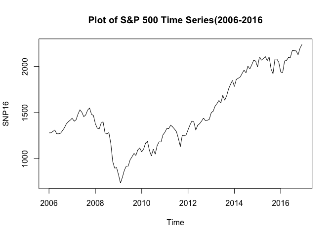
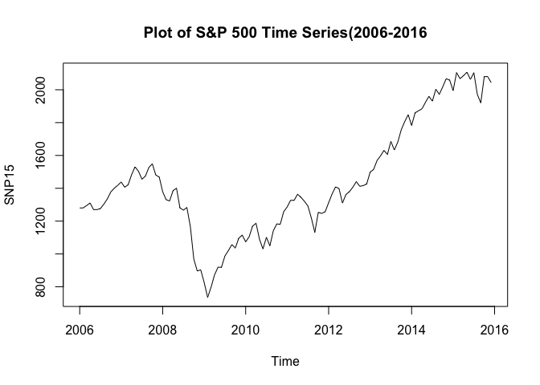
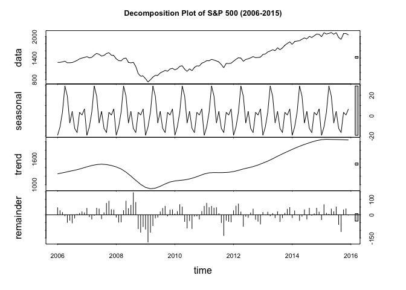
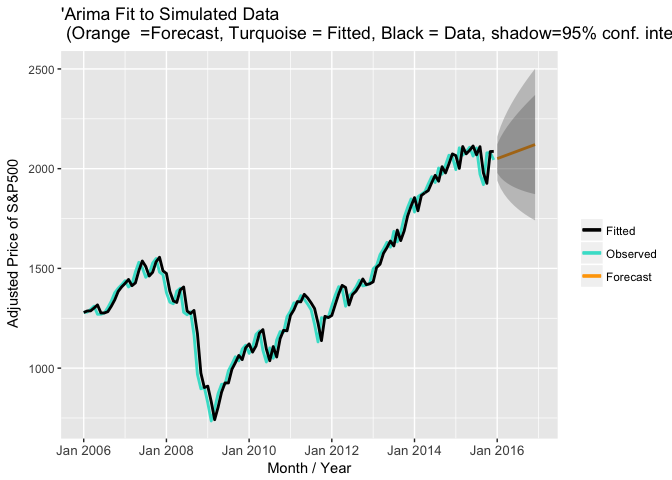
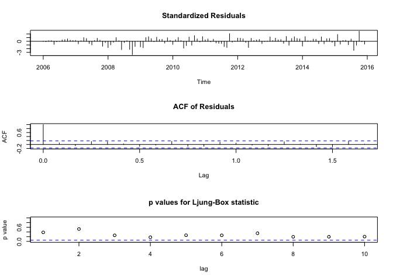
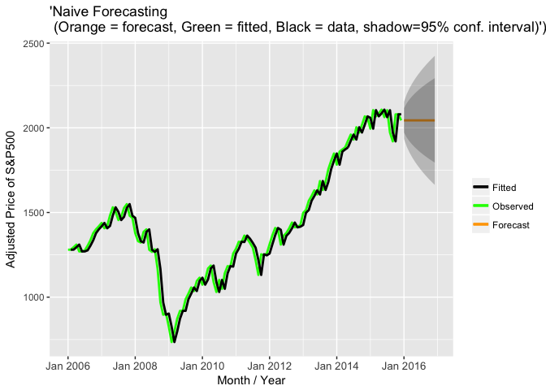

Standard & Poor's 500 INDEX Forecasting (GSPC)
================

Abstract
--------

Post the financial debacle in 2008-09, the necessity for forecasting the stock market has become of paramount importance. With advent of tools for forecasting and the ease of availability of data, there is no restriction on the different forecasting techniques. In this paper we are attempting to find the optimal statistical technique to forecast the stock market based on the S&P 500 index. Our choice of S&P 500 Index in the presence of other indices such as Dow Jones Industrial Average and Nasdaq Composite Index, is mainly as S&P 500 provides a broader representation of the overall US stock market.

Introduction
============

Brief Note on S&P 500 Index The Standard & Poor's 500, often abbreviated as the S&P 500, or just "the S&P", is an American stock market index based on the market capitalizations of 500 large companies having common stock listed on the NYSE or NASDAQ. The S&P 500 index components and their weightings are determined by S&P Dow Jones Indices. Forecasting of the stock market can be carried out vide two approaches: - ● Fundamental Approach – forecasting is done based on the economy, the financial statement of the company and the company’s future prospects ● Technical Analysis – forecasting based on time series analysis of available historical data of the stock market.

In this project, we have attempted only the second approach i.e “Technical Analysis”. The data for our project is obtained from “Yahoo Finance” and the forecasting techniques are implemented in R.

Data Collection
===============

We have imported the data from Yahoo finance. We have extracted the daily adjusted closing price value of S&P 500 from 1st January 2006 to 31st December 2016. . The ticker symbol for S&P 500 is “GSPC”.

``` r
startDate = as.Date("2006-01-01") 

endDate = as.Date("2016-12-31")

#getting data from yahoo finance using start and end date
getSymbols("^GSPC", from = startDate, to = endDate,src="yahoo")
```

    ## [1] "GSPC"

The extracted data contains seven columns - first acting as an index, the next four columns is generally referred to as OHLC i.e Open, High, Low and Close prices of the index. The sixth column comprises the volume of trade and the seventh column i.e “Adjusted Price” is of utmost importance to our paper. In our time series forecasting techniques, we will mainly be using the “Adjusted Price” column, the reason for this can be summed up as “stock split” which is explained further with an example below.

In’R’,we use the ‘quantmod’ library to extract data of any stock. The `getSymbols()` function takes 4 parameters – the ticker, the start date ,the end date and the source.

`Why we are using the adjusted closing price?` The closing price provides us the value at which the stock closes at the end of the day. Now due to some management reason, the company decides to split the stock thereby decreasing the value of the stock price. Say if one stock of company is priced for at $100, the company splits one stock into two, thereby now the price of each stock is further split and is $50. So the opening price of the stock and the closing of the stock varies the following day. Hence for our paper we have only considered the adjusted value of the index, which takes into account the “stock split “factor.

Since we are doing monthly forecasting, our extracted data is converted into monthly format.

    ##          Jan     Feb     Mar     Apr     May     Jun     Jul     Aug
    ## 2006 1280.08 1280.66 1294.87 1310.61 1270.09 1270.20 1276.66 1303.82
    ## 2007 1438.24 1406.82 1420.86 1482.37 1530.62 1503.35 1455.27 1473.99
    ## 2008 1378.55 1330.63 1322.70 1385.59 1400.38 1280.00 1267.38 1282.83
    ## 2009  825.88  735.09  797.87  872.81  919.14  919.32  987.48 1020.62
    ## 2010 1073.87 1104.49 1169.43 1186.69 1089.41 1030.71 1101.60 1049.33
    ## 2011 1286.12 1327.22 1325.83 1363.61 1345.20 1320.64 1292.28 1218.89
    ## 2012 1312.41 1365.68 1408.47 1397.91 1310.33 1362.16 1379.32 1406.58
    ## 2013 1498.11 1514.68 1569.19 1597.57 1630.74 1606.28 1685.73 1632.97
    ## 2014 1782.59 1859.45 1872.34 1883.95 1923.57 1960.23 1930.67 2003.37
    ## 2015 1994.99 2104.50 2067.89 2085.51 2107.39 2063.11 2103.84 1972.18
    ## 2016 1940.24 1932.23 2059.74 2065.30 2096.95 2098.86 2173.60 2170.95
    ##          Sep     Oct     Nov     Dec
    ## 2006 1335.85 1377.94 1400.63 1418.30
    ## 2007 1526.75 1549.38 1481.14 1468.36
    ## 2008 1166.36  968.75  896.24  903.25
    ## 2009 1057.08 1036.19 1095.63 1115.10
    ## 2010 1141.20 1183.26 1180.55 1257.64
    ## 2011 1131.42 1253.30 1246.96 1257.60
    ## 2012 1440.67 1412.16 1416.18 1426.19
    ## 2013 1681.55 1756.54 1805.81 1848.36
    ## 2014 1972.29 2018.05 2067.56 2058.90
    ## 2015 1920.03 2079.36 2080.41 2043.94
    ## 2016 2168.27 2126.15 2198.81 2238.83

Exploratory Analysis
====================

Our S&P 500 Stock Index data is in the form of time-series; this means that our data exists over a continuous time interval with equal spacing between every two consecutive measurements. Once we have our time series data object ready, we plot the object to do a good exploratory analysis on it. This enables us to make inferences about important components of the time-series data, such as trend, seasonality, heteroskedasticity, and stationary. A brief on each inference: ● Trend: a dataset has a trend when it has either a long-term increasing or decreasing graph. ● Seasonality:a dataset has seasonality when it has patterns that repeat over known, fixed periods of time (e.g. monthly, quarterly, yearly). ● Heteroskedasticity:a data is heteroskedastic when its variability is not constant (i.e. its variance increases or decreases as a function of the explanatory variable). ● Stationary:a stochastic process is called stationary if the mean and variance are constant (i.e. their joint distribution does not change over time). We start our analysis by plotting our time series to give us a basis about how to start our modeling.  Later we remove the year 2016 in order to compare our forecasted values with the real values.  From the plot we can see that there was certain dip in the stock prices between 2008 -2010.This is time when U.S market crashed.

When we plot, we observe a trend in our time-series, we further analyze our data by decomposing. We break-down our time-series into its seasonal component, trend, and residuals/white noise using the `stl() function`. \#Decomposition of the SNP15 data

    ##  Call:
    ##  stl(x = SNP15, s.window = "periodic")
    ## 
    ## Components
    ##             seasonal     trend    remainder
    ## Jan 2006 -19.2896838 1253.2217   46.1479660
    ## Feb 2006 -11.0192345 1264.5913   27.0879780
    ## Mar 2006   3.4362237 1275.9609   15.4728640
    ## Apr 2006  29.1211893 1288.0753   -6.5864965
    ## May 2006  19.1141106 1300.1897  -49.2138217
    ## Jun 2006  -7.0989053 1312.5335  -35.2346570
    ## Jul 2006   4.1980684 1324.8773  -52.4153838
    ## Aug 2006 -12.4019361 1337.1343  -20.9123974
    ## Sep 2006 -16.5748844 1349.3912    3.0336506
    ## Oct 2006   3.3119550 1365.0117    9.6163041
    ## Nov 2006   0.6438138 1380.6322   19.3540371
    ## Dec 2006   6.5592740 1398.0087   13.7320926
    ## Jan 2007 -19.2896838 1415.3852   42.1444632
    ## Feb 2007 -11.0192345 1430.5300  -12.6908584
    ## Mar 2007   3.4362237 1445.6749  -28.2511057
    ## Apr 2007  29.1211893 1456.8385   -3.5896849
    ## May 2007  19.1141106 1468.0021   43.5037703
    ## Jun 2007  -7.0989053 1472.4793   37.9696136
    ## Jul 2007   4.1980684 1476.9564  -25.8844697
    ## Aug 2007 -12.4019361 1472.6204   13.7714906
    ## Sep 2007 -16.5748844 1468.2844   75.0404345
    ## Oct 2007   3.3119550 1457.4256   88.6424208
    ## Nov 2007   0.6438138 1446.5668   33.9293926
    ## Dec 2007   6.5592740 1430.0180   31.7827359
    ## Jan 2008 -19.2896838 1413.4691  -15.6294087
    ## Feb 2008 -11.0192345 1389.6126  -47.9633176
    ## Mar 2008   3.4362237 1365.7560  -46.4922452
    ## Apr 2008  29.1211893 1329.0760   27.3928127
    ## May 2008  19.1141106 1292.3960   88.8699390
    ## Jun 2008  -7.0989053 1246.9125   40.1864457
    ## Jul 2008   4.1980684 1201.4290   61.7529728
    ## Aug 2008 -12.4019361 1151.8661  143.3657750
    ## Sep 2008 -16.5748844 1102.3033   80.6315989
    ## Oct 2008   3.3119550 1055.4011  -89.9630510
    ## Nov 2008   0.6438138 1008.4989 -112.9027454
    ## Dec 2008   6.5592740  973.2151  -76.5243769
    ## Jan 2009 -19.2896838  937.9313  -92.7615952
    ## Feb 2009 -11.0192345  922.6954 -176.5861856
    ## Mar 2009   3.4362237  907.4596 -113.0258387
    ## Apr 2009  29.1211893  913.9842  -70.2953531
    ## May 2009  19.1141106  920.5087  -20.4828091
    ## Jun 2009  -7.0989053  942.1333  -15.7143836
    ## Jul 2009   4.1980684  963.7579   19.5240333
    ## Aug 2009 -12.4019361  990.8816   42.1402847
    ## Sep 2009 -16.5748844 1018.0054   55.6494258
    ## Oct 2009   3.3119550 1040.6946   -7.8166212
    ## Nov 2009   0.6438138 1063.3838   31.6023913
    ## Dec 2009   6.5592740 1075.6805   32.8601848
    ## Jan 2010 -19.2896838 1087.9772    5.1824443
    ## Feb 2010 -11.0192345 1094.0701   21.4391350
    ## Mar 2010   3.4362237 1100.1629   65.8308859
    ## Apr 2010  29.1211893 1106.7536   50.8151724
    ## May 2010  19.1141106 1113.3442  -43.0482906
    ## Jun 2010  -7.0989053 1124.1650  -86.3561173
    ## Jul 2010   4.1980684 1134.9858  -37.5838456
    ## Aug 2010 -12.4019361 1151.0247  -89.2927779
    ## Sep 2010 -16.5748844 1167.0636   -9.2887516
    ## Oct 2010   3.3119550 1187.5649   -7.6168588
    ## Nov 2010   0.6438138 1208.0662  -28.1600054
    ## Dec 2010   6.5592740 1229.1652   21.9155581
    ## Jan 2011 -19.2896838 1250.2641   55.1455537
    ## Feb 2011 -11.0192345 1262.9729   75.2663286
    ## Mar 2011   3.4362237 1275.6816   46.7121038
    ## Apr 2011  29.1211893 1278.9534   55.5353550
    ## May 2011  19.1141106 1282.2253   43.8605875
    ## Jun 2011  -7.0989053 1281.4346   46.3043050
    ## Jul 2011   4.1980684 1280.6440    7.4379831
    ## Aug 2011 -12.4019361 1281.4239  -50.1319090
    ## Sep 2011 -16.5748844 1282.2037 -134.2088145
    ## Oct 2011   3.3119550 1285.7290  -35.7408772
    ## Nov 2011   0.6438138 1289.2542  -42.9380524
    ## Dec 2011   6.5592740 1297.1559  -46.1152110
    ## Jan 2012 -19.2896838 1305.0576   26.6420916
    ## Feb 2012 -11.0192345 1319.6313   57.0680217
    ## Mar 2012   3.4362237 1334.2049   70.8288401
    ## Apr 2012  29.1211893 1350.1716   18.6172575
    ## May 2012  19.1141106 1366.1383  -74.9224216
    ## Jun 2012  -7.0989053 1379.2804  -10.0214962
    ## Jul 2012   4.1980684 1392.4226  -17.3007264
    ## Aug 2012 -12.4019361 1406.3471   12.6348011
    ## Sep 2012 -16.5748844 1420.2716   36.9733502
    ## Oct 2012   3.3119550 1438.8326  -29.9845558
    ## Nov 2012   0.6438138 1457.3937  -41.8574513
    ## Dec 2012   6.5592740 1479.5080  -59.8773818
    ## Jan 2013 -19.2896838 1501.6224   15.7772628
    ## Feb 2013 -11.0192345 1524.9497    0.7495632
    ## Mar 2013   3.4362237 1548.2770   17.4766728
    ## Apr 2013  29.1211893 1575.3907   -6.9419249
    ## May 2013  19.1141106 1602.5043    9.1215608
    ## Jun 2013  -7.0989053 1631.8358  -18.4568435
    ## Jul 2013   4.1980684 1661.1672   20.3646747
    ## Aug 2013 -12.4019361 1688.8424  -43.4705319
    ## Sep 2013 -16.5748844 1716.5176  -18.3927078
    ## Oct 2013   3.3119550 1742.6141   10.6140102
    ## Nov 2013   0.6438138 1768.7105   36.4557388
    ## Dec 2013   6.5592740 1794.3820   47.4187435
    ## Jan 2014 -19.2896838 1820.0534  -18.1737787
    ## Feb 2014 -11.0192345 1844.7128   25.7564164
    ## Mar 2014   3.4362237 1869.3721   -0.4683673
    ## Apr 2014  29.1211893 1891.7829  -36.9541306
    ## May 2014  19.1141106 1914.1937   -9.7378396
    ## Jun 2014  -7.0989053 1934.2212   33.1077202
    ## Jul 2014   4.1980684 1954.2487  -27.7766794
    ## Aug 2014 -12.4019361 1973.0382   42.7336825
    ## Sep 2014 -16.5748844 1991.8278   -2.9629190
    ## Oct 2014   3.3119550 2007.7293    7.0088274
    ## Nov 2014   0.6438138 2023.6307   43.2855543
    ## Dec 2014   6.5592740 2034.7289   17.6116942
    ## Jan 2015 -19.2896838 2045.8272  -31.5475027
    ## Feb 2015 -11.0192345 2049.7104   65.8088010
    ## Mar 2015   3.4362237 2053.5937   10.8599789
    ## Apr 2015  29.1211893 2052.0437    4.3450806
    ## May 2015  19.1141106 2050.4938   37.7819926
    ## Jun 2015  -7.0989053 2049.5625   20.6464706
    ## Jul 2015   4.1980684 2048.6313   51.0107261
    ## Aug 2015 -12.4019361 2047.1012  -62.5192553
    ## Sep 2015 -16.5748844 2045.5712 -108.9662839
    ## Oct 2015   3.3119550 2043.4141   32.6340951
    ## Nov 2015   0.6438138 2041.2569   38.5091818
    ## Dec 2015   6.5592740 2038.9291   -1.5484004

    ## Warning in plot.window(xlim, ylim, log, ...): "ts.colour" is not a
    ## graphical parameter

    ## Warning in title(main = main, xlab = xlab, ylab = ylab, ...): "ts.colour"
    ## is not a graphical parameter

    ## Warning in plot.window(xlim, ylim, log, ...): "ts.colour" is not a
    ## graphical parameter

    ## Warning in title(main = main, xlab = xlab, ylab = ylab, ...): "ts.colour"
    ## is not a graphical parameter

    ## Warning in plot.window(xlim, ylim, log, ...): "ts.colour" is not a
    ## graphical parameter

    ## Warning in title(main = main, xlab = xlab, ylab = ylab, ...): "ts.colour"
    ## is not a graphical parameter

    ## Warning in plot.window(xlim, ylim, log, ...): "ts.colour" is not a
    ## graphical parameter

    ## Warning in title(main = main, xlab = xlab, ylab = ylab, ...): "ts.colour"
    ## is not a graphical parameter

 \#Seasonal trend of our data year wise In the year 2009 and 2013 , the trend is reversed. From the plot we can see there are no seasonal patterns, thus showing that our data is non-stationary.  \# Data Seasonality is checked - using ets() function Data is not seasonal

    ## [1] FALSE

We further test whether our data in seasonal by the running the below function in ‘R’. The ‘p-value’ is 1 indicating no seasonality in our data.

``` r
library(fma)
fits <- ets(SNP15)
fitp <- ets(SNP15,model="ANN")
deviance <- 2*c(logLik(fits) - logLik(fitp))
df <- attributes(logLik(fits))$df - attributes(logLik(fitp))$df 
1-pchisq(deviance,df)
```

    ## [1] 1

Model Estimation
================

Before we build our forecasting models, we need to understand the relationship of our data points at different time lags. The lag refers to the time difference between one observation and a previous observation in the dataset. The correlation between the two observations is calculated using the Autocorrelation Function (ACF) and Partial Autocorrelation Function (PACF). • Autocorrelation Function (ACF): is the correlation for time series observations with a lag. • Partial Autocorrelation Function (PACF): is the summary of the relationship between an observation in a time series with a lag and with the relationships of intervening observations removed  From the plots we observe that: • Both ACF and PACF shows significant values, for now we assume that an ARMA-model will be a good fit. • The ACF can be used to estimate the MA-part, i.e. q-value, the PACF can be used to estimate the AR-part, i.e. p-value. • To estimate a model-order we look at 1.) whether the ACF values die out sufficiently, 2.) whether the ACF signals over differencing and 3.) whether the ACF and PACF show any significant and easily interpretable peaks at certain lags. • ACF and PACF might suggest not only one model but many from which we need to choose after considering other diagnostic tools.

Data Stationarity
=================

We observed from ACF and PACF that our data in not stationary .We conduct the ADF (Augmented Dickey-Fuller Test) and KPSS (Kwiatkowski–Phillips–Schmidt–Shin Test) on our data, to make our data is non-stationary. ADF test says differences is required if p-value is &gt; 0.05

ADF test says differences is required if p-value is &gt; 0.05

``` r
adf.test(SNP15)
```

    ## 
    ##  Augmented Dickey-Fuller Test
    ## 
    ## data:  SNP15
    ## Dickey-Fuller = -1.5907, Lag order = 4, p-value = 0.7465
    ## alternative hypothesis: stationary

Kipps test says differences is required if p-value is &lt; 0.05

``` r
kpss.test(SNP15)
```

    ## Warning in kpss.test(SNP15): p-value smaller than printed p-value

    ## 
    ##  KPSS Test for Level Stationarity
    ## 
    ## data:  SNP15
    ## KPSS Level = 2.4046, Truncation lag parameter = 2, p-value = 0.01

Transforming our data from Non-Stationary to Stationary
=======================================================

To make our data stationary, we find the difference between the consecutive values, and plot the ACF and PACF of our differenced data.

1.  Function to determine the differencing order of the data - for seasonal data

<!-- -->

    ## [1] 0

 Observation : We determined our data doesnt require any seasonally differencing

1.  Function to determine the differencing order of the data - for non-seasonal data

<!-- -->

    ## [1] 1

Observation: Data is not stationary, and requires differencing.

Differencing the data by order 1 and plotting the ACf ,PACF and time series plot of the differenced data.

``` r
SNP15diff <- diff(SNP15, differences=1)
ggtsdisplay(SNP15diff)
```

 Observation: 95% of ACF and PACF are within the significance levels

We Check if the differenced data of order 1 is stationary by carrying out ADF KPSS Test

    ## Warning in kpss.test(SNP15diff): p-value greater than printed p-value

    ## 
    ##  KPSS Test for Level Stationarity
    ## 
    ## data:  SNP15diff
    ## KPSS Level = 0.28745, Truncation lag parameter = 2, p-value = 0.1

    ## 
    ##  Augmented Dickey-Fuller Test
    ## 
    ## data:  SNP15diff
    ## Dickey-Fuller = -3.8358, Lag order = 4, p-value = 0.01963
    ## alternative hypothesis: stationary

The differenced data of order 1 is determined to be stationary

We now know the d part of our ARIMA model. Now we will determine the p and q part . We plot the ACF and PACF for our differenced data.  From the above Acf and pacf we observe that there are lags at higher significane levels ,so possible models are ARMA(0,0). We observe further differencing is not needed and hence in ARIMA model d = 1.

`Principle of Parsimony says choose one with the least number of parameters`

You can also be lazy and just call auto.arima and let it do the work for you.
-----------------------------------------------------------------------------

    ## Series: SNP15 
    ## ARIMA(0,1,0) with drift         
    ## 
    ## Coefficients:
    ##        drift
    ##       6.4190
    ## s.e.  5.1155
    ## 
    ## sigma^2 estimated as 3140:  log likelihood=-647.45
    ## AIC=1298.91   AICc=1299.01   BIC=1304.46

1. ARIMA MODEL
==============

We have built our ARIMA model i. e p = 0 , d =1 and q = 0. We confirm if this is the best ARIMA model for the data from running the auto.arima() function. \`\`\`{ r echo =FALSE} fit &lt;- Arima(SNP15, order = c(0,1,0), include.drift = TRUE)

forecasting the next 12 months values
=====================================

plotting standardized residuals , ACF and p -value of SNP15
===========================================================

summary(SP500ARIMA) `We further check if our ‘residuals’ are white noise and are following normal distribution.`{ r echo =FALSE} tsdiag(fit) residFit &lt;- ggplot(data=fit, aes(residuals(fit))) + geom\_histogram(aes(y =..density..), col="black", fill="white" , bins = 10) + geom\_density(col=1) + theme(panel.background = element\_rect(fill = "gray98"), panel.grid.minor = element\_blank(), axis.line = element\_line(colour="gray"), axis.line.x = element\_line(colour="gray")) + ggtitle("Plot of S&P 500 ARIMA Model Residuals")

residFit

    We notice that the distribution of the residuals in not perfect, the outliers can be attributed to the 2008 financial crisis. We now move to the forecasting stage.

    Plotting the forecasted values

Warning: Removed 12 rows containing missing values (geom\_path).
----------------------------------------------------------------

Warning: Removed 12 rows containing missing values (geom\_path).
----------------------------------------------------------------

Warning: Removed 120 rows containing missing values (geom\_path).
-----------------------------------------------------------------


    


    #2. Holts - Winter Forcasting Model
    Holts Winter function has alpha , beta and gamma, 
    * Alpha represents over all smoothing paramneter
    * Beta represents trend smoothing parameter
    * Gamma represents seasonal smoothing parameter

    The model by default is additive,as there is no sesonality in our data we set GAMMMA =FALSE in our Holts Winter Model

Warning: Removed 12 rows containing missing values (geom\_path).
----------------------------------------------------------------

Warning: Removed 14 rows containing missing values (geom\_path).
----------------------------------------------------------------

Warning: Removed 120 rows containing missing values (geom\_path).
-----------------------------------------------------------------

\`\`\`



3. Exponential Smoothing Method:
================================

In this methodology, more weightage is given to recent data points. The forecast is generally a flat-line.

\`\`\`{ r echo =FALSE}

MergeDF &lt;- function(dn,df){ require(zoo) ds &lt;-as.data.frame(window(dn)) names(ds) &lt;- 'observed' ds$month &lt;- as.yearmon(time(window(dn)))

dfit&lt;-as.data.frame(df*f**i**t**t**e**d*)*d**f**i**t*month&lt;-as.yearmon(time(df$fitted)) names(dfit)\[1\]&lt;-'fitted'

ds&lt;-merge(ds,dfit,all.x=T) ds\[,'forecast'\] &lt;- NA ds\[,'lo80'\] &lt;- NA ds\[,'hi80'\] &lt;- NA ds\[,'lo95'\] &lt;- NA ds\[,'hi95'\] &lt;- NA

ds&lt;-merge(ds,dfit,all.x=T) \#Merge fitted values with source and training data

fcastn&lt;-as.data.frame(df) fcastn$Month&lt;-as.yearmon(row.names(fcastn)) names(fcastn)&lt;-c('forecast','lo80','hi80','lo95','hi95','month')

library(plyr) \# for combining dataframe row wise pd&lt;-rbind.fill(ds,fcastn) return(pd)

}

startDate = as.Date("2006-01-01")

endDate = as.Date("2016-12-31")

getting data from yahoo finance using start and end date
========================================================

getSymbols("^GSPC", from = startDate, to = endDate,src="yahoo")

convert data into monthly wise
==============================

GSPC\_monthly &lt;- to.monthly(GSPC) monthly &lt;- as.vector(GSPC\_monthly$GSPC.Adjusted)

data is split month wise from 2006 to 2016
==========================================

SNP16&lt;- ts(monthly,c(2006,1),frequency=12) SNP15&lt;- ts(monthly,c(2006,1),c(2015,12),frequency=12)

Expo &lt;- ets(SNP15)

Et &lt;- forecast(Expo,h =12)

e &lt;- MergeDF(SNP15,Et)

ets &lt;- ggplot(data = e, aes(x = month)) + geom\_line(aes(y = observed, colour = "Observed"), size = 1) + geom\_line(aes(y = fitted, colour = "Fitted"), size = 1) + geom\_line(aes(y = forecast, colour = "Forecast"), size = 1) + scale\_colour\_manual("",breaks = c("Fitted","Observed","Forecast"),values = c("black","orange","blue")) + geom\_ribbon(aes(ymin = lo95, ymax = hi95), alpha = .25) + geom\_ribbon(aes(ymin = lo80, ymax = hi80), alpha = .25) + scale\_x\_yearmon(name = "Month / Year") + theme(axis.text.x = element\_text(size = 10)) + ggtitle("'Exponential Smoothing Forecasting(Orange = forecast, Blue = fitted, Black = data, shadow=95% conf. interval)')") + ylab ( " Adjusted Price of S&P500") ets


    #4. Naive Method: 
    We incorporated this methodology, as it is one of the best model for financial time series object.

Warning: Removed 12 rows containing missing values (geom\_path).
----------------------------------------------------------------

Warning: Removed 13 rows containing missing values (geom\_path).
----------------------------------------------------------------

Warning: Removed 120 rows containing missing values (geom\_path).
-----------------------------------------------------------------


    

    # Conclusion:
    After using the above stated forecasting techniques, we now generate the error values for all our methods. We consider the MAPE (Mean Absolute Percentage Error) and MAE (Mean Absolute Error) for our Error Evaluation. This is mainly because we are forecasting stock prices which will have absolute values. There is no need to consider a range of negative and positive errors as in the case of RMSE (Root Mean Square Error). RMSE is generally used when you need a wide variation of your error, as in the case of temperatures, where we get negatives and positive values. 

    #1. Forecasting Error 

    Below are the forecasted values of all our models:
    Table of Results

\[1\] "GSPC"
------------

Observed Value ARIMA Holts Winter Exponential Smoothing
-------------------------------------------------------

Jan 2016 1940.24 2050.359 2050.506 2043.944
-------------------------------------------

Feb 2016 1932.23 2056.778 2057.073 2043.944
-------------------------------------------

Mar 2016 2059.74 2063.197 2063.639 2043.944
-------------------------------------------

Apr 2016 2065.30 2069.616 2070.206 2043.944
-------------------------------------------

May 2016 2096.95 2076.035 2076.772 2043.944
-------------------------------------------

Jun 2016 2098.86 2082.454 2083.339 2043.944
-------------------------------------------

Jul 2016 2173.60 2088.873 2089.905 2043.944
-------------------------------------------

Aug 2016 2170.95 2095.292 2096.471 2043.944
-------------------------------------------

Sep 2016 2168.27 2101.711 2103.038 2043.944
-------------------------------------------

Oct 2016 2126.15 2108.130 2109.604 2043.944
-------------------------------------------

Nov 2016 2198.81 2114.549 2116.171 2043.944
-------------------------------------------

Dec 2016 2238.83 2120.968 2122.737 2043.944
-------------------------------------------

Naive
-----

Jan 2016 2043.94
----------------

Feb 2016 2043.94
----------------

Mar 2016 2043.94
----------------

Apr 2016 2043.94
----------------

May 2016 2043.94
----------------

Jun 2016 2043.94
----------------

Jul 2016 2043.94
----------------

Aug 2016 2043.94
----------------

Sep 2016 2043.94
----------------

Oct 2016 2043.94
----------------

Nov 2016 2043.94
----------------

Dec 2016 2043.94
----------------

    Using the “accuracy ()” function in R we now generate the errors between the original data and the forecasted data for all our forecasting methods. 

Method ME RMSE MAE MPE MAPE
---------------------------

1 Arima 20.16413 74.73548 60.57074 0.8064816 2.889506
-----------------------------------------------------

2 Holts Winter 19.20576 74.06051 59.85811 0.7618695 2.857043
------------------------------------------------------------

3 Exponential Smoothing 61.88390 110.63686 97.78677 2.7485378 4.602951
----------------------------------------------------------------------

4 Naive 61.88757 110.63892 97.78923 2.7487128 4.603062
------------------------------------------------------

    By observing the Error chart above, we see that the Holt’s Winter model has performed the best with MAPE value – “4.33” and MAE value – “0.922“.

    #2. Model Error
    This is mainly a backward-assessment to find the relative difference between the fitted data generated by the forecasting model and the actual data, prior to forecasting. 

Method1 ME RMSE MAE MPE MAPE
----------------------------

1 Arima 0.01061384 55.57081 43.13279 -0.1756005 3.255969
--------------------------------------------------------

2 Holts Winter 4.55806440 56.30269 44.90006 0.2140487 3.387048
--------------------------------------------------------------

3 Exponential Smoothing 6.36755364 55.93764 44.34665 0.2916375 3.333907
-----------------------------------------------------------------------

4 Naive 6.41899147 56.17166 44.71714 0.2939524 3.361742
-------------------------------------------------------

ACF1
----

1 0.07858622
------------

2 0.07050308
------------

3 0.07879669
------------

4 0.07860786
------------

\`\`\` By observing the above chart, we notice that ARIMA model gives us the lowest MAE and MAPE error – ‘0.5676’ and ‘3.8754’ respectively.

To conclude, Sometimes, a model which fits the data well does not necessarily perform/forecast well! This is because a perfect fit can always be obtained by using a model with appropriate number of parameters. We should always avoid over-fitting of data, as it does not give an insight to trend/pattern of the data.
===========================================================================================================================================================================================================================================================================================================================

References
==========

1.Advantages of the mean absolute error (MAE) over the root mean square error (RMSE) in assessing average model performance - By Cort J. Willmott\*, Kenji Matsuura 2.Forecasting Uncertain Hotel Room Demand - By Mihir, Mounir and Paul ,Department of Electrical and Computer Engineering , Duke Univerisity 3.Exponential Smoothing: The State of the Art - By EVERETTE S. GARDNER, Jr. 4. Forecasting: Principles & Practice - By Rob J Hyndman 5. Forecasting methods and stock market analysis - By Virginica Rusu and Cristian Rusu
